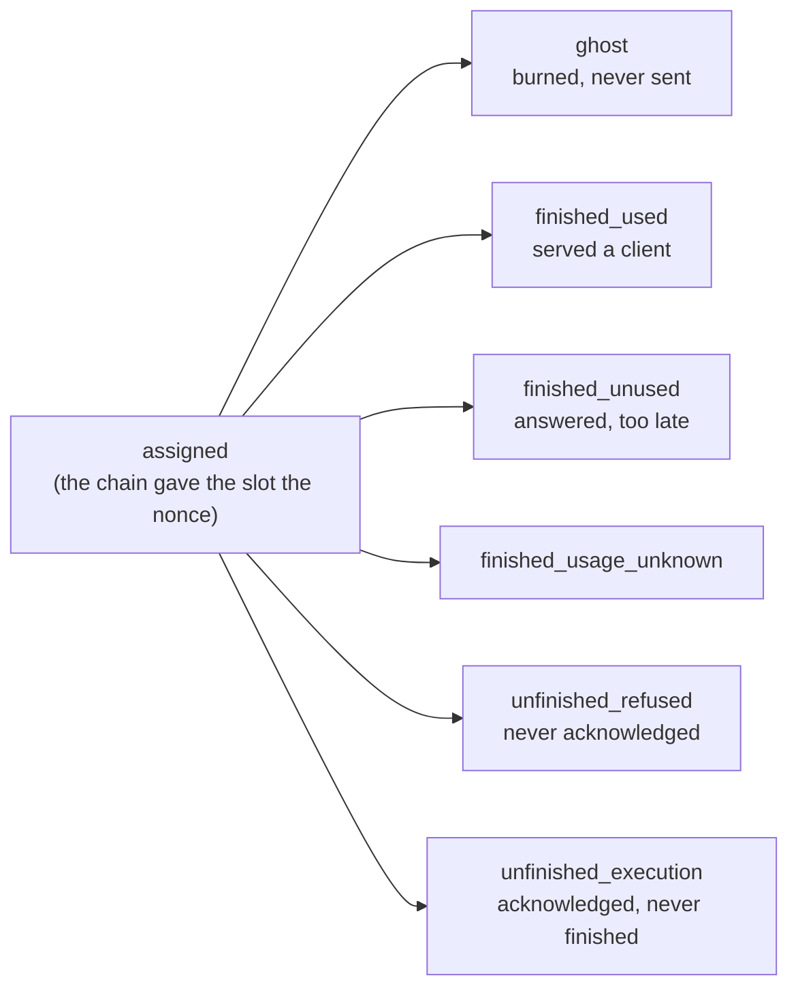

# Accounting

Settlement counts **nonces**, not requests. One request burns several, and some nonces belong to no request at all — a warmup probe, a burn, a nonce the race could not use. So the gateway keeps a ledger of where every committed nonce went, and derives from it a reading of what the numbers mean.

## The ledger and the request records

Two stores answer different questions, and confusing them wastes an investigation:

| | Request records | Nonce ledger |
| --- | --- | --- |
| Answers | what became of one client request | where every committed nonce went |
| Configured by | `GATEWAY_REQUESTS_RETENTION_*` | `GATEWAY_ACCOUNTING_*` |
| Served at | `GET /v1/requests/{id}` | its own JSON port, `GATEWAY_ACCOUNTING_PORT` |
| Owned by | [`store/`](../store/) | [`accounting/`](../accounting/), fed by [`nonces/`](../nonces/) |

The rest of this document is the nonce ledger.

## The vocabulary

Every fact the ledger files is one of a closed set of strings, and those strings are a contract: they are stored in the snapshot, served by the JSON API, and read by an external tracker. A value outside the set normalises to `unknown` and the fact becomes invisible.

They are therefore declared once, in a `vocabulary.go` beside the type that carries them, and referenced by name everywhere else — so a rename reaches every site through the compiler, while editing a *value* silently changes the wire string under every reader of the snapshot and the API.

| Vocabulary | Declared in | What it names |
| --- | --- | --- |
| `Disposition` | [`accounting/vocabulary.go`](../accounting/vocabulary.go) | what became of a nonce — the six ends every one of them reaches |
| `Usage`, `Phase` | same | whether the answer reached a client, and whether the chain was in proof-of-compute |
| `Terminal*` | same | how an attempt ended, as the ledger files it |
| `TimeoutOutcome`, `ProtocolKind` | same | a settled timeout round, and the protocol facts the event ring keeps |
| `Finding*`, `Severity` | same | this gateway's reading of the counters |
| `TimeoutKind/Action/Reason*` | [`engine/vocabulary.go`](../engine/vocabulary.go) | what a nonce was owed, what the gateway did, and why |
| `Start*`, `Stage*`, `Role*`, `Visibility*` | same | why an attempt started, what escalated it, and what the client saw |
| `GhostReason*` | [`scheduler/vocabulary.go`](../scheduler/vocabulary.go) | why a nonce was burned rather than served |

The timeout vocabulary lives with `engine.TimeoutEvent` because two packages emit it — the race (`engine/settle.go`) and the warmup (`warmup/settle.go`) — and only the ledger consumes it. One producer could own its own words; two cannot.

### A nonce's dispositions

`unfinished_refused` is the cheap failure — the nonce frees at the refusal deadline. `unfinished_execution` is the expensive one: the host took the work, so the nonce is held to the execution deadline, and a record left there settles at the full reserved cost in the executor's favour. The ledger reports one; the escrow tick's sweep is what tries to claim it back (see [`race.md`](./race.md), "The vote nobody retried").

The kind is read from the receipt — `engine/settle.go`, `timeoutKind` — and then deferred to the verifiers' vote, which is the protocol's answer and can disagree: they judge on what they saw, and the receipt went to the gateway.

## The surface

`GATEWAY_ACCOUNTING_ENABLED` builds the ledger, and the ledger serves itself only as JSON on its own port, `GATEWAY_ACCOUNTING_PORT` (9091 by default, on every interface). Nothing of it reaches Prometheus: a gauge aggregated from the ledger would walk every nonce it holds under the book's lock on every scrape.

devshardctl spelled these `DEVSHARD_STATS_ENABLED`, `DEVSHARD_STATS_PORT`, `DEVSHARD_STATS_RETENTION_EPOCHS` and `DEVSHARD_STATS_SNAPSHOT_SECONDS`, and each is still read when the gateway's own name is unset. One value does not carry over: a legacy retention of `0` kept everything, and the gateway refuses it while the ledger is on (see "Storage").

| Route | Answers |
| --- | --- |
| `GET /api/v1/epochs` | every epoch the ledger holds, summed across participants |
| `GET /api/v1/epochs/{epoch}/participants` | every participant of one epoch |
| `GET /api/v1/epochs/{epoch}/participants/{address}` | one participant, by its own chain address |
| `GET /api/v1/epochs/{epoch}/events` | the applied timeouts and invalid verdicts of one epoch, newest first |
| `GET /api/v1/epochs/{epoch}/events/{address}` | the same feed for one participant |
| `GET /api/v1/escrows` | the escrow ids the ledger holds |

`current` stands in for an epoch index and resolves against the chain snapshot. Epoch `0` is **refused** rather than served: zero means "unconstrained" inside the ledger, so answering it would report every epoch as one. `?model=` and `?escrow_id=` narrow every route but `/escrows`, and `escrow_id` accepts both repetition and commas; the event feed also takes `?participant=`.

The participant route is what the surface exists for: a host operator can ask what this gateway saw of its own participant. An address the epoch holds no record of is a **404 rather than an empty list**, so "nothing went wrong" stays distinguishable from "this gateway never routed to you". The event feed is the opposite — a host with nothing against it gets an empty feed, because there, nothing to report is the healthy case.

Every route is read-only and serves one gateway's view of public network behaviour, so the listener carries no authentication. It is still a separate port, and whether it is reachable beyond the deployment is the operator's choice.

`POST /v1/admin/accounting/reset/{epoch}` clears one epoch and answers how many escrows went with it. It lives on the **admin** surface because it erases records, and the epoch is named rather than defaulted for the same reason — a rotation leaves escrows of two epochs live at once, and neighbouring epochs are untouched.

Each escrow keeps its newest 256 events, which caps a pathological run rather than trimming normal traffic: a verdict is rare, and an escrow dies with its epoch.

### The counter's shape is this ledger's own

A counter is served **flat** — `escrow_id`, `slot_id`, `disposition`, `ghost_reason`, `terminal`, `phase` and the timeout fields all at the top level of the object. The legacy ledger in `devshard/accounting` nests the same facts under a `key` object and calls the burn reason `no_send_reason`.

Nothing outside this gateway reads the JSON counter, so no reader has to migrate to the flat shape, and the two shapes stay apart.

The cost of that is worth stating, because it is silent: a reader written against the legacy shape finds none of these fields, decodes them as empty, filters every counter out and reports **zero burns rather than an error**. The gateway e2e scenarios therefore read counters with their own helper, not the shared one.

## Findings

Every participant record carries a `findings` array beside its counters: this gateway's reading of what the counters mean, for an operator who needs to know what to look at rather than what was counted. A finding names a stable `code`, a `severity` of `warning` or `critical`, and the two numbers it was flagged on — `part` and `whole`, the latter absent when the finding counts rather than measures a rate.

Findings are derived on every read and **never stored**: the counters are the fact, the finding is only an interpretation. The JSON API is the only place they are served.

### Four rules that keep a finding honest

- **A volume floor.** No *rate* finding is raised below **20** nonces in its denominator: a rate off four attempts describes noise, not a host. The one finding that counts rather than measures, `ledger_overcounted`, has no floor: a single overcounted nonce is already a defect in the books.
- **Burns are excluded from every host rate.** A burn is this gateway's own decision; charging it to the host would report the gateway's throttling as the host's failure.
- **The gateway's own failures are excluded.** A phase transition ending an attempt, a vote round that reached no verdict, a missing poster, a long response that had already produced content, and a client that stopped waiting are all the gateway's. A failure the ledger could not *name* still counts — excusing the unclassified would empty the rates.
- **The warmup probe is excluded whatever it ended as.** It is the gateway's own request, so it leaves both sides of every ratio; excluding it only when it succeeded would report a host's refusals while hiding its successes.

Thresholds are constants rather than configuration: two gateways must not report the same host differently, and a host comparing two reports should be able to tell that the host moved, not the ruler.

### What the host answers for

| Code | Rate of | Warning | Critical |
| --- | --- | --- | --- |
| `execution_timeouts` | nonces acknowledged and never finished, over nonces that reached the host | 1% | 5% |
| `refusals` | nonces never acknowledged, over nonces that reached the host | 5% | 20% |
| `answers_unused` | finished answers nobody used, over answers delivered | 20% | — |
| `slow_receipts` | acknowledgements slower than 2.5 s, over answers acknowledged outside PoC | 10% | — |
| `slow_chunks` | answers that stalled mid-stream longer than 5 s, over answers delivered outside PoC | 10% | — |
| `slow_decode` | answers written at more than 40 ms per output token, over answers delivered outside PoC | 10% | — |
| `clock_drift` | receipts stamped more than 5 s from this gateway's clock | 5% | — |
| `logprobs_not_token_ids` | answers whose logprob tokens name decoded text, over answers delivered | 0.1% | 1% |
| `chain_recorded_misses` | nonces the chain itself recorded as missed, over assigned | 1% | 5% |
| `chain_recorded_invalid` | nonces the chain itself recorded as invalid, over assigned | 1% | 5% |
| `challenges_unresolved` | validation challenges still without a verdict, over assigned | 1% | 5% |
| `timeouts_undecided` | timeout rounds that reached no verdict, over rounds that voted | 10% | 50% |

**`execution_timeouts`** — the host answered with a receipt and then delivered nothing. The expensive failure: the nonce is held to the execution deadline where a plain refusal frees it at the refusal deadline. It usually means work was accepted into a queue the host could not drain, so check whether the requested output length fits the hardware's decode rate.

**`refusals`** — the host did not take the work. The cheap failure, but it still spends the nonce. Points at capacity or reachability rather than speed.

**`answers_unused`** — the host finished, but another had already answered the client. Losing races consistently points at throughput rather than availability: the work is correct and arrives too late to be worth anything.

**`slow_receipts`** — the receipt is the host's first sign of life, before any token is generated, so a slow one points at admission rather than generation: the request waited to be picked up. The threshold sits just past the observed p99.

**`slow_chunks`** — the host began answering and then went quiet between chunks. A client reads this as a hang rather than as slowness, and a long enough gap ends the attempt outright.

**`slow_decode`** — the host answered correctly and wrote at a fraction of its peers' rate. Measured from the first content chunk, so the prompt it had to read is not charged to how fast it writes. The threshold is absolute, so a model heavier than any yet served would flag every host running it.

**`clock_drift`** — the chain measures the execution deadline from the timestamp the host signs into its receipt, so a drifted clock moves that deadline. Running ahead makes the network wait past a deadline already passed; running behind gets a nonce voted timed out while the answer is still being written. Check NTP on the host. The offset is measured against the midpoint of the send-to-receipt round trip, not against dispatch, so the host is not charged for the outbound leg; half a second is added back because the executor stamps whole seconds downward.

**`logprobs_not_token_ids`** — a validator replays the answer from its logprob token ids, and decoded text cannot be replayed, so it votes the answer invalid and the host loses the reward. A host does this for every answer carrying logprobs or for none, which is why one flagged answer is already enough to report.

**`chain_recorded_misses`, `chain_recorded_invalid`** — not this gateway's reading but the chain's own, carried back from settlement. These are the numbers that cost the host its reward, so they outrank anything measured here.

**`challenges_unresolved`** — a validation was challenged and never settled either way. The rate matters more than the count: two disputes in thirty thousand nonces is noise, four hundred in nineteen thousand is a pattern.

**`timeouts_undecided`** — the round was raised and never reached a verdict, because votes could not be collected or too few arrived. A nonce that reaches no verdict cannot be raised again, so the host is never answerable for it. Rounds this gateway skipped are excluded: they asked nobody.

### What this gateway did

| Code | Rate of | Warning |
| --- | --- | --- |
| `throttled_by_gateway` | assigned nonces burned without being sent | 10% |
| `blocked_by_state_divergence` | assigned nonces burned because the host's escrow state no longer matches the group's | 1% |
| `failure_terminals` | nonces that reached the host and produced no usable answer | any |

**`throttled_by_gateway`** — this gateway stopped sending, so these nonces are its decision and not the host's failure. It counts two burn reasons together, `participant_window_full_no_send` and `participant_cut_off_no_send`, which the `counters` array beside the finding separates: the first is a host that was working and had no room, the second one this gateway had already found broken. Its per-host congestion windows narrow after repeated failures and widen again as they stop, which makes this a consequence of the other findings rather than a fault of its own. The forced send bounds how much of it one escrow may produce in a row: with the rung on, a sustained run produces one `forced_send` line per `scheduler_max_consecutive_burns` burns, so a high rate with no such line means the runs are being broken by serves and the nonces are going a few at a time rather than in sweeps (see [routing.md](./routing.md), "The forced send").

**`blocked_by_state_divergence`** — the host returned a post-state-root that disagrees with the group's. It earns one replay of the retained chain first, because a host rolls its diff back on a mismatch and its state survives intact; this counts what it burned after that replay was spent. It is the only capability-shaped verdict that still withholds a host: a build that refuses tools, a version or a context length is counted and reported, never routed around.

**`failure_terminals`** — how many failures reached the host at all. Which failure each was is in the `counters` array beside the finding: read `terminal` there, and a `phase` of `poc` marks one that is expected.

### What needs reporting

| Code | Flagged on |
| --- | --- |
| `ledger_overcounted` | nonces accounted beyond what the chain assigned |
| `ledger_disagrees_with_chain` | the drift left between this ledger and the chain once overcounting is set aside |
| `reasons_unknown` | classified nonces carrying a reason this ledger could not name, over assigned (5%) |

**`ledger_overcounted`** — this gateway accounted for more nonces than the chain says the slot was given, so one of the two is wrong. Worth reporting rather than acting on: no host behaviour produces this.

**`ledger_disagrees_with_chain`** — what the two sides disagree on beyond that bug. The cross-check compares **one quantity per slot**: the timeouts this gateway applied against the chain's misses. Both are the same fact counted twice, once from the diffs the gateway composed and once from the escrow's own host stats, so a difference means the gateway missed a diff.

It does not compare the invalid verdicts the gateway recorded against the chain's invalidations, because those are different stages of one lifecycle. `recorded_invalid_transitions` counts a validator dissenting — a `MsgValidation` carrying `valid: false`, which moves the inference to **challenged** (`devshard/state/machine.go`, `applyValidation`). `protocol_invalid` counts a challenge that went on to **conclude** against the host, which needs `votes_invalid` past the threshold (`applyValidationVote`). Subtracting one from the other made every challenge that did not reach the threshold a permanent unit of disagreement, which is the shape a healthy fleet produces all day.

The two halves of what it does compare are not equally durable, and that is why the ledger seeds its own half. The chain's misses are persisted per diff by the escrow store and re-read whole on every sweep; the gateway's are in memory, snapshotted on an interval, and dropped entirely when `SchemaVersion` moves. So the first time the ledger sees a slot's host stats with nothing of its own recorded for it, it takes the chain's miss count as its starting point (`accounting/book.go`, `ObserveHostStats`). Both halves then cover the same window — everything after the ledger started watching — and a restart no longer reads as a disagreement for the rest of the epoch. A restored ledger keeps what it restored; only an empty one is seeded.

**`reasons_unknown`** — the ledger's own honesty check: how much of this host's traffic it filed under a reason it could not name. A rising share means the gateway's instrumentation is behind its behaviour, not that the host did anything.

### Phase

Every rate that names a host fault counts only what happened outside proof-of-compute, on **both** sides of the ratio. A host proving computation cannot serve, and charging it for that would make every participant look broken once an epoch.

### What the ledger cannot say

It holds nonce dispositions, not timings, so no finding speaks to prefill or decode rate directly. The nearest thing it offers is `answers_unused`, where losing races consistently points at throughput.

## Storage

The ledger lives in memory and is written whole to `accounting.db` under the storage directory every `GATEWAY_ACCOUNTING_SNAPSHOT_SECONDS`, and once more at shutdown. Nothing queries that database except the ledger's own load at start-up, so its tables mirror the in-memory shape one for one and a write is a single transaction that empties and refills them. The transaction is what makes a half-written ledger impossible: a crash or a failed insert rolls back to the previous contents rather than leaving the tables empty.

Retired escrows are pruned once a minute: an escrow that is retired and was created more than `GATEWAY_ACCOUNTING_RETENTION_EPOCHS` epochs before the current one leaves the ledger and the next snapshot together, while a live escrow stays however old it is (`accounting/service.go`, `Service.prune`). The default is 2. At two to three million nonces a day an unpruned ledger grows by close to a gigabyte a day, so the gateway refuses to boot with the ledger on and a retention below 1.

A snapshot that cannot be read is reported and the gateway starts with an **empty ledger**: refusing to start over an unreadable observability file would trade a gateway for a graph.

Only the nonces whose disposition can still move are written down — those awaiting a timeout, and those an unfinished disposition might yet be lifted from. A burned or finished nonce is already counted and nothing lifts it, so the file stays close to the size of the trouble rather than the size of the history. Two things follow:

- A nonce whose race died with the process, or whose vote was still posting when it stopped, is named `abandoned_by_restart` rather than left pending for ever: no vote result ever reached the ledger, and it will still settle as a completed inference nobody checked. A stored `started` is read as unresolved for that reason (`accounting/store.go`, `Book.Restore`).
- An unfinished nonce is re-asked on every sweep. If the protocol finished it after the race gave up, it leaves the unfinished bucket — that bucket is what settlement reads as work the participant failed to do.

## Money and tokens

The ledger carries the chain's own arithmetic; it computes none of it. Eight fields ride on all three levels — the slot, the participant record and the epoch summary:

| Field | Where it comes from |
|---|---|
| `chain_cost` | `HostStats.Cost`, read on every sweep |
| `reserved_cost` | `InferenceRecord.ReservedCost`, `(input_length + max_tokens) × token_price` |
| `actual_cost` | `InferenceRecord.ActualCost`. The state machine clamps it to the reserve, and the ledger still refuses to derive a refund from a larger one rather than trusting that |
| `refunded_cost` | derived at read time, never stored: `reserved − actual` for a nonce that paid, the **whole reserve** for one the chain timed out or invalidated (both return everything: `applyTimeout` never assigns a cost, and invalidation returns the cost on top of the surplus already released at finish), and **zero while a nonce is still open**, because a reserve nobody has paid out is money held, not money back |
| `estimated_input_tokens` | `InferenceRecord.InputLength` — the normalised body's size in **bytes** — put through `filters.EstimatedPromptTokens`, so the field is served in the same unit as everything beside it |
| `max_tokens` | `InferenceRecord.MaxTokens`, the output-side budget the gateway reserved |
| `input_tokens` | `InferenceRecord.InputTokens`, the prompt the chain recorded when the inference finished |
| `output_tokens` | what the **gateway** counted off the stream (`accounting/book.go`, `addProduced`): the host's own usage when it sent one, otherwise one token per logprob entry |

The first pair is what a host was **given**, the second what it **produced**, and all four are token counts so a reader can divide one by the other without converting anything. The chain itself mixes the units — its reserve is `(input_length + max_tokens) × token_price`, bytes added to tokens — and that is a fact about the price, not about the prompt. The ledger converts the byte length once, where the escrow reserve keeps it in bytes because bytes are what the chain charges ([capacity.md](./capacity.md), "The balance floor").

These fields are also the only ones a burn is left out of. A burn commits a chain record like any other nonce — the gateway's own prompt against the smallest output reserve the protocol accepts (`registry/session.go`, `ghostParams`) — and no host ever sees it, so folding it in would report a host this gateway burned nonces at as a host that wastes its reservations, which the rule that burns are excluded from every host rate forbids. The money fields still count them: a burn costs the escrow whoever decided it.

Carrying both sides makes two readings available per host that neither side gives alone. `input_tokens ÷ estimated_input_tokens` is the error in the gateway's own prompt estimate, which is what the congestion windows are denominated in. `output_tokens ÷ max_tokens` is how much of the reserved output a participant's hosts actually produced. Both are a division of two numbers in the same unit, which is the point: the chain records the prompt as a **byte length** and charges it as though those bytes were tokens, so serving that length raw would ask every reader to convert it, and a reader who converts by dividing by four does not reproduce the estimator, which rounds up and floors at one. So the ledger converts once, with the one definition the request boundary itself uses (`filters.EstimatedPromptTokens`), and serves the result in tokens.

**The answer is counted by the gateway, not by the host's claim.** `MsgFinishInference` is the only message that sets the chain's token counts, and the executor signs it from what its own runtime reported (`common/completionapi`, `GetUsage`). That reading takes the **first** event in the stream carrying any usage, so a runtime that reports the prompt before it has generated anything pins the record at zero output for good — real prompt, no answer. The chain then charges `(input + 0) × price` and the host is paid for the prompt alone. Validation does not catch it: `TokenCountInflated` fails an executor that claims **more** than the replay, never one that claims less. So `output_tokens` is the gateway's own count of the stream it read — the host's usage when it sent one, and one token per logprob entry when it did not, which the gateway forces on (`filters/table.go`). It is a counter the gateway adds to once per attempt (`addProduced`) rather than a fold of the chain's records: nothing re-reads an attempt that has ended, so the count it made is the one it saves.

That makes the two sides cover different populations, deliberately. `input_tokens` counts the nonces the chain finished; `output_tokens` counts **every attempt the gateway made**, including one that lost its race or was cut off mid-answer, because those tokens were generated and the escrow paid for the prompt that bought them. A host that loses every race still shows what it produced. Read `output_tokens ÷ max_tokens` as the whole participant's share of what it reserved, not as a per-nonce ratio.

**The counted side covers one population: the nonces the chain counted tokens for.** The chain books `InputLength` and `MaxTokens` at `StartInference` and sets `InputTokens` and `OutputTokens` only at `FinishInference` (`devshard/state/machine.go`), so a nonce that was refused, timed out, or is still running carries the reservation and nothing else. Summing the given side over every started nonce and the counted side over the finished ones puts two populations either side of a division sign: a shard whose requests mostly time out reads as an estimate error of ten to one, which is a statement about how many answers arrived, not about the estimate. So the fold takes them only from a record in `StatusFinished`, and `counted_nonces` says how many contributed. Ghosts are excluded by the same rule and for the same reason.

A nonce that did not finish is not dropped, it is filed apart. Its prompt was still handed to a host and still cost the escrow a reservation, so its estimate lands in `estimated_error_tokens` — refused, timed out, invalidated or still running. `estimated_input_tokens ÷ counted_nonces` and `estimated_error_tokens` then answer two different questions without either polluting the other: what a served request costs, and how much prompt the fleet handed over for nothing.

`reserved_cost` keeps every started nonce, including the ones that never finished: money is owed on a reservation whatever became of it, which is the fact an operator needs when an escrow drains without serving.

**`in_flight` counts nonces and `in_flight_requests` counts clients, and only the second one may not be added up.** One request racing two hosts is two nonces and one client, so the request side is a *union* of request ids rather than a sum — which the fold does when it rolls slots into a participant and participants into an epoch (`accounting/tally.go`, `hostActivity.add`). Adding the served per-participant rows together instead re-counts that client once per host, and the two numbers then agree by construction whatever is really in flight. The epoch summary is the level that answers "how many clients is this fleet serving".

All of it is carried by the ten-second sweep (`nonces/recorder.go`), which already reads the escrow state for host stats — the request path is untouched, and the paid amount does not exist there anyway: it appears only once the host's `MsgFinishInference` lands in a diff. The sweep re-reads the same nonces every pass, so a record replaces its predecessor rather than adding to it.

Two limits bound what the numbers cover. Sealing drains `EscrowState.Inferences` once a record turns terminal and the nonce gate passes, so under load a timed-out or invalidated nonce can be evicted between two sweeps and never reach the ledger — `chain_cost` stays complete while the per-nonce sums are a sample biased toward successes. And `actual_cost` counts money the chain later claws back on invalidation (`hs.Cost -= rec.ActualCost` with `rec.ActualCost` left set), so it can exceed `chain_cost` in the same row by exactly the invalidated total.

Per-participant output tokens are exported as `devshard_gateway_participant_output_tokens_total{participant_key,model}`, taken from the host's own reported usage. Its label pair is already paid for by `devshard_gateway_participant_prefill_seconds_per_input_token`.

**The money is saved, not only derived.** Every sweep rebuilds each nonce's money from the chain, so a live escrow could lose the lot and have it back within ten seconds. A retired escrow has no next sweep — nothing reads the chain for it again — and its tokens would be one restart away from zero while its nonce counts stood. So the snapshot carries the per-slot fold of the money beside the counters (`accounting_money`), and a restore hands it back as that slot's share. The next reading of the chain for the same escrow clears the saved fold first (`ObserveInferences`): the fold and the per-nonce costs are two accounts of the same nonces, and adding them would count every token twice. What a restart drops is the per-nonce detail, not the totals; nothing serves that detail.

**A retirement takes one last reading.** Routing is what keeps an escrow readable, and deactivation, settlement and an escrow the chain no longer has all end in the same close. Anything the chain recorded in the ten seconds since the last sweep would go with it, so the registry tells the ledger first (`registry.Deps.Retiring`): the ledger takes the sweep's reading once more, marks the escrow retired and writes itself out. The reading happens in `closeDraining`, once the last request has released the escrow and before its storage goes — not in `Retire`, because a retirement waits for the requests already running and those are exactly the inferences the reading is for.

**What that reading still cannot see is a finish the gateway has not composed into a diff yet.** A host's `MsgFinishInference` arrives gossiped in its mempool on some later host response (`user/session.go`, `processResponse`), lands in `pendingTxs`, and reaches the state machine only when the next diff carries it — which the next request composes. Tokens are set at `FinishInference`, so a nonce whose finish is still pending reads as started: no `input_tokens`, no `output_tokens`, no `actual_cost`. Under load the next request drains it within a nonce or two, and it is the **tail** that is exposed: stop the traffic and there is no next diff, so the last finishes sit in `pendingTxs` until something composes one. Settlement does (`Finalize` drains pending in its first phase); a deactivation that is never settled does not, and closing the session drops them. `user.Session.SendPendingDiff` is the operation that would drain them without a request.

## What a host is allowed to be doing

Every participant row carries a `capability` object, and it is the one part of the record that is **not** the epoch's history: it is read from this process's live state when the row is served, and a restart starts it over. Half of it is what the host has refused — an unsupported protocol version, a tool choice it would not take, the context length it cut requests off at. The other half is its two congestion windows as they stand right now: `input_window_tokens` and `output_window_tokens`, what is in flight against each, the cut-off state, and `window_weight`, the chain weight those windows were sized from ([capacity.md](./capacity.md), "What a host's weight buys").

That is there to answer one question from the same page as the burns: a host whose nonces are being burned with `participant_window_full_no_send` is a host whose window is full, and the window and the weight beside it say whether that is the host struggling or the gateway sizing it wrongly. Nothing here is stored, and a participant the limiter is not currently tracking has no window half at all.

## Where to change what

| To change | Go to |
| --- | --- |
| a finding's threshold | `accounting/findings.go`, the constants at the top |
| what a finding excludes | `accounting/findings.go`, `excused` / `offRecord` / `servedNoUser` |
| a stored or reported value's name | the owning `vocabulary.go` — and treat it as a migration |
| what the ledger persists | `accounting/store.go` and `accounting/sqlstore.go`, together |
| what feeds the ledger | [`nonces/`](../nonces/) — live events, chain diffs, the sweep |
