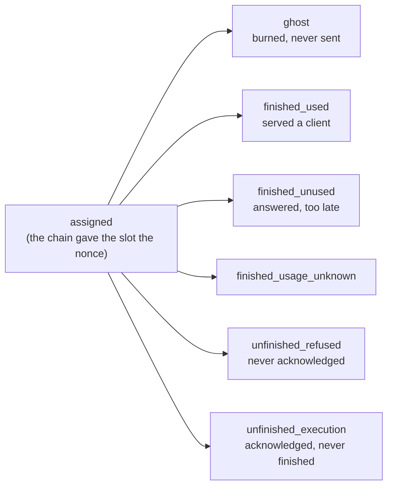

# Accounting

Settlement counts **nonces**, not requests. One request burns several, and some nonces belong to no request at all — a warmup probe, a burn, a nonce the race could not use. So the gateway keeps a ledger of where every committed nonce went, and derives from it a reading of what the numbers mean.

## Two ledgers with similar names

Confusing them wastes an investigation:

| | Request ledger | Nonce ledger |
| --- | --- | --- |
| Answers | what became of one client request | where every committed nonce went |
| Configured by | `GATEWAY_ACCOUNTING_*` | `GATEWAY_NONCE_ACCOUNTING_*` |
| Served at | `GET /v1/requests/{id}` | `/metrics`, plus its own JSON port |
| Owned by | [`store/`](../store/) | [`accounting/`](../accounting/), fed by [`nonces/`](../nonces/) |

The rest of this document is the nonce ledger.

## The vocabulary

Every fact the ledger files is one of a closed set of strings, and those strings are a contract: they are stored in the snapshot, exported as metric labels, and read by an external tracker. A value outside the set normalises to `unknown` and the fact becomes invisible.

They are therefore declared once, in a `vocabulary.go` beside the type that carries them, and referenced by name everywhere else — so a rename reaches every site through the compiler, while editing a *value* silently moves the wire string under every panel that queries it.

| Vocabulary | Declared in | What it names |
| --- | --- | --- |
| `Disposition` | [`accounting/vocabulary.go`](../accounting/vocabulary.go) | what became of a nonce — the six ends every one of them reaches |
| `Usage`, `Phase` | same | whether the answer reached a client, and whether the chain was in proof-of-compute |
| `Terminal*` | same | how an attempt ended, as the ledger files it |
| `TimeoutOutcome`, `ProtocolKind` | same | a settled timeout round, and the protocol facts the event ring keeps |
| `Finding*`, `Severity` | same | this gateway's reading of the counters |
| `TimeoutKind/Action/Reason*` | [`engine/vocabulary.go`](../engine/vocabulary.go) | what a nonce was owed, what the gateway did, and why |
| `Start*`, `Stage*`, `Role*`, `Visibility*` | same | why an attempt started, what escalated it, and what the client saw |
| `GhostReason*` | [`scheduler/ghost.go`](../scheduler/ghost.go) | why a nonce was burned rather than served |

The timeout vocabulary lives with `engine.TimeoutEvent` because three packages emit it — the race, the burn charge and the warmup — and only the ledger consumes it. One producer could own its own words; three cannot.

### A nonce's dispositions

`unfinished_refused` is the cheap failure — the nonce frees at the refusal deadline. `unfinished_execution` is the expensive one: the host took the work, so the nonce is held to the execution deadline.

The kind is read from the receipt — `engine/settle.go`, `timeoutKind` — and then deferred to the verifiers' vote, which is the protocol's answer and can disagree: they judge on what they saw, and the receipt went to the gateway.

## The surface

`GATEWAY_NONCE_ACCOUNTING_ENABLED` builds the ledger and exports it as `devshard_gateway_nonces_*` on the gateway's ordinary metrics endpoint. There is no second port to configure: a Prometheus already scraping the gateway picks the series up on its next scrape.

`GATEWAY_NONCE_ACCOUNTING_LISTEN_ADDR` additionally serves the ledger as JSON on its own port, for a reader that needs what a metric cannot carry — escrow ids and slots are unbounded labels and stay out of Prometheus deliberately.

| Route | Answers |
| --- | --- |
| `GET /api/v1/epochs` | every epoch the ledger holds, summed across participants |
| `GET /api/v1/epochs/{epoch}/participants` | every participant of one epoch |
| `GET /api/v1/epochs/{epoch}/participants/{address}` | one participant, by its own chain address |
| `GET /api/v1/epochs/{epoch}/events` | the applied timeouts and invalid verdicts of one epoch, newest first |
| `GET /api/v1/epochs/{epoch}/events/{address}` | the same feed for one participant |
| `GET /api/v1/escrows` | the escrow ids the ledger holds |

`current` stands in for an epoch index and resolves against the chain snapshot. Epoch `0` is **refused** rather than served: zero means "unconstrained" inside the ledger, so answering it would report every epoch as one. `?model=` and `?escrow_id=` narrow every route but `/escrows`, and `escrow_id` accepts both repetition and commas; the event feed also takes `?participant=`.

The participant route is what the surface exists for: a host operator can ask what this gateway saw of its own participant. An address the epoch holds no record of is a **404 rather than an empty list**, so "nothing went wrong" stays distinguishable from "this gateway never routed to you". The event feed is the opposite — a host with nothing against it gets an empty feed, because there nothing to report is the healthy case.

Every route is read-only and serves one gateway's view of public network behaviour, so the listener carries no authentication. It is still a separate port, and whether it is reachable beyond the deployment is the operator's choice.

`POST /v1/admin/accounting/reset/{epoch}` clears one epoch and answers how many escrows went with it. It lives on the **admin** surface because it erases records, and the epoch is named rather than defaulted for the same reason — a rotation leaves escrows of two epochs live at once, and neighbouring epochs are untouched.

Each escrow keeps its newest 256 events, which caps a pathological run rather than trimming normal traffic: a verdict is rare, and an escrow dies with its epoch.

### The counter's shape is this ledger's own

A counter is served **flat** -- `escrow_id`, `slot_id`, `disposition`, `ghost_reason`, `terminal`, `phase` and the timeout fields all at the top level of the object. The legacy ledger in `devshard/accounting` nests the same facts under a `key` object and calls the burn reason `no_send_reason`.

Nothing outside this gateway reads the JSON counter, and the in-repo Grafana dashboard queries the Prometheus labels instead -- `devshard_gateway_nonces_by_disposition` grouped by `ghost_reason` -- which already match. The shapes are therefore left apart deliberately rather than aligned.

The cost of that is worth stating, because it is silent: a reader written against the legacy shape finds none of these fields, decodes them as empty, filters every counter out and reports **zero burns rather than an error**. The e2e suite hit exactly this, which is why the gateway scenarios read counters with their own helper rather than the shared one.

## Findings

Every participant record carries a `findings` array beside its counters: this gateway's reading of what the counters mean, for an operator who needs to know what to look at rather than what was counted. A finding names a stable `code`, a `severity` of `warning` or `critical`, and the two numbers it was flagged on — `part` and `whole`, the latter absent when the finding counts rather than measures a rate.

Findings are derived on every read and **never stored**: the counters are the fact, the finding is only an interpretation. They also leave as `devshard_gateway_nonce_finding{code,severity,epoch,participant,model}`, valued at the rate that raised them — which is how an alert reaches them, since the JSON API is empty by default.

### Four rules that keep a finding honest

- **A volume floor.** No finding is raised below **20** nonces in its denominator: a rate off four attempts describes noise, not a host.
- **Burns are excluded from every host rate.** A burn is this gateway's own decision; charging it to the host would report our throttling as its failure.
- **Our own failures are excluded.** A phase transition ending an attempt, a vote round that reached no verdict, a missing poster, a long response that had already produced content, and a client that stopped waiting are all ours. A failure the ledger could not *name* still counts — excusing the unclassified would empty the rates.
- **The warmup probe is excluded whatever it ended as.** It is the gateway's own request, so it leaves both sides of every ratio; excluding it only when it succeeded would report a host's refusals while hiding its successes.

Thresholds are constants rather than configuration: two gateways must not report the same host differently, and a host comparing two reports should be able to tell that the host moved, not the ruler.

### What the host answers for

| Code | Rate of | Warning | Critical |
| --- | --- | --- | --- |
| `execution_timeouts` | nonces acknowledged and never finished, over nonces that reached the host | 1% | 5% |
| `refusals` | nonces never acknowledged, over nonces that reached the host | 5% | 20% |
| `answers_unused` | finished answers nobody used, over answers delivered | 20% | — |
| `slow_receipts` | acknowledgements slower than 2.5 s, over answers acknowledged outside PoC | 10% | — |
| `slow_chunks` | answers that stalled mid-stream longer than 5 s, over answers delivered outside PoC | 10% | — |
| `slow_decode` | answers written at more than 40 ms per output token, over answers delivered outside PoC | 10% | — |
| `clock_drift` | receipts stamped more than 5 s from this gateway's clock | 5% | — |
| `logprobs_not_token_ids` | answers whose logprob tokens name decoded text, over answers delivered | 0.1% | 1% |
| `chain_recorded_misses` | nonces the chain itself recorded as missed, over assigned | 1% | 5% |
| `chain_recorded_invalid` | nonces the chain itself recorded as invalid, over assigned | 1% | 5% |
| `challenges_unresolved` | validation challenges still without a verdict, over assigned | 1% | 5% |
| `timeouts_undecided` | timeout rounds that reached no verdict, over rounds that voted | 10% | 50% |

**`execution_timeouts`** — the host answered with a receipt and then delivered nothing. The expensive failure: the nonce is held to the execution deadline where a plain refusal frees it at the refusal deadline. It usually means work was accepted into a queue the host could not drain, so check whether the requested output length fits the hardware's decode rate.

**`refusals`** — the host did not take the work. The cheap failure, but it still spends the nonce. Points at capacity or reachability rather than speed.

**`answers_unused`** — the host finished, but another had already answered the client. Losing races consistently points at throughput rather than availability: the work is correct and arrives too late to be worth anything.

**`slow_receipts`** — the receipt is the host's first sign of life, before any token is generated, so a slow one points at admission rather than generation: the request waited to be picked up. The threshold sits just past the observed p99.

**`slow_chunks`** — the host began answering and then went quiet between chunks. A client reads this as a hang rather than as slowness, and a long enough gap ends the attempt outright.

**`slow_decode`** — the host answered correctly and wrote at a fraction of its peers' rate. Measured from the first content chunk, so the prompt it had to read is not charged to how fast it writes. The threshold is absolute, so a model heavier than any yet served would flag every host running it.

**`clock_drift`** — the chain measures the execution deadline from the timestamp the host signs into its receipt, so a drifted clock moves that deadline. Running ahead makes the network wait past a deadline already passed; running behind gets a nonce voted timed out while the answer is still being written. Check NTP on the host. The offset is measured against the midpoint of the send-to-receipt round trip, not against dispatch, so the host is not charged for the outbound leg; half a second is added back because the executor stamps whole seconds downward.

**`logprobs_not_token_ids`** — a validator replays the answer from its logprob token ids, and decoded text cannot be replayed, so it votes the answer invalid and the host loses the reward. A host does this for every answer carrying logprobs or for none, which is why one flagged answer is already enough to report.

**`chain_recorded_misses`, `chain_recorded_invalid`** — not this gateway's reading but the chain's own, carried back from settlement. These are the numbers that cost the host its reward, so they outrank anything measured here.

**`challenges_unresolved`** — a validation was challenged and never settled either way. The rate matters more than the count: two disputes in thirty thousand nonces is noise, four hundred in nineteen thousand is a pattern.

**`timeouts_undecided`** — the round was raised and never reached a verdict, because votes could not be collected or too few arrived. A nonce that reaches no verdict cannot be raised again, so the host is never answerable for it. Rounds this gateway skipped are excluded: they asked nobody.

### What this gateway did

| Code | Rate of | Warning |
| --- | --- | --- |
| `throttled_by_gateway` | assigned nonces burned without being sent | 10% |
| `blocked_by_state_divergence` | assigned nonces burned because the host's escrow state no longer matches the group's | 1% |
| `failure_terminals` | nonces that reached the host and produced no usable answer | any |

**`throttled_by_gateway`** — this gateway stopped sending, so these nonces are its decision and not the host's failure. Its per-host window narrows after repeated failures and widens again as they stop, which makes this a consequence of the other findings rather than a fault of its own.

**`blocked_by_state_divergence`** — the host returned a post-state-root that disagrees with the group's. It earns one replay of the retained chain first, because a host rolls its diff back on a mismatch and its state survives intact; this counts what it burned after that replay was spent. It is the only capability-shaped verdict that still withholds a host: a build that refuses tools, a version or a context length is counted and reported, never routed around.

**`failure_terminals`** — how many failures reached the host at all. Which failure each was is in the `counters` array beside the finding: read `terminal` there, and a `phase` of `poc` marks one that is expected.

### What needs reporting

| Code | Flagged on |
| --- | --- |
| `ledger_overcounted` | nonces accounted beyond what the chain assigned |
| `ledger_disagrees_with_chain` | the drift left between this ledger and the chain once overcounting is set aside |
| `reasons_unknown` | classified nonces carrying a reason this ledger could not name, over assigned (5%) |

**`ledger_overcounted`** — this gateway accounted for more nonces than the chain says the slot was given, so one of the two is wrong. Worth reporting rather than acting on: no host behaviour produces this.

**`ledger_disagrees_with_chain`** — what the two sides disagree on beyond that bug. The cross-check compares **both sides per slot**: the timeouts this gateway applied against the chain's misses, and the invalid verdicts it recorded against the chain's. Both sides are persisted, so a restart does not raise this on its own — restoring the chain's half without the gateway's once made every restart look like a disagreement for the rest of the epoch.

**`reasons_unknown`** — the ledger's own honesty check: how much of this host's traffic it filed under a reason it could not name. A rising share means the gateway's instrumentation is behind its behaviour, not that the host did anything.

### Phase

Every rate that names a host fault counts only what happened outside proof-of-compute, on **both** sides of the ratio. A host proving computation cannot serve, and charging it for that would make every participant look broken once an epoch.

### What the ledger cannot say

It holds nonce dispositions, not timings, so no finding speaks to prefill or decode rate directly. The nearest thing it offers is `answers_unused`, where losing races consistently points at throughput.

## Storage

The ledger lives in memory and is written whole to `accounting.db` under the storage directory every `GATEWAY_NONCE_ACCOUNTING_SNAPSHOT_SECONDS`, and once more at shutdown. Nothing queries that database except the ledger's own load at start-up, so its tables mirror the in-memory shape one for one and a write is a single transaction that empties and refills them. The transaction is what makes a half-written ledger impossible: a crash or a failed insert rolls back to the previous contents rather than leaving the tables empty.

A snapshot that cannot be read is reported and the gateway starts with an **empty ledger**: refusing to start over an unreadable observability file would trade a gateway for a graph.

Only the nonces whose disposition can still move are written down — those awaiting a timeout, and those an unfinished disposition might yet be lifted from. A burned or finished nonce is already counted and nothing lifts it, so the file stays close to the size of the trouble rather than the size of the history. Two things follow:

- A nonce whose race died with the process is named `abandoned_by_restart` rather than left pending for ever: no timeout was ever voted on it, and it will still settle as a completed inference nobody checked.
- An unfinished nonce is re-asked on every sweep. If the protocol finished it after the race gave up, it leaves the unfinished bucket — that bucket is what settlement reads as work the participant failed to do.

## Metrics

The `devshard_gateway_nonces_*` family is **gauges, not counters**. A nonce's disposition moves when it is reclassified, so a series goes down as well as up and `rate()` over one reports nonsense.

Every series carries an `epoch` label: the ledger holds several epochs at once and a participant keeps its slot across a rotation, so the epoch is what separates two otherwise identical series — and it, not the dashboard's time range, is what a panel must filter on. A cumulative gauge does not respond to a time picker.

## Where to change what

| To change | Go to |
| --- | --- |
| a finding's threshold | `accounting/findings.go`, the constants at the top |
| what a finding excludes | `accounting/findings.go`, `excused` / `offRecord` / `servedNoUser` |
| a stored or reported value's name | the owning `vocabulary.go` — and treat it as a migration |
| what the ledger persists | `accounting/store.go` and `accounting/sqlstore.go`, together |
| what feeds the ledger | [`nonces/`](../nonces/) — live events, chain diffs, the sweep |
