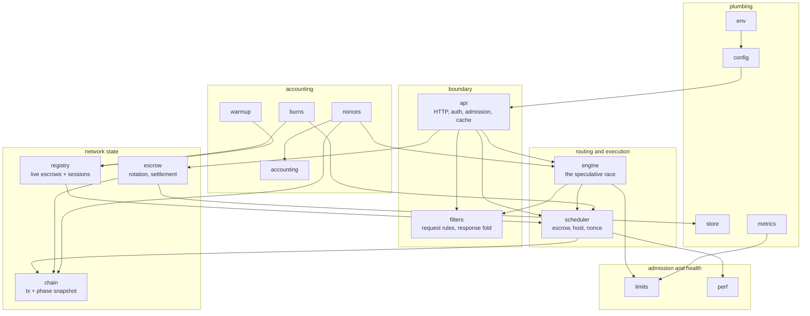
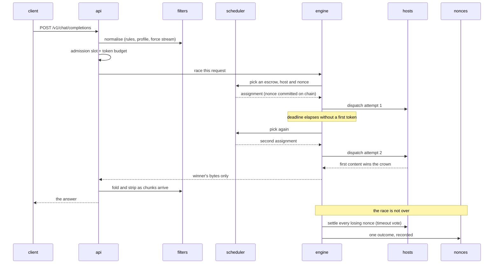
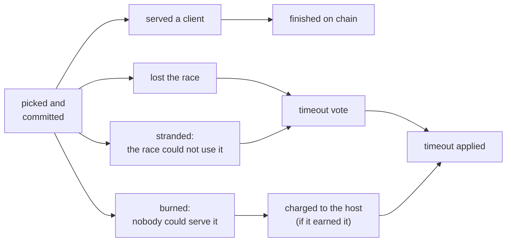

# Architecture

## The problem this shape solves

A normal API gateway forwards a request and forgets it. This one cannot, for three reasons:

1. **A nonce costs money the moment it is committed**, before anyone is served. A request that fails still leaves an obligation on the chain.
2. **Hosts are untrusted and uneven.** Any of them can be slow, wrong, or lying, so the answer a client gets is raced across several and the loser's cost still has to be accounted for.
3. **The network moves underneath.** Escrows deplete and rotate, epochs change phase, hosts join and leave — all while requests are in flight.

Every structural choice below follows from one of those.

## Layers

`filters` depends on nothing: it is pure, and its behaviour is pinned byte-for-byte against goldens. `env` is read once at startup and never again. Everything else reads an immutable `config` snapshot that is swapped whole on reconfiguration.

## One request

Two things in that diagram are the whole design:

- **The client is answered before the request is finished.** The crown goes to the first attempt producing content; the losers are still running, and their nonces still owe votes. A client hanging up does not cancel them.
- **The nonce is committed at pick time, not at success time.** That is why a burned nonce, a refused host and a stranded assignment all have names and all reach the ledger.

## A nonce's life

Every nonce ends in exactly one of these, and the ledger's job is to say which:

A nonce that reaches none of the bottom row is money the escrow paid for silence. That is the failure mode the whole accounting layer exists to make visible.

## Where the money is

Four places, each with its own guard:

| Risk | Guard |
| --- | --- |
| a committed nonce nobody settles | the race's drain barrier: shutdown waits for every owed vote |
| a host that refuses work and takes no miss | [`burns`](./burns/) — probe first, charge only what the host earned |
| an escrow that pays for work it did not receive | [`accounting`](./accounting/) cross-checks its own counts against the chain's |
| a reply held in memory until the process dies | a per-request cap, a process-wide ceiling, and folding as chunks arrive |

## What runs in the background

Beyond the request path, the process runs: the chain phase observer, the escrow lifecycle manager (rotation, depletion, settlement), the nonce ledger's sweep, the escrow warmup, and the burn charger. Each is started by the composition root and stopped by it in order — the race's drain barrier last, because it is the one that can still owe the chain something.

## Divergences from the legacy gateway

Recorded in full in [`docs/rules.md`](./rules.md); the load-bearing ones:

- **Every restart starts clean** — no ejections, no capability counts, no penalties replayed. Minute-scale backoff self-heals faster than stale state is worth.
- **Capability refusals do not withhold a host from routing.** They are counted and reported; a version refusal would otherwise retire a host permanently, since a gateway serves one protocol version for its whole life.
- **A non-streaming reply is folded as it arrives, not accumulated.** What a request holds is the answer being assembled, not the stream it came from.
