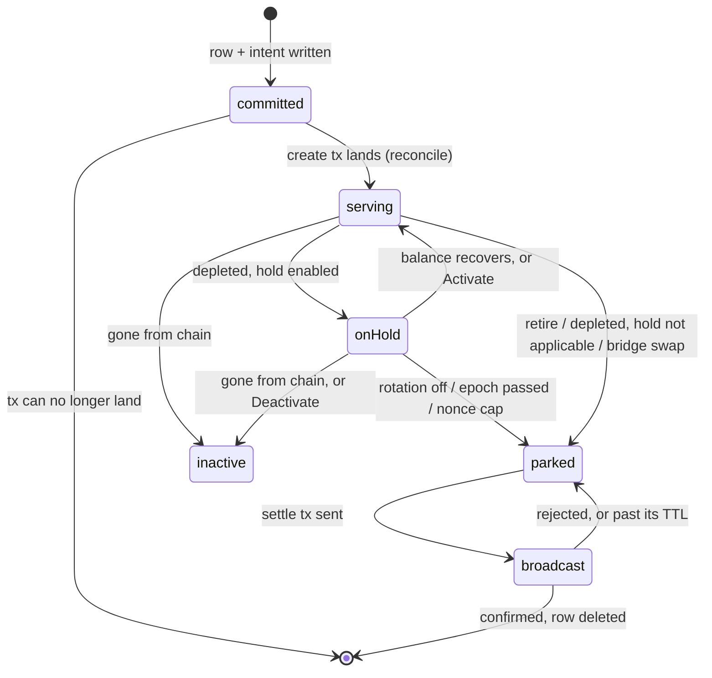
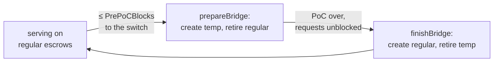
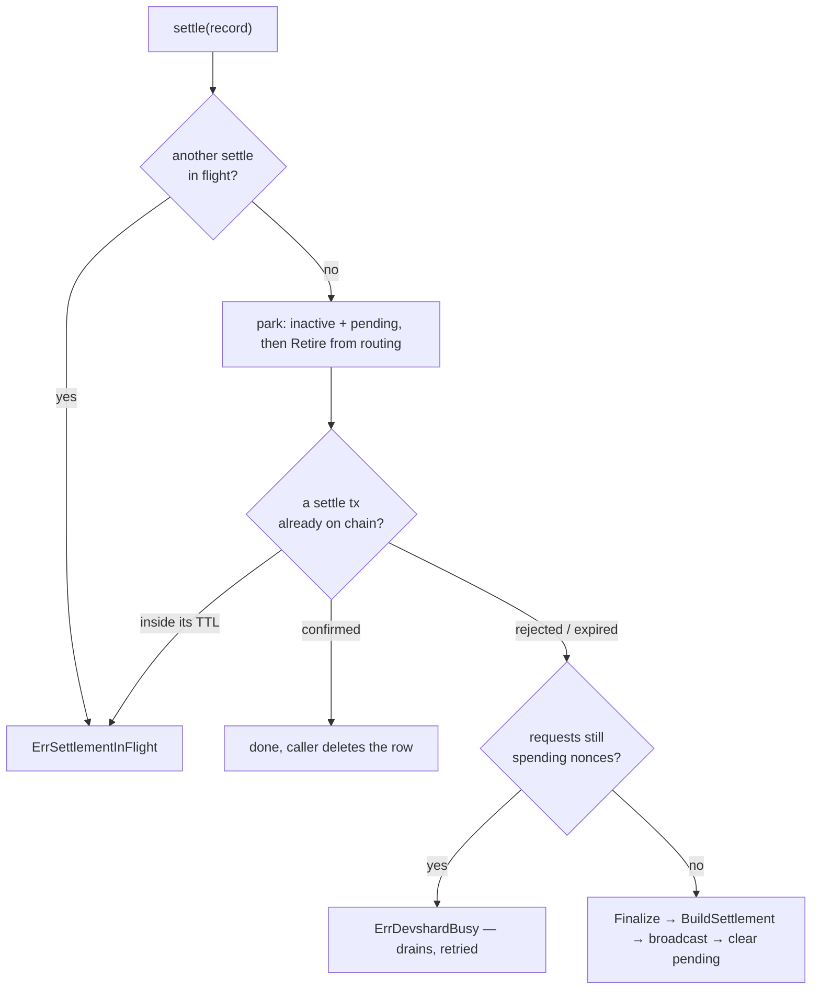

# Escrows

An escrow is a funded account on chain that pays for inference. Every nonce the gateway spends is drawn from one, so an escrow's lifecycle is where the gateway's money lives: it is created ahead of need, rotated around epoch switches, retired when it empties, and settled once — after which nothing can ever settle it again.

Owned by [`escrow/`](../escrow/) (the lifecycle) and [`registry/`](../registry/) (which escrows are routable right now). The two are separate: the registry answers "can a request use this escrow", the manager answers "should this escrow exist at all".

## The one invariant everything else protects

**The row is the key.** `devshards.private_key_env` names the environment variable holding the only signing key that can settle that escrow. Nothing else on the machine records it. Delete the row before the settlement lands and the escrow's balance is stranded on chain permanently.

Every ordering rule below follows from that:

| Rule | Where |
| --- | --- |
| the row is written **before** the create transaction is broadcast | `commitments.go`, `createEscrow` → `onPrepared` |
| retirement with settlement off **parks**, it does not delete | `settlement.go`, `retire` |
| the row is deleted only after a settlement is confirmed | `settlement.go`, `deleteSettled` |
| an escrow is taken out of routing before it is settled | `settlement.go`, `settle` → `park` |

## The states a row can be in

The state is not a column; it is the combination of five:

| `active` | `on_hold` | `settlement_pending` | `settle_tx_hash` | Means |
| --- | --- | --- | --- | --- |
| true | false | false | `""` | serving |
| true | true | false | `""` | on hold: still published, waiting for its held money, off the candidate list |
| false | false | true | `""` | parked: out of routing, waiting to settle |
| false | false | true | set | settled, broadcast not yet confirmed |
| row deleted | — | — | — | settled and confirmed; the escrow is finished |
| false | false | false | `""` | deactivated by hand, or gone from chain |

`on_hold` means something only while `active=1`; every statement that clears `active` clears it too, so `active=0, on_hold=1` is never written (`store.DevshardRecord.OnHold`, `store/devshards.go`). See [`routing.md`](./routing.md), "An escrow on hold", and [`escrow/README.md`](../escrow/README.md), "An escrow on hold", for what holds it there and what brings it back.

`rotation_role` (`regular` / `temp`) and `rotation_epoch` say which set the escrow belongs to; `route_prefix` is the URL path this escrow's hosts serve on, falling back to the gateway's own prefix when empty.

## The tick

`escrow/manager.go`, `tick`, every **15 s** (`TickInterval`), single-threaded per process. Order matters, and the first six steps run **whatever `rotation.enabled` says**:

| # | Step | Runs regardless of the toggle because |
| --- | --- | --- |
| 1 | `reconcile` | crash recovery is not a rotation feature |
| 2 | `settlePending` | a parked escrow's row is the only record of its key; nothing else picks it up |
| 3 | `checkMissing` | an escrow gone from chain must stop taking traffic |
| 4 | `sweepTimeouts` | a nonce the chain still settles is owed a vote whether or not rotation is on |
| 5 | `resumeHeld` | every row on hold is re-synced into the registry, resumed or parked, before this tick's own depletion pass runs against it — whatever the toggle says |
| 6 | `checkDepletion` | so must an empty one — only *creating its replacement* is rotation's business |
| 7 | `prepareBridge` / `finishBridge` | rotation proper; skipped when the toggle is off |

Every step returns its error into an `errors.Join`; one failing model or escrow never stops the others. `Stop()` cancels the context and waits for the tick in flight, so shutdown never races a half-finished rotation.

`sweepTimeouts` is the one step that does not run *on* the tick. A vote round can outlast 15 s, so it runs in its own goroutine and a second tick starts nothing while the first is still voting; `Stop()` waits for it as well. Its whole cost is bounded by `timeout_sweep.budget_per_tick` across every escrow, and the walk starts one escrow further along each tick so a backlog on one cannot starve the rest. `devshard_gateway_timeout_sweep_total` counts what each tick applied and failed to apply, which together are what it found unless shutdown cut the round short; a tick that found nothing moves no series. See [`race.md`](./race.md), "The vote nobody retried".

## Creating an escrow

`commitments.go`, `createEscrow`.

1. Resolve the signer from `model.private_key_env` — by name; the key itself is never written anywhere.
2. `onPrepared`: write the **commitment** row (tx hash, model, role, epoch, created-at) *before* broadcasting. A failed write aborts with no broadcast: **no broadcast without durable intent.**
3. Broadcast. If the process dies here, the commitment is the only trace — and it is enough.
4. On the next tick, `reconcile` resolves every commitment.

`reconcileOne` has exactly five outcomes:

| Chain says | Action |
| --- | --- |
| tx landed, produced an escrow | write the devshard row, drop the commitment |
| tx landed, produced no escrow | drop the commitment — terminal, it will never produce one |
| tx not found, inside its TTL | keep it; retry next tick |
| tx not found, past its TTL | drop the commitment; a fresh create is correct |
| endpoint unreachable | keep it; an unreachable endpoint is not an answer |

The TTL window is `commitmentReconcileGrace` = `chain.UnorderedTxTTL` (9 min) + 2 min of index lag. A row with no `created_at` (legacy or malformed) counts as **still pending** — keeping a commitment costs one row, dropping one prematurely costs a duplicate escrow.

### The create breaker

`breaker.go`. Per `(model, role)`: each failure raises the cooldown (1, 2, 4 ticks, capped at `maxCreateBreakerCooldownTicks` = 4), and `gated` burns one tick per call. Cooldowns are counted in **ticks, not seconds** — a stalled tick loop does not silently expire them.

A gated create returns `errCreateSuppressed`, which is not "nothing to do": the bridge reads it as a signal to take its degrade path (below) rather than retire escrows for replacements that were never created.

## Rotation: the epoch bridge

Around an epoch switch, hosts re-form and an escrow created under the old epoch stops being funded by the new one. The bridge covers that gap with **temp** escrows.

`prepareBridge` wins whenever the switch is within `rotation.pre_poc_blocks`, taking precedence over `finishBridge` where the two windows overlap — a bridge half-built is worse than one built early. `finishBridge` runs only when `RequestsBlocked` is false and only for models that actually have an active temp, so it is a no-op on a network that never bridged.

**Degrade path.** If `prepareBridge` cannot create the temp escrows, `promoteRegularsToTemp` relabels the existing regulars to `temp` in place (`SetDevshardRotationRole` — the role only, so a concurrent write to the same row is not clobbered). The epoch then still has bridge coverage, and `finishBridge` will retire them when it builds fresh regulars.

Failures are recorded per model in `rotation_status` (`stage`, `epoch`, `create_error`, `completed`) and skipped, never aborted.

## Depletion

A depleted escrow is worse than a dead one: its in-flight count is low precisely because every request fails, so the load score **prefers** it. `OnBalanceExhausted` marks it (no I/O — the request path never reaches the chain), and the next tick's `checkDepletion` acts, choosing one of two paths per marked escrow (`escrow/depletion.go`, `escrow/hold.go`):

- **hold disabled, rotation off, or the model not replaceable** — `replaceDepleted` runs: the same park-then-replace path rotation always ran, described below.
- **otherwise** — `holdOrPark` decides among four outcomes:
  1. the escrow is already on hold — nothing to do this tick, another mark already moved it;
  2. the reason is the nonce cap, or the model already holds `hold_max_per_model` rows on hold — parked, the same as the disabled path, because nothing about a spent nonce budget comes back;
  3. the escrow's creation epoch — the row's `rotation_epoch`, or the chain's escrow epoch when the row has none — is older than the current one or cannot be resolved — parked, never held, so no hold can outlive the chain's settlement window;
  4. otherwise — put on hold (`PutOnHoldIfServing`), then judged for a replacement by the count rule below, not by the always-replace rule the parked path uses.

Parking, in either path, is inactive and settlement-pending in one statement that matches only a serving row, then out of routing — and only the call that moved the row creates a replacement, so neither a later tick nor a restart creates a second one. Putting on hold is the same shape, one statement that matches only a serving row not already on hold, and only the call that moved it decides on a replacement.

**The count rule decides who gets a replacement**, whether the escrow was parked or put on hold: a replacement is created only when the model has fewer than `TargetCount` **serving** escrows — `active=1, on_hold=0`, any role — once this one has left them (`replaceIfShort`, `escrow/hold.go`). An escrow that resumed from hold is surplus over the target, so when it depletes again the count is already full and no second replacement is funded; the same count repairs a replacement lost to a crash, at the model's next depletion.

- the replacement gets **one attempt**: a failed create, including one that broadcast and never confirmed or one a shutdown cut short after the park, is not retried — a create that did land is still registered by `reconcile`; the model runs one escrow short until the next rotation, and if the escrow was the model's last active temp during proof-of-compute, `finishBridge` finds no temp to finish and the model serves nothing until the next epoch's bridge;
- a failure to close the retired escrow's session after the park still counts as parked — routing has already stopped — so the create still runs, and the error is surfaced;
- the replacement is always `regular` — inheriting `temp` would hand the next bridge an escrow to retire instead of lasting coverage;
- with no model configured for replacement, the escrow is parked anyway, with a warning;
- with settlement on, the parked escrow settles through `settlePending` on a later tick, like any other parked row;
- a park or a hold that fails re-marks the escrow, so the next tick tries again, and nothing is created meanwhile;
- a snapshot with no epoch yet (`EpochIndex == 0` or `BlockHeight == 0`) **refuses** the replacement before anything is parked or held — an escrow created under it belongs to no epoch, and the next bridge would fund a full set on top of it; the escrow stays marked and serving for the next tick.

With rotation off, `checkDepletion` parks the drained escrow but creates no replacement. If the operator still offers the model (`limits.model_access` or `limits.model_limits` names it), `api/routes.go`'s `routableModel` answers `503` with `Retry-After` for that model until an operator acts, rather than the `400` a model nobody offers gets.

An escrow put on hold rather than parked stays a different lifecycle from here on: see [`routing.md`](./routing.md), "An escrow on hold", and [`escrow/README.md`](../escrow/README.md), "An escrow on hold".

## Gone from chain

`checker.go`. A host reporting an escrow absent only *marks* it; `TriggerEscrowCheck` confirms with the chain on the next tick. Only a confirmed not-found deactivates: a lookup error and a found escrow both leave it serving. **Ambiguity is never a reason to deactivate.** Routing stops before the row is written, so a confirmed-absent escrow takes no further request even if the write fails.

## Settlement and retirement

`settlement.go`. `settle` is the single path — operator (`Settle`), rotation (`retire`) and the tick (`settlePending`) all go through it, so they share the dedup, the ordering and the busy check.

**Park comes before the reconciliation.** The caller deletes the row on success, and a row that is gone can no longer take the escrow out of routing — an escrow put back into service by hand would otherwise keep serving with nothing left to un-publish it. For the same reason `Activate`, and a re-registration through `register` (`POST /v1/admin/devshards`, `/import`), both refuse a row that is parked or carries a settle hash (`ErrDevshardNotActivatable`, HTTP 409): serving from it again spends nonces the settlement does not account for. `register` does not refuse a row on hold — the upsert it runs never puts a row on hold or resumes it, so an active row keeps whatever the flag already was; only a re-registration that writes `active = 0` clears `on_hold` with it.

**`alreadySettled`** decides whether a previous broadcast counts, using the hash and the `settle_tx_at` stamp:

| Chain says | Conclusion |
| --- | --- |
| committed and succeeded | settled; reconcile and let the caller drop the row |
| not found, inside the TTL | still landing — `ErrSettlementInFlight`, do not rebroadcast |
| not found, past the TTL | clear the hash; a fresh transaction is right |
| committed and rejected | clear the hash; retry |
| endpoint unreachable | fail the tick — not an answer |

A row written before `settle_tx_at` existed carries no stamp and counts as **past** the window — the opposite default from the create path: keeping a stale commitment costs a row, keeping a stale settle hash costs an escrow that is never settled at all. Rebroadcasting one that was still landing costs a fee once, and the stamp that write leaves governs every tick after it.

**Deferred, not failed.** `ErrDevshardBusy` and `ErrSettlementInFlight` both mean "not yet": the next tick retries. `deferredRetire` filters them out of rotation's error set, so an ordinary bridge does not report an error for every escrow that happened to be draining.

**With `rotation.settlement_enabled` off**, `retire` only parks. The row survives, carrying the key name, and `settlePending` picks it up the moment settlement is switched on. One tick settles at most `pendingSettleBudget` = 4 parked escrows, so a backlog drains without one tick spending minutes in chain calls.

## Draining: the registry side

`Retire` takes the escrow out of the routing set immediately, but its session stays alive until the requests already dispatched on it finish. The entry sits in `draining` for that whole time, and `Add` refuses the same id with `ErrDraining` — a second session over storage the first still holds would corrupt it.

The close runs with the registry lock **released**: flushing takes the session lock, and a dispatch takes the session lock before the registry lock, so holding both here in the opposite order wedges every later route and settlement behind one retirement.

`entry.close()` flushes the snapshot and then closes the session **unconditionally**, and reports the two separately. The entry stays in `draining` only when the store was not released; a failed flush with a successful close frees the id, because holding it would refuse that escrow for the rest of the process's life. On the last release the failure is counted (`DrainCloseFailures`) rather than raised: the request that held the escrow open has already been answered, and there is nobody left to hand it to. A `Retire` with nothing in flight returns it to its caller instead.

## Height sync

Mainnet height is the escrow's logical clock: every host and the sequencer keep a signed `(height, hash)` inside the escrow's own log, so a verifier replaying the diffs recomputes the same time. The protocol lives in the session (`user/heartbeat.go`, `user/heightsync_seed.go`); the gateway's part is to open the cadence, and that is the whole of it.

**Only the user side can open a turn.** A busy escrow pays nothing for this — a host's own stamp on `confirm`/`finish` discharges the cadence. A quiet one has no such traffic, and if nobody opens a heartbeat turn it never syncs at all, while its hosts count the silence toward arming close-ready. `StartHeartbeatLoop` is therefore started per serving session, and the session's `Close` stops it.

**The gateway needs no block oracle of its own.** A heartbeat stamps the floor the log already holds (`referenceStampLocked` reads `HeightSyncFloorAsOf`, nothing else), and where a live tip is wanted the session falls back to the host clients' own response-leg anchors (`observedHeightLocked`). The gateway is a courier: it carries heights, and cannot raise the floor even if it wanted to — a sequencer-composed stamp never raises `F` and never counts toward a turnover. Running a follower here would buy a trust label and nothing the protocol reads.

**It is on unless the fleet is told it is not.** Both gates ship on, the way devshardctl ran them, so a deployment that upgrades into this gateway keeps syncing without being told to. `GATEWAY_HEIGHT_SYNC_ENABLED=false` turns the cadence off for a fleet whose hosts do not carry height sync, which would otherwise skip a heartbeat every interval and log it. `GATEWAY_HEIGHT_SYNC_REQUIRE_SEED=false` is for the e2e stand, where hosts have no catalog and no oracle.

**The warmup waits for the seed; the chat path does not yet.** A probe teaches nobody before the group is reachable and before the escrow's log carries a height, so the prober waits for the router catalog and then for the seed, as devshardctl does. The chat path is the half still missing: devshardctl gates every request on `WaitHeightSeed` and refuses with `Retry-After` when it cannot seed, and this gateway does not, so an escrow that never seeds still serves inference while `heightsync: seed_incomplete` is the only signal. Closing that belongs in routing, which picks among escrows where devshardctl had exactly one.

**The cadence runs the fleet's schedule, not the compiled one.** The heartbeat's `Interval`, `TurnTimeout` and `IdleTimeout` come from the runtime-params feed ([`runtime_params.go`](../runtime_params.go)), so governance moving `height_sync_interval_ms` moves them for every session opened after it — a live escrow keeps the schedule it opened with, because the interval is read once when its loop starts. Only that half is overlaid: `AckDeadlineBlocks`, `DeltaBlocks` and `BlockTime` stay compiled, because they are folded into `SyncTurnRecord` and every replaying verifier must recompute the same verdict from them. An overlay that would fail `Validate` is clamped back to the compiled schedule and counted, and a feed that answers nothing yields the compiled 12 s, because zero on the wire means keep the default.

## Failure modes and their causes

| Symptom | Cause |
| --- | --- |
| `escrow is still draining` on activation | a request from the previous incarnation has not finished; wait a tick |
| `devshard cannot be activated` (409) | the escrow is parked for settlement — settle it, do not re-serve it |
| `settlement already in flight`, repeatedly | a settle tx is inside its 11-minute window; it resolves on its own |
| the same escrow settles every tick and never clears | the broadcast is landing but `settle_tx_hash` is not being written — check the store |
| rotation logs "the network serves no such model" | the chain's snapshot lists no host for that model; the escrow is skipped |
| a bridge creates nothing and retires nothing | the create breaker is gated after repeated failures; look for the earlier create error |
| an escrow's whole `Amount` is paid out to the group's slots instead of settling normally | it stayed unsettled past the chain's window — an escrow on hold must settle inside its epoch or epoch+1 exactly like a serving one (`inference-chain/x/inference/keeper/msg_server_settle_devshard_escrow.go:49`), or `DevshardPruningThreshold` (2) epochs after the one that funded it, the chain splits its entire balance across the group instead of paying by settlement; being on hold does not extend the window (`inference-chain/x/inference/keeper/devshard_pruning.go:9-25`) |

## Where to change what

| To change | Go to |
| --- | --- |
| how often the lifecycle runs | `escrow/manager.go`, `TickInterval` |
| how long a tx is considered still-landing | `escrow/commitments.go`, `commitmentReconcileGrace` |
| how many parked escrows settle per tick | `escrow/settlement.go`, `pendingSettleBudget` |
| how hard a failing create is throttled | `escrow/breaker.go`, `escalatedCooldownTicks` |
| when the bridge starts | `rotation.pre_poc_blocks`, read in `escrow/manager.go`, `tick` |
| how many escrows a model gets | `rotation.models_json`: `temp_count`, `target_count` (1 when absent; an explicit value below 1 is rejected, `escrow/models.go`) |
| what makes an escrow routable | `registry/registry.go`, `Add` / `unpublish` |
