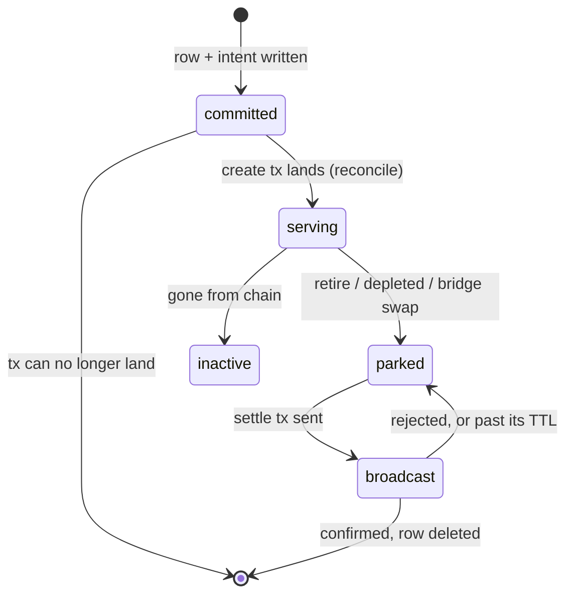
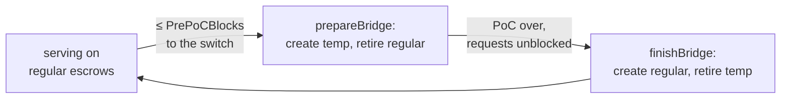
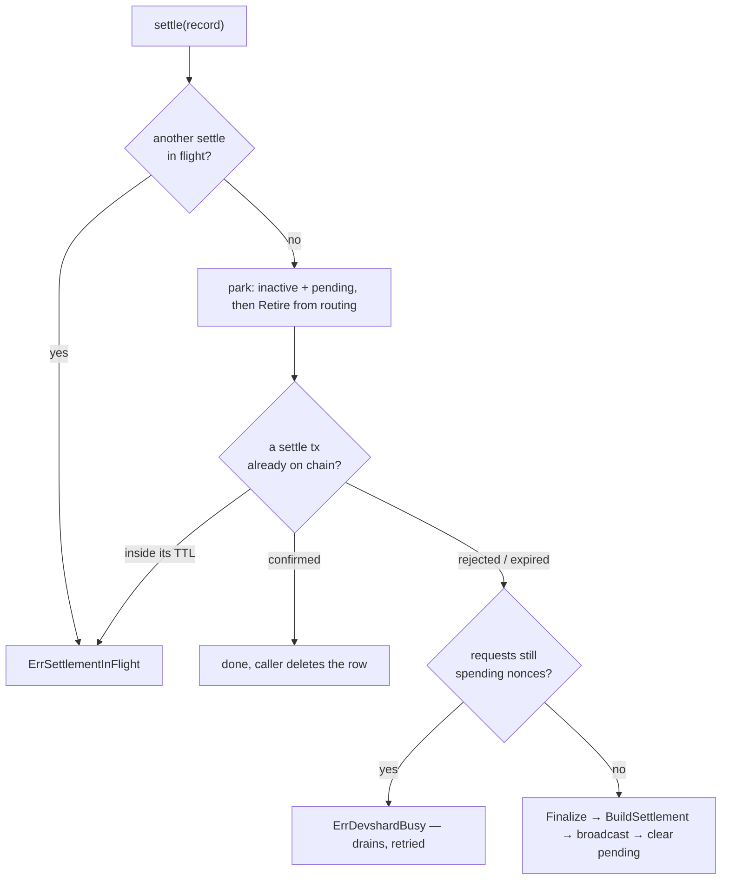

# Escrows

An escrow is a funded account on chain that pays for inference. Every nonce the gateway spends is drawn from one, so an escrow's lifecycle is where the gateway's money lives: it is created ahead of need, rotated around epoch switches, retired when it empties, and settled once — after which nothing can ever settle it again.

Owned by [`escrow/`](../escrow/) (the lifecycle) and [`registry/`](../registry/) (which escrows are routable right now). The two are deliberately separate: the registry answers "can a request use this escrow", the manager answers "should this escrow exist at all".

## The one invariant everything else protects

**The row is the key.** `devshards.private_key_env` names the environment variable holding the only signing key that can settle that escrow. Nothing else on the machine records it. Delete the row before the settlement lands and the escrow's balance is stranded on chain permanently.

Every ordering rule below follows from that:

| Rule | Where |
| --- | --- |
| the row is written **before** the create transaction is broadcast | `commitments.go`, `createEscrow` → `onPrepared` |
| retirement with settlement off **parks**, it does not delete | `settlement.go`, `retire` |
| the row is deleted only after a settlement is confirmed | `settlement.go`, `deleteSettled` |
| an escrow is taken out of routing before it is settled | `settlement.go`, `settle` → `park` |

## The states a row can be in

The state is not a column; it is the combination of four:

| `active` | `settlement_pending` | `settle_tx_hash` | Means |
| --- | --- | --- | --- |
| true | false | `""` | serving |
| false | true | `""` | parked: out of routing, waiting to settle |
| false | true | set | settled, broadcast not yet confirmed |
| row deleted | — | — | settled and confirmed; the escrow is finished |
| false | false | `""` | deactivated by hand, or gone from chain |

`rotation_role` (`regular` / `temp`) and `rotation_epoch` say which set the escrow belongs to; `route_prefix` is the URL path this escrow's hosts serve on, falling back to the gateway's own prefix when empty.

## The tick

`escrow/manager.go`, `tick`, every **15 s** (`escrowTickInterval`), single-threaded per process. Order matters, and the first four steps run **whatever `rotation.enabled` says**:

| # | Step | Runs regardless of the toggle because |
| --- | --- | --- |
| 1 | `reconcile` | crash recovery is not a rotation feature |
| 2 | `settlePending` | a parked escrow's row is the only record of its key; nothing else picks it up |
| 3 | `checkMissing` | an escrow gone from chain must stop taking traffic |
| 4 | `checkDepletion` | so must an empty one — only *creating its replacement* is rotation's business |
| 5 | `prepareBridge` / `finishBridge` | rotation proper; skipped when the toggle is off |

Every step returns its error into an `errors.Join`; one failing model or escrow never stops the others. `Stop()` cancels the context and waits for the tick in flight, so shutdown never races a half-finished rotation.

## Creating an escrow

`commitments.go`, `createEscrow`.

1. Resolve the signer from `model.private_key_env` — by name; the key itself is never written anywhere.
2. `onPrepared`: write the **commitment** row (tx hash, model, role, epoch, created-at) *before* broadcasting. A failed write aborts with no broadcast: **no broadcast without durable intent.**
3. Broadcast. If the process dies here, the commitment is the only trace — and it is enough.
4. On the next tick, `reconcile` resolves every commitment.

`reconcileOne` has exactly four outcomes:

| Chain says | Action |
| --- | --- |
| tx landed, produced an escrow | write the devshard row, drop the commitment |
| tx landed, produced no escrow | drop the commitment — terminal, it will never produce one |
| tx not found, inside its TTL | keep it; retry next tick |
| tx not found, past its TTL | drop the commitment; a fresh create is correct |
| endpoint unreachable | keep it; an unreachable endpoint is not an answer |

The TTL window is `commitmentReconcileGrace` = `chain.UnorderedTxTTL` (9 min) + 2 min of index lag. A row with no `created_at` (legacy or malformed) counts as **still pending** — keeping a commitment costs one row, dropping one prematurely costs a duplicate escrow.

### The create breaker

`breaker.go`. Per `(model, role)`: each failure raises the cooldown (1, 2, 4 ticks, capped at `maxCreateBreakerCooldownTicks` = 4), and `gated` burns one tick per call. Cooldowns are counted in **ticks, not seconds** — a stalled tick loop does not silently expire them.

A gated create returns `errCreateSuppressed`, which is not "nothing to do": the bridge reads it as a signal to take its degrade path (below) rather than retire escrows for replacements that were never created.

## Rotation: the epoch bridge

Around an epoch switch, hosts re-form and an escrow created under the old epoch stops being funded by the new one. The bridge covers that gap with **temp** escrows.

`prepareBridge` wins whenever the switch is within `rotation.pre_poc_blocks`, taking precedence over `finishBridge` where the two windows overlap — a bridge half-built is worse than one built early. `finishBridge` runs only when `RequestsBlocked` is false and only for models that actually have an active temp, so it is a no-op on a network that never bridged.

**Degrade path.** If `prepareBridge` cannot create the temp escrows, `promoteRegularsToTemp` relabels the existing regulars to `temp` in place (`SetDevshardRotationRole` — the role only, so a concurrent write to the same row is not clobbered). The epoch then still has bridge coverage, and `finishBridge` will retire them when it builds fresh regulars.

Failures are recorded per model in `rotation_status` (`stage`, `epoch`, `create_error`, `completed`) and skipped, never aborted.

## Depletion

A depleted escrow is worse than a dead one: its in-flight count is low precisely because every request fails, so the load score **prefers** it. `OnBalanceExhausted` marks it (no I/O — the request path never reaches the chain), and the next tick's `checkDepletion` acts:

- a replacement is created **first**, so coverage never drops to zero, then the depleted escrow is retired;
- the replacement is always `regular` — inheriting `temp` would hand the next bridge an escrow to retire instead of lasting coverage;
- with no model configured for replacement, the escrow is retired anyway, with a warning;
- a failed retirement re-marks the escrow, so the next tick tries again;
- a snapshot with no epoch yet (`EpochIndex == 0` or `BlockHeight == 0`) **refuses** the replacement — an escrow created under it belongs to no epoch, and the next bridge would fund a full set on top of it.

## Gone from chain

`checker.go`. A host reporting an escrow absent only *marks* it; `TriggerEscrowCheck` confirms with the chain on the next tick. Only a confirmed not-found deactivates: a lookup error and a found escrow both leave it serving. **Ambiguity is never a reason to deactivate.** Routing stops before the row is written, so a confirmed-absent escrow takes no further request even if the write fails.

## Settlement and retirement

`settlement.go`. `settle` is the single path — operator (`Settle`), rotation (`retire`) and the tick (`settlePending`) all go through it, so they share the dedup, the ordering and the busy check.

**Park comes before the reconciliation.** The caller deletes the row on success, and a row that is gone can no longer take the escrow out of routing — an escrow put back into service by hand would otherwise keep serving with nothing left to un-publish it. For the same reason `Activate` refuses a row that is parked or carries a settle hash (`ErrDevshardNotActivatable`, HTTP 409): serving from it again spends nonces the settlement does not account for.

**`alreadySettled`** decides whether a previous broadcast counts, using the hash and the `settle_tx_at` stamp:

| Chain says | Conclusion |
| --- | --- |
| committed and succeeded | settled; reconcile and let the caller drop the row |
| not found, inside the TTL | still landing — `ErrSettlementInFlight`, do not rebroadcast |
| not found, past the TTL | clear the hash; a fresh transaction is right |
| committed and rejected | clear the hash; retry |
| endpoint unreachable | fail the tick — not an answer |

A row written before `settle_tx_at` existed carries no stamp and counts as **past** the window — the opposite default from the create path, and deliberately so: keeping a stale commitment costs a row, keeping a stale settle hash costs an escrow that is never settled at all. Rebroadcasting one that was still landing costs a fee once, and the stamp that write leaves governs every tick after it.

**Deferred, not failed.** `ErrDevshardBusy` and `ErrSettlementInFlight` both mean "not yet": the next tick retries. `deferredRetire` filters them out of rotation's error set, so an ordinary bridge does not report an error for every escrow that happened to be draining.

**With `rotation.settlement_enabled` off**, `retire` only parks. The row survives, carrying the key name, and `settlePending` picks it up the moment settlement is switched on. One tick settles at most `pendingSettleBudget` = 4 parked escrows, so a backlog drains without one tick spending minutes in chain calls.

## Draining: the registry side

`Retire` takes the escrow out of the routing set immediately, but its session stays alive until the requests already dispatched on it finish. The entry sits in `draining` for that whole time, and `Add` refuses the same id with `ErrDraining` — a second session over storage the first still holds would corrupt it.

The close runs with the registry lock **released**: flushing takes the session lock, and a dispatch takes the session lock before the registry lock, so holding both here in the opposite order wedges every later route and settlement behind one retirement.

`entry.close()` flushes the snapshot and then closes the session **unconditionally**, and reports the two separately. The entry stays in `draining` only when the store was not released; a failed flush with a successful close frees the id, because holding it would refuse that escrow for the rest of the process's life. On the last release the failure is counted (`DrainCloseFailures`) rather than raised: the request that held the escrow open has already been answered, and there is nobody left to hand it to. A `Retire` with nothing in flight returns it to its caller instead.

## Failure modes worth recognising

| Symptom | Cause |
| --- | --- |
| `escrow is still draining` on activation | a request from the previous incarnation has not finished; wait a tick |
| `devshard cannot be activated` (409) | the escrow is parked for settlement — settle it, do not re-serve it |
| `settlement already in flight`, repeatedly | a settle tx is inside its 11-minute window; it resolves on its own |
| the same escrow settles every tick and never clears | the broadcast is landing but `settle_tx_hash` is not being written — check the store |
| rotation logs "the network serves no such model" | the chain's snapshot lists no host for that model; the escrow is skipped on purpose |
| a bridge creates nothing and retires nothing | the create breaker is gated after repeated failures; look for the earlier create error |

## Where to change what

| To change | Go to |
| --- | --- |
| how often the lifecycle runs | `escrow/manager.go`, `escrowTickInterval` |
| how long a tx is considered still-landing | `escrow/commitments.go`, `commitmentReconcileGrace` |
| how many parked escrows settle per tick | `escrow/settlement.go`, `pendingSettleBudget` |
| how hard a failing create is throttled | `escrow/breaker.go`, `escalatedCooldownTicks` |
| when the bridge starts | `rotation.pre_poc_blocks`, read in `escrow/manager.go`, `tick` |
| how many escrows a model gets | `rotation.models_json`: `temp_count`, `target_count` |
| what makes an escrow routable | `registry/registry.go`, `Add` / `unpublish` |
