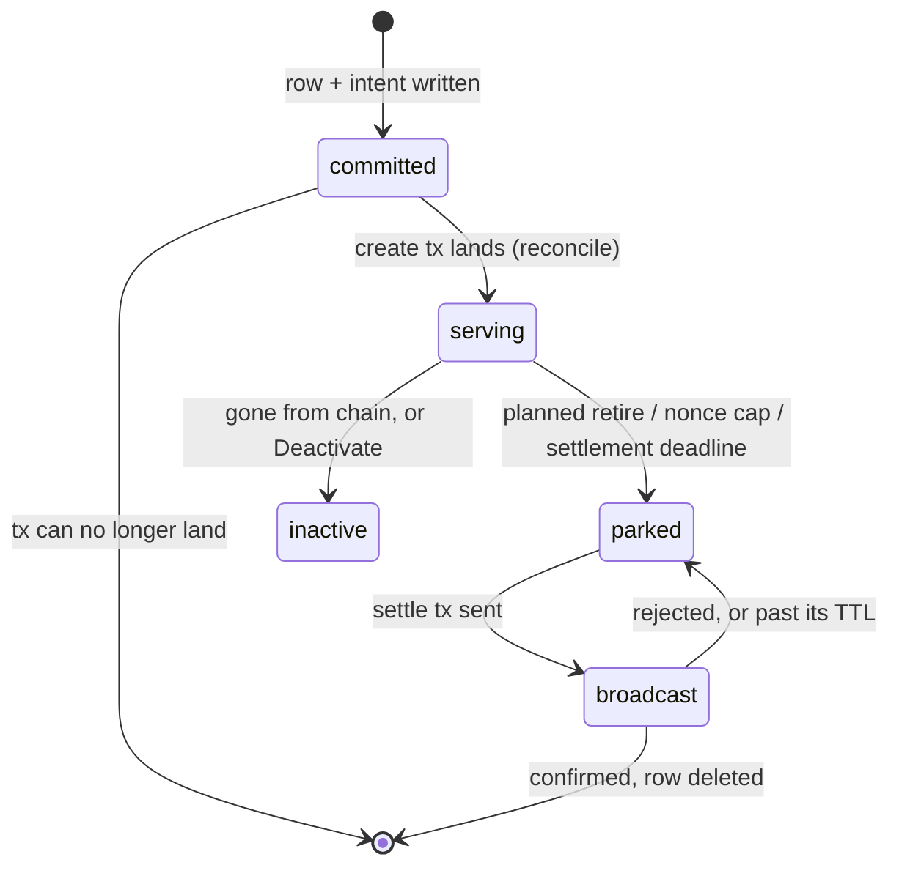
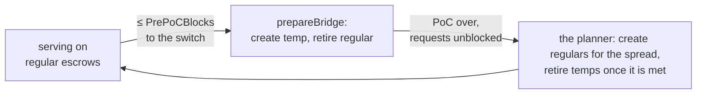
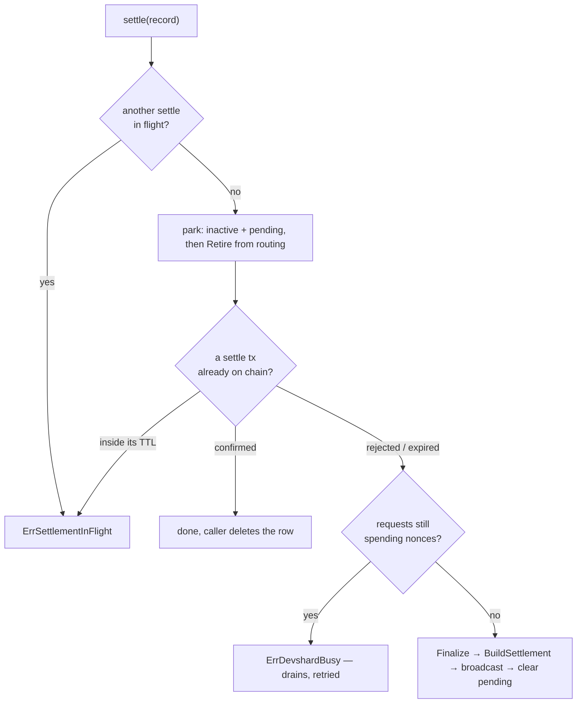

# Escrows

An escrow is a funded account on chain that pays for inference. Every nonce the gateway spends is drawn from one, so an escrow's lifecycle is where the gateway's money lives: it is created ahead of need, rotated around epoch switches, retired when it empties, and settled once — after which nothing can ever settle it again.

Owned by [`escrow/`](../escrow/) (the lifecycle) and [`registry/`](../registry/) (which escrows are routable right now). The two are separate: the registry answers "can a request use this escrow", the manager answers "should this escrow exist at all".

## The one invariant everything else protects

**The row is the key.** `devshards.private_key_env` names the environment variable holding the only signing key that can settle that escrow. Nothing else on the machine records it. Delete the row before the settlement lands and the escrow's balance is stranded on chain permanently.

Every ordering rule below follows from that:

| Rule | Where |
| --- | --- |
| the row is written **before** the create transaction is broadcast | `commitments.go`, `createFor` → `onPrepared` |
| retirement with settlement off **parks**, it does not delete | `settlement.go`, `retire` |
| the row is deleted only after a settlement is confirmed | `settlement.go`, `deleteSettled` |
| an escrow is taken out of routing before it is settled | `settlement.go`, `settle` → `park` |

## The states a row can be in

The state is not a column; it is the combination of four:

| `active` | `settlement_pending` | `settle_tx_hash` | Means |
| --- | --- | --- | --- |
| true | false | `""` | serving |
| false | true | `""` | parked: out of routing, waiting to settle |
| false | true | set | settled, broadcast not yet confirmed |
| row deleted | — | — | settled and confirmed; the escrow is finished |
| false | false | `""` | deactivated by hand, or gone from chain (`gone_from_chain` set) |

*Starved*, *full* and *idle* are not states of a row: `liquidity.Classify` computes them from the escrow's money each tick and nothing stores them (see [`liquidity/README.md`](../liquidity/README.md), "Flags"). A starved escrow stays serving and routing spends it first on requests it can afford; only a nonce cap, a planned retire or the settlement deadline takes a row out of service.

`rotation_role` (`regular` / `temp`) and `rotation_epoch` say which set the escrow belongs to — a regular is labelled with the latest epoch, a temp with the epoch it bridges into, the effective epoch plus one; `route_prefix` is the URL path this escrow's hosts serve on, falling back to the gateway's own prefix when empty.

`chain_epoch` and `amount` are what the chain stamped on the escrow and locked for it, 0 until read; `gone_from_chain` marks a row the chain confirmed it no longer holds. None of the three is a state: no upsert writes them (`store/README.md`, "The devshard registry"). The tick reads the first two lazily, sixteen unresolved rows a tick, each tick starting after the last row the previous one read so a row that never resolves cannot starve the rest; a row's first failed read is narrated once (`escrow chain epoch and amount unresolved`). A create reads them as soon as its row is registered (`escrow/chain_facts.go`; see [`escrow/README.md`](../escrow/README.md), "Chain epochs and amounts").

```mermaid
stateDiagram-v2
    [*] --> committed: row + intent written
    committed --> serving: create tx lands (reconcile)
    committed --> [*]: tx can no longer land
    serving --> parked: planned retire / nonce cap / settlement deadline
    serving --> inactive: gone from chain, or Deactivate
    parked --> broadcast: settle tx sent
    broadcast --> [*]: confirmed, row deleted
    broadcast --> parked: rejected, or past its TTL
```

## The tick

`escrow/manager.go`, `tick`, every **15 s** (`TickInterval`), single-threaded per process. Order matters, and the first eight steps run **whatever `rotation.enabled` says**:

| # | Step | Runs regardless of the toggle because |
| --- | --- | --- |
| 1 | `reconcile` | crash recovery is not a rotation feature |
| 2 | `resolveChainFacts` | a money deadline reads the chain epoch, whatever rotation does; up to sixteen unresolved rows a tick |
| 3 | `checkSettleMargin` | the margin the deadline rule uses is only worth what the measured block time says; the check narrates and never refuses, and runs first so a stale snapshot is projected with this tick's block time |
| 4 | `parkAtDeadline` | an escrow whose chain settlement window is closing loses its whole amount unless something parks it (see "Settlement by deadline") |
| 5 | `settlePending` | a parked escrow's row is the only record of its key; nothing else picks it up |
| 6 | `markPrunedPastDeadline` | a row nothing will settle would hold its place in the unsettled count for good; it is marked gone once the chain pruned it, up to sixteen lookups a tick, after the deadline is narrated and settlement had its turn |
| 7 | `checkMissing` | an escrow gone from chain must stop taking traffic |
| 8 | `sweepTimeouts` | a nonce the chain still settles is owed a vote whether or not rotation is on |

Then the planned lifecycle (`escrow/planned_lifecycle.go`, `runPlannedLifecycle`):

9. `promoteTakenReserves`: a reserve a request took is already a regular in routing; its row follows before the planner reads the model.
10. `markSpent`: a serving escrow routing would retire is marked through `OnBalanceExhausted` whether or not a request reached it (`escrow/depletion.go`).
11. `drainPlannedMarks`: a nonce-cap mark retires its escrow; a balance mark is dropped and counted (see "Depletion").
12. `prepareBridge` inside the pre-PoC window, or `retireSurplusReserves` outside it while requests are not blocked: rotation proper, skipped when the toggle is off, no model parses, or the snapshot carries no epoch yet.
13. `planFunding`: the funding planner reads the rows, decides, narrates, counts and executes the decision (`applyPlan`; `escrow/planner.go`, see [`escrow/README.md`](../escrow/README.md), "The funding planner").

A taken reserve also wakes the tick at once rather than at the next 15 s (`escrow/reserve.go`, `OnReserveTaken`).

Steps 1–12 return their errors into an `errors.Join`; one failing model or escrow never stops the others. Step 13 returns only what executing a plan failed at: a failed read is narrated as `FundingPlanFailed` and never fails the tick. `Stop()` cancels the context and waits for the tick in flight, so shutdown never races a half-finished rotation.

`sweepTimeouts` is the one step that does not run *on* the tick. A vote round can outlast 15 s, so it runs in its own goroutine and a second tick starts nothing while the first is still voting; `Stop()` waits for it as well. Its whole cost is bounded by `timeout_sweep.budget_per_tick` across every escrow, and the walk starts one escrow further along each tick so a backlog on one cannot starve the rest. It votes only on an escrow whose session is active, and steps over one a `Finalize` is running on instead of waiting for it: `sessionHandle.SweepExecutionTimeouts` takes the same per-escrow lock `Finalize` holds with `TryLock` and checks the phase again under it (`registry/session.go`, `registry/timeout_sweep.go`), so a stalled finalize never gets an extra diff from the sweep. Each escrow is held while it is swept so a retirement cannot close the session mid-vote, and the escrow reports `IsBusy` meanwhile so a settlement defers instead of blocking the tick on `Finalize`; the hold is not a request, though, so it never counts in `ActiveUsers` and never moves the escrow's load score (`registry/views.go`, `Registry.holdForSweep`). `devshard_gateway_timeout_sweep_total` counts what each tick applied and failed to apply, which together are what it found unless shutdown cut the round short; a tick that found nothing moves no series. See [`race.md`](./race.md), "The swept vote and the retried vote".

## Creating an escrow

`commitments.go`, `createFor`.

1. Resolve the signer from `model.private_key_env` — by name; the key itself is never written anywhere.
2. `onPrepared`: write the **commitment** row (tx hash, model, role, epoch, created-at) *before* broadcasting. A failed write aborts with no broadcast: **no broadcast without durable intent.**
3. Broadcast. If the process dies here, the commitment is the only trace — and it is enough.
4. On the next tick, `reconcile` resolves every commitment.

Before step 2 the chain client refuses a create the wallet cannot pay for — spendable `ngonka` below `amount` plus the fee — without writing a commitment or broadcasting (`chain/txclient.go`, `CreateEscrow`). The refusal does not open the create breaker and is narrated once per (model, role) until a create succeeds (`escrow/commitments.go`, `narrateUnderfunded`).

Before the chain client is asked at all, the manager refuses a create whose `amount` cannot pay one full-context request of its model: the model's retirement floor (`config.Limits.RetirementReserve`, the context length as prompt bytes the scheduler retires an escrow below) times the chain's `token_price`, plus its `fee_per_nonce` (`scheduler.RequestCost`, the price routing retires an escrow below), plus the `create_devshard_fee` the chain takes out of the amount before the escrow's first balance — all three read from the devshard escrow params the observer polls (`escrow/commitments.go`, `creationFloor`). Such an escrow would be retired by the next tick's `markSpent` and replaced by another just as short, every tick, each round paying a create and a settle. The refusal is narrated once per (model, role) as `EscrowCreateBelowFloor` until a create succeeds, it opens no breaker, so raising `amount` takes effect on the next tick, and an operator's create answers 400. A price the observer has not read yet skips the check, and a product that overflows is refused.

`reconcileOne` has exactly five outcomes:

| Chain says | Action |
| --- | --- |
| tx landed, produced an escrow | write the devshard row, drop the commitment |
| tx landed, produced no escrow | drop the commitment — terminal, it will never produce one |
| tx not found, inside its TTL | keep it; retry next tick |
| tx not found, past its TTL | drop the commitment; a fresh create is correct |
| endpoint unreachable | keep it; an unreachable endpoint is not an answer |

The TTL window is `commitmentReconcileGrace` = `chain.UnorderedTxTTL` (9 min) + 2 min of index lag. A row with no `created_at` (legacy or malformed) counts as **still pending** — keeping a commitment costs one row, dropping one prematurely costs a duplicate escrow.

### The create breaker

`breaker.go`. Per `(model, role)`: each failure raises the cooldown (1, 2, 4 ticks, capped at `maxCreateBreakerCooldownTicks` = 4), and `gated` burns one tick per call. Cooldowns are counted in **ticks, not seconds** — a stalled tick loop does not silently expire them.

A gated create returns `errCreateSuppressed`, which is not "nothing to do": the bridge reads it as a signal to take its degrade path (below) rather than retire escrows for replacements that were never created.

## Rotation: the epoch bridge

Around an epoch switch, hosts re-form and an escrow created under the old epoch stops being funded by the new one. The bridge covers that gap with **temp** escrows.

```mermaid
graph LR
    A["serving on<br/>regular escrows"] -->|"≤ PrePoCBlocks<br/>to the switch"| B["prepareBridge:<br/>create temp, retire regular"]
    B -->|"PoC over,<br/>requests unblocked"| C["the planner: create regulars for the spread,<br/>retire temps once it is met"]
    C --> A
```

`prepareBridge` runs whenever the switch is within `rotation.pre_poc_blocks`, and the funding planner plans nothing inside that window except a nonce-cap retire — a bridge half-built is worse than one built early. Temps are retired only while requests are not blocked, so the retire is a no-op on a network that never bridged.

**Temps carry the epoch they bridge into.** `prepareBridge` labels and counts its temps by the effective epoch plus one (`escrow/epochs.go`, `bridgeLabel`), not by the latest epoch, which moves at PoC start while the window is still open. One window — one that crosses PoC start, or one a PoC longer than the window holds entirely — therefore funds one temp set. See [`escrow/README.md`](../escrow/README.md), "The bridge across proof-of-compute".

**Degrade path.** If `prepareBridge` cannot create the temp escrows, `promoteRegularsToTemp` relabels the existing regulars to `temp` in place (`SetDevshardRotationRole` — the role only, so a concurrent write to the same row is not clobbered). The epoch then still has bridge coverage, and the planner retires them once it has funded fresh regulars.

**The bridge is capped, and a partial fill degrades.** A model with `max_unsettled` set funds at most its room — `max_unsettled` less every row the chain still holds for it and every open commitment (`escrow/budget.go`, `unsettledCount`; `escrow/rotation.go`, `bridgeRoom`). A fill that ends with fewer temps at the bridge label than `temp_count` — no room, a model the network does not serve, or creates stopped part way — is an error (`errBridgePartialFill`): the model takes the degrade path, so its regulars keep serving as temps and none is retired with nothing in its place. The error is written to `rotation_status.create_error`, again on every tick while the room stays short, and does not fail the tick.

After PoC the planner's spread shortfall funds the regular set the temps bridged to, and the old temps are retired once the spread is met, regulars first (`escrow/apply_plan.go`, `retireBridgedTemps`). See [`escrow/README.md`](../escrow/README.md), "The funding planner".

Failures are recorded per model in `rotation_status` (`stage`, `epoch`, `create_error`, `completed`) and skipped, never aborted.

## Depletion

A depleted escrow is worse than a dead one: its in-flight count is low precisely because every request fails, so the load score **prefers** it. `OnBalanceExhausted` marks it (no I/O — the request path never reaches the chain), and the next tick drains the marks (`escrow/planned_lifecycle.go`, `drainPlannedMarks`). A nonce-cap mark retires the escrow through `retire`. A balance mark is dropped and counted in `devshard_gateway_planner_ignored_marks_total`, and the escrow keeps serving what it can pay. `markSpent` marks a serving escrow no request reached, by the same rule.

If the operator still offers a model no escrow can serve (`limits.model_access` or `limits.model_limits` names it), `api/routes.go`'s `routableModel` answers `503` with `Retry-After` for that model, rather than the `400` a model nobody offers gets.

## The reserve

Each model keeps `reserve_count` (default 1) full escrows in the `reserve` role that routing takes only when no regular escrow can pay for a request — the case a large prompt against evenly drained regulars hits, while each regular still covers the retirement floor — the model's context length as prompt bytes at four bytes per token — and a prompt runs denser in bytes than that estimate. The funding planner funds the reserves as standbys at the model's `amount`, never across the proof-of-compute bridge. The first request that takes one turns it into a regular escrow, and the tick it wakes promotes the row (`promoteTakenReserves`) before the planner reads the model. A reserve does not count toward `target_count`; a promoted one does. A reserve left over from an earlier epoch or past a lowered `reserve_count` is retired on the next tick outside the bridge (`retireSurplusReserves`). See [`escrow/README.md`](../escrow/README.md), "The reserve".

## The funding planner

The funding planner always runs and always executes: on every tick it reads each model's money (`liquidity`), plans creates and retires (`funding`), journals the decision, exports it and executes it. Only a nonce-cap mark retires an escrow outside the plan; the planner funds and retires every other escrow itself. See [`escrow/README.md`](../escrow/README.md), "The funding planner".

## Gone from chain

`checker.go`. A host reporting an escrow absent only *marks* it; `TriggerEscrowCheck` confirms with the chain on the next tick. Only a confirmed not-found deactivates: a lookup error and a found escrow both leave it serving. **Ambiguity is never a reason to deactivate.** Routing stops before the row is written, so a confirmed-absent escrow takes no further request even if the write fails. A confirmed absence also marks the row `gone_from_chain`, which takes it out of the `max_unsettled` count, out of the planner's parking and out of `settlePending`, even with `settlement_pending` still set: a gone escrow has nothing left to settle. Reactivating a row (`Activate`, or a re-registration with `active = 1`) clears the mark in the same write, so a row put back by hand and later parked counts and settles again (`store/devshards.go`, `SetDevshardActive`; `escrow/budget.go`, `goneFromChain`). A row already out of service needs no host report: once its settle deadline has passed and the chain answers it no longer holds the escrow, the tick marks it the same way (`escrow/deadline.go`, `markPrunedPastDeadline`; [`escrow/README.md`](../escrow/README.md), "Settlement by deadline").

## Settlement and retirement

`settlement.go`. `settle` is the single path — operator (`Settle`), rotation (`retire`) and the tick (`settlePending`) all go through it, so they share the dedup, the ordering and the busy check.

```mermaid
graph TD
    S["settle(record)"] --> D{"another settle<br/>in flight?"}
    D -->|yes| IF["ErrSettlementInFlight"]
    D -->|no| P["park: inactive + pending, then Retire from routing"]
    P --> AS{"a settle tx<br/>already on chain?"}
    AS -->|"confirmed"| OK["done, caller deletes the row"]
    AS -->|"inside its TTL"| IF
    AS -->|"rejected / expired"| B{"requests still<br/>spending nonces?"}
    B -->|yes| BUSY["ErrDevshardBusy — drains, retried"]
    B -->|no| F["Finalize → BuildSettlement → broadcast → clear pending"]
```

**Park comes before the reconciliation.** The caller deletes the row on success, and a row that is gone can no longer take the escrow out of routing — an escrow put back into service by hand would otherwise keep serving with nothing left to un-publish it. For the same reason `Activate`, and a re-registration through `register` (`POST /v1/admin/devshards`, `/import`), both refuse a row that is parked or carries a settle hash (`ErrDevshardNotActivatable`, HTTP 409): serving from it again spends nonces the settlement does not account for.

**`alreadySettled`** decides whether a previous broadcast counts, using the hash and the `settle_tx_at` stamp:

| Chain says | Conclusion |
| --- | --- |
| committed and succeeded | settled; reconcile and let the caller drop the row |
| not found, inside the TTL | still landing — `ErrSettlementInFlight`, do not rebroadcast |
| not found, past the TTL | clear the hash; a fresh transaction is right |
| committed and rejected | clear the hash; retry |
| endpoint unreachable | fail the tick — not an answer |

A row written before `settle_tx_at` existed carries no stamp and counts as **past** the window — the opposite default from the create path: keeping a stale commitment costs a row, keeping a stale settle hash costs an escrow that is never settled at all. Rebroadcasting one that was still landing costs a fee once, and the stamp that write leaves governs every tick after it.

**Deferred, not failed.** `ErrDevshardBusy` and `ErrSettlementInFlight` both mean "not yet": the next tick retries. `deferredRetire` filters them out of rotation's error set, so an ordinary bridge does not report an error for every escrow that happened to be draining.

**With `rotation.settlement_enabled` off**, `retire` only parks. The row survives, carrying the key name, and `settlePending` picks it up the moment settlement is switched on, or once its chain epoch is over while previous-epoch settlement is on (below). `settlePending` walks the parked rows in deadline order: a passed deadline first, then the earliest settle-by height, rows with no deadline last, ties by escrow id. A row inside its settlement margin is settled with force, which crosses the busy check, and does not count against the budget. The other rows settle at most `pendingSettleBudget` = 4 per tick, so a backlog drains without one tick spending minutes in chain calls.

**Per model.** A model's own `settlement_enabled` in `rotation.models_json` overrides the global toggle for that model's escrows, both ways; a model that sets nothing, or an escrow whose model is not in the list, follows the global toggle (`models.go`, `settlementPolicy`). `retire` and `settlePending` read it; an admin settle ignores it, since an operator asked for that one. The list is read whatever `rotation.enabled` says, and a list that does not parse leaves every model on the global toggle.

**Previous-epoch settlement.** `rotation.previous_epoch_settlement_enabled`, and a model's own `previous_epoch_settlement_enabled` over it, settle an escrow only once its chain epoch E is over, never in E itself. With it on and `settlement_enabled` off, `retire` still only parks; from the switch into E+1 `settlePending` settles that parked row under its usual budget, and the deadline pass parks a still-serving row inside its margin and settles it, as it does with settlement on (`settlementPolicy.settles`). The epoch is over only when it is provably so (`ownEpochOver`, `epochs.go`): the effective epoch's lower bound (the latest less one while the effective epoch is unknown) must exceed the chain epoch's upper bound (the label while the chain epoch is unresolved). The two flags resolve model over global each on its own, so a model's `settlement_enabled: false` does not turn off a global previous-epoch flag; set the model's `previous_epoch_settlement_enabled: false` as well to keep it unsettled. With `settlement_enabled` on it changes nothing.

**An escrow the chain has pruned.** The chain deletes an escrow `DevshardPruningThreshold` epochs after the one that funded it, distributing an unsettled one's amount across the group (`inference-chain/x/inference/keeper/pruning.go`), so a row parked past that has nothing left to settle and every attempt would fail on `escrow N not found`. After the busy check and before `Finalize`, `settle` asks the chain for the escrow (`prunedOnChain`); only an answer that it is absent counts, and a failed query lets the settle go on. An absent escrow returns `ErrEscrowPruned` and the row is dropped (`settleAndDrop`): the tick moves on silently, and the admin settle answers 410 Gone.

## Settlement by deadline

`escrow/deadline.go`. The chain settles an escrow only while the effective epoch is the epoch it stamped, E, or E+1; at E+2 it prunes the escrow and splits its whole amount across the group (`inference-chain/x/inference/keeper/msg_server_settle_devshard_escrow.go`, `devshard_pruning.go`). The money deadline therefore reads the row's `chain_epoch`, never its `rotation_epoch`: the label is the latest epoch at create time, one ahead of the chain's during PoC, and the legacy gateways read the deadline from it, one epoch late. While `chain_epoch` is unresolved the label less one stands in, and while the snapshot's effective epoch is unknown the latest stands in, so either guess alone reads a deadline early, never late. The one double fault reads it late: an effective epoch unknown during PoC labels the temp N+2, and if its `chain_epoch` is also still unresolved the deadline reads the label less one, N+1, one epoch late, until lazy resolution fills `chain_epoch` (within minutes).

At effective E+1 the escrow must settle before the switch into E+2, the snapshot's `EpochSwitchBlockHeight` (at the switch block itself the snapshot already names the next switch). Once the height is within `rotation.settle_margin_blocks` (600) of it, or the deadline has passed, the tick's `parkAtDeadline` acts — on every tick, whatever `rotation.enabled` says and whether the model is still configured:

- a serving, starved, held or standby-reserve row whose model settles is parked and narrated `escrow parked at its settlement deadline`; `settlePending` settles it;
- a row whose model has settlement off, and previous-epoch settlement off or its own epoch not provably over, is narrated `escrow deadline passes unsettled` with reason `settlement_disabled` and left alone: the toggles win;
- an operator-deactivated row (inactive, not parked, no settle hash) is narrated with reason `operator_deactivated`, or `key_missing` when the environment cannot resolve its key, and never settled automatically;
- a row gone from chain is skipped; a passed deadline is narrated with reason `deadline_passed`. Once the chain has pruned the escrow, a parked row its model's settlement policy settles is dropped by `settlePending`, and any other row out of service is marked gone from chain by `markPrunedPastDeadline`, which keeps it as the record of the loss.

Each reason is narrated once per row while it lasts. A settle that never commits is rebroadcast once its TTL passes, which is why the margin should cover two settle windows. The tick checks that against the block time it measures over at least 100 blocks (`escrow/settle_margin.go`): a margin shorter than two settle windows at that pace is journalled `settle margin shorter than two settle windows`, once per episode, and nothing is refused. A snapshot older than `chain_snapshot_max_age_seconds` is read at a projected height (its height plus its age over that block time, or over one second when none is measured or it measures under a second), so a frozen snapshot reads a deadline early; the episode is journalled `escrow deadlines read past a stale chain height` once. See [`escrow/README.md`](../escrow/README.md), "Settlement by deadline".

## Draining: the registry side

`Retire` takes the escrow out of the routing set immediately, but its session stays alive until the requests already dispatched on it finish. The entry sits in `draining` for that whole time, and `Add` refuses the same id with `ErrDraining` — a second session over storage the first still holds would corrupt it.

The close runs with the registry lock **released**: flushing takes the session lock, and a dispatch takes the session lock before the registry lock, so holding both here in the opposite order wedges every later route and settlement behind one retirement.

`entry.close()` flushes the snapshot and then closes the session **unconditionally**, and reports the two separately. The entry stays in `draining` only when the store was not released; a failed flush with a successful close frees the id, because holding it would refuse that escrow for the rest of the process's life. On the last release the failure is counted (`DrainCloseFailures`) rather than raised: the request that held the escrow open has already been answered, and there is nobody left to hand it to. A `Retire` with nothing in flight returns it to its caller instead.

## Height sync

Mainnet height is the escrow's logical clock: every host and the sequencer keep a signed `(height, hash)` inside the escrow's own log, so a verifier replaying the diffs recomputes the same time. The protocol lives in the session (`user/heartbeat.go`, `user/heightsync_seed.go`); the gateway's part is to open the cadence and to carry the heights hosts report ([`heights/README.md`](../heights/README.md)).

**Only the user side can open a turn.** A busy escrow pays nothing for this — a host's own stamp on `confirm`/`finish` discharges the cadence. A quiet one has no such traffic, and if nobody opens a heartbeat turn it never syncs at all, while its hosts count the silence toward arming close-ready. `StartHeartbeatLoop` is therefore started per serving session, and the session's `Close` stops it.

**The escrow's time never comes from the gateway's own reading of the chain.** A heartbeat stamps the floor the log already holds (`referenceStampLocked` reads `HeightSyncFloorAsOf`, nothing else), and where a live tip is wanted the session falls back to the host clients' own response-leg anchors (`observedHeightLocked`). The gateway is a courier: it carries heights, and cannot raise the floor even if it wanted to — a sequencer-composed stamp never raises `F` and never counts toward a turnover. The optional follower (`DEVSHARD_GATEWAY_CHAIN_ORACLE`, off by default) buys exactly one thing: a trust label on each carried tip, how far it sits from the gateway's own reading. Nothing the protocol reads depends on it ([`heights/README.md`](../heights/README.md)).

**It is on unless the fleet is told it is not.** Both gates ship on, the way devshardctl ran them, so a deployment that upgrades into this gateway keeps syncing without being told to. `GATEWAY_HEIGHT_SYNC_ENABLED=false` turns the cadence off for a fleet whose hosts do not carry height sync, which would otherwise skip a heartbeat every interval and log it. `DEVSHARD_REQUIRE_HEIGHT_SEED=false` is for the e2e stand, where hosts have no catalog and no oracle.

**The warmup waits for the seed; the chat path does not yet.** A probe teaches nobody before the group is reachable and before the escrow's log carries a height, so the prober waits for the router catalog and then for the seed, as devshardctl does. The chat path is the half still missing: devshardctl gates every request on `WaitHeightSeed` and refuses with `Retry-After` when it cannot seed, and this gateway does not, so an escrow that never seeds still serves inference while `heightsync: seed_incomplete` is the only signal. Closing that belongs in routing, which picks among escrows where devshardctl had exactly one.

**A host that keeps failing is skipped, not abandoned.** After the second failed heartbeat in a row a host is skipped for one interval, then two, four and eight, and stays at eight while it fails (`user/heartbeat.go`, `heartbeatBackoff`). Any answer from it — a heartbeat or an inference — clears the count, so a host that comes back is sent the next heartbeat. Only the heartbeat backs off: requests still reach the host and are what bring it back. `heartbeat host dead` carries the `backoff` and the `catch_up` length it would have sent.

**The cadence runs the fleet's schedule, not the compiled one.** The heartbeat's `Interval`, `TurnTimeout` and `IdleTimeout` come from the runtime-params feed ([`app/runtime_params.go`](../app/runtime_params.go)), so governance moving `height_sync_interval_ms` moves them for every session opened after it — a live escrow keeps the schedule it opened with, because the interval is read once when its loop starts. Only that half is overlaid: `AckDeadlineBlocks`, `DeltaBlocks` and `BlockTime` stay compiled, because they are folded into `SyncTurnRecord` and every replaying verifier must recompute the same verdict from them. An overlay that would fail `Validate` is clamped back to the compiled schedule and counted, and a feed that answers nothing yields the compiled 12 s, because zero on the wire means keep the default.

## Failure modes and their causes

| Symptom | Cause |
| --- | --- |
| `escrow is still draining` on activation | a request from the previous incarnation has not finished; wait a tick |
| `devshard cannot be activated` (409) | the escrow is parked for settlement — settle it, do not re-serve it |
| `settlement already in flight`, repeatedly | a settle tx is inside its 11-minute window; it resolves on its own |
| the same escrow settles every tick and never clears | the broadcast is landing but `settle_tx_hash` is not being written — check the store |
| rotation logs "the network serves no such model" | the chain's snapshot lists no host for that model; the escrow is skipped |
| a bridge creates nothing and retires nothing | the create breaker is gated after repeated failures; look for the earlier create error |
| an escrow's whole `Amount` is paid out to the group's slots instead of settling normally | it stayed unsettled past the chain's window — an escrow must settle inside its epoch or epoch+1 (`inference-chain/x/inference/keeper/msg_server_settle_devshard_escrow.go`, `SettleDevshardEscrow`), or `DevshardPruningThreshold` (2) epochs after the one that funded it, the chain splits its entire balance across the group instead of paying by settlement, whatever its state (`inference-chain/x/inference/keeper/devshard_pruning.go`, `DevshardPruningThreshold` and `distributeUnsettledEscrow`) |
| `funding guarantee broken` in the journal; `devshard_gateway_funding_guarantee` below 0 | the model holds fewer full escrows than `full_context_slots` and a guard create is held back: the wallet cannot pay (`EscrowCreateUnderfunded`), the create breaker is gated, a PoC blocks requests, or the bridge window is open (the temps carry the guarantee there). Written once per episode, which lasts until the guard shortfall is zero |
| `model amount cannot fund a full escrow` | the model's `amount` is too small: `amount − create fee < slot` at the current prices, so a fresh escrow could never be full (full is a balance of one slot, the same test `liquidity.Classify` applies). The guarantee is off for that model and capacity follows demand alone; raise `amount` in `rotation.models_json` |
| `escrow budget reached` | the creates the planner wants exceed the room left under `max_unsettled` (every row the chain still holds plus open commitments counts). It creates only what fits; when the deficit exceeds the rows already parking it parks one starved escrow at a time, each settled one frees a place and is refilled full, always inside the budget. Steady churn here means demand needs more than a full budget holds |
| a short wallet: creates refused with `EscrowCreateUnderfunded`, one starved escrow parked at a time | the planner marks the model wallet-short on the first refusal and parks one starved escrow while nothing is parking, so the money it still holds returns to the wallet by settlement; a landed create or a top-up clears it |
| `escrow parked at its settlement deadline` for a row the chain data lags behind | deadlines read past a stale snapshot: once the snapshot is older than `chain_snapshot_max_age_seconds` they are read at a projected height (`escrow deadlines read past a stale chain height`), one block per measured block time or per second; only an API that stops answering is projected |

## Where to change what

| To change | Go to |
| --- | --- |
| how often the lifecycle runs | `escrow/manager.go`, `TickInterval` |
| how long a tx is considered still-landing | `escrow/commitments.go`, `commitmentReconcileGrace` |
| how many parked escrows settle per tick | `escrow/settlement.go`, `pendingSettleBudget` |
| how early a closing settlement window parks an escrow | `rotation.settle_margin_blocks` (`GATEWAY_ROTATION_SETTLE_MARGIN_BLOCKS`); the rule is `escrow/deadline.go` |
| how hard a failing create is throttled | `escrow/breaker.go`, `escalatedCooldownTicks` |
| when the bridge starts | `rotation.pre_poc_blocks`, read in `escrow/manager.go`, `tick` |
| how many escrows a model gets | `rotation.models_json`: `temp_count`, `target_count` (1 when absent; an explicit value below 1 is rejected), `reserve_count` (1 when absent; 0 turns reserves off; negative is rejected), `max_unsettled` (absent: target + temp + reserve + 4; below target + temp + reserve + 1 is rejected), `full_context_slots` (absent: 2; below 1 is rejected; both read by the funding planner), `settlement_enabled` (absent follows `rotation.settlement_enabled`), `previous_epoch_settlement_enabled` (absent follows `rotation.previous_epoch_settlement_enabled`), `escrow/models.go` |
| what the planner decides: the guarantee, `need`, the rate bucket, the retires | `funding/` (`plan.go`, `retire.go`, `bucket.go`); the arithmetic is described in [`funding/README.md`](../funding/README.md) |
| how a decision is executed: the retires, the creates, the drain of depletion marks | `escrow/apply_plan.go`, `escrow/planned_lifecycle.go` |
| which escrow a request takes: the tiers and the money floor | `scheduler/escrow_pick.go` |
| what makes an escrow routable | `registry/registry.go`, `Add` / `unpublish` |
