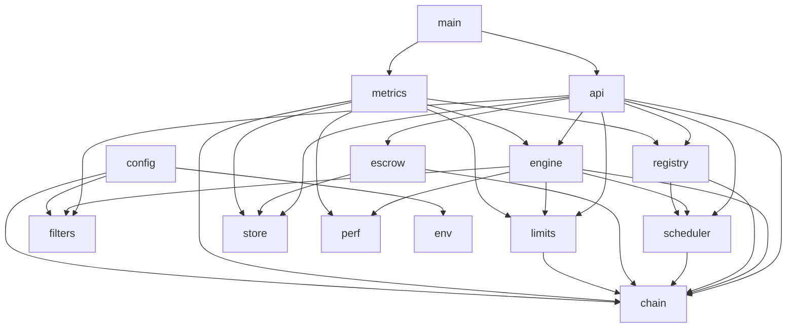

# Devshard gateway — architecture

The gateway (`devshard/cmd/gateway`) sits between the broker and the race participants: it accepts OpenAI-shaped chat-completion requests, normalises them, chooses which escrow and which participant will serve each one, races several participants against each other when that is worth doing, streams the winner's bytes back, and makes sure every nonce it spent on the chain is settled. It replaces `devshard/cmd/devshardctl`, which had grown into a single 26k-line `package main` where target selection lived at three uncoordinated points and one struct carried 57 fields across three goroutines.

This document is the map: what each package owns, which package may call which, how the process is composed at boot, and how it shuts down. The reasoning that used to live in code comments now lives in this document set — the code is deliberately sparse on prose.

## The document set

| Document | The question it answers |
|---|---|
| [gateway-architecture.md](./gateway-architecture.md) (this file) | What are the pieces, who may call whom, how does the process start and stop? |
| [gateway-invariants.md](./gateway-invariants.md) | What must always be true, and what line of code enforces it? |
| [gateway-request-lifecycle.md](./gateway-request-lifecycle.md) | What happens to one request, from socket to settlement? |
| [gateway-routing-and-nonces.md](./gateway-routing-and-nonces.md) | How is an escrow and a participant chosen, and why is a nonce sometimes burned? |
| [gateway-speculative-race.md](./gateway-speculative-race.md) | How does the race run, who wins, and how is the outcome recorded? |
| [gateway-escrow-lifecycle.md](./gateway-escrow-lifecycle.md) | How are escrows created, rotated, settled and retired? |
| [gateway-capacity-and-health.md](./gateway-capacity-and-health.md) | How much traffic does a participant get, and when is it taken out of rotation? |
| [gateway-request-filtering.md](./gateway-request-filtering.md) | What is accepted, clamped, forced or rejected on the way in and on the way out? |
| [gateway-operations.md](./gateway-operations.md) | Routes, metrics, configuration, and what an operator sees. |
| [gateway-non-goals.md](./gateway-non-goals.md) | What the gateway deliberately does not do, and where it diverges from the legacy gateway. |

## Packages

Weight is carried by four packages — `filters`, `engine`, `api` and `chain` — and everything else is small enough to hold in one reading. Exact line counts are deliberately not listed: they were stale in every row within days of being written, and which packages are heavy changes far more slowly than how many lines they contain.

| Package | Owns |
|---|---|
| `env/` | The only place that reads environment variables. One typed table: name, type, default. |
| `config/` | The immutable configuration snapshot — defaults merged with environment and admin overrides, validated fail-fast — plus the atomic holder that publishes replacements. |
| `store/` | SQLite: devshard records, admin overrides, intent commitments, rotation status, suspicious hosts, and the asynchronous request-accounting ledger. |
| `chain/` | All chain input and output: the transaction client (build, sign, broadcast, confirm) and the phase observer that polls the public API and publishes an immutable `PhaseSnapshot`. |
| `filters/` | The request and response boundary: one rule table for every top-level parameter, per-model profiles, schema bounds, the streaming response rewriter, and the vLLM capability-error parser. |
| `perf/` | Per-participant decayed success and failure counts, Envoy-style outlier ejection, and the sticky host-capability flags. |
| `limits/` | Three limiters: the gateway-wide FIFO admission limiter, the per-participant AIMD window with circuit breaker, and the chain-weight capacity model. |
| `registry/` | The live escrow set: escrow id to session, model, group and in-flight count, published and draining, behind a copy-on-write snapshot. |
| `scheduler/` | Target selection: which escrow, which participant, which nonce — including burning the nonces bound to participants that cannot serve. |
| `engine/` | The speculative race: attempts, escalation, crowning, streaming, drain, and the single point where a race outcome is recorded. |
| `escrow/` | The escrow lifecycle: creation, crash-recovery reconciliation, rotation across the proof-of-compute boundary, depletion, settlement and retirement. |
| `api/` | The HTTP boundary: routes, authentication, admission, the response cache, request capture, error mapping and the streaming writer. |
| `metrics/` | The Prometheus registry and every collector; the only package that knows Prometheus exists. |
| `main.go` | The composition root. No policy, only wiring, boot and shutdown. |

## Dependency rules

Arrows are one-way and the graph is acyclic. Acyclicity is enforced by the Go compiler — an import cycle does not build — so the shape below cannot silently rot into a cycle. The *direction* of each arrow is convention: no test asserts the layering, and `go list -f '{{join .Imports "\n"}}' ./cmd/gateway/...` is how you check it.

Every package except `env`, `filters` and `chain` also reads `config`; those edges are omitted above for legibility, as are `main`'s edges to everything it wires.

Three rules hold this shape in place.

**Interfaces are declared by the consumer, never by the producer.** `engine` does not import `escrow`; it declares a two-method `escrowLifecycle` interface and `main` passes the escrow manager into it. `escrow` does not import `registry`; it declares `SettlementSource`. This is what keeps the two genuinely circular pressures — settlement needs a live session, routing needs the escrow set — from becoming import cycles. It also has a practical benefit that showed up during the build: a narrow interface makes a whole class of mistake unrepresentable. An attempt to reproduce a settlement bug by swapping `SettlementSession` for `Target` in `api` did not compile, because `api`'s interface declares only the former.

**No mutable package-level state.** The only process-wide mutability is the configuration snapshot pointer (`config.Holder`, an `atomic.Pointer`) and the contents of the store. Everything else is owned by a struct with an explicit lifetime.

**`metrics` is allowed to import downward, and does.** It reads `engine`, `limits`, `perf`, `registry`, `chain`, `store` and `transport`. The alternative — every domain package importing Prometheus — would drag telemetry into the algorithmic cores. One adapter package holding all Prometheus knowledge keeps `limits` and `perf` pure, and the graph stays acyclic.

## Concurrency model

There are exactly four kinds of long-lived concurrent actor in the process, and each has one owner.

- **The phase observer** (`chain.PhaseObserver`) runs a fixed number of pollers and publishes an immutable snapshot. Consumers read the pointer; nothing shares a field with it. `Start` is idempotent and `Stop` is a barrier for concurrent callers.
- **The escrow manager** (`escrow.Manager`) runs one 15-second tick. `Stop` cancels the derived context, so a tick already in flight is interrupted rather than merely un-rescheduled — a tick can outlast the shutdown grace period, and returning early would let the store close under a settlement write.
- **One dispatcher actor per escrow** (`scheduler`) owns that escrow's nonce sequence. It is lock-free by construction: requests enter through a channel, decisions leave through per-waiter reply channels. Idle dispatchers are reaped, because escrow ids are unique and never reused, so "alive for the process lifetime" would grow without bound as escrows rotate.
- **One coordinator per race** (`engine`) owns the race state. Attempt goroutines communicate with it only by sending events on a channel; no field is shared. This is the direct answer to the legacy engine's `inflight` struct, whose 57 fields were written and read by three goroutines at once — including on the money path, where `waitForInflightsDoneUntil` returned while attempts were still writing the fields the outcome then read.

Everything else is per-request and finishes with the request.

## Boot

`main.run` reads the environment, resolves the storage directory, opens the store, and calls `compose`, which builds everything in dependency order and returns without starting anything. `serve` then starts the background work and the listener.

Two details in `compose` are load-bearing.

**The boot budget ties two numbers together.** Building escrow runtimes at boot is bounded by a semaphore, and the pooled HTTP client those builders share has `MaxIdleConns` and `MaxIdleConnsPerHost` set to the same number (`main.go`, `bootBudget` and `newBootBudget`). Bounding only the concurrency trades a request storm for connection churn: Go's default idle pool is two per host, so a bounded-but-unmatched builder pool would open and discard sockets instead of reusing keep-alives. The legacy gateway got this right as two independent numbers that happened to agree; here it is one number, so they cannot drift.

**Escrow runtimes are rehydrated lazily.** Nothing iterates the escrow set at boot spawning a goroutine per escrow. With a hundred escrows that pattern is a hundred concurrent chain reads at the moment the process is least able to absorb them. All chain reads are centralised in the phase observer's fixed pollers plus the escrow tick, so the chain request rate is a constant, independent of how many escrows exist.

## Shutdown

Shutdown order is a contract, not an implementation detail (`main.go`, `shutdownOrder`). Eight steps, in this order:

1. **HTTP server** — stop accepting, so nothing new enters.
2. **Races** — in-flight races drain to the vote that settles their nonces. This needs every step below it still alive.
3. **Dispatchers** — the scheduler's per-escrow actors, which nothing else stops.
4. **Escrow lifecycle** — the rotation and settlement tick.
5. **Chain observer** — the pollers.
6. **Escrow sessions** — the registry, which holds every escrow session's SQLite handle.
7. **Store** — second to last, because closing it drains the accounting ledger, and a queued row must not outlive the connection it needs. Closing the gateway store while escrow sessions still hold their own handles is the same bug one level down, which is why the registry closes first.
8. **Chain connections** — last. Every step above can still reach the chain, and a socket closed earlier is a socket the next poll must re-dial.

Two properties of the runner matter as much as the order.

`stopAll` (`main.go`) runs every step even after one fails, and joins the errors — except a step marked `needsQuiesced`, which is skipped and the skip reported. The store must be reached whatever happened above it, so it carries no guard; the escrow sessions do, because closing a session takes no lock and closing one under a drain that overran races a nonce commit.

`waitFor` (`main.go`) bounds a drain by the shutdown budget **without cancelling the work inside it**. Cancelling would abort the very vote the drain exists to protect; waiting forever would forfeit every step below to the SIGKILL that follows. So an overrunning drain is left running and reported. This was found the hard way: an earlier version discarded the context entirely, so the grace period reached only the listener. One unanswered request plus SIGTERM meant the drain blocked for minutes and the orchestrator killed the process mid-vote — losing exactly the vote the drain exists to protect, plus queued ledger rows and the escrow snapshot flush.

Restart behaviour follows from what is and is not persisted. Escrow records, intent commitments, rotation status, admin overrides, suspicious hosts and the accounting ledger survive a restart. Participant health does not: AIMD windows, breaker state and performance rings start clean. That is deliberate — see [gateway-non-goals.md](./gateway-non-goals.md).
