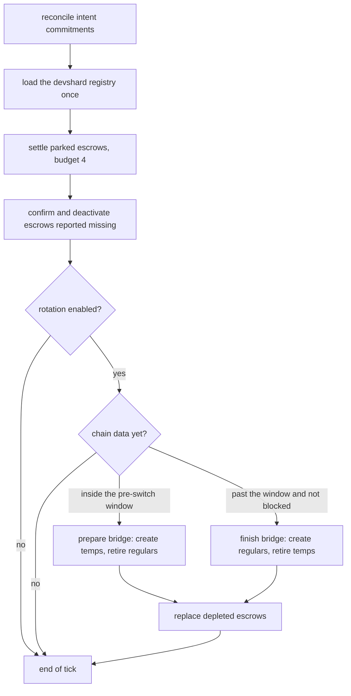
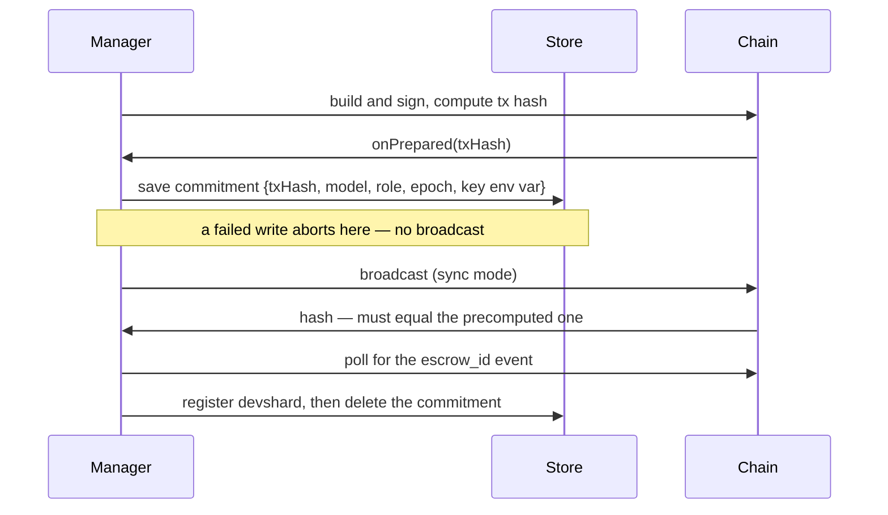

# Devshard gateway — escrow lifecycle

An escrow is a funded on-chain account with a fixed participant group, serving one model. Requests spend its nonces; settlement returns what is left. The gateway creates escrows, rotates them across the proof-of-compute boundary, replaces them when they are exhausted, settles them and retires them — and must never lose the ability to settle one, because the record it keeps is the only pointer to the key that can.

This document covers `escrow/`, plus the parts of `chain/` and `store/` it depends on. How escrows are chosen for a request is in [gateway-routing-and-nonces.md](./gateway-routing-and-nonces.md).

## The tick

One goroutine, one fifteen-second tick, everything in a fixed order (`escrow/manager.go:96-134`). Errors are joined; nothing aborts the rest of the tick.

Three of those steps run **outside** the rotation toggle, and each for its own reason (`escrow/manager.go:97-107`):

- **Crash recovery** must not depend on an operator switch — an escrow created before rotation was turned off still has to be recovered.
- **Parked settlements** must survive it, because a parked escrow's registry row is the only record of which key can settle it, so nothing else will ever pick it up.
- **A vanished escrow** must stop taking traffic whatever the toggle says.

The registry is loaded exactly once per tick and every later step filters that slice rather than re-reading it. The chain snapshot is *pulled* rather than subscribed to: at a fifteen-second cadence a five-second poll is equivalent, and pulling avoids callback ordering races (`escrow/manager.go:118`).

`Stop` cancels the derived context rather than merely stopping the scheduling, because a tick can outlast the ten-second shutdown grace and returning early would let the process close its store while a settlement write is still running. It is also a barrier for concurrent callers (`escrow/manager.go:74-79`).

## Creating an escrow, and surviving a crash mid-creation

Creating an escrow is a chain transaction whose result — the escrow id — is only knowable after it commits. A crash between broadcast and record would lose a funded escrow. So the intent is durable *before* the broadcast:

Every arrow in that sequence is an invariant (`escrow/commitments.go:51-97`, `chain/txclient.go:150-197`). No broadcast without durable intent. The node's hash must equal the one the intent recorded, or the recovery record points at a different transaction. And the commitment is deleted only *after* the registry write succeeds — a failed registry write leaves the commitment so the next tick recovers from durable intent.

Reconciliation resolves each outstanding commitment by transaction hash, with a four-branch decision (`escrow/commitments.go:114-129`):

| Chain says | Action |
|---|---|
| Found, with an escrow id | Register the escrow, delete the commitment, reset the create breaker. |
| Committed but failed, or committed with no escrow event | Clear the commitment. Terminal. |
| Not found, within the grace period | Keep it. Retry next tick. |
| Not found, past the grace period | Clear it. It can never land. |
| Any other error (endpoint unreachable) | Keep it, surface the error, retry next tick. |

The grace period is eleven minutes and is not arbitrary: the chain's unordered-transaction time-to-live is nine minutes, plus two minutes of index lag (`escrow/commitments.go:16-17`). It is coupled to `chain.unorderedTxTTL`, so changing one without the other reopens the window it closes. A commitment row with a zero creation timestamp — malformed or from an older schema — defensively counts as still pending and is never dropped.

"Not found" is only ever concluded when *every* reachable query endpoint agrees. A per-endpoint error is never read as absence (`chain/txclient.go:239-271`, `chain/escrow_query.go:23-49`).

## Rotation across the proof-of-compute boundary

Participants are taken out of inference during proof-of-compute, so an escrow whose group is about to be preserved cannot serve. Rotation bridges the gap with short-lived `temp` escrows:

- **Pre-switch window** (the epoch switch is within `rotation_pre_poc_blocks`, default 300): create `temp` escrows up to each model's temp count, then retire every active non-temp escrow for that model. Inside the window this runs even when proof-of-compute is not yet active.
- **After the window, once the chain is no longer blocking requests**: create `regular` escrows up to each model's target count, then retire the temps of this epoch or earlier.

Outside the window while requests are blocked, neither runs.

Failure handling is per model and deliberately degrades rather than aborting (`escrow/rotation.go:54-60`): if creating temps fails, the existing regulars are relabelled as temp in place so the epoch still has bridge coverage, the failure is recorded in the rotation status, and the next model is processed. A relabelling write that fails does not stop the loop either; only the first error is surfaced.

Creation counts are keyed by `(model, role, epoch)`, so escrows from a previous epoch never count toward this epoch's target — every new epoch creates fresh regulars from zero (`escrow/rotation.go:44-52`). Note the asymmetry that follows: preparing the bridge retires *all* active non-temp escrows for a model regardless of epoch, while finishing it filters temps by epoch.

A model the chain reports nobody serving is skipped — but only when the chain has reported *something*. With both per-model weight views empty (cold start), the model is not skipped, because "no data" is not "nobody serves it" (`escrow/models.go:43-58`).

### The create breaker

Repeatedly failing to create an escrow for a model must not become a per-tick chain hammer. A breaker keyed by `model|role` gates creation with a cooldown ladder of 1, 2, 4, 4, 4… ticks (`escrow/breaker.go`). "Ticks" here are **call counts, not durations** — the cooldown decrements once per call, and the call only happens on ticks where a creation would otherwise be attempted. At a fifteen-second tick the cap is about a minute. The breaker resets only when a creation succeeds and the escrow is registered.

The reading side has a trap worth naming: the gate function *mutates* the cooldown as a side effect of being read, so nothing that merely observes state may call it.

## Depletion and replacement

An escrow whose nonces are spent stops being routable. The scheduler notices this at pick time and calls a hook; the hook is a bare in-memory mark, because it runs on the request path and must not perform I/O or fan out a chain call per escrow (`escrow/depletion.go:12-21`).

The tick drains those marks and replaces each escrow: **create the replacement first, retire the depleted one second**, so coverage never drops to zero, and a failed create leaves the depleted escrow in place (`escrow/depletion.go:58-68`). A failed replacement re-marks itself rather than silently un-scheduling — an earlier version cleared the mark before attempting the replacement, so any failure left the escrow serving with nothing scheduled to replace it.

There is no backoff and no attempt cap on that retry; it is retried every tick until it succeeds.

## Settlement and retirement

Settlement claims the escrow's remaining funds. Getting the order wrong either lets traffic keep spending an escrow that is being settled, or throws away the only record of how to settle it.

The order is (`escrow/settlement.go:63-112`):

1. **Deduplicate.** A second concurrent caller for the same escrow is a no-op *success*, not an error.
2. **Deactivate** — before any chain call. This stops routing traffic without claiming the funds are settled.
3. **Mark settlement pending.**
4. **Only then check whether the escrow is busy.** If requests are still spending its nonces, return the busy sentinel.
5. Resolve the signing key, finalize, build the settlement payload, broadcast.
6. Clear the pending mark **only after the broadcast is confirmed**.

Step 4 comes after step 2 on purpose, and this ordering was got wrong once during the build. Checking busy first leaves the escrow active, so it keeps taking requests, so it never drains, so it never settles — a livelock. Deactivating first means a busy escrow drains and the next trigger settles it. "Busy" is a deferred-settle signal, not a failure, and it surfaces as HTTP 409 rather than a server error.

Retirement honours the settlement toggle (`escrow/settlement.go:114-140`):

- **Settlement disabled** (the default): the escrow is *parked* — deactivated and marked pending, with its **registry row kept**. The row carries the name of the environment variable holding the settling key; deleting it makes the funds unrecoverable. This was a real defect during the build: the default path deleted the row while the escrow stayed funded on chain.
- **Settlement enabled**: settle, and delete the row only on confirmed success. A busy or failed settle leaves the escrow registered, inactive and pending.

Parked escrows are drained by the tick, four per turn, so a backlog cannot stretch one tick across minutes of chain round-trips (`escrow/settlement.go:20-46`). While settlement is disabled the sweep is a no-op and the parked escrows simply accumulate until an operator turns it on.

Because settlement needs a live session — to finalize and to build the payload — the registry resolves a settling escrow through the **published-or-draining** lookup, and rehydrates a non-resident one lazily: a serving session for finalizing, which collects host signatures, and a read-only session for building the payload, which reads only local storage.

## Missing escrows

A host can report that the escrow it was asked to serve does not exist on chain. The engine records the fact and hands it to the escrow manager, which marks it — again with no I/O on the request path — and confirms it on the next tick (`escrow/checker.go`).

The confirmation rule is fail-safe and stated as an absolute: **only a confirmed not-found deactivates**. A lookup error keeps the escrow active. A found escrow keeps it active. Ambiguity is never a reason to deactivate a funded escrow. Concurrent checks for the same escrow deduplicate to one, and the marks are drained in sorted order so behaviour is deterministic.

## What the chain observer provides

The observer polls every five seconds and publishes one immutable snapshot. It folds raw inputs only: scale, admission and speculation policy are derived by subscribers, never by the observer (`chain/observer.go:40-42`).

Fields the rest of the gateway depends on, and their absent-value semantics:

| Field | Meaning when absent |
|---|---|
| `RequestsBlocked` | Mirrors the chain's raw state. Relaxed mode is applied at the admission boundary, never here. |
| `MaxNonce` | 0 means *not fetched*, so the scheduler falls back to a conservative ceiling rather than disabling the cap. |
| `Preserved` | nil means *not loaded*, so everyone counts as preserved — reading it as "nobody is preserved" would ghost every nonce an escrow owns. |
| `CurrentWeights` | Already preservation-filtered, and merged with validation-capable nodes during proof-of-compute validation. Not re-filtered downstream. |
| `EpochSwitchBlockHeight` | Derived by a four-rung ladder over the epoch stages, first match wins. |

A failed poll republishes the previous snapshot with `LastError` set, so subscribers keep the last known-good view rather than seeing an empty one (`chain/observer.go:157-167`). Chain phase strings are compared **verbatim and never normalised** (`chain/snapshot.go:5`).

Node capability — whether a participant can run validation inference — is the one fail-closed signal: unknown, errored or stale all read as "not capable", so the proof-of-compute merge stays conservative. That cache is polled sixteen ways with a two-second per-fetch timeout, because a sequential pass over hundreds of miners takes longer than the freshness window, which silently reports *every* node as incapable — and one tarpitting miner alone is enough to cause it (`chain/versions.go:80-84`).

## Transaction encoding

The transaction messages are hand-encoded protobuf. The field numbers are a frozen wire contract with the chain's message types, and `buf`-generated code is deliberately not used here. Three details are easy to lose:

- The signature sent is `r‖s` — the recovery byte is validated and dropped (`chain/tx_build.go:59-66`).
- Transactions are *unordered* with a nine-minute timeout timestamp, so the account sequence is fetched but signed as zero: an unordered transaction does not consume a sequence.
- Older nodes nest transaction events under `logs` only, and vesting accounts nest the base account several levels deep — both are why the response walkers look over-defensive (`chain/txclient.go:294-295, 455-456`).

Settlement transactions have no intent hook and no confirmation wait, because settlement creates no chain-side resource whose id must be recovered, so there is nothing to reconcile (`chain/txclient.go:199-202`).

## What the store holds

One SQLite database, `gateway.db`, on a single connection so writes serialise and contention waits on the busy timeout instead of failing (`store/store.go:18-19`). Write helpers retry ten times with a fixed backoff to ride out a transient lock, and abort immediately on context cancellation.

| Table | Holds |
|---|---|
| `config_overrides` | The admin override document, a single row. |
| `devshards` | The escrow registry: id, model, role, epoch, active, settlement-pending, and the *name* of the environment variable holding the key. |
| `escrow_rotation_commitments` | Durable creation intent, keyed by transaction hash. |
| `gateway_rotation_status` | Per (model, role) rotation progress. Admin visibility only. |
| `request_accounting` | The request ledger. |
| `suspicious_hosts` | Operator pins. |

Private keys are never stored — only the name of the variable holding one (`store/devshards.go:13-14`). A zero-row update or delete is an error rather than a silent success, so state can never diverge from what the caller believes it wrote. Migrations are an ordered list applied one transaction per version, which makes opening the database idempotent.
