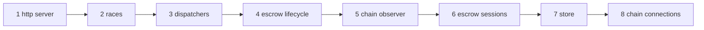

# Devshard gateway — invariants

These are the properties that must hold for the gateway to be correct rather than merely working. Most were learned the hard way, several were violated during the rewrite itself, and a few are enforced by a type or a lock rather than by discipline — which is always the preferred form.

Each entry states the invariant, what enforces it and where, and what breaking it costs. Where an invariant was broken during the build, the failure is recorded: invariant 1 broke eight times, and the shape that kept returning is more instructive than any individual bug.

## 1. A committed nonce is always settled

Advancing the nonce sequence sends a `MsgStart` to the chain. From that moment the inference is owed a resolution: either the host finishes it and the session records the finish, or the gateway posts a timeout vote. A committed nonce with neither is an orphaned chain message that settlement can never resolve — money the escrow can never reclaim.

Every nonce the gateway commits therefore ends up in exactly one of three states:

| State | Who resolves it |
|---|---|
| Served | An attempt ran; the host's response was applied to the session, or a timeout vote was posted for it. |
| Ghosted | The scheduler burned it locally with a recorded reason; nothing was ever sent, so nothing is owed. |
| Stranded but voted | The assignment could not be dispatched; a synthetic attempt outcome carries it into the timeout plan. |

**What enforces it.**

- The decision type is closed. `scheduler.Decision` is a sum of `serve`, `burn`, `hold` and `decline` (`scheduler/decision.go`, `Decision`); a nonce is handed to a waiter, accounted as a ghost, parked, or given back uncommitted, and there is no way to express "committed and nobody's" without changing the type.
- Every started attempt must deliver its terminal event. `AttemptDone` is sent with a **blocking** send, unlike progress events which are dropped when the coordinator is busy (`engine/attempt.go`, `AttemptSpec.emit` blocking, `AttemptSpec.offer` dropping). That delivery is what lets a committed nonce be settled, so the attempt goroutine waits for it.
- An assignment with no dispatch target is *stranded*, not dropped: `strand` releases the host slot, keeps the escrow hold, and appends a synthetic attempt with `TerminalNoReceipt` so the outcome carries it into `TimeoutPlan` (`engine/race.go`, `raceCoordinator.strand`).
- A race that fails before its first attempt still reports (`engine/race.go`, `raceCoordinator.fail`).
- `RaceOutcome.TimeoutPlan` produces one step per attempt whose nonce is not already finished, with an explicit skip reason where a vote must not be posted (`engine/settle.go`, `RaceOutcome.timeoutSkipReason` and `RaceOutcome.TimeoutPlan`).
- `Engine.Stop` is a real barrier: a race is registered under the engine mutex *before* it starts and released only after its vote goroutine finishes (`engine/engine.go`, `Engine.admit` and `raceRegistration.release`). Registering any later would leave a just-admitted race outside the barrier — precisely the race whose vote is still owed and whose nonces are already committed.
- The engine's `Run` recovers a panic solely to release that registration and then re-panics with the same value (`engine/engine.go`, the deferred recover in `Engine.Run`). Without it, a panic between admission and settlement would leave `Stop` waiting forever.

**This shape broke seven times.** Every one of them was some variation of *state moved between the commit and the lookup that was supposed to resolve it*:

1. **Admission taken as a peek where atomicity was required.** Selection used the limiter's cheap `Available` peek and the engine called `Acquire` afterwards. Two critical sections, so the window could fill in between; the failed acquire produced an attempt that never entered the outcome, so nothing posted its vote. Fixed by moving `Acquire` inside the same `session.Advance` callback that commits the nonce.
2. **A missing dispatch target returning early after the commit.** `begin` resolved the escrow handle after the pick and returned an error when the escrow had rotated out — with no slot release and no attempt outcome. Fixed by `strand`.
3. **The declined-admission path.** The dead `AttemptDeclined` / `AttemptRePick` events that (2) and (1) had left behind were deleted rather than left as a second, silent early return.
4. **A retired escrow unresolvable for settlement.** The registry resolved only the published set, so an escrow retired between the end of a race and the settle step silently dropped every vote that race owed. Fixed by the published-or-draining lookup — invariant 4 below.
5. **An in-flight counter with no production caller.** `registry.Acquire` existed, was unit-tested, and was never called by production code, so every escrow's in-flight count stayed zero. `Retire` therefore saw an idle escrow and closed the session immediately instead of draining it, and settlement could no longer resolve it. The fix made the defect unrepresentable rather than fixing the instance: `Acquire` now returns the session *and* the release together in one locked step, so a dispatch handle cannot be obtained without the hold (`registry/registry.go`, `Registry.Acquire`).
6. **A reply applied only on the success path.** `escrowTarget.Send` calls `session.ProcessResponse` after `SendOnly`, and applying the reply is what marks the nonce finished, verifies the post state root, persists the host's signature and queues the `MsgConfirmStart`. A reply can arrive *beside* an error, so gating the apply on `err == nil` strands the nonce: the race then crowns a paid success as a failure, posts a timeout vote against the wrong deadline, and never stops escalating. The apply therefore runs whenever a reply exists, and its own error is reported only when the send did not already fail (`api/dispatch.go`, `escrowTarget.Send`).
7. **A re-added escrow id stealing the settlement lookup.** Deactivating and reactivating an escrow while a stream was in flight published a new entry under an id whose earlier entry was still draining; the settlement lookup, which checked live entries first, then resolved every nonce the *old* entry had committed to the *new* session. It also opened a second session over storage the draining entry still held. Fixed by `Add` refusing an id that is still draining (`registry/registry.go`, `Registry.refuseIfDrainingLocked`).

**An eighth broke the same invariant by a different mechanism: a skip predicate that was too wide.** A host still producing content past 280 seconds must not have a timeout voted against it, so the vote is deferred. The predicate first read `ContentChunks > 0` — but that counter increments on error events as well as content, so a host that emitted a single SSE error and then held the stream open for 280 seconds was exempted too. Its nonce ended neither host-finished nor timeout-voted, and nothing else sweeps an unfinished nonce, so the escrow could never reclaim what that nonce cost. The predicate now reads `ContentSource != ""`, which only a rendered content, reasoning or tool-call field sets, so the exemption covers the case it was written for and nothing else (`engine/outcome.go`, `RaceOutcome.longResponseExempt`).

**Deliberately not enforced by suppression.** A host whose escrow state diverged still gets its timeout vote posted (`engine/settle.go`, `RaceOutcome.timeoutSkipReason`, which deliberately does not name it). Skipping the vote for a state-blocked host — which one of the two legacy timeout ladders did — would mean that once a host diverged, every later nonce bound to it stopped being settled: an accumulating leak. Divergence is actioned as a routing fact instead (invariant 8).

**Known residual.** A ghost burn commits without taking the escrow hold, because a ghost is never dispatched and owes no vote (`scheduler/dispatcher.go`, `dispatcherDeps` and the serve branch of `dispatcher.drain`). This is consistent, but it means ghost commits are not protected against a concurrent retire the way served commits are.

## 2. Exactly one outcome and exactly one winner per race, on every path

A race has several attempts running concurrently, may be abandoned by its client mid-flight, and continues after its caller has returned. Every exit path must still produce exactly one `RaceOutcome` and crown at most one winner.

**One winner.** `c.winner` is assigned in two places, `answer` and `settleClaims`, both guarded by `c.winner == nil` and both running only on the coordinator goroutine; a claim it cannot answer yet is parked and re-read on the next turn rather than answered twice. Attempts do not decide; they *claim*. A writer that has content sends a crown request and blocks on the reply (`engine/stream.go`, `winnerWriter.claim`), so no byte reaches the client before the coordinator has answered. A loser's writer is not merely gated — `Abandon` clears its client field, so a suppressed attempt has no reachable sink at all rather than a sink behind a branch someone must remember to write (`engine/stream.go`, `winnerWriter` and `winnerWriter.Abandon`).

**One outcome.** `report()` is the sole caller of `Report`, and it closes the race's `done` channel before building the outcome (`engine/race.go`). A second call panics on the double close, so a duplicated outcome cannot pass silently as a second `Report` — it takes the process down at the point of the defect instead. The three possible callers are made mutually exclusive by the race exit value: only `exitComplete` reports on the calling goroutine, while the other two hand a race that still owes work to a single spawned goroutine that awaits and reports (`engine/race.go`).

**One recording point.** The exemption ladder that decides whether a host is judged for an attempt is applied in `Engine.record` and nowhere else, so what a host is judged on cannot differ between two recording paths. The legacy gateway had six divergent entry points for the same decision.

## 3. No field crosses a goroutine except through the event channel

The legacy engine shared a 57-field `inflight` struct across three goroutines, and did so on the money path: the drain returned while attempts were still writing the fields the outcome then read. That is a data race deciding what gets paid.

In the rewrite each attempt owns its own state and publishes facts as events:

- `attemptState` is owned by the attempt's goroutine and never read by another (`engine/attempt.go`, `attemptState`).
- `liveAttempt` — the coordinator's parallel record — is written only in response to events, on the coordinator goroutine (`engine/race.go`, `liveAttempt`).
- The byte path (`attemptSink`, `contentGate`) runs only on the attempt's goroutine; the one fact an `io.Writer` signature cannot carry, "this chunk has content", is passed in-goroutine immediately before the matching write (`engine/race.go`, `attemptSink` and `contentGate`).
- The reassembly buffer belongs to one attempt's goroutine; only the byte *charge* it holds is shared, and that is atomics (`engine/carry.go`, `carryBuffer`).

There are exactly two cross-goroutine channels — the event channel and the crown request/reply handshake — plus a close-only `done` channel. Cross-race state (crown strikes, the race registration) is behind its own mutex or atomic.

**The channel's blocking discipline is part of the invariant.** Progress events use a non-blocking offer and are dropped when the coordinator is busy, because a full channel means it is already awake and the next delivered event carries the same running totals (`engine/attempt.go`, `AttemptSpec.offer`). Terminal events block. Making `AttemptDone` non-blocking would compile, pass most tests, and quietly break invariant 1.

**Go's `select` chooses at random among ready cases, and that forced a specific shape.** When a buffered event and a fired timer are both ready, the coordinator may take the timer and act on state the queued event has already invalidated. The consequences are concrete: spending a nonce on an escalation the newer state has cleared, mislabelling a healthy host, or reporting a completed winner as cancelled. So every select arm that *reads* race state begins by draining the event queue — `catchUp`, called from `expire` and `depart` (`engine/race.go`, `raceCoordinator.catchUp`). This class appeared three times in the engine before it was fixed structurally, and once as a live test flake in which the stall test passed at `-count=3` and then failed with the wrong terminal state. It is also why an earlier claim in the design notes — that timeout precedence in the legacy engine was "implicit in select-arm ordering" — was wrong: the Go specification chooses uniformly at random among ready cases, so the legacy precedence was not implicit, it was *undefined*.

Precedence in the rewrite is explicit. `nextDeadline` takes the earliest deadline outright; the declaration order of the trigger constants breaks exact ties, and that order is the policy (`engine/race.go`, `nextDeadline` and the `deadlineTrigger` constants).

## 4. Routing and settlement read the escrow set asymmetrically, on purpose

```
Routing      → published entries only
Settlement   → published, then draining
Status reads → published or draining, without counting
```

Routing must refuse a retired escrow so it takes no further request. The nonces that escrow already committed still owe their votes, and the draining entry is the one holding the storage those votes settle through — so rehydrating a second session over the same files would fight it (`registry/registry.go`, `Registry.RoutableSession` and `Registry.SettlementSession`).

This is stated in one comment and depended on by three files. Unifying the two lookups — the obvious tidy-up — either lets routing dispatch into an escrow that is going away, or strands the votes of one that already did. The narrow interfaces make the mistake hard to even express: an attempt to reproduce the settlement bug at the API layer by swapping the settlement lookup for the routing one did not compile, because that layer's interface declares only the settlement lookup.

The read-only status handle exists as a third case precisely because it must **not** take a hold: an operator inspecting an escrow must not keep it from retiring.

## 5. The slot and the escrow hold are taken with the nonce, and given back after the vote

Three resources are taken together and must never diverge: the nonce, the participant's concurrency slot, and the escrow's in-flight hold.

**Acquisition is one atomic step.** All three happen inside the callback of `session.Advance`, which runs under the session's own lock with the nonce-to-host binding already fixed (`scheduler/dispatcher.go`, the serve branch of `dispatcher.drain`). Match decides; on `serve` the slot is acquired, then the hold; only then does the nonce commit. A refused slot becomes `burn{ghostThrottled}` — a ghost kind that already existed, which is evidence the original design always meant throttling to ghost rather than commit.

**Release is by whoever spends it.** The engine's view of the limiter deliberately exposes only `Release` (`engine/engine.go`, `hostWindows`; `engine/attempt.go`, `hostLimiter`): an interface that cannot acquire cannot get the ownership wrong. The attempt releases the slot when it ends; every scheduler path that cannot deliver an assignment gives the slot and the hold back *together* (`scheduler/dispatcher.go`, `reservation` and `dispatcher.giveBack`).

**The hold outlives the race.** The race parks the escrow hold on its registration and releases it only after the settlement vote has been posted — from inside the goroutine that posts it (`engine/engine.go`, `raceRegistration.holdEscrow`, `raceRegistration.release` and `Engine.settle`). The assignment's own hold is handed back as soon as the race has its own (`engine/race.go`, `raceCoordinator.launch`), except in the stranded case, where it is kept because the escrow being retired is exactly why there was no target and the vote still has to reach it (`engine/race.go`, `raceCoordinator.strand`).

**Why the peek still exists.** `limits.Available` remains as a cheap pre-filter for routing, where a stale answer costs nothing (`scheduler/scheduler.go`, `hostLimiter`). What broke was using it as the authority. The distinction — filter versus authority — is the whole lesson.

**And why the frozen refusal matters.** Acquiring at the serve point with no memory would burn one nonce per drain iteration whenever a window is full, where the old code burned none: a money bug traded for a money bug. A refused participant is folded back into the drain's frozen `throttled` predicate so the sweep answers the queue instead (`scheduler/dispatcher.go`, `admit`).

## 6. Shutdown order is a contract

Eight steps, in this order (`main.go`, `shutdownOrder` and `stopAll`). Every one is attempted even if an earlier one fails, with a single exception described below:



The ordering encodes three dependencies. Races drain to the vote that settles their nonces, and that vote needs the escrow sessions, the chain observer and the chain client still alive — so races stop second, and everything they depend on stops below them. The store is second to last because closing it drains the accounting ledger, and a queued row must not outlive its connection; the registry closes just above it for the same reason one level down, since each escrow session holds its own SQLite handle. Chain connections close last because every step above can still reach the chain, and a socket closed earlier is one the next poll must re-dial.

Three runner properties are as load-bearing as the order. Every step runs even after a failure, because the store must be reached whatever happened above it. The drain is *bounded but not cancelled*: cancelling would abort the vote the drain exists to protect, waiting forever would forfeit every later step to the SIGKILL that follows, so an overrunning drain is left running and reported (`main.go`, `waitFor`).

And one step is guarded by quiescence rather than run unconditionally. A step marked `needsQuiesced` is skipped, and the skip reported, whenever anything above it failed (`main.go`, `shutdownStep.needsQuiesced` and `stopAll`); today that is the escrow sessions and nothing else. Closing an escrow session takes no lock, so closing one under a drain that overran races a nonce commit — trading a vote this shutdown was already going to drop for on-disk state nothing can repair. The store deliberately carries no guard, which is why "the store must be reached" and this exception do not collide.

This was got wrong twice. An earlier order omitted the scheduler's dispatchers and the registry entirely — closing the gateway store while every escrow session still held a handle. And an earlier `waitFor` discarded its context, so the grace period reached only the listener: one unanswered request plus SIGTERM meant the drain blocked for minutes and the orchestrator killed the process mid-vote, losing exactly the vote the drain exists to protect.

## 7. Money-path orderings

Each of these is an ordering whose reversal produces a plausible-looking program that loses funds.

| Rule | Enforced at | Cost of reversal |
|---|---|---|
| Durable intent is written before the broadcast; a failed intent write aborts before broadcasting. | `chain/txclient.go`, `TxClient.CreateEscrow`; `escrow/commitments.go`, `Manager.createEscrow` | A crash between broadcast and record leaves a funded escrow nobody knows about. |
| The precomputed transaction hash must equal the one the node returns. | `chain/txclient.go`, `TxClient.CreateEscrow` | The recovery record points at a transaction that is not the one that landed. |
| The commitment row is deleted only after the escrow is registered. | `escrow/commitments.go`, `Manager.persistEscrow` | A crash in between loses the only pointer to a funded escrow. |
| A transaction that may still land is never dropped from durable intent (11-minute grace = the chain's 9-minute unordered-transaction TTL plus 2 minutes of index lag). | `escrow/commitments.go`, `commitmentReconcileGrace` and `Manager.txMayStillLand` | An escrow created but not yet indexed is forgotten. |
| An escrow is deactivated only on unanimous, confirmed absence; any endpoint error keeps it active. | `escrow/checker.go`, `Manager.TriggerEscrowCheck`; `chain/escrow_query.go`, `TxClient.GetEscrow` | A network blip deactivates a live, funded escrow. |
| Deactivate before any chain call; mark settlement pending; only then check whether the escrow is busy. | `escrow/settlement.go`, `Manager.park` and `Manager.settle` | Checking busy first leaves the escrow active, so it never drains, so it never settles. |
| `settlement_pending` is cleared only after the broadcast is confirmed. | `escrow/settlement.go`, `Manager.settle` | A settlement that failed looks completed. |
| The registry row is deleted only after settlement succeeds; with settlement disabled the escrow is parked, never deleted. | `escrow/settlement.go`, `Manager.retire` | The row carries the environment-variable name of the settling key. Delete it and the funds are unrecoverable. |
| A replacement escrow is created before the depleted one is retired. | `escrow/depletion.go`, `Manager.replaceDepleted` | Coverage drops to zero between the two. |
| A zero-row UPDATE or DELETE is an error, never a silent success. | `store/devshards.go`, `requireOneRow` | State diverges from what the caller believes it wrote. |
| Private keys are never persisted — only the name of the environment variable holding one, and a raw key in a request body is rejected at the boundary. | `store/devshards.go`, `DevshardRecord`; `api/errors.go`, `ErrPrivateKeyEnvRequired` | A key reaches the commitment row, the logs, and every operator in between. |

## 8. Fail-closed and fail-open are chosen per signal, and each choice is deliberate

Neither default is right everywhere. What matters is that each is decided rather than inherited.

**Fail closed** — refuse rather than guess:

- A model absent from a *populated* per-model weight view is served by nobody and gets zero capacity, rather than inheriting the all-model view (`limits/capacity.go`, `Capacity.modelServedLocked`). Unvalidated model strings are client input; without this, an unknown model inherited full network capacity.
- A NaN or out-of-range scale factor clamps to zero, never to one (`limits/gateway.go`, `clampUnit`). The natural-looking alternative — returning an empty weight map — would have hit the "no baseline means unlimited" branch and granted *full* capacity.
- An empty escrow registry means the gateway is not ready, not that every model routes; the request is refused with 503 (`api/routes.go`, `Server.routableModel`).
- A host's node-version capability is unknown until proven, and a stale entry counts as unknown, so the proof-of-compute validation merge stays conservative (`chain/versions.go`, `VersionsCache.IsNodeValidationCapable`).
- Admin routes do not exist when no admin key is configured — the response is 404, not 401 — and a configured key must be at least 16 characters. An empty key can never authenticate anything.

**Fail open** — carry on rather than break a working system:

- A failed chain poll republishes the previous snapshot with `LastError` set, rather than publishing an empty one (`chain/observer.go`, `PhaseObserver.refresh`).
- `MaxNonce == 0` means "not fetched", not "no limit": the scheduler falls back to the historical ceiling of 19 800 rather than disabling the cap or refusing to serve (`chain/snapshot.go`, `PhaseSnapshot.MaxNonce`; `scheduler/escrow_pick.go`, `fallbackNonceCeiling`).
- A nil preserved set means "not loaded yet", so everyone counts as preserved. Reading absent data as "nobody is preserved" would ghost every nonce the escrow owns (`scheduler/scheduler.go`, `pocPreserved`).
- When the chain has reported no weights at all for either view, escrow scoring falls back to the availability-filtered membership share instead of zero (`limits/capacity.go`, `Capacity.EscrowWeight`). Zero would reject every request during the boot window. Because that fallback serves requests correctly and *silently*, it publishes a gauge derived from the very same two predicates the branch reads, so the signal cannot drift from the behaviour it reports (`limits/capacity.go`, `Capacity.WeightsUnobserved` and `Capacity.weightsUnobservedLocked`).

## 9. Bounded by construction

Several loops in this system spend money or memory per iteration, so each has an explicit bound rather than a hope.

- **The scheduler's drain** bounds its cost in nonces: predicates frozen for the drain, a burn budget of `groupSize × (waiters + 1)` fixed at entry, and a sweep that answers unservable waiters without touching a nonce (`scheduler/dispatcher.go`, `dispatcher.drain`).
- **SSE reassembly** is charged against three budgets — per attempt, per participant, and process-wide. The participant level is what stops one host that never terminates an event from draining the shared pool and starving every other host of classification. A cap trip degrades classification to whatever parses on its own rather than stopping it, and the participant charge is undone on a global trip so quota is never left stranded (`engine/carry.go`, `carryBudget` and `carryBudget.reserve`).
- **The accounting ledger** rejects a zero on either retention axis, so an unbounded ledger cannot be configured, and it sheds rows rather than blocking the response path (`store/accounting.go`, `Store.NewLedger` and `Ledger.Record`).
- **Settlement of parked escrows** is capped at four per tick so a backlog cannot stretch one tick across minutes of chain round-trips (`escrow/settlement.go`, `pendingSettleBudget`).
- **Version polling** runs sixteen ways with a two-second per-fetch timeout, because a sequential pass over hundreds of miners takes longer than the freshness window — which silently makes every node report as not validation-capable, and one tarpitting miner is enough to cause it (`chain/versions.go`, `versionsPollConcurrency`, `versionsFetchTimeout` and `VersionsCache.Poll`).
- **Boot** builds escrow runtimes under a semaphore whose depth is also the idle-connection pool size (`main.go`, `newBootBudget` and `publishEscrows`).

Two unbounded-looking maps are deliberate and safe: crown strikes and reassembly charges are keyed by participant, and the participant set is the bounded validator set (`engine/engine.go`, `crownStrikes`; `engine/carry.go`, `carryBudget.counterFor`). Eviction would break both. A crown-strike entry is the running count of contentless answers, and a content-bearing answer is what removes one, so dropping the entry hands a suspicious host a clean record it did not earn. A reassembly counter is held by pointer for the life of the attempt that took it, so dropping the map entry mints a second counter for the next attempt while the first still carries live charges — the participant's cap then bounds neither. The per-participant limiter state map is the one that genuinely never evicts; only the performance tracker ages entries out.

A third holds one mutex per escrow id ever published, and serializes opening that escrow's session (`registry/registry.go`, `Registry.openingLock`). It is not evicted, and the reason is that removing a lock while a caller waits on it lets the next caller take a fresh one and open the same SQLite file concurrently -- the failure the lock exists to prevent. `singleflight` self-cleans its keys but shares the first caller's context, so a caller that cancels mid-open would fail the ones that would have succeeded, which is worse on a path that opens the storage a settlement writes through. The cost is one small mutex per escrow the process ever served.

## 10. Labels, ordering and determinism

- Metric label *values* are exported by the package that emits them and referenced by the metrics layer rather than restated (`engine/outcome.go`, the exported label-value constants). One source means renaming a constant breaks the build rather than the dashboard. Editing its *value* still compiles, and the wire string moves under every panel and alert that queries the old one — so the constants are the contract with Grafana, not an internal vocabulary.
- A route label is always a route pattern, never a raw request path. Three of the legacy gateway's eight branches emitted unbounded strings, including a default that returned the path itself on unauthenticated traffic — one Prometheus series per probe.
- Escrow id is safe on gauges, where stale series expire, and expensive on counters: escrow ids are monotonic chain identifiers and are never reused, so a counter keyed by one grows with uptime and nothing else, and no scrape will ever retire the series on its own. Three counters carry that key deliberately — the scheduler's ghost-burn, nonce-hold and burn-budget families — because a spent nonce has to be attributable to the escrow that paid for it. Nothing else does, and the three do not grow without bound either: `metrics.DispatchRecorder.EscrowRetired` deletes all three of an escrow's series, and the scheduler calls it when it reaps that escrow's dispatcher (`metrics/dispatch_recorder.go`, `DispatchRecorder.EscrowRetired`; `scheduler/scheduler.go`, `Scheduler.retire`).
- Iteration that has an observable effect is over sorted keys — membership publication, the escrow-missing drain, the registry's snapshot and close paths.
- Request capture admits a deterministic stride rather than a random sample, so a configured rate is honoured exactly and reproducibly (`api/capture.go`, `requestCapture.admit`).
