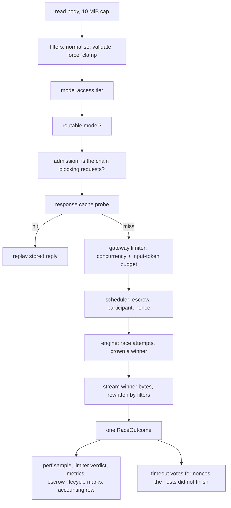

# Devshard gateway — the life of a request

One `POST /v1/chat/completions` from socket to settled nonce. This is the spine document: it names each stage, says what can end the request there, and links to the document that covers the stage in depth.

## The path

The order of the first six stages is deliberate: everything cheap and everything that can *refuse* runs before anything that reserves a resource.

## 1. Ingest

The body is read through `http.MaxBytesReader` at 10 MiB for chat and 64 KiB for every operator route (`api/middleware.go`, `chatIngestLimit`, `adminIngestLimit` and `readBody`). `MaxBytesReader` rather than `io.LimitReader` for two reasons: it yields a typed error the status mapper turns into 413, and it marks the connection so the server stops reading a hostile body instead of draining it.

The mark is made by type-asserting the writer, which is why `readBody` hands `MaxBytesReader` the writer the server owns rather than the one the handler holds (`api/middleware.go`, `baseWriter`). Every route runs behind the metrics wrapper, and a writer the standard library cannot see through takes the mark silently: the refusal still returns 413 while the connection stays open and the body keeps arriving. Unwrapping restores the read deadline too, which `http.NewResponseController` reaches the same way.

The listener sets `ReadHeaderTimeout` (5 s), `IdleTimeout` (120 s) and `MaxHeaderBytes` (1 MiB), and deliberately sets **no `WriteTimeout`** (`api/server.go`, `Server.HTTPServer`). `WriteTimeout` is an absolute deadline on the whole response, so any value truncates every SSE stream at it. That is why per-attempt deadlines live in the engine rather than in the listener — and why "hardening" the server by adding a write timeout would break streaming.

## 2. Filters

`filters.NormalizeRequest` parses, validates, normalises and re-marshals the body; a rejection is a 400 with a message the caller can act on, and the request is written to the capture sink. See [gateway-request-filtering.md](./gateway-request-filtering.md).

Three things leave this stage that the rest of the pipeline depends on: the normalised body (which is what the cache is keyed on and what the host receives), the routed model, and the resolved output-token budget.

## 3. Authorisation and routability

Model access tiers are `open`, `api_key` and `admin_only`. An empty policy map means every model is open; once *any* policy exists, a model absent from the map is `admin_only`, so adding a model to the network cannot silently expose it (`config/config.go`, the `ModelAccess*` constants and `Limits.AccessFor`).

Then the model must actually be routable. An unroutable model is refused **before** it can take a cache lookup, a limiter slot or a token budget, and an empty registry is treated as "the gateway is not ready" (503) rather than "everything routes" (`api/routes.go`, `Server.routableModel`).

Credentials are compared by hashing both sides and running `subtle.ConstantTimeCompare` against every configured key, so the timing reveals neither which key matched nor the length or prefix of the configured one (`api/middleware.go`, `keyGate` and `keyGate.authenticate`). A request with no `Authorization` header never reaches a comparison at all, and the admin comparison lives inside the admin gate rather than in a blanket middleware, so a cheap public route cannot be used as a timing oracle.

## 4. Admission

The chain blocks inference during proof-of-compute. Admission is a pure predicate over the published chain snapshot, evaluated here rather than as a per-escrow gate call (`api/admission.go`, `admission`).

The observer publishes the chain's *raw* blocking state; relaxed proof-of-compute mode is the operator's override of it, not a chain fact. This gate is the only place the override decides whether a request is refused, but it is not the only reader, and the readers deliberately disagree. The per-weight concurrency allowance follows the **raw** phase, because it bounds what the hosts can physically do (`main.go`, `modelCapacity.ForModel`). The scale factor follows the override: reading the raw state there would zero the scale during proof-of-compute, and a zero scale clamps every weight-derived cap to nothing, so relaxed mode would go dead in exactly the deployments that set an input-token cap or a per-model override (`main.go`, `blockedFor` and `modelCapacity.ScaleFactor`). The engine reads it a third time, to separate an attempt the phase transition ended from one the host ended (`engine/race.go`, `pocBypassActive` and `pocGenerating`).

## 5. Response cache

The cache is probed after admission and before the limiter, so a hit costs no slot and no token budget — but during proof-of-compute the gateway serves nothing at all, which is a deliberate divergence from the legacy gateway (see [gateway-non-goals.md](./gateway-non-goals.md)).

The key is `{sha256(authorization header), escrow scope, model, sha256(normalised body)}` (`api/cache.go`, `cacheKey` and `cacheKeyFor`). Each component earns its place: without the caller, one caller is served another's reply; without the escrow scope, a devshard-pinned request is answered from an escrow that never saw it while the response header still names that escrow; and a streamed reply is stored as the write boundaries it arrived in, because a replay that re-chunks the stream is not the stream that was cached.

A recorded reply keeps the **first** status the handler chose, so a write after the response has begun cannot turn a recorded failure into a 200 (`api/cache.go`, `cacheRecorder.WriteHeader`). Entries carry a one-hour lifetime and eviction drops entries in map order — a wrong choice costs one re-run, which is cheaper than maintaining an age-ordered list on every hit. The cache is disabled entirely when its byte budget is zero or negative.

## 6. Admission to capacity

`limits.GatewayLimiter.AcquireForModel` takes both a concurrency slot and an input-token budget, scaled by the chain-derived capacity for that model. Input tokens are *estimated* as `ceil(len(body)/4)` with a floor of one — deliberately not a tokenizer call (`api/routes.go`, `estimatePromptTokens`); it feeds the in-flight budget and the performance buckets, not billing.

A request that could not fit even on a completely idle gateway is rejected without queueing. Otherwise it joins a FIFO queue with a bounded wait and is either handed a slot directly by a releasing request or timed out into a 429 carrying `Retry-After`. See [gateway-capacity-and-health.md](./gateway-capacity-and-health.md).

## 7. Routing

`scheduler.Pick` returns an assignment: an escrow, a participant and a committed nonce, with the participant's concurrency slot and the escrow's in-flight hold already taken in the same atomic step. See [gateway-routing-and-nonces.md](./gateway-routing-and-nonces.md).

## 8. The race

`engine.Run` dispatches the first attempt, escalates to more participants when the first is slow or refuses, crowns the first attempt to produce actual content, and streams that attempt's bytes to the client. See [gateway-speculative-race.md](./gateway-speculative-race.md).

Two seams between the API layer and the engine deserve naming here because both were silent, total failures when they were wrong:

**The dispatch payload is a concrete type, not an opaque blob.** `engine.Request.Params` is typed `any` and forwarded unread, but both ends require it to be exactly `devshard/user.InferenceParams` — the value the escrow session commits, not the request body it was built from (`engine/engine.go`, `Request`). It is built by the API layer, travels through the scheduler's request profile into `session.Advance`, and reaches the timeout poster unchanged. When it was documented merely as "opaque", one side forwarded the raw body and the other asserted the concrete type, so no nonce ever committed and the gateway served nothing.

**Applying the host's reply is what finishes a nonce.** The dispatch adapter must call the session's response processing *before returning*, including when `Send` returned an error alongside a reply (`api/dispatch.go`, `escrowTarget.Send`). Applying the reply is what marks the nonce finished, verifies the post-state root, persists the host's signature and queues the confirmation message. Skipping it strands the nonce: the race then records a paid success as a failure, posts a timeout vote against the wrong deadline, and never stops escalating.

The stream handed to the transport must also stay **unwrapped**, because the transport flushes each SSE line through a type assertion on it; a wrapper that does not re-expose the flusher leaves a crowned winner's bytes in the server's buffer (`api/dispatch.go`, `escrowTarget.Send`).

## 9. Streaming out

The client writer withholds the status line until the first byte, so a failure before any content still returns a real status instead of a 200 with an error body in it (`api/stream.go`, `clientStream` and `clientStream.begin`). Once the client has seen a status, no later error can replace it — a post-start failure only flushes and returns.

Streaming replies pass through the stateful SSE rewriter, which strips the gateway's internal fields. Non-streaming replies are buffered whole, because stripping requires a complete body. Flushing goes through `http.NewResponseController` rather than an `http.Flusher` type assertion, so a wrapper cannot swallow it (`api/stream.go`, `newClientStream` and `clientStream.Flush`).

`X-Devshard-ID` is written at two different moments, and both are needed. On a stream the header must be set before the first byte, so the engine fires an `OnEscrow` callback the moment the escrow is settled on — after the pick, before any byte, the last point a header can still be set. For a reply still holding its headers, the write after the run completes is the authoritative one (`api/routes.go`, the two `EscrowHeader` writes in `Server.race`).

## 10. Recording

Every race produces exactly one `RaceOutcome`, and it fans out from a single point (`engine/engine.go`, `Engine.record` and `Engine.settle`):

| Destination | What it gets |
|---|---|
| `perf` | One sample per attempt, unless the exemption ladder excuses it. |
| `limits` | One verdict per attempt — or explicitly no window movement. |
| `metrics` | Fourteen families updated here from the one outcome, plus two more the settle goroutine derives from the same outcome's timeout plan — so two call sites cannot disagree about what a race did. |
| `escrow` lifecycle | A mark when a host reported the escrow missing. Set *before* the accounting row is queued, so an observer that has seen the row has also seen the mark. |
| Accounting ledger | One row per request. |
| Timeout votes | One posted vote per nonce the host did not finish, unless the skip ladder gives a reason. |

The accounting row records tokens and topology, never money: who served it, which nonce, output tokens summed over every attempt, and the winner's timings. It is written by a non-blocking send into a queue drained by one writer goroutine, because its caller is on the client's response path (`store/accounting.go`, `ledgerQueueDepth` and `Ledger.Record`). A shed row is counted in the ledger statistics and surfaced as `devshard_gateway_accounting_rows_lost_total`; it never fails a request, and it never fails process exit either, because telling an orchestrator that a clean shutdown was a crash is worse than losing a telemetry row.

Retention is enforced on both axes — age and row count — and a zero on either is rejected at construction, so an unbounded ledger cannot be configured.

## What can end a request, and with what status

| Condition | Status |
|---|---|
| Body over the ingest cap | 413 |
| Filter rejection (unknown parameter, bad shape, out-of-range value) | 400 |
| Model not served by any escrow | 400, listing the routable models |
| Gateway not ready (empty registry) | 503 |
| Model requires a credential the caller does not have | 401 |
| Requests blocked by the chain phase | 503, naming the phase |
| Gateway-limiter queue timeout, or no escrow capacity, or escrow busy | 429 with `Retry-After` |
| Pinned escrow no longer serves the model | 409 |
| Pinned escrow id unknown to the gateway | 404 |
| Engine stopping, or registry closed | 503 |
| Host refusal the client must see verbatim | The host's own status |
| Every attempt failed | 502 |
| Non-streaming race exceeded its bound | 504 |

Errors are always written as `{"error":{"message":...}}` by the one error writer in the API package, so no rejection escapes as `http.Error`'s plain text (`api/errors.go`, `errorEnvelope` and `writeError`).

## Request capture

When capture is enabled, rejected requests and races where every attempt failed are written to disk for diagnosis. Sampling is a **deterministic stride**, not a random draw, so a configured rate is honoured exactly and reproducibly (`api/capture.go`, `requestCapture.admit`). The directory has a byte ceiling measured at start-up by walking it, bytes are reserved before a write and refunded on failure, files are written to a temporary name and renamed, and permissions are `0700`/`0600`. Bodies that are not valid JSON are stored base64-encoded rather than dropped.
