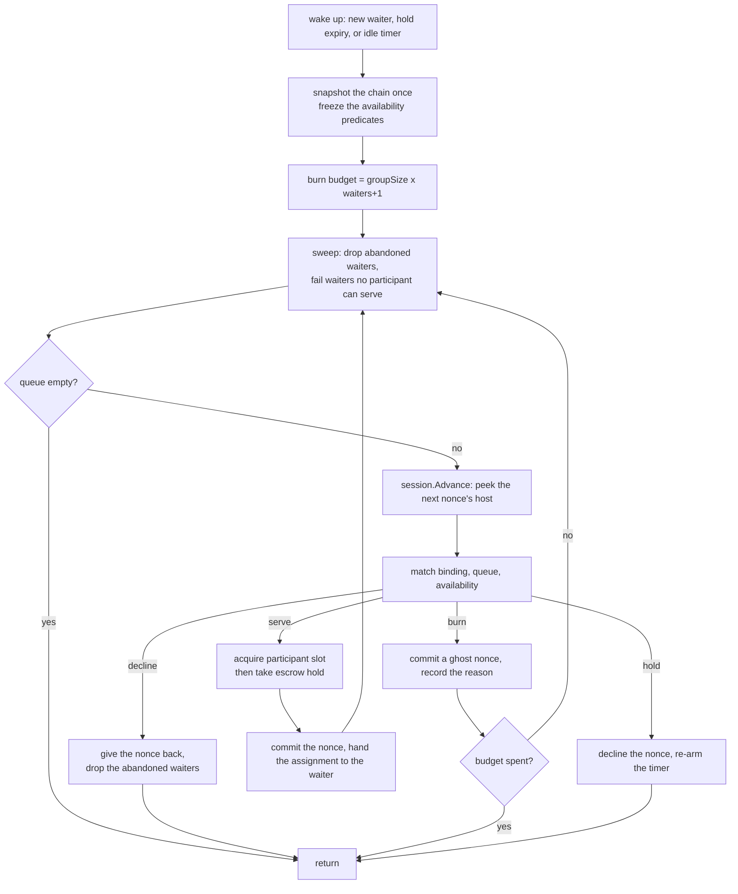

# Devshard gateway — routing and nonces

Choosing where a request goes is not a free decision in this system. The protocol binds an executor to a nonce (`executor = nonce % groupSize`), and `user.Session` issues nonces strictly in order. So "pick host X" is not something the gateway can say: it can only advance the nonce sequence, and every nonce it advances past is spent whether or not anyone serves it. Nonces are a capped, chain-costed resource. That is the fact the whole scheduler is shaped around.

This document covers `scheduler/` (which escrow, which participant, which nonce) and `registry/` (what the live escrow set is and who may hold a handle on it). The race that follows a pick is in [gateway-speculative-race.md](./gateway-speculative-race.md).

## Vocabulary

- **Escrow** — a funded on-chain account with a fixed participant group, serving one model. The gateway usually holds many.
- **Participant key** — the identity a host is known by. A validator may hold several *slots* in a group; all of its slots share one participant key. Every filter in the scheduler is keyed by participant, never by slot, so a request that excluded a host cannot be re-served through a sibling slot of the same validator (`match.go`, `match`).
- **Group size** — the number of slots in an escrow's group. `nonce % groupSize` is the slot index, which is why advancing the nonce is how a host is chosen.
- **Ghost burn** — a nonce that was committed locally with a one-token placeholder inference and never sent anywhere, because no host bound to it could serve any waiting request. It is spent money with a recorded reason.

## Picking an escrow

`Pick` is called once per request and once per escalation attempt inside a race. An escalation passes the escrow it is already pinned to; only a fresh request goes through escrow selection (`scheduler.go`, `Scheduler.Pick`).

**A pin skips selection entirely, and that has two consequences worth knowing** (`escrow_pick.go`, the pin branch of `pickEscrow`). A request that names an escrow — an escalation, or a client calling `/devshard/{id}/v1/chat/completions` — is matched against the candidate list by id and returned directly, so it is neither scored nor checked against the nonce ceiling below, and it does not fire the exhaustion callback that schedules a replacement. A pin that names an escrow the gateway no longer routes to is refused with `ErrEscrowGone`. A deployment served entirely through pinned requests therefore never marks a spent escrow for rotation.

Selection (`escrow_pick.go`, `pickEscrow`) runs over `registry.Candidates(model)`, which is already filtered to escrows whose session phase accepts new inferences, and against a single chain snapshot taken once for the call.

**The nonce ceiling comes first.** An escrow whose latest nonce has reached the cap is dropped from the candidate set. The cap is `types.MaxActiveNonce(maxNonce, groupSize)` where `maxNonce` is the governance parameter read from the chain. Two details are load-bearing. The parameter arrives as a `uint64` and is *clamped* to `math.MaxUint32` rather than cast, because a value that wraps to zero makes `MaxActiveNonce` return the maximum `uint64` and silently disables the gate entirely (`escrow_pick.go`, `atNonceCap`). And when the parameter has not been observed at all, the fallback is the raw constant 19 800 — the fixed ceiling the gateway ran on before the parameter existed. Treating an unknown cap as unlimited would let an escrow run past the ceiling the *host* enforces; refusing to serve would stall every cold start (`escrow_pick.go`, `fallbackNonceCeiling`).

Dropping a capped escrow is only half the answer. Routing declines it; nothing about that tells the rotation lifecycle to build a replacement. So the pick also calls `OnEscrowExhausted(escrowID)`, which is wired to the escrow manager's exhaustion mark. Without it an escrow drains quietly and every request eventually returns "no escrow capacity" (`escrow_pick.go`, the exhaustion call in `pickEscrow`). Because this fires on the request path — potentially once per spent candidate per pick — the callback must mark and return, never do I/O (`registry/membership.go`, `exhaustion`).

**Then the score.** Lower is better:

```
loadScore(escrow) = activeUsers(escrow) / escrowWeight(escrow, model)
```

`activeUsers` is the escrow's in-flight count; `escrowWeight` is the capacity model's view of how much of the network's serving weight this escrow commands for this model (see [gateway-capacity-and-health.md](./gateway-capacity-and-health.md)). A weight that is zero, negative or NaN scores `+Inf` and the candidate is skipped — deliberately, because a plain ratio would score a broken escrow as perfectly idle (`escrow_pick.go`, `loadScore`).

Ties are broken by one process-wide atomic counter modulo the tie-set size. It is a pseudo-round-robin over whatever tie set exists at that moment, not a fair per-model rotation, and it depends on the candidate slice being in a stable order — which the registry guarantees by sorting each model's candidates by escrow id (`escrow.go`, `newLiveSet`). That coupling between the registry's ordering and the scheduler's tie-break is real and easy to break by "optimising" either side.

If nothing survives, `Pick` returns `ErrNoEscrowCapacity`, which deliberately names no host: it is a capacity condition, not an accusation (`errors.go`, `ErrNoEscrowCapacity`).

## The per-escrow dispatcher

Once an escrow is chosen, the request becomes a *waiter* submitted to that escrow's dispatcher — a goroutine that is the sole owner of the escrow's nonce stream and of the queue of waiters. Nothing else touches either (`dispatcher.go`, `dispatcher` and `newDispatcher`). One escrow, one actor, no lock around the nonce sequence.

Submission returns one of three outcomes, and the distinction is the gateway's status-code policy: accepted, buffer full (`ErrEscrowBusy`, a rate-limit class — the escrow is sound, the caller arrived faster than it can serve) or stopped (`ErrDispatcherStopped`, retryable, the caller lost a race with a retiring actor). Treating a full buffer as "stopped" would turn a saturated escrow into a retry spin (`dispatcher.go`, `submitOutcome` and `dispatcher.submitWaiter`).

A waiter never sends the actor a message to leave. Cancellation is a flag the waiter sets on itself, because a departure message could block the actor (`decision.go`, `waiter`). The reply channel is buffered with capacity one so the hand-off never blocks on a caller who has gone away, and a small mutex orders `deliver` against `abandon` so that a nonce arriving in the same instant as a cancellation is owned by exactly one of them — rather than by neither (`decision.go`, `newWaiter`, `waiter.deliver` and `waiter.abandon`).

### The drain

Each wake-up runs one drain (`dispatcher.go`, `dispatcher.drain`):



**Predicates are frozen for the whole drain.** `pocRequired`, `throttled`, `ejected` and `stateBlocked` are memoised per participant; `capability` is memoised on the composite key `{participant, model, requiresTools, contextHint}`. This is not a caching optimisation. Reading them live lets a host look usable to the sweep that keeps a waiter and unusable to the binding that would serve it, one iteration later — which burns a nonce every turn, forever (`match.go`, `availability`; `dispatcher.go`, `capabilityKey` and `freeze`). Any future predicate that reads another field of the request profile must join that memo key, or it will see a stale answer for the rest of the drain.

**The burn budget is `groupSize * (waiters + 1)`, computed once at drain entry.** Together with the freeze it gives the drain a termination proof: `waiting`, the availability predicates and the budget are all fixed, no waiter is appended during a drain (appends happen only in the select loop), and every iteration either returns, serves — which strictly shrinks the queue — or burns, which strictly shrinks the budget. Iterations are therefore bounded by `waiters + budget + 1`. Hold deadlines are fixed at enqueue time, so a fired timer cannot re-hold the same head.

**The sweep is the second termination lever.** Before every binding it drops abandoned waiters silently and answers any waiter for which no participant passes all six gates (excluded, PoC-required, throttled, ejected, state-blocked, capability). This costs no nonce. The answer is normally `ErrNoAvailableHost`, which is transient — but when every participant that blocked the waiter did so *only* because it does not implement tools, the answer is `ErrToolsUnsupported` instead, which the API returns as `400` rather than a fault. That distinction is the reason the capability gate reports a reason and not merely a boolean: no amount of waiting makes a host implement tools, so telling the caller to retry would cost them another nonce for the same refusal.

### match is pure

`match` reads nothing outside its arguments, mutates nothing, and returns one of exactly four decisions:

| Decision | Meaning |
|---|---|
| `serve{waiter}` | This nonce's host can serve this waiter. Commit and hand over. |
| `burn{kind}` | No waiting request can use this nonce's host. Commit a ghost and record why. |
| `hold{until}` | Nobody can use it *yet*. Decline the nonce and wait, in case a compatible request arrives. |
| `decline{}` | Nobody is left at all. Give the nonce back uncommitted. |

The exhaustiveness of that sum type is the nonce-liveness invariant made compiler-checked (`decision.go`, `Decision`): there is no outcome in which a nonce is committed and nobody owns it, and no way to add one without changing the type.

Decision order: a host the chain requires to be preserved for proof-of-compute burns `ghostPoC`; a throttled host burns `ghostThrottled`; a host the outlier detector ejected burns `ghostEjected`; otherwise the queue is walked in arrival order and the first waiter that is not excluding this participant, is not blocked on it and passes the capability gate is served. If nobody live remains in the queue at all — every waiter having been abandoned between the sweep and the binding — the nonce is declined rather than burned: a burn would spend a chain-costed nonce on behalf of nobody, and would record it under a reason that never happened. Otherwise, if the oldest *live* waiter is still inside the hold grace, the nonce is held; past that it burns `ghostCapability` if some waiter was blocked on the host specifically, and `ghostExclude` if the queue simply excludes it.

Two subtleties in there are worth the ink. The hold deadline is anchored on the oldest **live** waiter, never on the queue head, because an abandoned head would otherwise park a nonce for a caller who will never be served — a liveness failure in disguise (`match.go`, the hold branch of `match`). And the hold window is half-open (`now.Before(until)`), so the deadline always passes.

### Ghost burns

A ghost commits a real one-token inference into the escrow's local diff and never sends it to a host. The prompt is a fixed placeholder and `MaxTokens` is 1 (`registry/session.go`, `ghostMaxTokens`, `ghostPrompt` and `nonceStream.ghostParams`). The point is bookkeeping: every nonce the escrow advances through has an owner (`registry/session.go`, `ghostPrompt`).

| Kind | Recorded reason | Cause |
|---|---|---|
| `ghostPoC` | `poc_unavailable_host` | The host is preserved for proof-of-compute and must not be sent work. |
| `ghostThrottled` | `participant_throttled_no_send` | The host's concurrency window is full or its breaker is open. |
| `ghostEjected` | `participant_ejected_no_send` | The outlier detector ejected the host, and the pool-wide cap left room to honour it. |
| `ghostCapability` | `participant_capability_no_send` | Every waiter is blocked on this host by capability (context too small, tools unsupported) or by a state-divergence block. |
| `ghostExclude` | `no_compatible_request_after_stale` | The queue has already raced this host, and the hold grace expired. |
| `ghostAbandoned` | `request_abandoned_before_dispatch` | The nonce was committed for a caller who vanished before the assignment reached it. |

Every burn is reported to the dispatch observer, which turns it into `devshard_gateway_ghost_nonces_burned_total{devshard_id,reason}`. A burned nonce is spent money; an unlabelled burn is money the operator cannot account for.

## Where the nonce, the slot and the hold are taken

This is the money path, and it is the part of the design that was got wrong most often during the build. All three acquisitions happen inside one atomic step.

`session.Advance(decide)` is the single peek-decide-commit unit (`scheduler.go`, `session`). It calls back into the scheduler with the *binding* — the nonce and the participant it is bound to — while `user.Session` holds its own lock, and it commits the nonce if and only if the callback says to commit. Everything the scheduler decides happens inside that callback:

1. `match` chooses.
2. On `serve`, the participant's concurrency slot is acquired (`dispatcher.go`, the slot acquire in `dispatcher.drain`). A refusal turns the decision into `burn{ghostThrottled}`.
3. Then the escrow's in-flight hold is taken (`dispatcher.go`, the escrow hold in `dispatcher.drain`). A refusal means the escrow was retired; the slot is given straight back and the queue fails with `ErrEscrowGone`.
4. Only then does the nonce commit.

The reason admission lives *inside* the commit rather than beside it is the sharpest lesson of the build. An earlier version used the limiter's cheap `Available` peek during selection and called `Acquire` afterwards, in the engine. Those are two separate critical sections, so between them a window could fill; the acquire then failed *after* the nonce was already committed, and the failed attempt never entered the race outcome — so nothing ever posted its settlement vote. A peek used as authority where atomicity was required, and the result was an orphaned chain message. `Available` remains, but only as a pre-filter whose staleness costs nothing (`scheduler.go`, `hostLimiter`).

The naive repair — acquire at the serve point with no memory — would have replaced one money bug with another: with a full window, every drain iteration would take, fail and burn a nonce, up to the whole budget, where the old code burned none. That is why `admit` folds a refused participant back into the drain's *frozen* `throttled` predicate (`dispatcher.go`, `admit`). The sweep then answers the affected waiters with `ErrNoAvailableHost` instead of the binding burning another nonce every turn.

The two reservations travel together as one value (`dispatcher.go`, `reservation`):

> Every path that cannot spend the assignment gives both back together; a path that hands it over gives neither back.

| Path | Slot | Escrow hold | Nonce |
|---|---|---|---|
| Escrow retired between acquire and hold | released inline | never taken | not committed — the intent declines |
| `Advance` fails after a serve decision | given back | given back | may or may not have committed |
| Session commits nothing on a serve (nil prepared) | given back | given back | none |
| Waiter abandoned between decision and hand-off | given back | given back | committed, charged `ghostAbandoned` |
| Caller cancels in the instant of delivery | released by `dropAssignment` | released | committed, charged `ghostAbandoned` |
| Normal dispatch | kept, released by the engine when the attempt ends | handed over: the race takes its own hold and the assignment's is released | spent |
| No dispatch target (escrow rotated out mid-race) | released by the engine | **kept**, transferred to the race | committed, left for the timeout vote |

The escrow hold is idempotent (a `sync.Once` around the release, `registry.go`, `Registry.holdLocked`), so a doubled release is harmless, and it is bound to the *entry* rather than to the escrow id, so a hold from a previous incarnation of the same id can never count against a new one.

One asymmetry is worth naming because no comment states it: **a ghost burn takes no escrow hold**. The burn branch returns from the intent before the acquire-and-hold block. That is consistent — a ghost is never dispatched and owes no vote, so it needs nothing kept alive on its behalf — but it means a ghost commit is not protected against a concurrent retire the way a serve is.

## Host blocking is permanent

`BlockHost(escrowID, participant)` is called by the engine when a host returns a post-state-root that diverges from the local one. It is per-escrow, has no expiry, no eviction and no recovery for the lifetime of the process (`scheduler.go`, `Scheduler.BlockHost`). That is deliberate and worth restating loudly, because an unbounded map with no cleanup reads like an oversight: the host demonstrated it is building on state the escrow does not share, so every later dispatch to it would compound the divergence. It is a correctness valve, not a performance signal.

Note what it is *not* used for. The engine's settlement path deliberately does **not** skip posting a timeout vote for a state-blocked host. That skip existed in one of the two legacy copies of the timeout ladder, and keeping it would mean that once a host diverged, every later nonce bound to it stopped being settled — an accumulating orphaned-message leak. The divergence is already actioned as a routing fact; reusing it to suppress a chain vote conflates two concerns.

## The escrow registry

`registry/` holds the live escrow set: for each escrow, its session, model, participant group, in-flight count and phase.

**Reads take no lock.** The set is a copy-on-write `liveSet` in an `atomic.Pointer`, written only under the registry mutex and read without one (`escrow.go`, `liveSet`). A pick costs one atomic load, never contends with a rotation, and — the structural point — there is no read lock that could be held across the session work that follows.

**Published and draining are two different sets, and the asymmetry is the design.** Routing reads the published set alone: a retired escrow must take no further request. Settlement reads published *then* draining: the nonces a retired escrow already committed still owe their votes (`registry.go`, `Registry.SettlementSession`). Unifying the two lookups, which is exactly what a tidying pass would do, either lets routing dispatch to an escrow that is going away or strands the votes of one that already did. This is stated once, in one comment, and depends on by three files.

The draining set is keyed by *entry*, not by escrow id, so the same id can be re-added while an earlier session of it is still finishing (`registry.go`, the `draining` map on `Registry`). The last release of a draining entry closes it, so a rotation cannot pull storage out from under a race that is still writing signatures. And `Add` refuses an id that is still draining (`ErrDraining`), because that earlier entry owns the nonces awaiting votes and holds the storage they settle through — a re-added id would otherwise steal the settlement lookup from the entry that still owes them, and open a second session over storage the first still holds.

**`Acquire` resolves the session and takes the hold in one locked step**, returning `(session, release, ok)` (`registry.go`, `Registry.Acquire`). Splitting them would let a retire land between the resolve and the count and close the session the caller is about to dispatch through. The shape is deliberate: there is no way to get a dispatch handle without also being counted, so "nobody called `Acquire`" — which is exactly what happened once, leaving every escrow's in-flight count at zero and letting retire close sessions instead of draining them — cannot happen again. A separate read-only `RoutableSession` remains for status routes, which must *not* count.

**Closing an entry flushes before releasing storage** (`escrow.go`, `escrowEntry.close`). Finalize advances the nonce, so an escrow closed without a flush replays its whole diff tail on the next rehydration. The mirror-image rule is that an *unpublished* session — one opened by `Add` on a path that then bails — is closed *without* flushing, because it served nothing and its snapshot would land on the storage of the entry that did serve (`registry.go`, `Registry.Add`).

**Rehydration is lazy and picks the right kind of session.** Finalizing collects signatures from hosts, so a non-resident escrow is rehydrated with a serving session; building a settlement payload reads only local storage, so it rehydrates read-only. A read-only session has no host clients — dispatching through one is a bug, which is why the two factories are distinct types rather than a flag (`session.go`, `SessionFactory`).

## Membership: what the capacity model is told

Every publish or retire recomputes membership for **every** live escrow, not just the one that changed, because a participant's total slot count moves whenever any escrow it serves appears or disappears (`registry.go`, `Registry.pushMembershipLocked`).

The value pushed per host is a **normalised share**, not a slot count:

```
hostShares[participant] = slots(participant, thisEscrow) / slots(participant, all live escrows)
```

and the capacity model computes `escrowWeight = Σ currentWeight[participant] × hostShares[participant] × available(participant)`. Passing raw counts would type-check and silently give a participant serving three escrows its full weight in each, tripling its apparent capacity and making the gateway over-admit — a failure invisible to every test (`membership.go`, `hostShares`).

This is also the wiring that, when missing, makes the gateway boot green and serve nothing: with no membership pushed, every escrow weighs zero, every candidate scores `+Inf`, and every request ends in `ErrNoEscrowCapacity`.

## Idle dispatchers are reaped

Escrow ids are unique and never reused, and escrows are replaced as they deplete, so a dispatcher that lived for the process's lifetime would leave one goroutine and one dead session behind per retired escrow. A dispatcher with an empty queue that has not held a nonce arms a five-minute idle timer and then asks the registry to retire it (`scheduler.go`, `idleDispatcherGrace`). Retirement is serialised under the same lock that hands out dispatchers, and it refuses if a submission is already claimed or buffered — the one arrival an empty queue cannot see (`dispatcher.go`, `dispatcher.markStopped`).

One consequence follows from the dispatcher being keyed by escrow id while its session, hold function and hold grace are captured from the *entry* at construction: if an id is retired and later re-added, the surviving dispatcher's hold refuses forever and every serve fails with `ErrEscrowGone` until the idle reaper removes it. The same capture means a live change to the hold-grace setting does not reach an already-running dispatcher.
