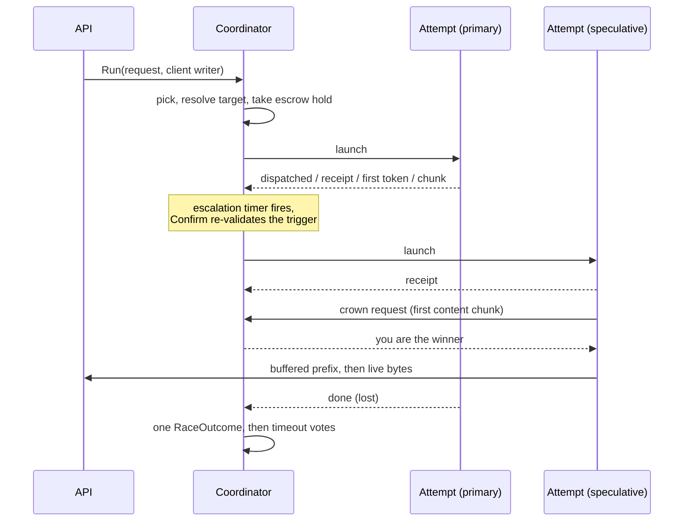

# Devshard gateway — the speculative race

One client request is a *race*: one to N attempts against distinct participants, of which at most one is crowned and streamed to the client. Speculation exists because a devshard host can fail in ways that a timeout alone does not catch — it can answer instantly with nothing, receipt and then never produce a token, or simply be much slower than a peer. Racing turns those into a latency cost rather than a failed request.

This document covers `engine/`. Where a nonce comes from is in [gateway-routing-and-nonces.md](./gateway-routing-and-nonces.md); the invariants the engine must not break are in [gateway-invariants.md](./gateway-invariants.md).

## Anatomy

Each attempt runs in its own goroutine and communicates with the coordinator only by events. The coordinator owns the race state and is the only thing that decides anything.

## Crowning

**A winner is crowned by its first chunk of actual content** — not by a receipt, not by the first token, and not by HTTP 200 (`engine/classify.go:28-30`, `engine/race.go`).

That precise choice is the answer to a specific failure. A host that responds instantly with an empty stream would win on any earlier signal, and the client would get nothing while a slower, honest host was cancelled. Requiring content means the empty host loses to whoever produces tokens.

The mechanics are a handshake, not a flag. An attempt's writer buffers everything it receives while it has produced no content; on the first chunk that carries content it sends a crown request and **blocks** on the reply (`engine/stream.go:54-104`). So no byte reaches the client before the coordinator has settled on a single winner. The coordinator's answer is you are the winner or you are suppressed, and a suspicious host's claim is **held** until it can be answered honestly. A suppressed attempt's writer then discards its buffered prefix and clears its client field entirely — a loser has no reachable sink at all, rather than a sink behind a branch someone must remember to write. Suppression is permanent, which is why the claim is held rather than refused early: an attempt refused a crown can never be given one, so refusing it while a rival might still fail would throw away an answer the race has already paid for.

A suppressed attempt keeps reporting successful writes to its host, so the host keeps streaming to its own receipt. Its bytes go nowhere.

The buffered prefix matters for correctness of the visible stream: role announcements and comment chunks that arrive before the first content are flushed to the client in order, ahead of the chunk that won. Past the 32 MiB carry cap the prefix is dropped, never the attempt — a capped attempt still wins, and its client stream simply starts at the chunk that crowned it (`engine/stream.go:121-133`).

### An SSE error event counts as a chunk but never crowns

An error event increments the attempt's chunk count — so the stream is *not* empty — while carrying no content, so it cannot crown (`engine/attempt.go:204-206`, `engine/classify.go:28-30`). That combination is what distinguishes "the host said something went wrong" from "the host said nothing", and the two are charged differently.

A **capability refusal** is a third case and is kept out of the error class entirely (`engine/reassembly.go:32-46`): another host can still serve the request, so it must neither count as a chunk nor end the race, while its message still reaches the performance recorder. On a refusal the engine records the host's capability limit and *grows the request's context hint*, so the next pick skips every host already known to be too small (`engine/capability.go:54-55`).

### Crown denial

A host that repeatedly answers with no content keeps receiving attempts but stops being crownable. Three content-free answers cost the crown; one content-bearing answer buys it back immediately (`engine/engine.go`). While denied, the host is treated as suspicious: a race that starts with it launches a speculative attempt immediately, and its claim on the client stream is held for as long as **any rival could still serve**. A rival is one already running that has not claimed, one whose pick is in flight, and one the race has committed to starting but not yet picked for — the replacement a suspicious primary earns is a rival from the moment the race decides to fetch it, not from the moment it launches. When none is left the held claim is crowned, because then its answer is the one the race committed a nonce for and refusing it would hand the client an error for a response that exists (`engine/race.go`).

The operator's manual suspicious-host pins fold into the same gate, so a pinned host escalates and is held back however well it has been answering.

An empty stream that burned completion tokens on a thinking-budget route is *not* a content-free answer: it is a model outcome, and the host is innocent. The check that separates them reads the host-reported usage — and it is allowed only on a thinking-budget route, because anywhere else any host could fake a usage object to escape the empty-stream penalty (`engine/classify.go:32-34`).

## Classification and reassembly

The classifier reads an attempt's SSE stream incrementally and yields, per chunk, whether it carried content, an error, a capability refusal, and how many tokens the host claims to have burned.

TCP does not deliver event-aligned chunks, so a carry buffer reassembles events split across reads and classifies each exactly once, when its final line arrives (`engine/reassembly.go:3-4`). The unterminated final event is classified on flush, before emptiness is decided, so a host is not charged for an empty answer it did not give.

Reassembly is charged against three budgets — per attempt (1 MiB), per participant (10 MiB) and process-wide (100 MiB). The participant level is the one that matters: it stops a single host that never terminates an event from draining the shared pool and starving every other host of classification (`engine/carry.go:11-13`). A cap trip releases the fragment and classifies the raw chunk instead, so classification *degrades* rather than stopping, and the first trip is reported once as a metric. A trip on the global budget undoes the participant charge, because a charge left behind on a trip is quota nobody can return.

## Escalation

The escalation policy is deliberately **pure**: a function of its arguments and the configured thresholds, with no chain snapshot and no clock of its own. It reads no host performance data either — the race reads the outlier detector and hands `Decide` a boolean, so what the policy does with that fact is still testable without a tracker (`engine/escalation.go`).

Stages that can trigger another attempt. The reason column is the wire string, which is what `devshard_gateway_escalation_decisions_total{reason}` carries:

| Reason | When |
|---|---|
| `suspicious_host` | The first attempt's host is crown-denied or operator-pinned — escalate immediately. |
| `receipt_timeout` | No receipt within the receipt timeout (doubled above 100 000 input tokens, because admitting a very large prompt is itself work). |
| `first_token_timeout` | No first token within the first-token deadline. |
| `attempt_failed` | An attempt ended without producing anything usable. |

An attempt launched at race start beside a primary the race distrusts carries a start reason rather than an escalation reason on `devshard_gateway_attempts_started_total{reason}`, and the two vocabularies do not overlap: `primary_suspicious` for a crown-denied or operator-pinned host, `primary_degraded` for one the outlier detector wanted out of rotation. The second exists because the routing gate that withholds an ejected host is capped, and a fleet failing together stays routable by design — see [gateway-capacity-and-health.md](./gateway-capacity-and-health.md).

The first-token deadline is a fixed quadratic in prompt size, `1.7 + 3e-5·T + 5e-10·T²` seconds, with a configurable floor (`engine/escalation.go:189-195`). Note that at the default floor of one second the floor is inert: the quadratic's minimum is 1.7 s, so the floor binds only if raised.

**Arming is not permission.** `NextEscalation` yields an `ArmedEscalation`, which is a deadline and nothing more. The only producer of an actionable escalation is `Confirm`, which re-derives the trigger *at fire time* and rejects a trigger that has vanished, a stage that has advanced, or a timer that fired early (`engine/escalation.go:93-95, 145-154`). This exists because an attempt's stage moves while its timer runs — a receipt landing just under the receipt timeout is the common case — and escalating on the armed stage would start a needless extra attempt on *every* healthy request. Confirming re-reads state, so the type system does the enforcing: forgetting to confirm yields a value that cannot be acted on.

The trigger is consumed *before* the new attempt starts, so a failed start cannot retry the same trigger (`engine/race.go`).

The escalation pick runs on its own goroutine rather than inline in the coordinator loop (`engine/race.go`). The scheduler may hold the nonce briefly for a co-arriving request, and a crown claim is the client's first token: waiting for the pick inside the loop would spend that hold on exactly the latency escalation exists to avoid. A departing client cancels the pick, which returns the nonce and the slot.

**Scarcity overrides speculation.** When the chain is blocking requests and the relaxed bypass is not active, the attempt budget collapses to one: a speculative attempt spends a nonce the phase the gateway is serving through will not replace (`engine/escalation.go:114-115`).

## Deadlines

One re-armed timer carries every deadline. `nextDeadline` takes the earliest of three families, and the declaration order of the trigger constants breaks *exact* ties only (`engine/race.go:98-152`):

1. **Hard timeout** — the minimum of: the drain deadline once the client has left; 30 minutes of total wait and 20 minutes without content for a non-streaming race; the loser grace after a crowned attempt finishes; and 20 minutes per live attempt.
2. **Escalation** — the next armed trigger, suppressed once the race is crowned, detached, or at its attempt budget.
3. **Stall** — the earliest `last chunk + inter-chunk stall` over attempts that have produced content and gone quiet.

The tie-break order is itself the policy: a race that must stop gains nothing from spending a nonce, and a stall flag is telemetry either way.

**Every select arm that reads race state drains the event queue first.** A buffered event and a fired timer are equally ready, and Go chooses among ready cases at random — so acting on a deadline that a queued event has already invalidated is a live possibility, not a theoretical one. It costs a spent nonce, a mislabelled healthy host, or a completed winner reported as cancelled. `catchUp` runs at the top of the timer and departure paths (`engine/race.go:431-452`). This class of bug appeared three times in this package, once as a test that passed only because it depended on the defect.

## Client departure and the drain

A client disconnect does not kill the race. The receipt, the response the session applies to its own state, and the vote that settles a committed nonce all have to complete after the client is gone.

The race context is `context.WithoutCancel` of the client's context: cancellation is dropped, values are kept (`engine/drain.go:20-36`). Writes to a departed client are reported as successful rather than failing, because a write error would end the attempt carrying them and the host that earned the crown still owes its receipt (`engine/drain.go:59-73`).

From departure onward the drain deadline is what bounds the race — forty minutes by default, and by construction longer than any deadline a race arms for itself, so the only host it ever ends is one that streams forever without tripping any other bound (`engine/drain.go:12-14`).

Once the winner has finished, the client's request handler is released and any still-pending losers are handed to a second `await` on a background goroutine. Nothing they can do changes what the client received (`engine/race.go:478-480`).

## The outcome

Everything the race learned is folded into one `RaceOutcome`, and one field decides everything downstream: `Terminal`.

There are twenty terminal values, and every downstream vocabulary — limiter verdict, performance sample, metric label — is a *total function* of it (`engine/outcome.go:14-16`). The HTTP-status recovery and the SSE inspection that decide the terminal therefore happen once, where the error and the bytes are, instead of being re-derived at each consumer.

One terminal is worth calling out: `Rejected` covers every upstream status that is neither throttling nor unavailability — 400s and 500s included — because those describe the request or the model, not the host's ability to serve, so they move nothing (`engine/outcome.go:28-29`).

### The three translations

| Consumer | Rule |
|---|---|
| Limiter verdict | Won/Lost → success; throttled/unavailable → overload; transport-class terminals → transport fault; empty stream, burn-empty, error stream and capability refusal → model outcome, which never moves a host's window. |
| Performance sample | One sample per attempt, unless the exemption ladder excuses it. The sample carries only participant, model and whether the host was responsive. |
| Metric labels | Bounded label vocabularies exported by the engine and referenced — not restated — by the metrics layer. |

"An empty stream is what the model produced, not what the host failed to carry, so the host's window must not contract for it" (`engine/outcome.go:131-132`). The host still answers for it, through crown denial rather than through the limiter.

### The exemption ladder

Whether an attempt contributes a performance sample at all is decided by one ordered ladder, applied in `Engine.record` and nowhere else (`engine/outcome.go:204-228`). The legacy gateway made this decision at six divergent call sites.

1. Never dispatched — the attempt exists only because of the gateway's own bookkeeping.
2. Ended by a proof-of-compute phase transition — blame the transition, not the host.
3. Error stream or capability refusal.
4. State-divergent.
5. Long response: content produced, nonce not finished, at least 280 seconds elapsed.
6. Empty stream while the proof-of-compute bypass is active.
7. Empty stream in a race nobody won.
8. Cancelled by the race itself — a sample would say the host was unresponsive when it was told to stop.

Two parallel ladders use the same facts for different questions: the *verdict* ladder decides whether the AIMD window moves, and the *timeout-skip* ladder decides whether a vote is posted. They deliberately disagree in one place — a race cancelling its own loser exempts it from the verdict but historically not from the sample, which is why rung 8 exists.

### Timeout votes

Every attempt whose nonce the host did not finish gets a vote posted, with one of four recorded skip reasons where it must not be (`engine/settle.go:61-109`): the attempt was aborted by a phase transition, the stream was empty and the nonce already finished, the nonce is already finished, or the response ran long after producing content.

A host whose escrow state diverged still gets its vote posted. Divergence is a routing fact — the scheduler blocks the host permanently — while an unposted vote leaves an orphaned start message that settlement can never resolve (`engine/settle.go:66-67`).

Posting runs on its own goroutine beside the race, because the protocol wait is measured in minutes. The engine's registration for that race is released only inside that goroutine, after the vote (`engine/engine.go:299-320`).

One external quirk is absorbed at the boundary: the shared session's timeout handler returns a **non-nil error on its success path**, which is why a posted vote is recognised by "unwrapped error plus a reported reason" rather than by `err == nil` (`engine/session.go:27-30`). There is a known collision — one genuine failure mode returns a structurally identical value — and it is named in a test rather than hidden. In the legacy gateway this quirk made the "completed" branch unreachable, so every posted vote was labelled failed.

## Stop

`Engine.Stop` is a barrier over admitted races, not over finished ones. A race is registered under the engine's mutex *before* it starts and released only after its vote goroutine finishes, so a `Stop` that overlaps a running race cannot observe the engine as idle (`engine/engine.go:152-214`). The wait is bounded by the deadlines a race arms for itself — twenty minutes, or forty for a drain — never by a host.

A panicking race still releases its registration and then re-panics with the same value, because recovering would answer the client with an outcome no race produced, and *not* releasing would hang shutdown forever (`engine/engine.go:135-143`).

## Tunables and backstops

Configurable (`config.Engine`, `config.Stream`):

| Knob | Default | Effect |
|---|---|---|
| `engine_receipt_timeout_ms` | 5 000 | Receipt deadline; doubled above 100 000 input tokens. |
| `engine_first_token_floor_ms` | 1 000 | Lower bound on the first-token curve. Inert at the default. |
| `engine_inter_chunk_stall_ms` | 30 000 | Silence after first content before an attempt is flagged stalled. |
| `engine_loser_grace_ms` | 600 000 | How long losers may keep streaming after the winner finishes. Must be at least the stall window, or losers merely between chunks are killed. |
| `engine_max_speculative_attempts` | 0 | 0 means bounded only by the host group. |
| `stream_drain_timeout_seconds` | 2 400 | Bound on a race after its client leaves. |
| `stream_classify_max_*_bytes` | 1 / 10 / 100 MiB | Reassembly budgets: attempt, participant, global. |

Not configurable, on purpose — these bound a request that every tunable already failed to bound (`engine/escalation.go:9`):

| Constant | Value |
|---|---|
| Streaming hard timeout | 20 minutes per live attempt |
| Non-streaming no-content timeout | 20 minutes |
| Non-streaming maximum attempt wait | 30 minutes |
| Receipt-doubling input-token threshold | 100 000 |
| Long-response exemption | 280 seconds |
| Crown-denial strikes | 3 |
| Event channel capacity | 32 |
| Crown prefix carry cap | 32 MiB |

One divergence follows from those numbers and is recorded rather than hidden: because the streaming hard timeout (20 minutes) always exceeds the long-response exemption (280 seconds), a stalled winner is always past the exemption — so `Stalled` can never itself move a limiter window or post a vote.
