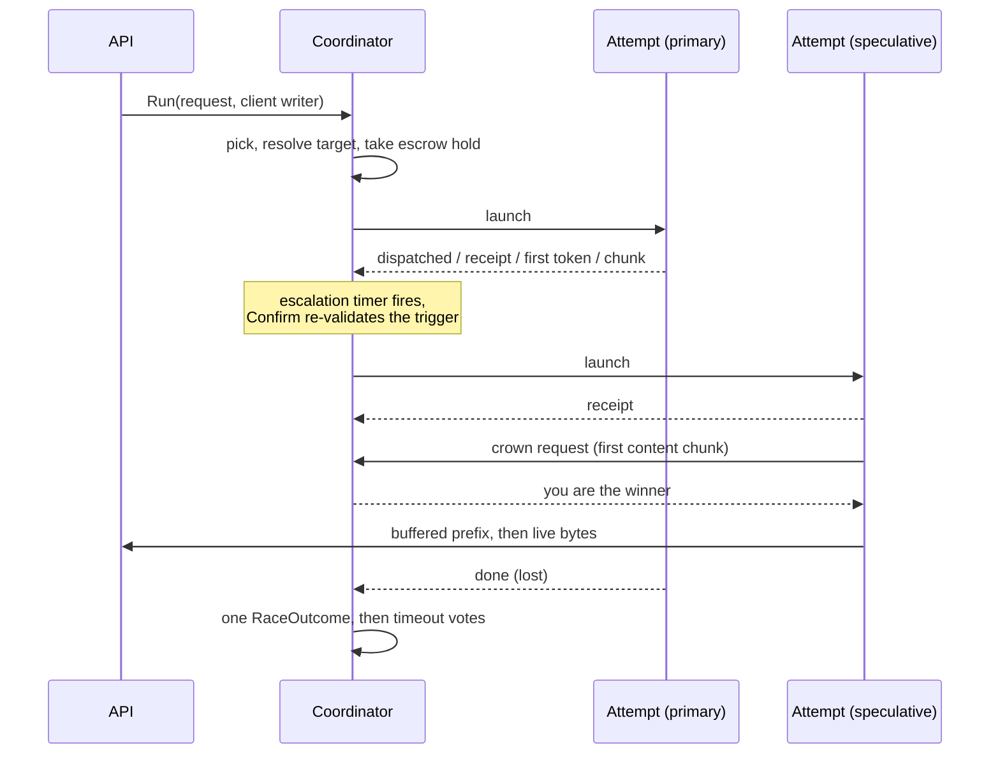

# Devshard gateway — the speculative race

One client request is a *race*: one to N attempts against distinct participants, of which at most one is crowned and streamed to the client. Speculation exists because a devshard host can fail in ways that a timeout alone does not catch — it can answer instantly with nothing, receipt and then never produce a token, or simply be much slower than a peer. Racing turns those into a latency cost rather than a failed request.

This document covers `engine/`. Where a nonce comes from is in [routing.md](./routing.md); the invariants the engine must not break are in [rules.md](./rules.md).

## Anatomy

Each attempt runs in its own goroutine and communicates with the coordinator only by events. The coordinator owns the race state and is the only thing that decides anything.

## Crowning

**A winner is crowned by its first chunk of actual content** — not by a receipt, not by the first token, and not by HTTP 200 (`engine/classify.go`, `chunkSignal.crownsWinner`; `engine/crown.go`, `raceCoordinator.answer`).

A host that responds instantly with an empty stream wins on any earlier signal, and the client gets nothing while a slower, honest host is cancelled. Requiring content means the empty host loses to whoever produces tokens.

The mechanics are a handshake, not a flag. An attempt's writer buffers everything it receives while it has produced no content; on the first chunk that carries content it sends a crown request and **blocks** on the reply (`engine/stream.go`, `winnerWriter.Write` and `winnerWriter.claim`). So no byte reaches the client before the coordinator has settled on a single winner. The coordinator's answer is you are the winner or you are suppressed, and a suspicious host's claim is **held** until it can be answered honestly. A suppressed attempt's writer then discards its buffered prefix and clears its client field entirely — a loser has no reachable sink at all, rather than a sink reachable behind a branch. Suppression is permanent, which is why the claim is held rather than refused early: an attempt refused a crown can never be given one, so refusing it while a rival might still fail would throw away an answer the race has already paid for.

A suppressed attempt keeps reporting successful writes to its host, so the host keeps streaming to its own receipt. Its bytes go nowhere.

The buffered prefix matters for correctness of the visible stream: role announcements and comment chunks that arrive before the first content are flushed to the client in order, ahead of the chunk that won. Past the 32 MiB carry cap the prefix is dropped, never the attempt — a capped attempt still wins, and its client stream simply starts at the chunk that crowned it (`engine/stream.go`, `winnerWriter.buffer`).

### An SSE error event counts as a chunk but never crowns

An error event increments the attempt's chunk count — so the stream is *not* empty — while carrying no content, so it cannot crown (`engine/attempt.go`, `attemptState.record`; `engine/classify.go`, `chunkSignal.crownsWinner`). That combination is what distinguishes "the host said something went wrong" from "the host said nothing", and the two are charged differently.

A **capability refusal** is a third case and is kept out of the error class entirely (`engine/reassembly.go`, `sseClassifier.facts`): it must neither count as a chunk nor end the race, while its message still reaches the performance recorder. After a tool or version refusal another host can still serve the request (`engine/capability.go`, `CapabilitySignal.Retriable`); a trusted host's context-length rejection ends the escalation instead (see [Escalation](#escalation)). On a refusal the engine records the host's capability limit (`engine/capability.go` → `perf/tracker.go`, `RecordContextLimit`). Nothing routes on it: the count is reported so an operator knows what to fix.

### Crown denial

A host that repeatedly answers with no content stops being crownable, and keeps receiving attempts until the breaker cuts it off for leaving nonces open. Three content-free answers cost the crown; one content-bearing answer buys it back immediately (`engine/engine.go`). While denied, the host is treated as suspicious: a race that starts with it launches a speculative attempt immediately, and its claim on the client stream is held for as long as **any rival could still serve**. A rival is one already running that has not claimed, one whose pick is in flight, and one the race has committed to starting but not yet picked for — the replacement a suspicious primary earns is a rival from the moment the race decides to fetch it, not from the moment it launches. When none is left the held claim is crowned, because then its answer is the one the race committed a nonce for and refusing it would hand the client an error for a response that exists (`engine/race.go`).

The operator's manual suspicious-host pins fold into the same gate, so a pinned host escalates and is held back however well it has been answering.

An empty stream that burned completion tokens on a thinking-budget route is *not* a content-free answer: it is a model outcome, and the host is innocent. The check that separates them reads the host-reported usage — and it is allowed only on a thinking-budget route, because anywhere else any host could fake a usage object to escape the empty-stream penalty (`engine/classify.go`, `thinkingBudgetRoute`).

## Classification and reassembly

The classifier reads an attempt's SSE stream incrementally and yields, per chunk, whether it carried content, an error, a capability refusal, and how many tokens the host claims to have burned.

TCP does not deliver event-aligned chunks, so a carry buffer reassembles events split across reads and classifies each exactly once, when its final line arrives (`engine/reassembly.go`, `sseClassifier`). The unterminated final event is classified on flush, before emptiness is decided, so a host is not charged for an empty answer it did not give.

Reassembly is charged against three budgets — per attempt (1 MiB), per participant (10 MiB) and process-wide (100 MiB). The participant level is the one that matters: it stops a single host that never terminates an event from draining the shared pool and starving every other host of classification (`engine/carry.go`, `carryBudget`). A cap trip releases the fragment and classifies the raw chunk instead, so classification *degrades* rather than stopping, and the first trip is reported once as a metric. A trip on the global budget undoes the participant charge, because a charge left behind on a trip is quota nobody can return.

A complete event is never charged. The transport writes an event and its terminator into the attempt in one write, and caps one event at `DefaultMaxSSEEventBytes`, which is `MaxJSONResponseBytes` (16 MiB), rather than at the attempt budget, because a host that does not stream writes its whole answer, forced logprobs included, as a single event ([`transport/client.go`](../../../transport/client.go), `writeSSELine` and `DefaultMaxSSEEventBytes`).

## Escalation

The escalation policy is **pure**: a function of its arguments and the configured thresholds, with no chain snapshot and no clock of its own. It reads no host performance data either — the race reads the outlier detector and hands `Decide` a boolean, so the policy's whole input is its argument list (`engine/escalation.go`).

Stages that can trigger another attempt. The reason column is the wire string an escalated attempt carries on `devshard_gateway_attempts_started_total{role="speculative",reason}` (`engine/escalation.go`, `EscalationStage.Reason`):

| Reason | When |
|---|---|
| `suspicious_host` | The first attempt's host is crown-denied or operator-pinned — escalate immediately. |
| `receipt_timeout` | No receipt within the receipt timeout (doubled above 100 000 input tokens, because admitting a very large prompt is itself work). |
| `first_token_timeout` | No first token within the first-token deadline. |
| `attempt_failed` | An attempt ended without producing anything usable, an empty stream that closed its nonce included. |

An attempt launched at race start beside a primary the race distrusts carries a start reason rather than an escalation reason on `devshard_gateway_attempts_started_total{reason}`, and the two vocabularies do not overlap: `primary_suspicious` for a crown-denied or operator-pinned host, `primary_degraded` for one the outlier detector wanted out of rotation. The second exists because the routing gate that withholds an ejected host is capped, and a fleet failing together stays routable by design — see [capacity.md](./capacity.md).

The first-token deadline is a fixed quadratic in prompt size, `1.7 + 3e-5·T + 5e-10·T²` seconds, with a floor from `engine_first_token_floor_ms` (`engine/escalation.go`, `EscalationPolicy.firstTokenTimeout`). At the default floor of six seconds the floor is what binds for ordinary traffic: the quadratic only overtakes it above roughly 67 000 input tokens.

**Arming is not permission.** `NextEscalation` yields an `ArmedEscalation`, which is a deadline and nothing more. The only producer of an actionable escalation is `Confirm`, which re-derives the trigger *at fire time* and rejects a trigger that has vanished, a stage that has advanced, or a timer that fired early (`engine/escalation.go`, `ArmedEscalation` and `EscalationPolicy.Confirm`). This exists because an attempt's stage moves while its timer runs — a receipt landing just under the receipt timeout is the common case — and escalating on the armed stage would start a needless extra attempt on *every* healthy request. Confirming re-reads state, so the type system enforces it: an unconfirmed `ArmedEscalation` carries a deadline and no permission, and cannot be acted on.

The trigger is consumed *before* the new attempt starts, so a failed start cannot retry the same trigger (`engine/race.go`).

The escalation pick runs on its own goroutine rather than inline in the coordinator loop (`engine/race.go`). The scheduler may hold the nonce briefly for a co-arriving request, and a crown claim is the client's first token: waiting for the pick inside the loop would spend that hold on exactly the latency escalation exists to avoid. A departing client cancels the pick, which returns the nonce and the slot.

**There is one ladder, because there is one reply shape.** The gateway asks every host to stream whatever the client asked for ([`filters/README.md`](../filters/README.md), "Streaming is forced upstream"), so every request has a first token to wait for and every attempt that ends without one is escalated on the spot. There is no buffered rung. A `response_timeout_retry` deadline scaled by an output-token rate configured at 50 against a measured 25 a second models half the real time, so its floor decides every fire, and a rung that never fires on its own terms reads as coverage it does not give. `engine_non_stream_response_floor_ms`, `engine_non_stream_response_ceiling_ms`, `engine_per_output_token_response_lag_ms`, the one-shot retry they gate and its exemption from the attempt budget do not exist.

**Scarcity overrides speculation.** When the chain is blocking requests and the relaxed bypass is not active, the attempt budget collapses to one: a speculative attempt spends a nonce the phase the gateway is serving through will not replace, and so would the replacement of a failed one, so none is started.

**A refusal that rules out a retry ends the escalation.** A capability refusal is retriable when it belongs to the answering host's build — a tool call or protocol version it lacks — so another host may still serve the request (`engine/capability.go`, `CapabilitySignal.Retriable`). A context-length rejection is not: the chain registers `--max-model-len` in a model's `ModelArgs`, and the broker drops a host's own `--max-model-len <value>` pair ([`decentralized-api/broker/broker.go`](../../../../decentralized-api/broker/broker.go), `Broker.MergeModelArgs`), so a prompt one host rejects as past the model's context length is one every host running the registered arguments rejects, and another attempt would only commit a nonce and leave its host a timeout vote. The race takes that as given: it does not check that the model registers the flag. A trusted host's rejection of the request itself rules out a retry too, because every host receives the same normalised body and the next host would repeat it (`engine/capability.go`, `rejectsRequest`). A rejection is an error event from an attempt that streamed no content, with a numeric `code` of 400 or a class that `HostApplicationError.HTTPStatus` maps to 400, which `filters.IsCacheableUpstreamError` accepts as an error about the request rather than the host ([`filters/README.md`](../filters/README.md), "Cacheability"). A message with no code and no class, a tool or version refusal, an answer that streamed content before its error, and a 404, 408, 422, 429 or 5xx still move on. A trusted host is one the race does not hold suspicious (see [Crown denial](#crown-denial)); the network does not verify a refusal or a rejection, so a suspicious host's refusal or rejection rules out nothing. Once a trusted host's refusal or rejection rules out a retry, the race arms no further escalation, gives up a pick still in flight, strands one that has already answered, and lets the attempts still running finish (`engine/capability.go`, `rulesOutRetry`; `engine/report.go`, `raceCoordinator.complete`). The client gets that host's error unless the crowned attempt carries its own (`engine/failure.go`, `RaceOutcome.hostError`).

## Deadlines

One re-armed timer carries every deadline. `nextDeadline` takes the earliest of five families — the hard timeout, the escalation, the missed deadline, the pick and the stall — and the declaration order of the trigger constants breaks *exact* ties only (`engine/race.go`, the `deadlineTrigger` constants; `engine/deadline.go`, `nextDeadline`):

1. **Hard timeout** — the minimum of: the drain deadline once the client has left; the loser grace after a crowned attempt finishes; and 20 minutes per live attempt.
2. **Escalation** — the next armed trigger, suppressed while a pick is already running, and once the race is crowned, detached, at its attempt budget — holding as many unfinished attempts as `engine_max_attempts_per_request` allows, or having started as many as its host group has — or once a trusted host's refusal or rejection of the request rules out a retry.
3. **Missed deadline** — the earliest receipt or first-token deadline a running attempt still owes: the deadline its escalation arms on, armed whether or not the race may still escalate, and judged once per attempt.
4. **Pick** — when an unanswered escalation pick stops being worth waiting for; zero while no pick is running.
5. **Stall** — the earliest `last chunk + inter-chunk stall` over attempts that have produced content and gone quiet.

The tie-break order is itself the policy: a race that must stop gains nothing from spending a nonce, an escalation shares its instant with the deadline it arms on and the rescue goes first, and a stall flag is telemetry either way.

**A missed deadline narrows the host, not the attempt.** When a running attempt passes its receipt or first-token deadline, the race narrows its host's congestion windows on the spot and leaves the attempt running (`engine/deadline.go`, `raceCoordinator.judgeMissedDeadlines`): its nonce is committed, and cancelling it after the receipt would leave an execution-kind timeout holding the escrow for half an hour instead of an answer. Both deadlines narrow by the severe factor, and they differ in what they blame: a receipt is owed before any prefill, so a missed one narrows both windows, while a missed first token is prefill's own failure and narrows the input window, the output one taking the cross factor ([capacity.md](./capacity.md), "The participant limiter: IOCW"). A window judged only when the attempt ends would keep admitting work to a host that takes minutes to start, for all of those minutes. The answer that eventually arrives earns no wider window (see the limiter row under [The three translations](#the-three-translations)). A deadline that passes during proof-of-compute generation is excused: that phase slows every host at once, and narrowing the whole fleet for it would turn the minutes after it into ghost burns. The attempt's finish line names each deadline its host was narrowed for, as `missed_receipt_deadline` and `missed_first_token_deadline`, and `devshard_gateway_participant_missed_deadlines_total{deadline}` counts them per host and model.

**Every select arm that reads race state drains the event queue first.** A buffered event and a fired timer can both be ready, and `select` picks at random, so an arm that reads state without draining acts on state a queued event has already invalidated. Three arms read state a queued event can change: the deadline timer, the pick's answer and the client's departure (`engine/deadline.go`, `engine/pick.go`, `engine/race.go`).

## Client departure and the drain

A client disconnect does not kill the race. The receipt, the response the session applies to its own state, and the vote that settles a committed nonce all have to complete after the client is gone.

The race context is `context.WithoutCancel` of the client's context: cancellation is dropped, values are kept (`engine/drain.go`, `drain` and `newDrain`). Writes to a departed client are reported as successful rather than failing, because a write error would end the attempt carrying them and the host that earned the crown still owes its receipt (`engine/drain.go`, `clientStream`).

The departure is read where a nonce is requested, not only where the select takes it: `begin` waits for the primary's pick under the client's context, so the scheduler gives up a pick still waiting when the client leaves, and `startPick` requests no speculative pick once the client has gone, even for an escalation that falls due as it leaves (`engine/race.go`, `raceCoordinator.begin`; `engine/pick.go`, `raceCoordinator.startPick`).

From departure onward the drain deadline is what bounds the race — forty minutes by default, and by construction longer than any deadline a race arms for itself, so the only host it ever ends is one that streams forever without tripping any other bound (`engine/drain.go`, `defaultDrainTimeout`).

Once the winner has finished, the client's request handler is released and any still-pending losers are handed to a second `await` on a background goroutine. Nothing they can do changes what the client received (`engine/race.go`, `runRace` and `raceCoordinator.release`).

## The outcome

Everything the race learned is folded into one `RaceOutcome`, and one field decides everything downstream: `Terminal`.

There are twenty-three terminal values, and every downstream vocabulary — limiter verdict, performance sample, metric label — is a *total function* of it (`engine/outcome.go`, `Terminal`). The HTTP-status recovery and the SSE inspection that decide the terminal therefore happen once, where the error and the bytes are, instead of being re-derived at each consumer.

`Rejected` is the one terminal whose scope is not obvious from its name: it covers every upstream 4xx that is neither throttling nor one of the named statuses, because those describe the request, not the host's ability to serve, so they move nothing (`engine/terminal.go`, `TerminalRejected`). A 5xx is the opposite case and gets its own terminal: the host answered but what it serves the request from did not, so `UpstreamServerError` narrows both windows by the hard factor on its own verdict, `UpstreamFault`. That verdict exists because the host demonstrably answered: unlike a throttle it must not clear the count of unanswered faults the breaker opens on, or a host alternating 5xx answers with connection resets would never be cut off.

The exception is a 5xx that names a fault in what the gateway sent. A host reports every diff it cannot apply as a 500 carrying the error's text — an escrow it cannot find, a nonce past the chain's cap, a balance, a payload hash — and none of those is the host's doing, so `transport.IsUpstreamRequestFault` keeps them a `Rejected` that blames nobody. The predicate matches on the shared error sentinels rather than a list of phrases, so the two sides cannot drift apart.

### The three translations

| Consumer | Rule |
|---|---|
| Limiter verdict | Won/Lost → success, or late success when its host missed the receipt or first-token deadline, which clears the cut-off's count without widening a window; throttled, unavailable and an attempt the streaming backstop cut → overload, soft on both windows; an upstream 5xx → upstream fault, hard on both windows and leaving the cut-off's count alone; a stall between chunks → decode stalled, severe on output and cross on input, and no business of the cut-off's; the remaining transport-class terminals → transport fault, which moves no window and counts towards the cut-off; an empty stream → empty answer, hard on both windows, or, when the stream left its nonce open, severe on both and counting towards the cut-off; a burn-empty the host held past the chain's refusal timeout → overload; a burn-empty inside it, an error stream, a capability refusal and a reply past the gateway's own buffer cap → model outcome, which never moves a host's window. The factors are in [capacity.md](./capacity.md), "The participant limiter: IOCW". |
| Performance sample | One sample per attempt, unless the exemption ladder excuses it. The sample carries participant, model, whether the host was responsive, and the two timings the escalation ladder reads back as quantiles. |
| Metric labels | Bounded label vocabularies exported by the engine and referenced — not restated — by the metrics layer. |

An empty stream narrows its host whether or not it closed the nonce: a client can render nothing from it, and another host given the same prompt usually can, so the race escalates on it at once and both windows narrow (`engine/escalation.go`, `EscalationPolicy.triggerFor`; `engine/judgement.go`, `RaceOutcome.Verdict`). A host that said nothing and also left the nonce open took the work and parked the reserve until the timeout vote, so it answers to the breaker as well as to crown denial. A burn-empty stays a model outcome and starts no other attempt: the thinking budget went on reasoning, and another host given the same prompt would spend it the same way.

### Counting what an attempt produced

`logprobs` is forced on for every host request (`filters/table.go`, the `StagePostLimits` rule) and stripped again from what the client is handed, so every streamed chunk carries one `logprobs.content` entry per token the host generated. The gateway counts them as the chunks arrive (`engine/classify.go`, `chunkScan.LogprobTokens`), which gives it a token count that does not depend on the host reporting one and that exists for an answer cut off half way.

`AttemptOutcome.OutputTokens` prefers the host's own `usage.completion_tokens` and falls back to that count. The host's number is authoritative where it exists — it is what the chain is handed and what the escrow pays against — but a fleet contains runtimes that ignore `include_usage`, and a stream the race cancelled never reaches its usage chunk at all. Either way the reply the client received is worth a number, and the count off the wire is the only one available.

The two can disagree, and where they do the gateway's request ledger says what the gateway saw while the nonce ledger says what the chain recorded ([accounting.md](./accounting.md), "What the chain record carries"). That disagreement is a fact about the host's runtime, not about the gateway.

### Reading an empty answer back

An attempt that ends `empty_stream` or `burn_empty` says the classifier found no content in the bytes that arrived, and that fact alone does not say which of two things happened: the host sent events carrying nothing, or it sent something the classifier could not read. An event whose `delta.content` is typed against the schema — an array of parts where the shape expects a string — fails every decode the classifier has, and is dropped whole, taking its `usage` block with it (`engine/classify.go`, `decodeEvent`). Both cases reach the log as the same two zeroes.

So the line carries both what the host said and what the gateway could not read, because one does not answer for the other.

**What the host said** is already decoded by the classifier, which parses every event once, and was simply not written down: the line now carries `finish_reason`, `usage_prompt_tokens` and `logprob_tokens` beside the `usage_tokens` it always had (`journal/render_race.go`, `appendEmptyAnswerFields`). Those four say whether the host thinks it produced anything at all, and a host reporting zero completion tokens has answered the question on its own.

**What the gateway could not read** is the raw head of two chunks, kept while no chunk has classified as content (`engine/chunk_head.go`, `attemptState.keepChunkHeads`):

- **the first**, because that is where a `delta` arrives and so where a decode the classifier lost would show;
- **the last**, because that is where the terminal event and its `usage` arrive.

Keeping only the last is not enough, and that is what this started as: the last contentless chunk is systematically the terminal usage event, which says nothing about a delta that never decoded. Where one chunk is both, it is offered once.

The stream's terminator is neither: the transport forwards `[DONE]` as a write of its own, so it is the last thing every well-formed stream delivers and would otherwise be the head of every empty answer alike. It is trimmed the way the chunk-gap measurement already trims it, and a write that was nothing else leaves the previous heads standing (`filters/sse.go`, `TrimSSEDone`).

**The head elides what the gateway asked for and strips again.** The gateway forces `logprobs` and `return_token_ids` on every request ([request.md](./request.md), "The rule table") and removes them from the reply, so a contentless chunk is mostly `prompt_token_ids`: a 49 000-token prompt returns its ids as some 225 kB of numbers, which is the whole chunk. Copying its first few hundred bytes would spend the budget on ids and never reach the delta beside them. So each of those values is replaced by a marker as the head is built, and the head resumes after it (`engine/chunk_head.go`, `elideBulkyValues`). A value the log can read — a `"logprobs":null` — is left as it is, because the marker would hide an answer rather than a bulk. Skipping a value costs one pass over it, which the classifier's own decode has already paid for.

Four bounds keep a head from becoming a copy of the answer: it stops at `maxEmptyChunkLogged` and is validated as UTF-8 before it is kept, it is only taken while no chunk has classified as content, and it is offered on the outcome only for the two terminals that mean the gateway read nothing (`engine/attempt_outcome.go`, `attemptState.emptyChunkHeads`). An answer that reached the client carries no head at all.

A head is host output, so it is untrusted text in a log line, and it is bounded rather than sanitised beyond its encoding: what a host sends is what a reader needs to see.

### The exemption ladder

Whether an attempt contributes a performance sample at all is decided by one ordered ladder, applied in `Engine.record` and nowhere else (`engine/judgement.go`, `RaceOutcome.sampleExemption`).

1. Never dispatched — the attempt exists only because of the gateway's own bookkeeping.
2. Never reported — the attempt returned no terminal at all, so there is nothing to judge it on.
3. Ended by a proof-of-compute phase transition — blame the transition, not the host.
4. Error stream or capability refusal.
5. State-divergent.
6. Long response after content — the host produced output, its nonce is still open, and the attempt has run past the exemption window, so the delay is a slow answer rather than an unresponsive host. An attempt the twenty-minute backstop cut does not take this rung; it is judged on its own terminal.
7. Empty stream while the proof-of-compute bypass is active.
8. A body the gateway refused to send — the host never saw the request, so nothing about it is the host's.
9. Empty stream in a race nobody won.
10. Cancelled by the race itself — a sample would say the host was unresponsive when it was told to stop.

Two parallel ladders use the same facts for different questions: the *verdict* ladder decides whether a congestion window moves, and the *timeout-skip* ladder decides whether a vote is posted. The sample ladder disagrees with the verdict ladder in exactly one place. A loser the race cancelled needs no verdict rung, because no terminal maps `client_cancelled` to a verdict at all; it does need a sample rung, because a recorded sample would report the host as unresponsive when the race is what told it to stop. That is rung 10.

Rung 8 is the same shape for a different cause. A host-bound body carries the escrow's catch-up diffs beside the prompt, and past what a host accepts the session refuses to send it — `transport.ErrHostRequestTooLarge`, raised after the nonce is already committed. Left unclassified it reached `TerminalDialFailure`: a negative perf sample, a push on the host's cut-off breaker, a `transport_error` in the ledger against the host's failure rate, and a 502 inviting a retry that would fail identically. The host saw none of it. `TerminalRequestTooLarge` names it, its verdict is a model outcome so no congestion window moves, the ledger excuses it the way it excuses a cancelled client, and the escalation still runs — the backlog belongs to this escrow, so another host is worth trying. The boundary keeps a reserve so that most of these are refused with a 413 before a nonce exists at all ([request.md](./request.md)).

### Timeout votes

Every attempt whose nonce the host did not finish gets a vote posted, with one of four recorded skip reasons where it must not be (`engine/settle.go`, `RaceOutcome.timeoutSkipReason` and `RaceOutcome.TimeoutPlan`): the attempt was aborted by a phase transition, the stream was empty and the nonce already finished, the nonce is already finished, or the response ran long after producing content.

A host whose escrow state diverged still gets its vote posted. Divergence is a routing fact — the scheduler blocks the host permanently — while an unposted vote leaves an orphaned start message that settlement can never resolve (`engine/settle.go`, `RaceOutcome.timeoutSkipReason`).

A vote that fails is written down as a warning naming the request, the nonce, the host and the reason, because a vote is the only thing that undoes a charge; the one exception is an escrow gone from the chain, which fails every vote it owed at once and has its own line already. Posting is handed to the queue below rather than run beside the race, because the protocol wait is measured in minutes and a goroutine per wait is what a fleet-wide outage multiplies. The engine's registration for that race is released only inside that goroutine, after the vote (`engine/engine.go`, `Engine.settle`). The started event is reported before the post and the result after it (`engine/settle.go`, `SettleTimeouts`): each report reaches the metrics synchronously on the settle goroutine, while its ledger fact and any line are only queued, for the journal's consumer to deliver (`observers.go`, `nonceAccountedRaces.RecordTimeout`).

A vote carries each verifier only the diffs its own cursor is missing, not the escrow's whole append-only log (`user/session.go`, `catchUpDiffsForVerifier`). A voter has to be caught up to the record it is judging and no further, and the cursor already says where it is, having been advanced only by what a host itself acknowledged. A verifier that turns out to be behind fails its vote, and that failure rewinds its cursor through `forgetHostState`, so the next round carries the whole chain again.

One external quirk is absorbed at the boundary: the shared session's timeout handler returns a **non-nil error on its success path**, so a posted vote is recognised by the handler's own `Applied` flag rather than by `err == nil` (`engine/session.go`, `SessionTimeouts.SettleTimeout`). The one failure that would otherwise be structurally indistinguishable from a posted vote — a diff the group carried without the timeout — is marked at its source with `user.ErrTimeoutNotApplied`, so a caller reading the error alone does not count it as one (`user/timeout_effect.go`, `timeoutSettledError`).

### The timeout-vote queue

This queue is over the chain votes a race owes for the nonces its hosts left unfinished, and over nothing else: it does not bound how many escrows may settle at once, which is a different transaction with no cap of its own beyond one settlement per escrow id (`escrow/dedup.go`, `inFlightSet`).

A vote outlives its race. The protocol will not accept it before the record's own deadline -- half an hour after a host confirmed the work, a minute after a nonce was sent nobody acknowledged -- so what a settle mostly does is wait. Waiting on a goroutine each is what does not scale: a fleet that stops answering turns every admitted request into one, and the debt grows with the request rate while the limiter keeps admitting, because a host that accepts a connection and never answers reports a missed receipt, which narrows both windows to their floor but never trips the cut-off.

So the waiting is put where it costs nothing and the posting is bounded (`engine/settle_queue.go`):

- **A vote waits on a runtime timer, not on a goroutine.** `time.AfterFunc` holds it until its own deadline and only then spends a goroutine. Deadline ordering comes free with that -- the runtime already keeps its timers in order -- and a vote due in a minute is never behind one due in an hour. `TimeoutPoster.VoteDeadline` is what makes it possible: the deadline is read *before* the wait instead of inside `HandleTimeout`, which is where the sleep used to be hidden.
- **`engine_max_concurrent_timeout_votes` bounds the posting**, which is the part that reaches hosts. A vote whose deadline has passed takes a place if one is free, and otherwise queues for the next place a finishing vote gives back. **Nothing is ever dropped**, because only the vote undoes the charge.
- **A late vote is still accepted**, which is the rule the whole design rests on. The protocol refuses a vote that is too *early* (`user/session.go`, `refusalDeadlineUnreachable`) and never one that is late; `MsgTimeoutInference` carries no timestamp at all, and `applyTimeout` judges the record's status and nothing else; and a record still pending or started cannot seal out from under a vote (`state/seal.go`, `sealEligibleStatus`). That rule lives in packages this gateway does not own, so it is pinned by a test in each of them -- `state/late_timeout_vote_test.go` and `user/timeout_vote_catchup_test.go` -- which fail if a lateness check is ever added.

What the shard holds while a vote waits is unchanged and inherent: the race's escrow, so the session is still open to vote through, and its place in the `Stop` barrier, so a shutdown drains the votes it owes rather than abandoning them. `devshard_gateway_owed_timeout_votes` is what the shard owes right now, waiting on a timer and posting alike, and is the series to watch against the limit.

A deadline can move after the vote was taken: a nonce the host confirms late stops being refusable and becomes an execution timeout due an escrow's whole execution window away. So the timer asks the deadline again before taking a place, and arms itself for the new one instead (`settleQueue.fire`). Posting it there and then would be correct -- the shared session sleeps out whatever is left -- but it would sleep it out *inside a place*, holding one for the whole window.

One cost stays with this design. A poster stuck in vote collection holds its place, so a few unreachable verifiers can idle the limit, which is why the limit's default is far above what a healthy shard uses.

### The vote nobody retried

The vote above is attempted **once**, at the end of the race that owned the nonce. A round that finds no verifiers, or a restart that outlives the round, leaves the nonce started, unvoted and still settleable — and `settleLiveRecordLocked` settles a started record at the **full reserved cost** in the executor's favour, without incrementing its `Missed` (`state/machine.go`).

The sweep is what claims it back. Every escrow tick scans its own live records for ones started, stamped and past their execution deadline by a grace, and re-votes them through the same `HandleTimeout` (`state/started_deadline.go`, `user/timeout_sweep.go`, `registry/timeout_sweep.go`). Three properties keep it off the hot path:

- **the scan is bounded by live records, not by traffic** — one pass under the read lock, no allocation when nothing is due (1.4 ms at 100 000 live records, 12 µs at 1 000);
- **the votes are bounded by one budget per tick across every escrow** (8 by default, so at most 32 a minute), and the walk rotates its starting escrow, so the RPC it adds never follows the request rate and no escrow starves;
- **the grace keeps it off a nonce whose own race is still due to wake and vote**, which is the ordinary case.

A nonce the verifiers decline stays started, and the next sweep finds it again; nothing is retried faster than the budget allows.

## Stop

`Engine.Stop` is a barrier over admitted races, not over finished ones. A race is registered under the engine's mutex *before* it starts and released only after its vote goroutine finishes, so a `Stop` that overlaps a running race cannot observe the engine as idle (`engine/engine.go`, `Engine.Stop`, `Engine.admit` and `raceRegistration.release`). The wait is bounded by the deadlines a race arms for itself — twenty minutes, or forty for a drain — never by a host.

A panicking race still releases its registration and then re-panics with the same value, because recovering would answer the client with an outcome no race produced, and *not* releasing would hang shutdown forever (`engine/engine.go`, the deferred recover in `Engine.Run`).

## Tunables and backstops

Carried in the configuration snapshot (`config.Engine`, `config.Stream`) and bounded by `Config.Validate`, at start-up and on every admin write. The five timings below, and the vote limit under them, take a `GATEWAY_ENGINE_*` variable and an admin override -- the limit because an operator has to be able to widen it while a shard is behind on votes. A race reads the snapshot when it is admitted (`engine/engine.go`, `Engine.Run`), so a swap reaches the next race and never re-times one already running, and the queue reads the limit as each vote is handed to it. The four values under them take neither, and `engine_max_attempts_per_request` is deliberately one of those: it multiplies nonces per request rather than moving a deadline. All four are named here by the spelling `Config.Validate` reports them under and are bounded there, but nothing reads a variable or an override for any of them, so changing one is a build.

| Field | Default | Effect |
|---|---|---|
| `engine_receipt_timeout_ms` | 5 000 | Receipt deadline; doubled above 100 000 input tokens. A host that misses it has both congestion windows narrowed by the severe factor. |
| `engine_first_token_floor_ms` | 6 000 | Lower bound on the first-token curve. Binds below roughly 67 000 input tokens. A host that misses the first-token deadline has its input window narrowed by the severe factor and its output window by the cross factor. |
| `engine_first_token_ceiling_ms` | 30 000 | Upper bound, whatever the host's own p75 asks for. |
| `engine_inter_chunk_stall_ms` | 30 000 | Silence after first content before an attempt is flagged stalled. |
| `engine_loser_grace_ms` | 600 000 | How long losers may keep streaming after the winner finishes. Must be at least the stall window, or losers merely between chunks are killed. |
| `engine_max_concurrent_timeout_votes` | 2 048 | Timeout votes for unfinished nonces **being posted** at once; nothing to do with settling an escrow. One past it waits for a poster and is never dropped; the votes still waiting out their deadlines cost no goroutine. 0 posts every due vote at once. |
| `engine_max_attempts_per_request` | 2 | Unfinished attempts one race may hold at once; an attempt that ends gives its place back, and no race starts more attempts than its host group has. 0 means bounded only by the host group. |
| `drain_timeout_seconds` | 2 400 | Bound on a race after its client leaves. |
| `classify_max_attempt_bytes`, `classify_max_participant_bytes`, `classify_max_global_bytes` | 1 / 10 / 100 MiB | Reassembly budgets: attempt, participant, global. |

Go constants rather than configuration — these bound a request that every value above already failed to bound (`engine/escalation.go`, `engine/outcome.go`, `engine/engine.go`, `engine/race.go` and `filters/stream.go`):

| Constant | Value |
|---|---|
| Streaming hard timeout | 20 minutes per live attempt |
| Scheduler pick timeout | 2 minutes waiting for a host to be assigned |
| Receipt-doubling input-token threshold | 100 000 |
| Long-response exemption | 280 seconds |
| Crown-denial strikes | 3 |
| Event channel capacity | 32 |
| Crown prefix carry cap | 32 MiB |

The long-response exemption is what those numbers interact with. An attempt that produced content, left its nonce open and ran past 280 seconds is judged by neither ladder — no performance sample and no limiter verdict — because at that point the delay is a slow answer rather than an unresponsive host (`engine/judgement.go`, `RaceOutcome.longResponseExempt` and `exemptOnBothLadders`). The loser grace is longer than the exemption, so a loser cancelled after it went quiet has usually run past it.

An attempt the backstop cuts is excluded from the exemption by name: an attempt still running twenty minutes after its dispatch is a host carrying more than it can, so it reports the same overload a `429` does. A stall the exemption does not cover — one whose nonce the protocol has already finished, or one that ends inside the 280 seconds — reports `DecodeStalled`: severe on the output window, the cross factor on the input one, and nothing at all to the cut-off.
