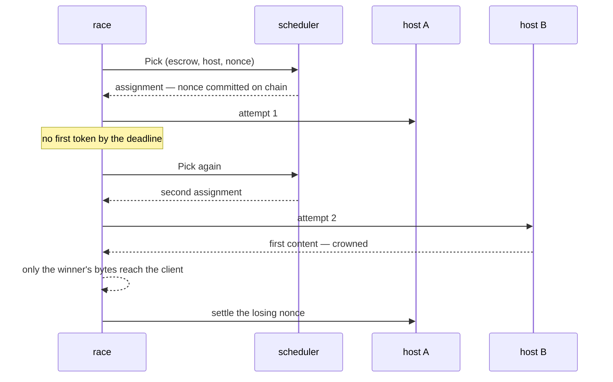

# The request path

One `POST /v1/chat/completions`, from the socket to the settled nonce. Every step names the file and function that does it.

## Order of operations

`api/routes.go`, `handleChat` → `chat` → `race`.

| # | Step | Where | Fails with |
| --- | --- | --- | --- |
| 1 | read the body, capped at 10 MiB | `readBody`, `chatIngestLimit` = `filters.MaxBodyBytes` | 413 |
| 2 | normalise the request | `filters.NormalizeRequest`, options from `filterOptions` | 400 |
| 3 | authorise the model for this caller | `authorizeModel` | 401 / 403 |
| 4 | is the model routable at all | `routableModel` | 503 |
| 5 | does the chain phase admit new work | `admission`, on `snapshots.Snapshot()` | 503 |
| 6 | cache lookup | `cacheKeyFor` → `cache.get` | — (hit returns here) |
| 7 | take an admission slot and token budget | `limiter.AcquireForModel` | 429 |
| 8 | race it | `race` → `engine.Run` | see below |
| 9 | release the slot | `defer limiter.ReleaseForModel` | — |

Steps 3–5 run **after** normalisation because the model name is only known once the body is parsed and the per-model profile applied.

## Step 2 in detail: `filters.NormalizeRequest`

`filters/pipeline.go`, `runPipeline`, in this order:

1. `unwrapExtraBody` — hoist `extra_body` into the top level.
2. `rejectUnknownParameters` — a parameter absent from the table is refused. The gateway does not forward what it has not been taught.
3. `applyStage(StagePreValidation)` — type and range checks, strips.
4. `normalizeMessages` → `validateMessages` — message hygiene, separate because a message is a nested document.
5. `decodeRequestView` — the typed view of what the client asked for.
6. `applyOutputTokenLimits` — default and cap, per model.
7. `decodeLogprobIntent` — **read here, before the next stage**, because `StagePostLimits` forces logprobs on and afterwards the document says what the gateway wants, not what the client asked.
8. `applyStage(StagePostLimits)` — the forcing stage: `logprobs`, `top_logprobs`, `return_token_ids`, `n → 1`.
9. `forceUpstreamStreaming` — unless `force_upstream_streaming` is off.
10. `document.Marshal` → `Result`.

`Result` carries the normalised body plus what the **client** asked for: `ClientStream`, `ClientUsage`, `Logprobs`, `MaxTokens`. The body and the intent diverge deliberately — that divergence is the whole response side.

### The rule table

`filters/table.go` is one row per top-level parameter: name, stage, rule. Per-model divergences live in `filters/profile_*.go` next to the rule they change.

| Forced regardless of the client | Why |
| --- | --- |
| `logprobs: true`, `top_logprobs: 5` | validators re-execute and compare distributions |
| `return_token_ids: true` | the same comparison needs token ids |
| `n: 1` when present | reservation budgets one `max_tokens` output; `n` choices can produce `n` times what was signed for |
| `stream: true` | the gateway needs the stream to time the first token and spot a stall |

The executor forces the first three itself (`common/completionapi.ModifyRequestBodyWithLogprobsMode`), so the gateway's copies are belt and braces on the committed payload rather than the only guard.

## Step 8 in detail: the race

`api/routes.go`, `race` → `engine.Run` (`engine/engine.go`).

The escalation ladder (`engine/escalation.go`) measures each stage against the host's own history, not a fixed timeout: receipt, first token, inter-chunk silence. `MaxSpeculativeAttempts` bounds the **total** attempts including the primary.

## The response side

Two shapes, decided by what the client asked for, not by what the host sends — the host always streams.

**Streaming client** — `filters.StreamRewriter` (`filters/stream.go`): each event is parsed, stripped, and forwarded as it arrives. A partial event is held in a carry bounded by `MaxStreamCarryBytes` (32 MiB).

**Non-streaming client** — `filters.BodyFolder` (`filters/fold.go`): events are folded into the answer **as they arrive**, and the internal fields are removed *before* merging. What the request holds is the answer being assembled, not the stream it came from. `api/stream.go`'s `Close` then chooses the status from the assembled body — a body the assembler could not fold is answered 502, never 200 with an error object inside.

### What a client can and cannot see

`filters/response.go`:

| Field | Returned? |
| --- | --- |
| `logprob`, `logprobs`, `top_logprobs` | only if the client asked (`logprobs: true`) |
| `token_ids`, `prompt_token_ids`, `prompt_logprobs` | never |

The "always stripped" list is **derived** from the two above, not written out a second time — a hand-written second list is exactly how `top_logprobs` once leaked.

## Memory

| Bound | Value | What it bounds |
| --- | --- | --- |
| `chatIngestLimit` | 10 MiB | one request body |
| `MaxStreamCarryBytes` | 32 MiB | one unterminated SSE event |
| `maxBufferedResponseBytes` | 32 MiB | one reply being assembled |
| `max_buffered_response_bytes` | 512 MiB | **every** reply being assembled, at once |

The last one exists because the request limiter does not stand in for it: with `max_concurrent_requests` unset the cap comes from network weight and admits thousands at a time. Past it, a request is refused 503; `devshard_gateway_buffered_response_bytes` is what is held right now.

## Where to change what

| To change | Go to |
| --- | --- |
| a parameter's validation or default | `filters/table.go`, and `filters/rules_*.go` for the rule body |
| how one model differs | `filters/profile_<model>.go` |
| what a client may see back | `filters/response.go`, `clientStrippedFields` / `requestableFields` |
| the status a failure gets | `api/errors.go`, `statusForError` |
| when a second attempt starts | `engine/escalation.go` |
| which escrow is picked | `scheduler/scheduler.go` |
| what a cache entry keys on | `api/cache.go`, `cacheKeyFor` |
