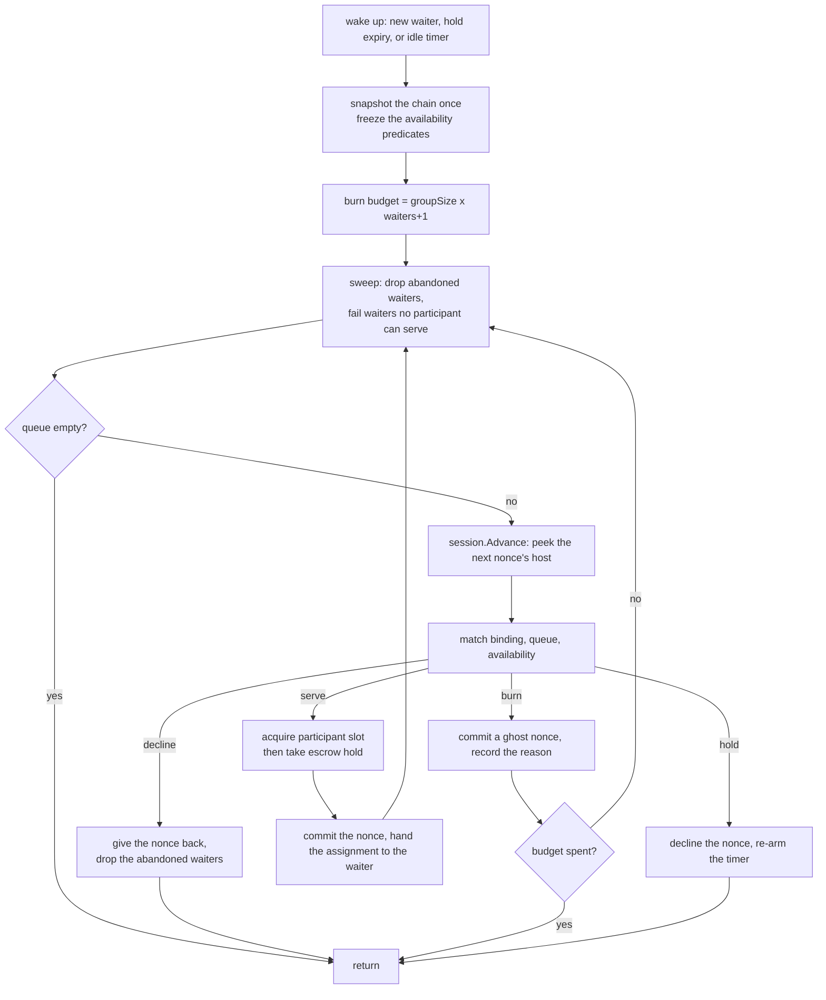

# Devshard gateway — routing and nonces

Choosing where a request goes is not a free decision in this system. The protocol binds an executor to a nonce (`executor = nonce % groupSize`), and `user.Session` issues nonces strictly in order. So "pick host X" is not something the gateway can say: it can only advance the nonce sequence, and every nonce it advances past is spent whether or not anyone serves it. Nonces are a capped, chain-costed resource. That is the fact the whole scheduler is shaped around.

This document covers `scheduler/` (which escrow, which participant, which nonce) and `registry/` (what the live escrow set is and who may hold a handle on it). The race that follows a pick is in [race.md](./race.md).

## Vocabulary

- **Escrow** — a funded on-chain account with a fixed participant group, serving one model. The gateway usually holds many.
- **Participant key** — the identity a host is known by. A validator may hold several *slots* in a group; all of its slots share one participant key. Every filter in the scheduler is keyed by participant, never by slot, so a request that excluded a host cannot be re-served through a sibling slot of the same validator (`match.go`, `match`).
- **Group size** — the number of slots in an escrow's group. `nonce % groupSize` is the slot index, which is why advancing the nonce is how a host is chosen.
- **Executor receipt** — the executor's signature over a committed inference, delivered as its own SSE event ahead of any output. It is the only thing that moves a record from `StatusPending` to `StatusStarted`, and it reaches the chain as `MsgConfirmStart` on the next composed diff. It is therefore queued when the event lands rather than when the request ends, because neither a held stream nor an abandoned one leaves a diff to carry it later (`user/session.go`, `Session.confirmStartOnReceipt`).
- **Ghost burn** — a nonce that was committed locally with a floor-sized placeholder inference and never sent anywhere, because no host bound to it could serve any waiting request. It is spent money with a recorded reason.

## Picking an escrow

`Pick` is called once per request and once per escalation attempt inside a race. An escalation passes the escrow it is already pinned to; only a fresh request goes through escrow selection (`request_pick.go`, `Scheduler.Pick`).

**A pin skips the score, not the gates** (`escrow_pick.go`, the pin branch of `pickEscrow`). A request that names an escrow — an escalation, or a client calling `/devshard/{id}/v1/chat/completions` — is matched against the candidate list by id and returned without a weight lookup, a load score or a tie-break, and without the allowlist reachability walk that filters the unpinned candidate set. It is still checked against the same exhaustion gates below, and a pinned escrow those gates catch still fires the exhaustion callback that schedules a replacement, exactly as an unpinned one does. That is deliberate: a pinned escrow id is untrusted client input on `/devshard/{id}/v1/chat/completions`, and the nonce ceiling is what reserves room for the finalize and settlement, so skipping it here would be the one route by which a client could push an escrow past the point the chain will settle it. A pin that names an escrow the gateway no longer routes to is refused with `ErrEscrowGone`.

Selection (`escrow_pick.go`, `pickEscrow`) runs over `registry.Candidates(model)`, which is already filtered to escrows whose session phase accepts new inferences, and against a single chain snapshot taken once for the call.

**The nonce ceiling comes first.** An escrow whose latest nonce has reached the cutoff is dropped from the candidate set. The cutoff is the hosts' cap, `types.MaxActiveNonce(maxNonce, groupSize)` where `maxNonce` is the governance parameter read from the chain, less an in-flight margin of 200, or half the hosts' cap where that is smaller (`escrow_pick.go`, `nonceInFlightMargin`). A pick is not a nonce: requests that passed the gate a moment earlier still spend nonces after it, and so do the validation and timeout diffs their races post, and one that lands above the hosts' cap is refused by every host it reaches. An escalation is a pinned pick and meets the same cutoff, so a race on an escrow inside the margin runs without one. The margin is room, not a bound: the dispatcher queue is unbounded, so a burst larger than the margin picked just below the cutoff can still take nonces past the hosts' cap. Capping the margin at half the cap keeps the cutoff from falling as the cap grows. Two details are load-bearing. The parameter arrives as a `uint64` and is *clamped* to `math.MaxUint32` rather than cast, because a value that wraps to zero makes `MaxActiveNonce` return the maximum `uint64` and silently disables the gate entirely (`escrow_pick.go`, `nonceCeilingReason`). And when the parameter has not been observed at all, because the chain has not enabled it or no read has succeeded since the gateway started (a later failed read keeps the last value: `chain/observer.go`, `refresh`), the fallback is the raw constant 19 800 — the fixed ceiling the gateway ran on before the parameter existed. Treating an unknown cap as unlimited would let an escrow run past the ceiling the *host* enforces; refusing to serve would stall every cold start (`escrow_pick.go`, `fallbackNonceCeiling`).

Dropping a capped escrow is only half the answer. Routing declines it; nothing about that tells the rotation lifecycle to build a replacement. So the pick also calls `OnEscrowExhausted(escrowID, reason)`, which is wired to the escrow manager's exhaustion mark. Without it an escrow drains quietly and every request eventually returns "no escrow capacity" (`escrow_pick.go`, `reportExhausted`). The nonce cap is reported only against a `max_nonce` read from the chain: under the fallback ceiling the pick declines the escrow and reports nothing, unless its balance floor catches it too (`escrow_pick.go`, `exhaustionReason`). The fallback is not the hosts' cap, which can sit far above it, and a reported escrow is parked, or put on hold and resumed once its balance is back (see "An escrow on hold", below), so a gateway that starts while its `max_nonce` read fails would otherwise take every escrow past 19 800 out of routing. Because this fires on the request path — potentially once per spent candidate per pick — the callback must mark and return, never do I/O (`registry/membership.go`, `exhaustion`). What the callback costs is why the balance floor is priced on a representative request rather than on the arriving one: a report parks or holds the escrow, and the pick walks every candidate against the same price, so a request-sized price lets one oversized arrival take every escrow of the model out of routing at once (see [capacity.md](./capacity.md), "The balance floor"). An escrow that merely cannot pay for *this* request is skipped and reported to nobody.

**Then the score.** Lower is better:

```
score(escrow) = (activeUsers(escrow) + expectedBurns(escrow, request)) / escrowWeight(escrow, model)
```

`activeUsers` is the escrow's in-flight count; `escrowWeight` is the capacity model's view of how much of the network's serving weight this escrow commands for this model (see [capacity.md](./capacity.md)). A weight that is zero, negative or NaN scores `+Inf` and the candidate is skipped: a plain ratio would score a broken escrow as perfectly idle (`escrow_pick.go`, `pickEscrow`). `expectedBurns` is the next section.

The two terms are added rather than multiplied, and that is the whole reason the numerator is what it is. A burn and an in-flight request both consume the escrow — one its nonce budget, the other its capacity — so one burn is priced as one request already being served, and the two trade against each other. Multiplying the forecast into the load ratio would have read as the same thing and silently done nothing: an escrow with no in-flight requests scores zero however far its cursor sits from a usable host, and zero times anything is still zero. The additive form is the one that survives an idle gateway.

Ties are broken by one process-wide atomic counter modulo the tie-set size. It is a pseudo-round-robin over whatever tie set exists at that moment, not a fair per-model rotation, and it depends on the candidate slice being in a stable order — which the registry guarantees by sorting each model's candidates by escrow id (`escrow.go`, `newLiveSet`). The registry's ordering and the scheduler's tie-break are coupled: an unsorted candidate slice makes the counter's modulo select arbitrarily.

If nothing survives, `Pick` returns `ErrNoEscrowCapacity`, which names no host: it is a capacity condition, not an accusation (`errors.go`, `ErrNoEscrowCapacity`).

## Pricing an escrow by the burns it will cost

The nonce names the host. An escrow's next nonce is already bound to one slot of its group, the one after it to the next slot, and so on around the group — so "how loaded is this escrow" and "how soon can this escrow serve this request" are different questions, and a load ratio alone answers only the first. Two escrows of equal weight and equal in-flight count would score identically under it even when one serves on its very next nonce and the other must burn six to reach a host that can take the request.

`expectedBurns` answers the second question by walking the group from where the cursor actually stands (`escrow_pick.go`, `expectedBurns`):

```
cursor        = latestNonce + 1 + waitersAlreadyQueuedOnThisEscrow
expectedBurns = steps from cursor to the first slot whose participant can take this request
```

Three things about that walk are load-bearing.

**It asks the same question the drain asks.** "Can take this request" is `availability.blocks`, the one ladder `match` and `servable` already share, plus this request's own exclusions — which is why the pick builds a waiter before it picks rather than after (`request_pick.go`, `pickOnce`). A second definition here would drift from the first, and the forecast would be confidently wrong about the very hosts the drain is about to refuse. The rungs that depend on the model alone are built once per pick and the one that belongs to a single escrow is added per candidate (`gates.go`, `fleetGates`; `match.go`, `availability.forEscrow`).

**Waiters already queued spend the nonces ahead of ours.** The cursor is moved past them, because each of them draws a nonce before this request does. The count is the dispatcher's claimed-submit counter, read for every candidate under one acquisition of the registry lock (`request_pick.go`, `queuedAhead`). It is an estimate in both directions and the forecast treats it as one: a waiter whose host is blocked burns several nonces rather than one, and a pick still returning after its nonce was committed is counted once in the cursor and once again here. That counter's other job is the dispatcher's retire guard, so moving when it is claimed or released moves this cursor too.

**A group no slot of which can take the request is priced at one lap, not refused.** The pick predicts; the drain decides. An escrow the forecast declined outright would answer `ErrNoEscrowCapacity` for a shard that is merely busy, and would skip the exhaustion sweep that answers `ErrHostsBusy` *without spending a nonce* (`dispatcher_queue.go`, `sweepExhausted`). Priced at a lap it is still picked when it is the only thing left, which is exactly what a busy shard should do.

A lap is not a veto, because the forecast is divided by the escrow's weight along with the in-flight count. A heavy escrow whose whole group is busy can still outrank a light one that is free — a lap of 2 over weight 1 000 is 0.002 against 0.1 for one request in flight on weight 10 — and on a fleet whose weights are spread that far the re-pick below becomes the ordinary path rather than the exception. The cost of being wrong there is bounded and cheap: the sweep answers without a nonce and the second escrow serves. Pricing the lap outside the ratio would fix the ranking and break the unit the two terms share, which is the thing that makes them comparable at all.

The walk stops at the first usable slot, so on a healthy fleet it costs one step per candidate; its price is set by how many slots of each group are blocked rather than by the group size (`escrow_pick_bench_test.go`, `BenchmarkPickEscrowForecast`). The gates it evaluates are not memoised across candidates, so a participant several escrows share is peeked once per escrow, and the congestion rung behind that peek takes the participant limiter's process-wide lock (`limits/participant.go`, `Admits`). That cost is real and is not what the benchmark measures.

## One re-pick when an escrow gives up

A drain that gives up answers `ErrHostsBusy`, and that error means "this escrow, right now" — not "this request" and not "this shard". Ending the request there 503s it while another escrow may be ready to serve it on its next nonce.

`Pick` therefore routes a second time, once, excluding the escrow that gave up (`request_pick.go`, `Pick` and `pickOnce`). Four bounds keep it from becoming a retry loop:

- **Only `ErrHostsBusy`.** A host the chain has stopped, a diverged escrow state, an exhausted budget — none of those is a condition another escrow fixes, and re-picking on them spends a second escrow's nonces to reach the same answer.
- **Only an unpinned request.** An escalation pins its escrow because it is racing attempts inside one nonce stream; moving it would hand the race an escrow it knows nothing about. The guard also saves a second drain, because the pin branch of `pickEscrow` ignores the escrow to avoid — a re-picked pin would ask the same busy group twice.
- **Once**, and not at all once the caller's context has ended, which would submit a waiter for a client that has already left.
- **The second round may improve the answer and never worsen it.** `ErrHostsBusy` is the most actionable refusal a shard has: a 503 carrying a `Retry-After`. A second escrow refusing for any other reason — a group the chain has stopped answering `ErrNoAvailableHost`, a retiring dispatcher, no other routable escrow at all — would turn that into a 502 with no retry hint, for a shard that is merely full. So the first escrow's answer stands unless the second round served, the caller's own context ended it, or it carries `ErrInsufficientBalance`, which is the one fact no other error reports and which the engine latches to stop escalating (`request_pick.go`, `outranksBusy`; `engine/pick.go`, `observePick`).

The escrow that gave up is still counted as reachable in the second round, so excluding the only candidate reads as "no capacity" rather than as an allowlist that refuses everybody (`escrow_pick.go`, the `avoided` branch; `allowlist.go`, `reachableByAllowlist`).

Nothing new is recorded for a re-pick. The two escrows' own ghost counters already carry whatever the attempts spent, and the journal's money lane is sized against a ceiling rather than a rate ([journal/README.md](../journal/README.md)), so a line here would buy volume and no fact. Neither the number of second rounds nor the number that served is exported.

## Past every escrow that cannot pay

An escrow that cannot pay for a request is the one refusal another escrow's balance answers. The pick already skips a candidate whose balance does not cover this request's reserve (`escrow_pick.go`, `belowBalanceFloor`), so it never chooses an escrow it can price out in advance. What it cannot see is the balance an escrow spends between being chosen and advancing its nonce: the drain then answers `ErrInsufficientBalance` to its whole queue, and that answer is about one escrow, not about the request.

`Pick` therefore steps past it and asks the next escrow, leaving out every escrow that has already answered out of funds, until one serves or no candidate is left (`request_pick.go`, `pickPastEmptyEscrows`). Unlike a busy escrow, which passes on its own, an escrow out of funds stays out for the rest of this walk — neither a replacement nor a hold's resume lands inside one request's lifetime — so there is nothing to come back to: the walk never revisits one and is bounded by the candidate count. A busy shard's second round walks on its own terms, so the two bounds compose rather than multiply.

The refusal the caller finally hears is the first out-of-funds answer, not the last round's. Once every candidate is excluded the pick declines with no reason left to carry, and passing that on would turn "no escrow has the balance" into a bare "no capacity" -- which the engine does not latch and the caller cannot act on. That first answer is wrapped twice before it leaves (`request_pick.go`, `outOfFundsAfter`): in `ErrNoEscrowCapacity`, because a drain's own error names no shard condition and would otherwise reach the client as a 502 for a fleet that is merely out of money, and in `EscrowsOutOfFunds`, which counts the escrows the walk asked so one empty escrow reads differently from an empty fleet.

A pinned escrow never walks, for the same reason it is never re-picked: an escalation races attempts inside one nonce stream.

## A challenge waits for votes no request carries

A validator disputing a finished inference moves its record to `StatusChallenged` on the first invalid vote, before any threshold is reached (`devshard/state/machine.go`, `applyValidation`). The record leaves that state only when further votes push either tally past the threshold, and it cannot be sealed while it waits -- a disputed record is mid-vote, not finished. Nothing in the protocol ends the round: there is no deadline for a challenge and no timeout reason that applies to one, so a disputed record waits as long as it has to.

What it waits for is a diff. Votes reach this gateway inside the mempool a host returns with its answer, and they reach the state machine only when a diff carries them, pending transactions first. A diff is composed when a request takes a nonce, so a quiet escrow with no request waits — but not forever while its session stays open: the height-sync heartbeat drains every pending transaction, votes included, onto its own nonces before it stamps a turn's floor, at most `N+1` nonces for `N` pending transactions (`devshard/user/heartbeat.go`, `drainUnpinnedPendingLocked`), and it is on by default (`config/defaults.go`, `Defaults`). The execution-timeout sweep does not close the gap on its own: it picks up records that are `Started`, never ones that are challenged, so on a quiet escrow a challenge depends on the heartbeat, or on one of the two paths below, rather than on the sweep.

Besides the heartbeat, two more paths compose a diff without a request behind it, and both run at the escrow's end rather than while it is open. `Finalize` composes its first diff from the pending transactions *before* it appends `MsgFinalizeRound` (`devshard/user/session.go`, `composeDiffLocked`), so every vote the gateway holds is applied while the session is still active, inside nonces finalization spends anyway. A retiring escrow sends one last diff for whatever is left, refusing an empty queue (`registry/retirement_flush.go`, `flushPendingAtRetirement`). Every way an escrow ends -- settled, depleted, gone from chain -- passes through one of the two, so a dispute still open at the escrow's end is resolved there if the heartbeat has not already carried it: a diff composed for the votes alone costs a nonce, and an escrow's nonces are capped by the chain's `max_nonce`.

## The last diff of a retiring escrow

The same pending transactions are what a retirement would otherwise throw away. A host's answer carries its mempool back, the gateway holds those transactions until a diff takes them, and a retiring escrow has no further request to compose one: whatever it is holding when its session closes -- a finish another host gossiped, a vote on a record still open -- is lost with the session, and the record it would have resolved stays in-flight until settlement.

So the close carries them first (`registry/retirement_flush.go`, `Registry.flushPendingAtRetirement`). It runs inside `closeDraining`, after the last request has released the escrow and before the nonce ledger takes the reading it will never take again, so a finish carried here is a finish the ledger records. The gate: an escrow holding nothing pending is never asked to spend a nonce on an empty diff. The send is bounded by a few seconds -- about what a host gets to acknowledge a request -- because the close can run on the goroutine of the request that released the escrow, and a host that has stopped answering must not hold that request open; a diff that does not land is narrated and the escrow closes anyway -- the gossip is lost either way, and a session left open over it would block the id from being published again.

## The per-escrow dispatcher

Once an escrow is chosen, the request becomes a *waiter* submitted to that escrow's dispatcher — a goroutine that is the sole owner of the escrow's nonce stream and of the queue of waiters. Nothing else touches either (`dispatcher.go`, `dispatcher` and `newDispatcher`). One escrow, one actor, no lock around the nonce sequence.

Submission returns one of three outcomes, and the distinction is the gateway's status-code policy: accepted, buffer full (`ErrEscrowBusy`, a rate-limit class — the escrow is sound, the caller arrived faster than it can serve) or stopped (`ErrDispatcherStopped`, retryable, the caller lost a race with a retiring actor). Treating a full buffer as "stopped" would turn a saturated escrow into a retry spin (`dispatcher.go`, `submitOutcome` and `dispatcher.submitWaiter`).

A waiter never sends the actor a message to leave. Cancellation is a flag the waiter sets on itself, because a departure message could block the actor (`decision.go`, `waiter`). The reply channel is buffered with capacity one so the hand-off never blocks on a caller who has gone away, and a small mutex orders `deliver` against `abandon` so that a nonce arriving in the same instant as a cancellation is owned by exactly one of them — rather than by neither (`decision.go`, `newWaiter`, `waiter.deliver` and `waiter.abandon`).

### The drain

Each wake-up runs one drain (`dispatcher_queue.go`, `dispatcher.drain`):



**Predicates are frozen for the whole drain.** The whole ladder — allowlist, `pocRequired`, `congested`, `ejected`, `stateBlocked` — is memoised per participant as the one reason it produced, and every later ask in that drain reads the memo (`match.go`, `availability.participantBlocked`; `dispatcher.go`, `freeze`). This is not a caching optimisation. Reading them live lets a host look usable to the sweep that keeps a waiter and unusable to the binding that would serve it, one iteration later — which burns a nonce every turn, forever. The memo key is the participant alone, so a predicate that reads a field of the request profile must carry that field in its key. The underlying predicates themselves stay live, so a host blocked while the drain runs is blocked for every participant the drain has not asked yet; only a participant already asked keeps the answer it was given.

**The burn budget is `groupSize * (waiters + 1)`, computed once at drain entry.** Together with the freeze it gives the drain a termination proof: `waiting`, the availability predicates and the budget are all fixed — the forced send changes which of serve and burn a binding produces, never whether one of them happens — no waiter is appended during a drain (appends happen only in the select loop), and every iteration either returns, serves — which strictly shrinks the queue — or burns, which strictly shrinks the budget. Iterations are therefore bounded by `waiters + budget + 1`. Hold deadlines are fixed at enqueue time, so a fired timer cannot re-hold the same head.

**The sweep is the second termination lever.** Before every binding it drops abandoned waiters silently and answers any waiter for which no participant passes all seven gates (outside the allowlist, PoC-required, window full, cut off, ejected, state-blocked, excluded by this waiter) with an error rather than leaving it queued. The sweep spends no nonce: it is the one exit that costs nothing, which is why it runs before every binding rather than after the queue has burned its way through the group.

### match is pure

`match` reads nothing outside its arguments, mutates nothing, and returns one of exactly four decisions:

| Decision | Meaning |
|---|---|
| `serve{waiter}` | This nonce's host can serve this waiter. Commit and hand over. |
| `burn{kind}` | No waiting request can use this nonce's host. Commit a ghost and record why. |
| `hold{until}` | Nobody can use it *yet*. Decline the nonce and wait, in case a compatible request arrives. |
| `decline{}` | Nobody is left at all. Give the nonce back uncommitted. |

The exhaustiveness of that sum type is the nonce-liveness invariant made compiler-checked (`decision.go`, `Decision`): there is no outcome in which a nonce is committed and nobody owns it, and no way to add one without changing the type.

Decision order (`scheduler/match.go`, `firstBlock`): a host outside the allowlist burns `ghostNotAllowed`; a host the chain has *not* preserved, and therefore requires to run proof-of-compute, burns `ghostPoC`; a host whose congestion windows are full burns `ghostWindowFull` and one its cut-off holds burns `ghostCutOff`; a host the outlier detector ejected burns `ghostEjected`; a host whose escrow state diverged burns `ghostStateDiverged`; and only then does the queue's own exclusion apply.

Two details in that order are load-bearing. The hold deadline is anchored on the oldest **live** waiter, never on the queue head, because an abandoned head would otherwise park a nonce for a caller who will never be served — a liveness failure in disguise (`match.go`, the hold branch of `match`). And the hold window is half-open (`now.Before(until)`), so the deadline always passes.

### Ghost burns

A ghost commits a real inference into the escrow's local diff and never sends it to a host. It takes the escrow's in-flight hold to do so, exactly as a served commit does, and gives it back as soon as the nonce is committed: a burn spends money, so a retirement landing mid-commit is barred the same way. The prompt is a fixed placeholder and `MaxTokens` is the network's floor of 64 (`registry/session.go`, `ghostMaxTokens`), because a smaller one would be raised anyway.

| Kind | Recorded reason | Cause |
|---|---|---|
| `ghostPoC` | `poc_unavailable_host` | The host is **not** in the preserved set, so proof-of-compute is required of it and it cannot take work. Preserved means kept in service: `pocRequired` is the negation of `pocPreserved`, and a nil set counts everyone as preserved so an unloaded snapshot fails open rather than ghosting every nonce. |
| `ghostWindowFull` | `participant_window_full_no_send` | The host's congestion windows cannot take this request. The host is working; this burn is a queueing decision, and the forced send below bounds how many of them one escrow may make in a row. |
| `ghostCutOff` | `participant_cut_off_no_send` | The host's cut-off is open, or it is half-open with its probe already in flight. The host is broken rather than busy, and nothing is forced past this. |
| `ghostEjected` | `participant_ejected_no_send` | The outlier detector ejected the host, and the pool-wide cap left room to honour it. |
| `ghostExclude` | `no_compatible_request_after_stale` | The queue has already raced this host, and the hold grace expired. |
| `ghostAbandoned` | `request_abandoned_before_dispatch` | The nonce was committed for a caller who vanished before the assignment reached it. |
| `ghostNotAllowed` | `participant_outside_allowlist` | The host is not on the participant allowlist, which is checked before every other gate. |
| `ghostStateDiverged` | `participant_state_diverged_no_send` | The host's escrow state diverged from this gateway's, so nothing may be dispatched to it on that escrow. |

Every burn is reported to the dispatch observer, which turns it into `devshard_gateway_ghost_nonces_burned_total{devshard_id,participant,reason}`. A burned nonce is spent money; an unlabelled burn is money the operator cannot account for.

### The forced send

A burn spends a nonce to step past a host the nonce is bound to. That is the right answer when the host cannot work — outside the allowlist, owing proof-of-compute, ejected, diverged, or cut off — and the wrong one when the host is merely busy, because a busy host empties on its own and a spent nonce never comes back. The two costs are not symmetric, and a window narrowed by the congestion ladder turns the asymmetry into a loop: the narrower the window, the more bindings find it full, and every one of those is a nonce.

The rung that breaks the loop is a counter, `burnsInARow`, owned by one escrow's dispatcher and reset by any serve (`dispatcher_queue.go`, `drain`). Once it reaches `scheduler_max_consecutive_burns` — 2 by default, 0 to turn the rung off — the next binding may cross a full congestion window. Two things change for that one binding: `match` stops reading `blockWindowFull` as a block (`match.go`, `servingOverFullWindows`), and an admission the window refuses is retried as an overdraft, which takes the tokens without asking whether they fit (`limits/participant.go`, `Overdraft`). The window is still asked first, so an ordinary serve stays ordinary; what changes is that its refusal no longer decides. The request's size is never what ends the pass — deferring to it is exactly what the rung exists to skip.

Two is the trade written as a fraction: one binding in three is a send rather than a burn, so a run can never cost more than two nonces per request served over a full window. An operator moves it through `max_consecutive_burns` in the admin API, and the drain reads it afresh, so a change reaches escrows already running rather than only new ones.

Three limits keep the rung from becoming its own fault.

- **A cut-off is never crossed.** It holds a host this gateway has already found broken, and a half-open one is spending its single probe, so a send forced there spends the nonce the rung was meant to save. The limiter refuses it whatever the caller asks for (`limits/participant.go`, `take`), so the rule does not rest on the scheduler asking correctly.
- **The licence is the bound host's alone.** `onlyThisHostIsLeft` reads the fleet as it stands, or every other full host would look usable and the rescue that serves a waiter which excluded this host would never arm — burning the nonce the rescue exists to spend (`match.go`, `onlyThisHostIsLeft`).
- **A run may end on a host with room**, which is an ordinary serve. A send is reported as forced only when it actually crossed a refusal, and the run restarts only on a hand-off that reached its caller: a nonce burned because the caller vanished is not a serve (`dispatcher_queue.go`, `handOff`).

The gateway writes a `forced_send` line naming the host and the run it ended (`journal/render_host.go`) and no metric of its own: the burns it replaced are already counted one by one as ghosts.

**The rung is inert when the whole fleet is full, by design.** The sweep runs first and on the strict view, so a waiter no participant can take is answered `ErrHostsBusy` before any nonce is bound (`dispatcher_queue.go`, `sweepExhausted`). That is backpressure rather than burning — nothing is being spent to avoid the load — and the rung exists for the opposite shape, where part of the fleet is usable and the nonce keeps landing on the part that is not.

### Unthrottled participants

`scheduler_unthrottled_participants` names the hosts whose quality-of-service gates this gateway declines to apply. When a nonce binds to one of them, a full congestion window and an outlier ejection stop being blocks, the slot is taken as an overdraft rather than a fitted acquire, and the nonce is therefore not burned for either reason. The list also admits its members whether or not the allowlist names them, because refusing a host this gateway was told to always serve would be two settings contradicting each other rather than one narrowing (`allowlist.go`, `admittedParticipants`).

**It does not make the cursor land on those hosts more often.** Nothing can: the slot layout is sampled by the chain, weight-proportionally and deterministically per escrow id, and `hostIdx = nonce % groupSize`. The list changes what happens when a nonce arrives at a host, never how often it arrives.

**Four rungs are never waived**, because each is a fact about the host or the chain that an operator list cannot make untrue. Proof-of-compute-required — the host owes the chain and will not take work. Cut-off — the host is already proven broken, and a send there spends exactly the nonce the waiver exists to save; the limiter refuses an overdraft past it whatever the caller asks, so the rule does not rest on the scheduler asking correctly. State-diverged — a correctness valve, where every further dispatch compounds the divergence. And excluded by this waiter, which is not a ceiling at all: the request itself refused this host after racing it.

**Two burns survive the waiver.** `ghostExclude`, when every live waiter has already raced this host and another host can serve them, and `ghostAbandoned`, when the nonce was committed as a serve and the caller vanished — the commit structurally precedes the delivery. "Never burned" is therefore true of the throttling rungs and of nothing else.

**The overdraft has no ceiling of its own, and that is deliberate.** `Overdraft` takes the tokens whether or not they fit, so an unthrottled host's in-flight total is not bounded by its own window. The bound is earlier and gateway-wide: `GatewayLimiter.AcquireForModel` refuses with 429 before the scheduler is reached. What the list waives is the participant's window, not the gateway's door.

**What the waiver must not touch.** `Admits` and `Available` answer for the limiter, and `limits.Capacity` reads `Available` to size `EscrowWeight`, which sizes the gateway-wide concurrency limit. A participant that always reported itself available would inflate that door for every model it serves. The waiver lives in what the scheduler does with the answer, never in the answer.

### Paths that ignore the routing lists, by design

Both lists narrow **routing**, and nothing else. The traffic a gateway owes the whole group is not filtered by them: host pings (`/clock`, `/healthz`) walk every live escrow's dials, diff catch-up teaches the group, finalize collects signatures from every slot, the pending-diff flush on retirement tries hosts until one accepts, and the timeout sweep votes on what the group holds. Filtering them would blind the gateway to hosts it may route to the moment a list changes, and reachability and clock drift are wanted for the whole group either way.

The warmup prober ignores them too. It spends one nonce on a newly published escrow so the group learns the escrow exists, and the group is the chain's, not this gateway's: the slot the nonce lands on is teaching a host that will hold state for this escrow whether or not routing ever chooses it (`warmup/warmup.go`, `dispatchProbe`).

## Where the nonce, the slot and the hold are taken

This is the money path, and the ordering below is its fragile part. All three acquisitions happen inside one atomic step.

`session.Advance(decide)` is the single peek-decide-commit unit (`contract.go`, `session`). It calls back into the scheduler with the *binding* — the nonce and the participant it is bound to — while `user.Session` holds its own lock, and it commits the nonce if and only if the callback says to commit. Everything the scheduler decides happens inside that callback:

1. `match` chooses.
2. On `serve`, the participant's congestion tokens are acquired (`dispatcher_queue.go`, the slot acquire in `dispatcher.drain`). A refusal turns the decision into `burn{ghostWindowFull}`, unless the forced send is due, which retries the same admission as an overdraft and burns `ghostCutOff` only if that is refused too.
3. Then, on `serve` and `burn` alike, the escrow's in-flight hold is taken (`dispatcher_queue.go`, the escrow hold in `dispatcher.drain`). A refusal means the escrow was retired; a serve gives its slot straight back, nothing commits, and the queue fails with `ErrEscrowGone`.
4. Only then does the nonce commit.

Admission lives *inside* the commit rather than beside it. The legacy gateway peeked during selection and called `Acquire` afterwards, in the engine. Those are two separate critical sections, so between them a window could fill; the acquire then failed *after* the nonce was already committed, and the failed attempt never entered the race outcome — so nothing ever posted its settlement vote. A peek used as authority where atomicity was required, and the result was an orphaned chain message. `Admits` remains, but only as a pre-filter whose staleness costs nothing, and it names *why* a host would refuse so the drain can tell a busy host from a broken one (`contract.go`, `hostLimiter`).

Acquiring at the serve point with no memory trades that bug for another: with a full window every drain iteration takes, fails and burns a nonce, up to the whole budget, where the old code burned none. That is why `admit` folds a refused participant back into the drain's *frozen* congestion verdict, under the reason the limiter gave for refusing it (`dispatcher.go`, `admit`; `gates.go`, `blockForAdmission`). The sweep then answers the affected waiters with `ErrHostsBusy` instead of the binding burning another nonce every turn. The fold is unconditional, and that is a trade rather than a free win: a window is refused per request size, so a host that could not take one large request is frozen as full for the waiters behind it, which are refused a host that would have served them. The alternative costs more — leaving such a host available re-offers the same ill-fitting waiter on every binding and burns a nonce each time, up to the whole budget, where folding it burns one. What the trade is really asking for is a match that pairs a nonce with a waiter the host has room for, rather than with the oldest live one; until it does, the forced send above bounds what the fold can cost in nonces.

The two reservations travel as one value (`dispatcher_queue.go`, `reservation`):

> Every path that cannot spend the assignment gives back what its decision took — a serve both, a burn its hold — and a path that hands the assignment over gives neither back.

| Path | Slot | Escrow hold | Nonce |
|---|---|---|---|
| Escrow retired between acquire and hold | released inline | never taken | not committed — the intent declines |
| `Advance` fails after a serve decision | given back | given back | may or may not have committed |
| `Advance` fails after a burn decision | never taken | given back | may or may not have committed |
| Burn committed | never taken | given back once the nonce is committed | burned, charged its ghost reason |
| Session commits nothing on a serve (nil prepared) | given back | given back | none |
| Waiter abandoned between decision and hand-off | given back | given back | committed, charged `ghostAbandoned` |
| Caller cancels in the instant of delivery | released by `dropAssignment` | released | committed, charged `ghostAbandoned` |
| Normal dispatch | kept, released by the engine when the attempt ends | handed over: the race takes its own hold and the assignment's is released | spent |
| No dispatch target (escrow rotated out mid-race) | released by the engine | **kept**, transferred to the race | committed, left for the timeout vote |

The escrow hold is idempotent (a `sync.Once` around the release, `registry/views.go`, `Registry.holdLocked`), so a doubled release is harmless, and it is bound to the *entry* rather than to the escrow id, so a hold from a previous incarnation of the same id can never count against a new one.

**A ghost burn takes the escrow hold and no slot.** A burn spends money, so a retire landing mid-commit is barred the way it is for a serve, and a refused hold turns the burn into a declined intent. The hold is given back once the nonce is committed, and given back just the same when the commit fails (`dispatcher.go`, `dispatcher.failAdvance`). The failure case is the one that matters: a hold never returned keeps the escrow's in-flight count above zero, and a retired escrow finishes draining only when that count reaches zero (`registry/registry.go`, `Registry.unpublish`). A commit fails after a burn decision when, for one, the escrow cannot cover the ghost's own reservation (`devshard/state/machine.go`, `StateMachine.applyStartInference`) — which is when an escrow is close to depleted and about to be retired.

## Serving a host the request excluded

A request that escalated past a host excludes it, so the race does not hand it back the same host it just gave up on. The exclusion is keyed by participant, not by slot, and lasts as long as the request waits.

That exclusion is expensive in a way nothing about it suggests, because **the host is the nonce's own position**: `hostIdx = nonce % groupSize`, and `PrepareInferenceFn` returns the same nonce to the next caller if the chooser declines it (`user/session.go`). Declining an excluded host therefore does not move to another one — the only way to reach the next host is to spend the nonce standing in front of it. And a validator may hold several slots of the group, so excluding **one** participant with ten of sixteen slots costs ten nonces to walk past, every time.

So past the stale window, when a host is blocked by nothing except the waiting requests' own refusal, the dispatcher serves the oldest such request instead of burning (`scheduler/match.go`, `match`). Both cost exactly one nonce; burning buys nothing, serving buys an attempt.

**Only when there is no alternative.** If any other participant could serve that waiter, the nonce is burned as before and the walk continues — otherwise a request would be handed straight back to the host it escalated away from while a healthy host sat idle (`availability.onlyThisHostIsLeft`). The serve is marked, so an operator can tell it apart from an ordinary one.

Every burn names its participant, in the log line and on `devshard_gateway_ghost_nonces_burned_total`. Without it the count says nonces are being spent and not which host's slots are eating them, which is the only thing that makes the number actionable.

## Host blocking is permanent

`BlockHost(escrowID, participant)` is called by the engine when a host returns a post-state-root that diverges from the local one — but not on the first one: the host rolls its own diff back on a mismatch, so its state survives intact, and replaying the retained chain is worth one request. `HostDiverged` spends that single replay; the block follows only once it is gone.

It is per-escrow, has no expiry, no eviction and no recovery for the lifetime of the process. The spent replay is returned only to a host whose later send the group accepted (`scheduler.go`, `Scheduler.HostServed`), never by time passing. Both outlive the escrow's dispatcher: reaping an idle actor is idleness, not resolution, and a dispatcher is recreated for the same escrow on the next request. Dropping either at that point would hand a host that cannot follow this escrow's chain a fresh replay for having been quiet five minutes. An unbounded map with no cleanup is bounded in practice: one entry per escrow that ever saw a divergent host, and escrow ids are chain-monotonic and never reused. The host demonstrated it is building on state the escrow does not share, so every later dispatch to it would compound the divergence. It is a correctness valve, not a performance signal.

One use it looks suited to is refused. The engine's settlement path does **not** skip posting a timeout vote for a state-blocked host. Skipping it means that once a host diverges, every later nonce bound to it stops being settled — an accumulating orphaned-message leak. The divergence is already actioned as a routing fact; reusing it to suppress a chain vote conflates two concerns.

## The escrow registry

`registry/` holds the live escrow set: for each escrow, its session, model, participant group, in-flight count and phase.

**Reads take no lock.** The set is a copy-on-write `liveSet` in an `atomic.Pointer`, written only under the registry mutex and read without one (`escrow.go`, `liveSet`). A pick costs one atomic load, never contends with a rotation, and — the structural point — there is no read lock that could be held across the session work that follows.

**Published and draining are two different sets, and the asymmetry is the design.** Routing reads the published set alone: a retired escrow must take no further request. Settlement reads published *then* draining: the nonces a retired escrow already committed still owe their votes (`registry/views.go`, `Registry.SettlementSession`). Unifying the two lookups either lets routing dispatch to an escrow that is going away or strands the votes of one that already did.

The draining set is keyed by *entry*, not by escrow id, so the same id can be re-added while an earlier session of it is still finishing (`registry.go`, the `draining` map on `Registry`). The last release of a draining entry closes it, so a rotation cannot pull storage out from under a race that is still writing signatures. And `Add` refuses an id that is still draining (`ErrDraining`), because that earlier entry owns the nonces awaiting votes and holds the storage they settle through — a re-added id would otherwise steal the settlement lookup from the entry that still owes them, and open a second session over storage the first still holds.

**Opening a session is serialized per escrow** (`registry.go`, `Registry.openingLock`). `Add` opens outside the registry mutex, because an open is slow I/O and holding the mutex across it would stall every pick. Two callers publishing one escrow is the ordinary case rather than a corner: creating an escrow adds it, and the devshard row that create writes wakes the republish watcher, which adds it again. A session is a SQLite file, so the second open fails with `SQLITE_BUSY` before either caller reaches the already-published check — and whichever one loses reports a failure for an escrow the other is already serving. With the open serialized, the second caller waits, finds the escrow live, and opens nothing.

**`Acquire` resolves the session and takes the hold in one locked step**, returning `(session, release, ok)` (`registry/views.go`, `Registry.Acquire`). Splitting them would let a retire land between the resolve and the count and close the session the caller is about to dispatch through. There is no way to get a dispatch handle without being counted, so no caller can skip `Acquire`; a skipped `Acquire` leaves every escrow's in-flight count at zero and lets retire close sessions instead of draining them. A separate read-only `RoutableSession` remains for status routes, which must *not* count.

**Closing an entry flushes before releasing storage** (`escrow.go`, `escrowEntry.close`). Finalize advances the nonce, so an escrow closed without a flush replays its whole diff tail on the next rehydration. The mirror-image rule is that an *unpublished* session — one opened by `Add` on a path that then bails — is closed *without* flushing, because it served nothing and its snapshot would land on the storage of the entry that did serve (`registry.go`, `Registry.Add`).

**Rehydration is lazy and picks the right kind of session.** Finalizing collects signatures from hosts, so a non-resident escrow is rehydrated with a serving session; building a settlement payload reads only local storage, so it rehydrates read-only. A read-only session has no host clients — dispatching through one is a bug, which is why the two factories are distinct types rather than a flag (`session.go`, `SessionFactory`).

## An escrow on hold

A depleted escrow is not always retired. `OnBalanceExhausted` only marks it — no I/O on the request path — and the next tick's `checkDepletion` decides whether to park the row or put it on hold, depending on `Rotation.HoldEnabled`, the per-model cap on rows held at once, and the exhaustion reason: the nonce cap always parks, because nothing about a spent nonce budget comes back (`escrow/hold.go`, `holdOrPark`). See [`escrow/README.md`](../escrow/README.md), "An escrow on hold", for the tick order and the transitions this walks through.

**Why holding beats retiring.** An exhausted escrow can still carry money owed to it: `Pending` or `Started` records owed a timeout vote, `Challenged` ones owed further validation. Every path that returns that money needs a live, open session. A posted timeout vote sends its own diff, and the engine keeps the escrow's in-flight hold until the vote is posted (`devshard/user/session.go`, `HandleTimeout`; `engine/engine.go`, `Engine.settle`). The execution-timeout sweep reaches only escrows the registry still publishes, through `Acquire` (`registry/timeout_sweep.go`, `Registry.SweepExecutionTimeouts`; `registry/views.go`, `Registry.Acquire`). And the height-sync heartbeat carries every pending transaction, votes included, on the escrow's own nonces once it goes quiet ("A challenge waits for votes no request carries", above). Retiring closes the session the moment it drains, which ends all three paths at once — so taking an escrow out of routing to bring it back later cannot go through `Retire`.

**What the flag touches, and what it does not.** `routable()` — `accepting() && !onHold` — is the one predicate an escrow on hold fails, and `Candidates` and `Routable` are the two reads built on it, so it is the only thing that drops out of the scheduler's candidate list (`registry/escrow.go`, `routable`; `registry/views.go`, `Candidates` and `Routable`). Everything else treats an entry on hold exactly like a serving one: `Acquire`, `SettlementSession`, `Snapshot`, `IsBusy`, an in-flight hold a dispatched request already took, and `ResumeCandidate`, the read the tick's own resume pricing uses to reach the escrow at all (`registry/views.go`). `SetOnHold` is written to touch nothing beyond the flag — no retire, no session close, no membership or accounting change (`registry/views.go`, `SetOnHold`).

**The resume price.** An escrow on hold resumes only once its balance covers `hold_resume_answers` capped answers priced at the retirement reserve — the same reserve `checkDepletion` uses to decide an escrow is finished, not the request-sized reserve an ordinary pick prices against (`scheduler/escrow_pick.go`, `ResumeReadiness`). The headroom is deliberate: pricing the resume at exactly the floor would let a balance sitting on the boundary flap on and off hold every tick as one nonce's cost crosses it either way; `hold_resume_answers` answers of margin means the balance has to clear the floor by a real amount before the escrow is trusted to serve again.

**When a hold expires.** A hold waits for money a vote or the sweep can still return, and no longer. A `Pending` record is due back by its start plus the refusal timeout and `user.TimeoutBuffer`; once the latest of those and one tick have passed, whatever is still reserved is money only settlement resolves — ghost burns, refusals nobody voted on — and the hold ends as expired instead of occupying one of the model's `hold_max_per_model` places until the epoch ends (`registry/views.go`, `Registry.ReservationsReturnBy`; `escrow/hold.go`, `holdExpired`). A `Started` record never counts down: its reserve is the execution-timeout sweep's to return, and the sweep reaches an escrow only while it is published, so parking it early would pay the whole reserve to the executor at settlement. That includes the long response a race deliberately does not vote on. A `Started` or `Challenged` record keeps the escrow on hold until the sweep or the dispute resolves it, or until the epoch ends the hold. The expiry is narrated once, as `EscrowHoldExpired` with the balance and what is still reserved, after the row is parked.

**The row is the authority.** Every active row is re-synced into the registry at the top of every tick, before `checkDepletion` runs: a row not on hold clears the registry flag, a row on hold is judged for resume or for parking (`escrow/hold.go`, `resumeHeld`). That leaves two windows that close only at the next tick, around 15 s: a boot or a republish that publishes a new registry entry can carry a flag already stale by the moment the registry sees it, and route the escrow for up to one tick before `resumeHeld` corrects it; and a tick that read its devshard slice before an operator's `Activate` landed can put the flag back on hold right after `Activate` cleared it, because `resumeHeld` still judges the row it read at the start of the tick.

**The epoch a hold is measured against.** A hold ends once the escrow's creation epoch is older than the current one, so it never rides the chain's epoch+1 settlement window. The creation epoch is the row's `rotation_epoch`, or the chain's escrow epoch when the row has none, as a seeded or admin-added row does; an escrow whose epoch cannot be resolved is parked, never held (`escrow/hold.go`, `creationEpoch`).

## Membership: what the capacity model is told

Every publish or retire recomputes membership for **every** live escrow, not just the one that changed, because a participant's total slot count moves whenever any escrow it serves appears or disappears (`registry.go`, `Registry.pushMembershipLocked`).

The value pushed per host is a **normalised share**, not a slot count:

```
hostShares[participant] = slots(participant, thisEscrow) / slots(participant, all live escrows)
```

and the capacity model computes `escrowWeight = Σ currentWeight[participant] × hostShares[participant] × available(participant)`. Passing raw counts would type-check and silently give a participant serving three escrows its full weight in each, tripling its apparent capacity and making the gateway over-admit against capacity that does not exist (`membership.go`, `hostShares`).

This is also the wiring that, when missing, makes the gateway boot green and serve nothing: with no membership pushed, every escrow weighs zero, every candidate scores `+Inf`, and every request ends in `ErrNoEscrowCapacity`.

## Idle dispatchers are reaped

Escrow ids are unique and never reused, and escrows are replaced as they deplete, so a dispatcher that lived for the process's lifetime would leave one goroutine and one dead session behind per retired escrow. A dispatcher with an empty queue that has not held a nonce arms a five-minute idle timer and then asks the registry to retire it (`scheduler.go`, `idleDispatcherGrace`). Retirement is serialised under the same lock that hands out dispatchers, and it refuses while a caller holds a claim — from being handed the dispatcher until its `Pick` returns — or a submission is buffered, the one arrival an empty queue cannot see (`dispatchers.go`, `Scheduler.retire`; `dispatcher.go`, `dispatcher.markStopped`).

One consequence follows from the dispatcher being keyed by escrow id while its session, hold function, match wait and idle grace are captured from the *entry* at construction. A retired and later re-added id would otherwise be served by the actor built for the retired session, whose hold refuses forever, so every serve would fail with `ErrEscrowGone` until the idle reaper removed it five minutes later. The registry mints a fresh session id on every publish and the dispatcher records the one it was built for, so a mismatch — like a dispatcher already stopped — builds a new actor instead of reusing the dead one (`dispatchers.go`, `Scheduler.dispatcherFor`). The capture still stands for settings: a live change to the match wait or the idle grace does not reach an already-running dispatcher.
