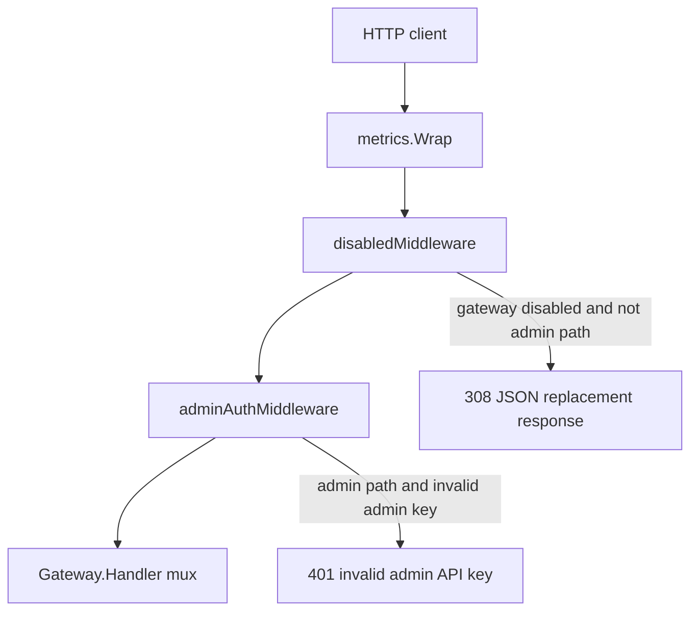
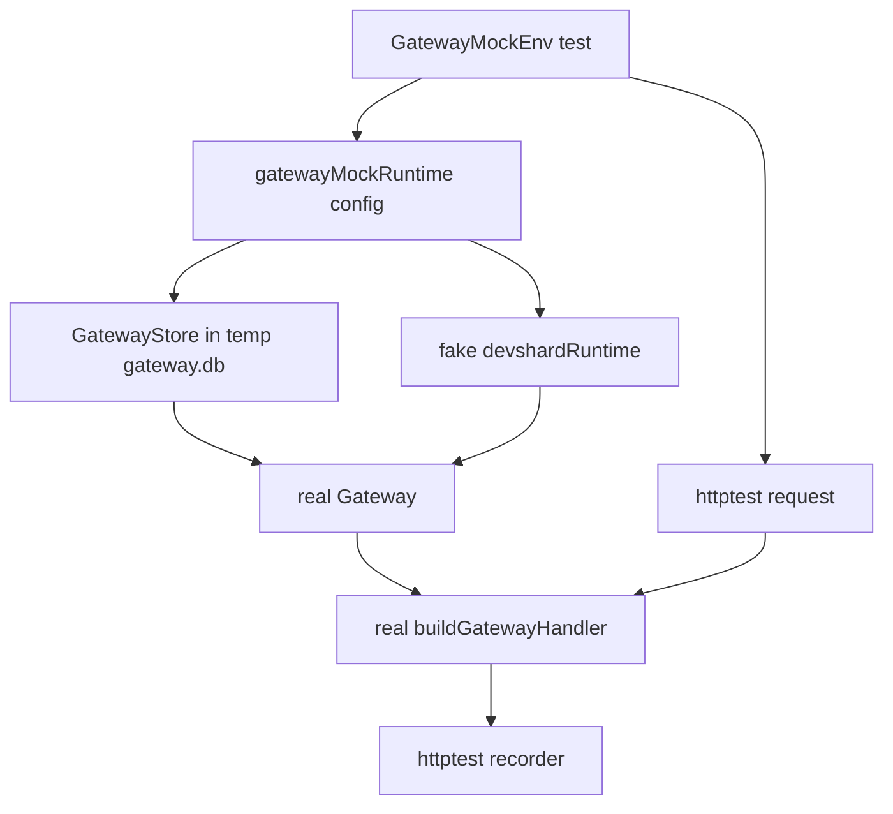
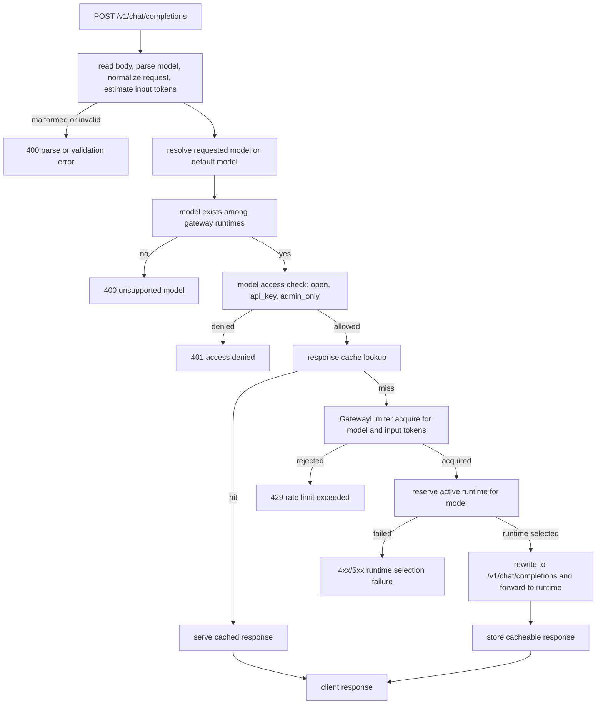
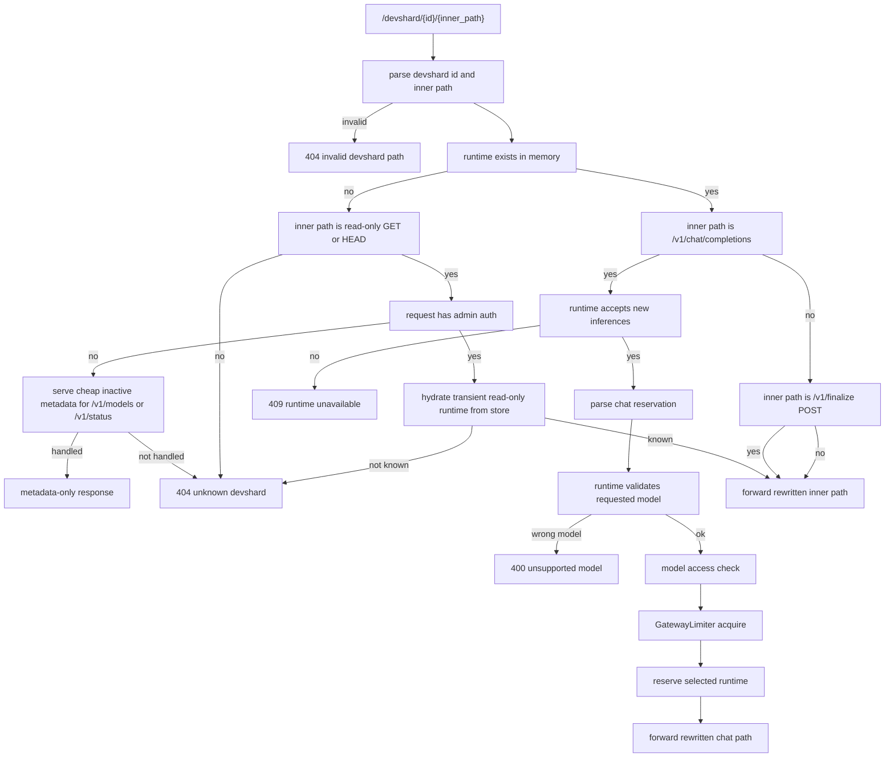
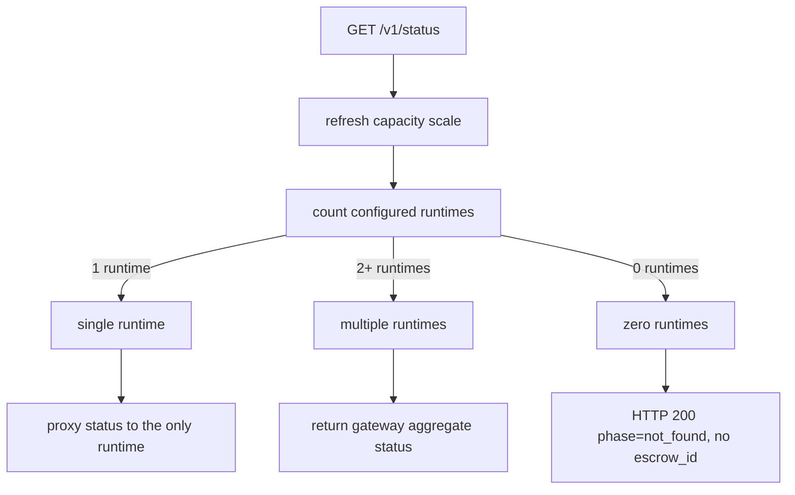
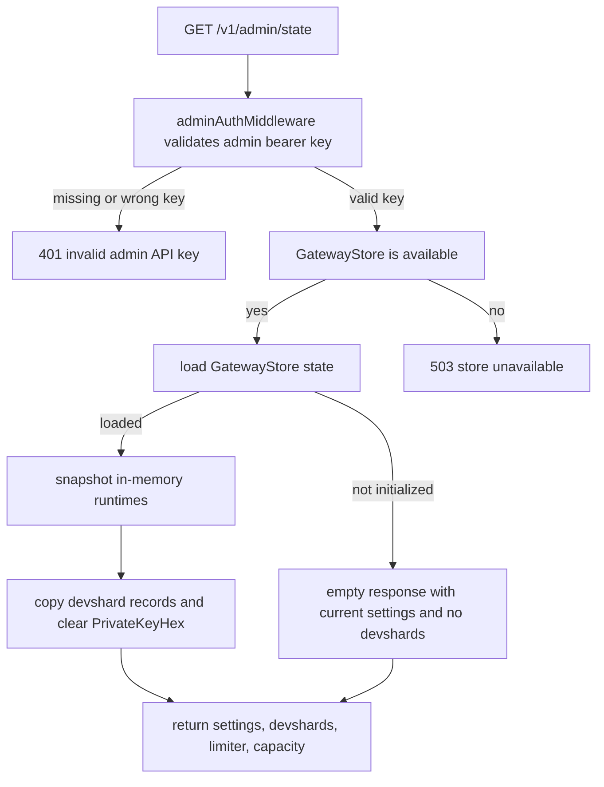
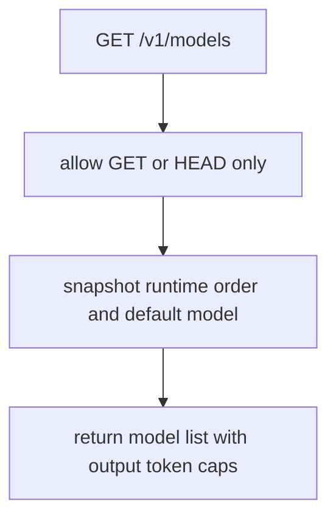

# Gateway Mockenv Coverage

This document maps the gateway request logic to the mock-environment tests in
`devshard/cmd/devshardctl/gateway_mockenv_*_test.go`.

The mockenv layer is not a full Docker or chain e2e suite. It builds a real
`Gateway`, a real `GatewayStore`, the real gateway HTTP handler stack, and fake
in-memory `devshardRuntime` handlers. This keeps the tests fast while still
exercising gateway routing, auth, access control, limiter, cache, status, and
admin-state behavior through HTTP requests.

## Handler Stack

`buildGatewayHandler` wraps the gateway in this order:

Mock coverage:

| Process | Mockenv test |
| --- | --- |
| Public traffic is blocked when the gateway is disabled | `TestGatewayMockEnvDisabledGatewayStillAllowsAdminState` |
| Direct devshard chat is also blocked when the gateway is disabled | `TestGatewayMockEnvDisabledGatewayBlocksDirectDevshardChat` |
| Direct devshard chat stays blocked when the gateway is disabled, even with admin auth | `TestGatewayMockEnvDirectDevshardDisabledGatewayAllowsAdminOperationalPathOnly` |
| Admin traffic still reaches the gateway when disabled | `TestGatewayMockEnvDisabledGatewayStillAllowsAdminState` |
| Direct admin operational traffic still reaches the gateway when disabled | `TestGatewayMockEnvDirectDevshardDisabledGatewayAllowsAdminOperationalPathOnly` |
| Admin paths require the configured admin bearer key | `TestGatewayMockEnvAdminStateRequiresAdminKey` |
| Direct operational paths require the configured admin bearer key | `TestGatewayMockEnvAdminAuthRequiredForDirectOperationalPaths` |
| User API keys can satisfy model `api_key` access | `TestGatewayMockEnvAPIKeyModelAccess` |
| Admin key can satisfy model `admin_only` access | `TestGatewayMockEnvAdminOnlyModelAccess` |
| Direct devshard routes enforce model `api_key` access | `TestGatewayMockEnvDirectDevshardEnforcesAPIKeyModelAccess` |
| Direct devshard routes enforce model `admin_only` access | `TestGatewayMockEnvDirectDevshardEnforcesAdminOnlyModelAccess` |

## Route Map

`Gateway.Handler` registers the main gateway surface. Mockenv tests focus on
the request paths where gateway-level decisions happen before a request reaches
a real devshard runtime.

| Route family | Gateway behavior | Mockenv coverage |
| --- | --- | --- |
| `/v1/chat/completions` | Pooled chat: validate, authorize, limit, choose runtime, forward | Covered |
| `/devshard/{id}/v1/chat/completions` | Direct chat: select requested runtime, validate model, limit, forward | Covered |
| `/v1/status` | Single runtime proxies status; multi-runtime returns aggregate; zero runtimes is HTTP 200 `phase=not_found` | Zero- and multi-runtime covered |
| `/v1/models` | Lists configured gateway models and caps | Indirectly covered through model validation |
| `/v1/admin/state` | Admin-only gateway state view with runtime snapshots and redacted inline keys | Covered |
| `/v1/admin/settings` | Admin-only settings update/read path | Not covered by mockenv yet |
| `/v1/admin/devshards*` | Admin-only add/import/activate/deactivate/settle/participants operations | Not covered by mockenv yet |
| `/v1/admin/escrows` | Admin-only escrow creation path | Not covered by mockenv yet |
| `/v1/admin/suspicious-hosts` | Admin-only suspicious-host list/update path | Not covered by mockenv yet |
| `/v1/finalize`, `/v1/state`, `/v1/debug/*` | Single-runtime or direct-devshard operational/debug paths | Direct admin auth, metadata-only guard, and pass-through covered |
| `/metrics` | Gateway metrics scrape | Not covered by mockenv yet |

## Mock Environment Harness

The harness gives each fake runtime:

- an escrow ID
- a model ID
- an active/inactive flag
- optional private-key fields seeded into `GatewayStore`
- an HTTP handler that records call count and returns mock chat JSON or SSE

## Pooled Chat Flow

Endpoint: `POST /v1/chat/completions`

Mock coverage:

| Process | Mockenv test |
| --- | --- |
| Routes pooled chat by requested model | `TestGatewayMockEnvPooledChatRoutesByModel` |
| Uses gateway default model when request omits `model` | `TestGatewayMockEnvPooledChatUsesDefaultModel` |
| Does not inject the default model back into the forwarded body | `TestGatewayMockEnvPooledChatUsesDefaultModel` |
| Enforces default-model access when request omits `model` | `TestGatewayMockEnvPooledChatMissingModelEnforcesDefaultModelAccess` |
| Rejects unsupported pooled model before runtime call | `TestGatewayMockEnvUnsupportedModelRejectedBeforeRuntime` |
| Rejects malformed JSON before runtime call | `TestGatewayMockEnvMalformedJSONRejectedBeforeRuntime` |
| Enforces `api_key` model access | `TestGatewayMockEnvAPIKeyModelAccess` |
| Enforces `admin_only` model access | `TestGatewayMockEnvAdminOnlyModelAccess` |
| Checks model access before serving pooled cache hits | `TestGatewayMockEnvPooledChatCacheDoesNotBypassAccessMode` |
| Excludes inactive runtimes from pooled routing | `TestGatewayMockEnvInactiveRuntimeExcludedFromPooledChat` |
| Applies gateway concurrency limiter before runtime call | `TestGatewayMockEnvConcurrencyLimitRejectsBeforeRuntime` |
| Passes OpenAI-style SSE streaming responses through | `TestGatewayMockEnvStreamingChatPassthrough` |
| Cache miss and cache store on successful pooled responses | `TestGatewayMockEnvPooledChatCacheHitSkipsRuntime` |
| Cache hit response replay for pooled chat | `TestGatewayMockEnvPooledChatCacheHitSkipsRuntime` |
| Runtime selection failure when all runtimes are unavailable | `TestGatewayMockEnvAllRuntimesUnavailableReturnsSelectionError` |
| Participant limiter rejecting all candidate runtimes | `TestGatewayMockEnvPooledChatParticipantLimiterAllHostsRejectedBeforeRuntime` |

## Direct Devshard Flow

Endpoint shape: `/devshard/{id}/{inner_path}`

Mock coverage:

| Process | Mockenv test |
| --- | --- |
| Routes direct chat by `/devshard/{id}` | `TestGatewayMockEnvDirectDevshardRouteByID` |
| Rewrites direct route inner path before forwarding | `TestGatewayMockEnvDirectDevshardRouteByID` |
| Rejects direct chat when request model does not match runtime model | `TestGatewayMockEnvDirectDevshardRejectsWrongModel` |
| Rejects malformed direct chat JSON before runtime call | `TestGatewayMockEnvDirectDevshardRejectsMalformedJSONBeforeRuntime` |
| Uses the selected runtime model when direct chat omits `model` | `TestGatewayMockEnvDirectDevshardUsesDefaultRuntimeModelWhenModelMissing` |
| Enforces selected runtime-model access when direct chat omits `model` | `TestGatewayMockEnvDirectDevshardMissingModelEnforcesRuntimeModelAccess` |
| Returns 404 for unknown direct devshard chat | `TestGatewayMockEnvUnknownDirectDevshardReturnsNotFound` |
| Direct route access control for `api_key` models | `TestGatewayMockEnvDirectDevshardEnforcesAPIKeyModelAccess` |
| Direct route access control for `admin_only` models | `TestGatewayMockEnvDirectDevshardEnforcesAdminOnlyModelAccess` |
| Direct route limiter rejection | `TestGatewayMockEnvDirectDevshardLimiterRejectsBeforeRuntime` |
| Direct route limiter rejection happens before cache miss forwarding | `TestGatewayMockEnvDirectDevshardLimiterRunsBeforeCacheMissForward` |
| Direct route cache hit | `TestGatewayMockEnvDirectDevshardCacheHitSkipsRuntime` |
| Direct route cache hits do not bypass model access checks | `TestGatewayMockEnvDirectDevshardCacheDoesNotBypassAccessMode` |
| Direct route cache entries are scoped by effective model | `TestGatewayMockEnvDirectDevshardCacheIsScopedByModel` |
| Direct route cache hits do not bypass inactive runtime checks | `TestGatewayMockEnvDirectDevshardCacheDoesNotBypassInactiveRuntime` |
| Runtime unavailable or inactive direct chat conflict | `TestGatewayMockEnvInactiveDirectDevshardReturnsConflict` |
| Direct operational paths require admin auth before pass-through | `TestGatewayMockEnvAdminAuthRequiredForDirectOperationalPaths` |
| Direct non-chat pass-through paths | `TestGatewayMockEnvAdminAuthRequiredForDirectOperationalPaths` |
| Direct finalize post-success deactivation | `TestGatewayMockEnvDirectFinalizeMarksRuntimeInactive` |
| Non-resident read-only metadata path | `TestGatewayMockEnvNonResidentDevshardServesPublicMetadataOnly` |
| Non-resident admin read-only hydration path | `TestGatewayMockEnvNonResidentDevshardAdminReadHydratesOrFailsWithoutMetadataFallback` |

## Status Flow

Endpoint: `GET /v1/status`

Mock coverage:

| Process | Mockenv test |
| --- | --- |
| Multi-runtime status returns aggregate gateway status | `TestGatewayMockEnvMultiRuntimeStatusIsAggregate` |
| Multi-runtime status does not proxy fake runtime handlers | `TestGatewayMockEnvMultiRuntimeStatusIsAggregate` |
| Single-runtime status proxies runtime handler | `TestGatewayMockEnvSingleRuntimeStatusProxiesRuntime` |
| Zero-runtime status is HTTP 200 `phase=not_found` | `TestGatewayMockEnvZeroRuntimeStatusIsNotFound` |

## Admin State Flow

Endpoint: `GET /v1/admin/state`

Mock coverage:

| Process | Mockenv test |
| --- | --- |
| Requires admin key for `/v1/admin/state` | `TestGatewayMockEnvAdminStateRequiresAdminKey` |
| Valid admin key can read state | `TestGatewayMockEnvAdminStateRequiresAdminKey` |
| Admin state still works while gateway disabled | `TestGatewayMockEnvDisabledGatewayStillAllowsAdminState` |
| Admin state does not expose inline private key material | `TestGatewayMockEnvAdminStateDoesNotExposePrivateKey` |
| Admin state omits the `private_key` JSON field | `TestGatewayMockEnvAdminStateDoesNotExposePrivateKey` |
| Store unavailable response | not covered by mockenv yet |
| Empty or uninitialized store response | not covered by mockenv yet |

## Models Flow

Endpoint: `GET /v1/models`

Mock coverage:

| Process | Mockenv test |
| --- | --- |
| Pooled chat indirectly depends on model IDs for validation | `TestGatewayMockEnvPooledChatRoutesByModel`, `TestGatewayMockEnvUnsupportedModelRejectedBeforeRuntime` |
| Direct `/v1/models` response shape | not covered by mockenv yet |
| Method rejection for `/v1/models` | not covered by mockenv yet |

## Current Mockenv Coverage Summary

| Gateway area | Covered by mockenv | Current tests |
| --- | --- | --- |
| Handler stack: disabled gateway | Yes | `TestGatewayMockEnvDisabledGatewayStillAllowsAdminState`, `TestGatewayMockEnvDisabledGatewayBlocksDirectDevshardChat`, `TestGatewayMockEnvDirectDevshardDisabledGatewayAllowsAdminOperationalPathOnly` |
| Handler stack: admin auth | Yes | `TestGatewayMockEnvAdminStateRequiresAdminKey`, `TestGatewayMockEnvAdminAuthRequiredForDirectOperationalPaths`, `TestGatewayMockEnvDirectDevshardDisabledGatewayAllowsAdminOperationalPathOnly` |
| Pooled chat routing | Yes | `TestGatewayMockEnvPooledChatRoutesByModel` |
| Pooled default model | Yes | `TestGatewayMockEnvPooledChatUsesDefaultModel`, `TestGatewayMockEnvPooledChatMissingModelEnforcesDefaultModelAccess` |
| Pooled model access modes | Yes | `TestGatewayMockEnvAPIKeyModelAccess`, `TestGatewayMockEnvAdminOnlyModelAccess`, `TestGatewayMockEnvPooledChatMissingModelEnforcesDefaultModelAccess` |
| Pooled cache access ordering | Yes | `TestGatewayMockEnvPooledChatCacheDoesNotBypassAccessMode` |
| Pooled validation before runtime | Yes | `TestGatewayMockEnvUnsupportedModelRejectedBeforeRuntime`, `TestGatewayMockEnvMalformedJSONRejectedBeforeRuntime` |
| Pooled inactive runtime exclusion | Yes | `TestGatewayMockEnvInactiveRuntimeExcludedFromPooledChat` |
| Pooled runtime selection failure | Yes | `TestGatewayMockEnvAllRuntimesUnavailableReturnsSelectionError` |
| Pooled gateway limiter | Yes | `TestGatewayMockEnvConcurrencyLimitRejectsBeforeRuntime` |
| Pooled streaming pass-through | Yes | `TestGatewayMockEnvStreamingChatPassthrough` |
| Direct devshard routing | Yes | `TestGatewayMockEnvDirectDevshardRouteByID` |
| Direct devshard model validation | Yes | `TestGatewayMockEnvDirectDevshardRejectsWrongModel`, `TestGatewayMockEnvDirectDevshardRejectsMalformedJSONBeforeRuntime` |
| Direct devshard default model | Yes | `TestGatewayMockEnvDirectDevshardUsesDefaultRuntimeModelWhenModelMissing`, `TestGatewayMockEnvDirectDevshardMissingModelEnforcesRuntimeModelAccess` |
| Direct devshard model access modes | Yes | `TestGatewayMockEnvDirectDevshardEnforcesAPIKeyModelAccess`, `TestGatewayMockEnvDirectDevshardEnforcesAdminOnlyModelAccess`, `TestGatewayMockEnvDirectDevshardMissingModelEnforcesRuntimeModelAccess` |
| Direct devshard limiter | Yes | `TestGatewayMockEnvDirectDevshardLimiterRejectsBeforeRuntime`, `TestGatewayMockEnvDirectDevshardLimiterRunsBeforeCacheMissForward` |
| Direct devshard cache isolation and access ordering | Yes | `TestGatewayMockEnvDirectDevshardCacheHitSkipsRuntime`, `TestGatewayMockEnvDirectDevshardCacheDoesNotBypassAccessMode`, `TestGatewayMockEnvDirectDevshardCacheIsScopedByModel`, `TestGatewayMockEnvDirectDevshardCacheDoesNotBypassInactiveRuntime` |
| Direct devshard unavailable conflict | Yes | `TestGatewayMockEnvInactiveDirectDevshardReturnsConflict`, `TestGatewayMockEnvDirectDevshardCacheDoesNotBypassInactiveRuntime` |
| Direct unknown devshard | Yes | `TestGatewayMockEnvUnknownDirectDevshardReturnsNotFound` |
| Direct operational path admin auth and pass-through | Yes | `TestGatewayMockEnvAdminAuthRequiredForDirectOperationalPaths` |
| Single-runtime `/v1/status` proxy mode | Yes | `TestGatewayMockEnvSingleRuntimeStatusProxiesRuntime` |
| Multi-runtime status aggregation | Yes | `TestGatewayMockEnvMultiRuntimeStatusIsAggregate` |
| Admin state auth and redaction | Yes | `TestGatewayMockEnvAdminStateRequiresAdminKey`, `TestGatewayMockEnvAdminStateDoesNotExposePrivateKey` |
| Response cache hit path | Yes | `TestGatewayMockEnvPooledChatCacheHitSkipsRuntime`, `TestGatewayMockEnvDirectDevshardCacheHitSkipsRuntime` |
| Direct finalize post-success deactivation | Yes | `TestGatewayMockEnvDirectFinalizeMarksRuntimeInactive` |
| Non-resident read-only metadata and admin hydration | Yes | `TestGatewayMockEnvNonResidentDevshardServesPublicMetadataOnly`, `TestGatewayMockEnvNonResidentDevshardAdminReadHydratesOrFailsWithoutMetadataFallback` |
| Participant limiter all-host rejection | Yes | `TestGatewayMockEnvPooledChatParticipantLimiterAllHostsRejectedBeforeRuntime` |
