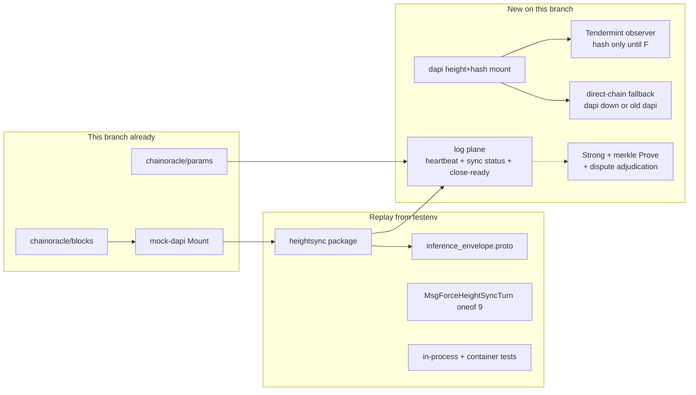
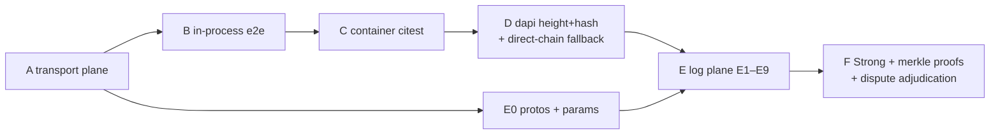

# Height-sync implementation plan (v5 / `ak/height-sync-protocol`)

**Spec:** [`proposals/HEIGHT_SYNC_PROTOCOL_PROPOSAL.md`](./proposals/HEIGHT_SYNC_PROTOCOL_PROPOSAL.md)  
**Test catalog (from `devshard-testenv`):** [`height-sync-tests.md`](./height-sync-tests.md)  
**Params:** [`height-sync-params.md`](./height-sync-params.md)  
**Related:** [`proposals/CPOC_PROTOCOL.md`](./proposals/CPOC_PROTOCOL.md), [`proposals/FINALIZATION_COLLECTOR_PROTOCOL_PROPOSAL.md`](./proposals/FINALIZATION_COLLECTOR_PROTOCOL_PROPOSAL.md), [`proposals/VALIDATION_PROTOCOL_PROPOSAL.md`](./proposals/VALIDATION_PROTOCOL_PROPOSAL.md)  
**PR #1584 review (P0–P4):** [`height-sync-pr-1584-review.md`](./height-sync-pr-1584-review.md)

**Status:** Phases **A**–**D** landed on this branch (dapi HTTP mount lives in `decentralized-api` and is committed separately). Catalog §2–§4 pass (`go test ./heightsync/... ./transport/... ./testenv/scenarios/ -run HeightSync`; held-response tests need `-tags=dev`). Phase C is `citest-height-sync` against this mock-dapi chainoracle (no `heightsyncd`). Phase D unit tests are D1–D8, D10, D11 (D9 is Phase E). The oracle substrate (`devshard/chainoracle/blocks`) and the mock-dapi mount already exist.

| Phase | Status | What’s on this branch |
| ----- | ------ | --------------------- |
| **A** | ✅ | `devshard/heightsync`, envelope, `MsgForceHeightSyncTurn` oneof 9, host/user/transport/state seams on `chainoracle/blocks`. Catalog §2–§3. |
| **B** | ✅ | In-process e2e in `testenv/scenarios/heightsync_anchor_e2e_*.go` (static `blocks.BlockOracle`s, `/devshard/v2`, numeric escrow ids). Catalog §4 including `-tags=dev` E2/E3/E8. |
| **C** | ✅ | Container citest `citest-height-sync` against mock-dapi `/block/*` (optional `DEVSHARD_CHAINORACLE_URL`; default compose unchanged) |
| **D** | ✅ | Hash-only Tendermint observer; direct-chain adapter; host failover (old dapi / dapi-down). Dapi `/block/*` mount is in `decentralized-api` (separate commit). |
| **E** | ✅ | Log plane (heartbeat, sync vector/state, repair, close-ready). **E0–E9 landed** (§8.15). |
| **F** | ⏳ | Strong / `light_block` / dispute adjudication / **floor garbage cleanup after L6** |

This plan delivers **the whole spec except the Strong path**, in six phases:

1. **A–C** replay the transport plane that is already implemented and tested on `devshard-testenv` (Omit/Anchor, cadence, forced turns, courier carry, response-leg signatures), rewired onto `chainoracle/blocks`. Envelope `(C-quorum)` withdrawn.
2. **D** mounts a **height+hash** oracle in production dapi and keeps v5 hosts working against an **unmodified older dapi**.
3. **E** builds the **log plane** — §10 heartbeat turns, §11 `sync_vector` / `sync_state` / `peer_seen` / repair probe, §12 close-ready arming, §14 L1–L7 verifier checks. This is new code; nothing on `devshard-testenv` covers it.
4. **F** is **only** the Strong path (`light_block`, `D`-band escalation, `(C-strong)`/`(C-hybrid)`), the dapi work that feeds it (commit signatures, IAVL `Prove()`), the **dispute adjudication** that consumes Strong-grade evidence, and **floor garbage cleanup** after L6 detects a garbage pair that became `F` (spec §14).

The split for disputes is: **marking lands in E, adjudication lands with F.** Phase E must *detect and record* every attributable event the spec names (`DISPUTE_ORIGINATOR` / `DISPUTE_CARRIER` on sight, `ACKED`-vs-log contradiction, false `SYNCED`) into the audit ring, metrics, and local evidence store. Turning those records into evidence packets, on-chain `MsgHeightSyncEvidence`, or slashing is Strong-phase work, because the canonical-pair half of the packet is a `LightBlock`.

---

## 0. Why not `git cherry-pick`

The height-sync commits on `devshard-testenv` (`a2f7507b0`, `5b079ca7a`, `95e3996fb`, …) will **not** apply cleanly:

| Conflict | This branch | `devshard-testenv` |
| -------- | ----------- | ------------------ |
| Oracle package | `devshard/chainoracle/blocks` (+ `params`, unified HTTP) | `devshard/blockoracle` |
| Testenv topology | mock-dapi **in-process** mock observer + `cosrv.Mount` | separate `heightsyncd` process; mockdapi is an HTTP client |
| Lineage | 0.2.15 / v5 (`#1497`, `#1564`, `#1578`) | 0.2.13-era testenv + later height-sync |
| `diff.proto` | 8 txs, field 9 free | field 9 = `MsgForceHeightSyncTurn` (compatible number) |

**Replay, do not cherry-pick.** Copy named directories from `devshard-testenv`, rewrite imports `devshard/blockoracle` → `devshard/chainoracle/blocks`, and wire hosts to the oracle this branch already serves from mock-dapi.

Source commits to replay from (merge-base `d8b8e9073`):

| Hash | What to take |
| ---- | ------------ |
| `a2f7507b0` | `heightsync/` skeleton, `inference_envelope.proto`, first e2e |
| `0a77734b4` | Phase A test fixes |
| `5b079ca7a` | **Core:** cadence, inbound, confirmation, origin signing, courier, force turn, docs catalog |
| `95e3996fb` | Container e2e + `decide_log` / `oracle_debug` |

Do **not** copy `devshard/blockoracle/**` or `testenv/cmd/heightsyncd` — replaced by `chainoracle` + mock-dapi.

---

## 1. What exists where

### This branch (`ak/height-sync-protocol`)

| Piece | State |
| ----- | ----- |
| `devshard/chainoracle/blocks` | `BlockOracle` (`Latest` / `At` / `Prove` / `Subscribe`), `Header`+`Commit`, HTTP `/block/latest\|:height\|prove\|stream`, `client`, `verifier` |
| `devshard/chainoracle/server.Mount` | Blocks + `/versions`; `import_gate_test.go` forbids `heightsync` / `host` / `testenv` imports |
| `devshard/chainoracle/params` | Runtime-config snapshot source/server (`common/runtimeconfig.Snapshot`) — the carrier for new chain params (§8.4) |
| mock-dapi | In-process mock observer, same HTTP contract |
| `observer.NewTendermint` | **Stub that panics** — production observer not written |
| `devshard/heightsync` | **✅ Present** (transport plane: cadence, inbound, confirmation, origin signing, audit) |
| Envelope / `MsgForceHeightSyncTurn` | **✅ Present** (`inference_envelope.proto`, `diff.proto` oneof 9) |
| Sequencer seams | `user/session.go`: force-turn compose in `PrepareInferenceFn`, escrow hints on `SendOnly` / `sendDiffRound` |
| Host seams | `host/host.go` `WithChainOracle`, `LatestHeight`; `host/mempool.go` unchanged (no force-turn sort on this branch) |
| Verifier seams | `state/machine.go` + `state/heightsync.go`: `applyForceHeightSyncTurn`, escrow hints hashed into rest hash |
| Transport seams | envelope wrap/unwrap, `WithHeightSync`, origin verify, seed RPC, peer tips; routes include `POST .../height-sync` |
| In-process e2e | **✅ Present** (`testenv/scenarios/heightsync_anchor_e2e_*.go`, catalog §4) |
| Peer fan-out | `gossip/interface.go`: `PeerClient.GossipTxs`, `MempoolSink.AddTx` |
| Production dapi | **No** `devshard` module dep; no `/block/*` routes. Height+hash today: `BrokerChainBridgeImpl.GetBlockHash` → CometBFT `Block` RPC (hash only, no commit) |

### `devshard-testenv` (replay source)

Transport plane **done and tested**: Omit/Anchor, `K`/`slots_num` cadence, degraded Anchor (`tip_stale_after_ms`), `MsgForceHeightSyncTurn` + cadence swallow, response-leg origin signatures, courier peer tips + `last_propagated`, freshness gate `F`, audit ring, exculpation API, seed RPC, in-process e2e E1–E11, container Phase A–C.

**Not implemented there either** (spec-only): Strong / `light_block`, `MsgHeartbeat` / `MsgHeightAck`, `sync_vector`, `sync_state`, `peer_seen`, repair probe, close-ready.



---

## 2. Phases

Each phase is independently shippable. Strong is last, matching `devshard-testenv` (Strong milestone ⏳). The log plane (E) does **not** need Strong evidence.

| Phase | Deliverable | Spec | Replay? | Status |
| ----- | ----------- | ---- | ------- | ------ |
| **A** | `heightsync/` + envelope + force turn + host/user/transport/state seams, imports on `chainoracle/blocks` | §7–§9, §13–§16 Anchor; §17 local-oracle readiness (no envelope quorum) | Yes | ✅ |
| **B** | In-process e2e on current `testenv/scenarios` | catalog §4 | Yes, path remap | ✅ |
| **C** | Container citest `citest-height-sync` against mock-dapi chainoracle (no `heightsyncd`) | catalog §5 A–C | Adapt | ✅ |
| **D** | Dapi mounts **height+hash** (`/block/latest`, `/block/:height`); hash-only Tendermint observer; **v5 ↔ old dapi** fallback. **No** `Prove()`, **no** commit-quorum requirement. | plan §7 | New | ✅ |
| **E** | **Log plane:** `MsgHeartbeat` / `MsgHeightAck`, `observed_height`, turn record, `sync_vector`, `sync_state`, `peer_seen`, repair probe, close-ready arming, L1–L7, marking of attributable events | §10–§12, §14 log-plane, §18.2.1, §20 params | New | ✅ |
| **F** | **Strong only:** `light_block` + `D`-band escalation + `(C-strong)`/`(C-hybrid)`; dapi `Header.Commit` + IAVL `Prove()`; dispute adjudication and evidence packets | §8, §15 Strong proof, §18.4, catalog §8 | New | ⏳ |



Only F depends on Strong. E depends on D solely because a heartbeat needs a real `(height, hash)` source on production hosts; against mock-dapi it can be developed in parallel with D.

---

## 3. Spec coverage matrix (validity re-check)

Every normative surface in the spec, the artefact that satisfies it, and the phase. This table is the acceptance criterion for "the plan fills the gaps the proposal targets".

| Spec | Surface | Artefact | Phase |
| ---- | ------- | -------- | ----- |
| §7 fields 1–7 | `HeightSyncSection` on the envelope | `proto/devshard/v1/inference_envelope.proto`, `transport/envelope.go` | A |
| §7 field 8 | Response-leg signature, `CanonicalOriginBytes`, field 8 excluded from signing input | `heightsync/origin_signing.go` | A |
| §7 field 9 | `light_block` | — | **F** |
| §7 field 10 | `tip_stale_after_ms`, advisory, set after signing | `heightsync/anchor.go` (degraded Anchor) | A |
| §8 Omit/Anchor/degraded Anchor | Producer mode table incl. quiet-vs-dead feed | `heightsync/anchor.go` + `source.go` | A |
| §8 Strong | Escalation state machine | — | **F** |
| §9 cadence | `K` / `slots_num` windows, initial turn, constraint `K ≥ slots_num` | `heightsync/cadence.go` | A |
| §9 forced turn | `MsgForceHeightSyncTurn` (oneof **9**), `ActiveForcedTurn`, second-directive ignore, cadence swallow | `diff.proto`, `state/machine.go`, `heightsync/cadence.go` | A |
| §9 lazy carry | `MaxFresh` + `last_propagated` gate | `transport/peer_tips.go` | A |
| §10.3 obligation | turnover tracking, `Interval` cadence, `D_ack` deadline, heartbeat turn opened by the **user only** | `heightsync/heartbeat.go` + `user/session.go` | **E** |
| §10.3 wire compat | Heartbeat turn also carries `MsgForceHeightSyncTurn{reason="heartbeat"}` so existing forced-turn enforcement covers the span | `user/session.go` | **E** |
| §10.4 | `MsgHeartbeat` (oneof **10**), `MsgHeightAck` (oneof **11**), `HeightAckContent` domain `heightsync.ack.v1`, four binding rules | `diff.proto`, `heightsync/logplane.go` | **E** |
| §10.5 | `observed_height` in `DiffContent`; REQUIRED on the heartbeat pair, RECOMMENDED on `MsgStartInference` / `MsgConfirmStart` / `MsgFinishInference` | `diff.proto` + `state/machine.go`; signature coverage and the `ExecutorReceiptContent` mirror in §8.2.1 | **E** (stamps: E, gated — see §8.5) |
| §10.6 | Async fan-out: span dispatched without awaiting acks; ack tail out of order; late acks tagged, never clear `degraded` | `user/session.go`, `heightsync/turn.go` | **E** |
| §10.7 | `SyncTurnRecord`, `open` / `complete` / `degraded`, `Q = ceil(2/3 × slots)` reachability, only `complete` advances `h_last` | `heightsync/turn.go` | **E** |
| §11.1 | `SyncVectorEntry` + `AckStatus`, one entry per slot for the preceding turn, `ACKED`-vs-log contradiction is user-attributable | `heightsync/syncvector.go`, L7 | **E** (marking) |
| §11.2 | `sync_state` decision table, `peer_seen` bitmap incl. probe-learned heights | `heightsync/syncstate.go`, `heightsync/peerseen.go` | **E** |
| §11.2 `CATCHING_UP` ⇒ next heartbeat Strong | Escalation of the *next* turn to Strong | recorded in E, **enforced in F** | E/F |
| §11.3 | `POST /sessions/:id/heightsync/repair`, both legs signed (domain `heightsync.repair.v1`), outcomes `HEIGHT` / `UNREACHABLE`, **no attribution** | `heightsync/repair.go`, `transport/server.go`, `server/routes.go` | **E** |
| §11.4 | One probe per `(turn, slot)` per prober, one HEIGHT per `(turn, requester)` per responder, `R_max` per `Interval` both sides, stagger `δ_probe`, backoff, zero probes on healthy path, armed hosts stop, unknown-turn reject | `heightsync/repair_budget.go` | **E** |
| §12.1–12.3 | `last_signal_height`, arming at `T_idle`, level-triggered disarm, emits nothing | `heightsync/closeready.go` | **E** |
| §12.4 | `CloseReadyView`, `UserTimeoutEvidence` (degraded turns as context) | `heightsync/closeready.go` | **E** (producer); consumer is finalization, out of scope |
| §13 host producer rules | Anchor on every response in a turn, degraded Anchor, ack REQUIRED even when oracle unusable | `heightsync/anchor.go` (A) + `host` ack producer (E) | A + E |
| §13 courier rules | Peer tips, `VerifyOrigin` on ingest, strip field 8, never self-brand as originator, heartbeat obligation | `transport/client.go` (A) + `user/session.go` (E) | A + E |
| §14 steps 1–3, 5–9 | Receiver pipeline incl. forced-turn-first ordering, freshness `F`, cadence/lazy classification, oracle reconciliation, deferred queue, audit + metrics | `heightsync/inbound.go` | A |
| §14 step 4 | Strong verification branch | — | **F** |
| §14 L1–L7 (+ L0 monotonicity) | Log-plane checks at diff-ingest | `heightsync/logplane.go` wired into `state.StateMachine.ValidateDiff`; L4 / L5a additionally at the `inbound.go` edge, where the envelope is still attached | **E** |
| §14 result classes | `VALID_*`, `DEFERRED_FAIL`, `DISPUTE_*`, `INVALID(reason)` + new `ack_sig_invalid`, `ack_causality` | `heightsync/inbound.go` + `logplane.go` | A (transport) + E (log) |
| §15 asymmetric model | Response signed, request trusted, exculpation on demand | `heightsync/origin_signing.go`, `transport/peer_tips.go` | A |
| §15 exception | Repair probe signs **both** legs | `heightsync/repair.go` | **E** |
| §15 Strong proof steps 1–7 | `VerifyLightBlock` | — | **F** |
| §16 | Originator immutability, `D` bound on carry-forward, provenance-less carry ⇒ carrier is source, `last_propagated` ladder | `transport/peer_tips.go` (`D` bound enforced only once `D` exists in F) | A (+F for the `D` clause) |
| §17 height readiness | **Withdrawn envelope `(C-quorum)`**; consumers use local oracle | `heightsync/quorum.go` (`QuorumForRoster` for turn completion only) | A |
| §17 `(C-turn)` | **Withdrawn** — a turn certifies reachability, not a height | `heightsync/turn.go` | **E** |
| §17 `(C-strong)` / `(C-hybrid)` | — | — | **F** |
| §18.1 | Local oracle readiness for cPoC (no `ConfirmationView`) | host/oracle + `blocks.BlockOracle` | A |
| §18.2 | `ObservedHeightNow()` | `transport/client.go` | A |
| §18.2.1 | `TurnTracker.Record` / `Latest` / `MissingAcks`, `Server.RepairProbe`, `Server.CloseReadyView` | `heightsync/turn.go`, `repair.go`, `closeready.go` | **E** |
| §18.3 | `HeightSyncEvidenceFor`, `VerifyOriginDetached` | `transport/client.go`, `heightsync/origin_signing.go` | A |
| §18.4 | `LightBlockFor` | — | **F** |
| §18.5 | Seed RPC `POST /sessions/:id/height-sync` behind `WithHeightSyncSeedRPC` | `transport/server.go` | A |
| §18.6 | `SendMsgForceHeightSyncTurn` | `user/session.go` | A |
| §18.7 | `AuditRing`, `HeightSyncAuditRing()` both sides | `heightsync/audit.go` | A |
| §19 attacks 1–5, 9, 11, 13 | Anchor-plane defences | catalog §2–§5 tests | A–C |
| §19 attacks 6–8, 12 | Strong-plane defences | catalog §8 S1–S12 | **F** |
| §19 attack 10 | Cross-session equivocation | audit ring records it (A); adjudication | A (record) / **F** |
| §19 attacks 14–22 | Log-plane defences (quiet session, missing ack, lying vector, false `SYNCED`, probe amplification, partitioned minority, drip-fed late acks) | plan §8.13 / catalog §7: H1–H24 | **E** |
| §19 attacks 23–26 | Stamp integrity (rewritten `executor_sig` height, regression, future-dating) and replay stability of the tier split | plan §8.13 / catalog §7.2–§7.3: H13a, H13c, H13d, H13e, H28–H30 | **E** |
| §20 defaults | `K`, `slots_num`, `F`, `W_conf`, `Q`, audit capacity, `StaleAfter` | existing constructors | A |
| §20 new params | `Interval`, `TurnTimeout`, `D_ack`, `T_idle`, `δ_probe`, `R_max`, turn completion's reuse of `Q` | `heightsync/params.go` + runtime-config snapshot | **E** |
| §20 `D`, header-cache window, Strong recency, `Rule=Strong/Hybrid` | — | — | **F** |

### Gaps this revision closes

The previous revision of this plan had Phase E as a five-line paragraph. Concretely it did not say:

- where `MsgHeightAck` is produced or how it reaches `Diff` (host mempool, §8.6);
- that L0–L7 run inside `state.StateMachine.ValidateDiff`, i.e. that the log plane is a **diff-validation** concern and not a transport concern — with L4 / L5a as the cross-plane exceptions that can only be evaluated at the transport edge (§8.7);
- how `sync_state` is computed, or that `ORACLE_UNAVAILABLE` must still be acked and now counts toward `Q` (§8.6);
- that `peer_seen` includes probe-learned heights (§8.6);
- how `sync_vector` is composed given async fan-out — it reports turn `s − 1`, never `s` (§8.5);
- the repair endpoint's route, auth, signing domain, and budget state (§8.9);
- the arming inputs for close-ready, or that arming must be level-triggered (§8.10);
- that `(C-turn)` was proposed as a deterministic confirmation rule and is withdrawn (§8.11);
- which attributable events are *marked* in E versus *adjudicated* in F (§8.7).

Two smaller corrections: the `D` bound on carry-forward (§16) cannot be enforced before `D` exists, so it moves to F; and `CATCHING_UP` forcing the next heartbeat to Strong is recorded in E but only enforced in F.

---

## 4. Phase A — replay transport plane onto this tree ✅

Landed. Catalog §2–§3 pass. Adaptations vs `devshard-testenv`: `WithChainOracle` (not `WithBlockOracle`); force-turn compose lives in `user/session.go` (`PrepareInferenceFn`); height-sync escrow fields are a 4th rest-hash component in `ComputeRestHashV2`.

### 4.1 Files to copy from `devshard-testenv` (then rewrite)

```
devshard/heightsync/**           # entire package
devshard/proto/devshard/v1/inference_envelope.proto
```

Patch in place (do not overwrite HEAD versions wholesale):

| File | Change |
| ---- | ------ |
| `diff.proto` | Add `MsgForceHeightSyncTurn` as oneof **9** (same number as testenv). Keep reveal-seed field 7 deprecated. |
| `transport/envelope.go` | New on this branch — copy |
| `transport/peer_tips.go` | Copy |
| `transport/client.go` / `server.go` / `types.go` | Merge: `WithHeightSync`, wrap/unwrap envelope, origin verify, mempool unchanged |
| `host/host.go` | `WithBlockOracle` → `WithChainOracle(blocks.BlockOracle)`; `LatestHeight`; force-anchor flag |
| `user/session.go` | Courier scheduler hook in `PrepareInference` / `SendOnly`; peer-tip ingest in `processResponse`; `SendMsgForceHeightSyncTurn` via `addPendingTx` |
| `state/machine.go` | `applyForceHeightSyncTurn` in the `applyTx` switch + escrow hint fields |
| `host/mempool.go` | Force-turn tx path (testenv already has this pattern) |

Import rewrite: `devshard/blockoracle` → `devshard/chainoracle/blocks` everywhere in the copied package.

`buf generate` / existing proto Makefile after envelope + `diff.proto`.

### 4.2 Envelope compatibility

HEAD transport is still **bare JSON** `InferenceRequest`. The testenv envelope is protobuf wrapping that JSON + optional `height_sync`.

Receiver rule (backward compatible **inside v5**):

- If the body parses as `InferenceRequestEnvelope` → use it.
- Else parse as today's JSON `InferenceRequest` → treat as **Omit** (no section).

Old **clients** talking to v5 hosts: Omit is valid outside sync turns; inside a sync turn the host still **responds** with a signed Anchor (`TestHeightSyncAnchor_E2E_ForcedSyncTurn_HostResponsesAnchorEvenIfUserOmits`). Gateway/devshardctl on this branch must be upgraded together with hosts for cadence; mixed old-ctl + new-host is Omit-on-request, Anchor-on-response.

### 4.3 Unit tests to bring over

All of `heightsync/*_test.go`, `origin_signing_test.go`, transport envelope/peer-tip tests. Swap fake oracles to `chainoracle/blocks` types. `TestLocalOracleSource_ParityWithBlockOracle` → `…ChainOracle`.

---

## 5. Phase B — in-process e2e ✅

Landed. Catalog §4 pass on this module:

```
go test -count=1 ./heightsync/... ./transport/... ./testenv/scenarios/ -run HeightSync
go test -tags=dev -count=1 ./testenv/scenarios/ -run '^TestHeightSyncAnchor_E2E_'
```

Copied `devshard/testenv/scenarios/heightsync_anchor_e2e_*.go` and held-response stubs (`heightsync_session_hold_*.go`, `transport/inference_hold_*.go`).

Adaptations:

- Oracle: static `blocks.BlockOracle` fakes (and `host.WithChainOracle`); **no** `heightsyncd`.
- HTTP: `/devshard/v2` (not `/v1/devshard`); `NewHTTPSession` requires `RoutePrefix` + temp `StoragePath`.
- Escrow ids must be canonical numeric (`ValidateEscrowID`); e2e uses `9001`.
- `state.NewStateMachine` takes a store (`MustMemoryStore`); `SendOnly` takes `(stream, receiptHandler)`.
- E8 (`HeldOriginatorReplayRejected`): courier cache `F` is widened so the held originator is still emitted after 70s; host inbound `F` stays 60s and rejects the replay.

Pass bar: catalog §4 all ✅ (`go test ./heightsync/... ./transport/... ./testenv/scenarios/ -run HeightSync`; E2/E3/E8 need `-tags=dev`, E8 skips under `-short`).

---

## 6. Phase C — container / citest e2e ✅

Do **not** revive `testenv/cmd/heightsyncd` or `Dockerfile.height-sync`. This branch's mock-dapi already is the producer.

Height-sync is **on** whenever a chain RPC/client or `DEVSHARD_CHAINORACLE_URL` is present:

| Env | Default | Effect |
| --- | ------- | ------ |
| `DEVSHARD_CHAINORACLE_URL` | unset | unary GET `/block/:height` (and `/prove`); chain RPC still seeds the scheduler |
| `DEVSHARD_HEIGHTSYNC_K` | `10` | cadence spacing |
| `DEVSHARD_HEIGHTSYNC_SLOTS` | `1` | sync-turn width |
| `DEVSHARD_HEIGHTSYNC_PROBE_INTERVAL` | `30m` | re-probe dapi after a transport miss (`chain.DefaultRPCProbeInterval`) |
| `DEVSHARD_LOG_LEVEL` | unset (`info`) | set `debug` in citest so `heightsync: emit` is visible |

Default `testenv/docker-compose.yml` / gencompose output does **not** set `DEVSHARD_CHAINORACLE_URL`. Only `citest-height-sync` patches the generated compose (`EnableHeightSyncCompose` → `http://mock-dapi:9100`).

Makefile target `citest-height-sync` (auto-discovered by `list-citest-targets`):

| ID | Scenario (from catalog §5) | On this branch |
| -- | -------------------------- | -------------- |
| A | Cadence logs on real compose | `TestHeightSync_CadenceEmitsAnchor`: mock-dapi `/block/latest` live; first chat is a sync-turn Anchor (`heightsync: emit` `mode=anchor` in compose logs) |
| B | Lost first response / force turn / cheating trail | Lost-first: `TestHeightSync_LostFirstChunk` (same mock-openai fault as A1, height-sync on). Force/session-start: covered by A (nonce 1). Cheating-trail mutate hooks stay in-process e2e (`testenv/scenarios`, catalog §4) — production binaries have no response-mutate hook |
| C | Feed stop → Omit / degraded; recover → Anchor | `TestHeightSync_FeedStoppedOmitsThenRecovers`: `docker compose pause mock-dapi` after a live Anchor; next chat is `mode=omit` or `tip_stale_after_ms`; unpause recovers. mock-chain does not serve Comet `/block`, so failover cannot Anchor while mock-dapi is paused (D10 is the unit test for a live chain). |

Also `TestHeightSync_MockDapiBlockLatest` (D6): `/block/latest` advances on the stock mock-dapi, no height-sync env required.

`StaleAfter`: keep `MOCKDAPI_STALE_AFTER` ≥ block cadence (catalog already documents this). Client default `StaleAfter` is 10s; mock-dapi block interval is 1s.

---

## 7. Phase D — Dapi height+hash (no merkle proofs)

### 7.1 Contract

Height-sync (scheduler, inbound, heartbeat) never imports CometBFT. It speaks **one** interface: `blocks.BlockOracle`. That is the "no CometBFT in the hot path" rule — not "no chain access if dapi is down".

CometBFT stays **inside** a `BlockOracle` adapter, the same way `common/chain.NewWithQueryFallback` already hides gRPC vs Comet RPC from query callers. Height-sync code does not branch on transport.

| Producer | Environment | Evidence on `Header` | When |
| -------- | ----------- | -------------------- | ---- |
| mock observer + `cosrv.Mount` | testenv mock-dapi | synthetic commit (already; unused until Strong) | now |
| **dapi in-process mount** + hash-only Tendermint observer | production, dapi reachable | `Height` + `BlockHash` only; `Commit` empty | **D** |
| **direct-chain adapter** (hash-only) | dapi down, old dapi, or `/block/*` missing | `Height` + `BlockHash` only; `Commit` empty | **D** — keep today's fallback |
| **dapi + full observer** (`Commit`, `Prove()`) | production Strong | real `Commit.Signatures` + `validators_hash` + IAVL proofs | **F only** |

`Prove()` (IAVL merkle) and commit-quorum verification are **Strong-phase work**. Phase D MUST NOT require `/block/:height/prove` to succeed, and neither Anchor nor the heartbeat may depend on it.

### 7.2 Mount in production dapi

This mount lives in `decentralized-api` and is committed on a **separate branch** from the `devshard` Phase D work. `decentralized-api` currently has **no** `devshard` require. Add:

```
require devshard v0.0.0
replace devshard => ../devshard
```

and import **only** `devshard/chainoracle/{blocks,blocks/observer,blocks/server,server}`.

Wire (height+hash only):

1. Implement `observer.NewTendermint` **hash-only**: map `block.Block.Hash()`, height, time, chain_id into `blocks.Header`. Leave `Commit` empty. Filling signatures / `validators_hash` is F.
2. `chainoracle/server.Mount` on the **existing Echo** at the **root** of the listen address hosts already use for dapi HTTP — **not** under `/v1/`, so the path matches mock-dapi and the client: `GET /block/latest`, `GET /block/:height`. `GET /block/:height/prove` and `/block/stream` may exist as 501 until F.
3. Do not collide with `GET /v1/bridge/status` or the deprecated `/v1/status`.
4. Capability: if the mount is disabled by env (`DAPI_CHAINORACLE_DISABLED`), omit the routes; v5 hosts then use the fallback in §7.3.

### 7.3 Fallback: old dapi **and** dapi unreachable

Two distinct reasons to leave dapi, already true of today's host/gateway chain client (`common/chain.NewWithQueryFallback` + dapi `GetBlockHash` over Comet RPC). Phase D must keep both.

| Why dapi cannot serve `(H, hash)` | Same as today | Height-sync adapter |
| -------------------------------- | ------------- | ------------------- |
| **Old dapi** — process up, no `/block/*` (404) | old binaries have no chainoracle mount | capability miss → direct chain |
| **Dapi down** — connection refused, timeout, reset, mid-session outage | queries already fall back to the chain node without a restart | transport miss → same adapter, **runtime**, not boot-only |

Old dapi **must not be modified**. Direct chain is the existing node endpoints the host already has:

1. **Chain gRPC** `CometServiceClient.GetLatestBlock` / `GetBlockByHeight` (preferred; `chain.Client` already exposes this).
2. **CometBFT RPC** `Block` / `GetBlockHash` (`GET {rpc}/block?height=`), used today when gRPC is down. URL from runtime-config snapshot, else `DEVSHARD_COMET_RPC` / `NODE_RPC_URL`, else `chain.RPCURLFromGRPCURL` (host + `:26657`).

Do not invent a new dapi HTTP path that old binaries would not serve.

**Host oracle is a failover wrapper**, not a one-shot startup probe. Same shape as `fallbackConn` in `common/chain/fallback.go`:

```
Latest():
  1. Comet NewBlock tipcache — only if the WS is connected and the last Observe
     is younger than CometMaxAge (20s). Disconnected or stale → skip, do not
     serve a frozen tip.
  2. NodeManager GetBlockHeader(0) — skip immediately while a non-success
     backoff is running (dummy, not found, or transient: 1m, then 5m, then
     every 15m). Unimplemented (old dapi) re-probes every 15m so an upgrade
     is picked up without a process restart. At() honors the same skip
     (not a per-height miss).
  3. Chain gRPC GetLatestBlock — at most once per ChainRefresh (10s); within
     that window reuse the last chain header. Do not Observe chain/dapi results
     into the Comet tip.
  4. All missing → oracle error; scheduler Omit; local oracle stale

At():
  cached Comet window. Dummy (no RPC) if the height is above the known tip
  or more than AtLookback (100) below it — L6 treats dummy as still pending.
  Else GetBlockHeader(height) unless nm is Unimplemented or in backoff, then
  GetBlockByHeight. Misses are dummy and negative-cached for AtNegativeTTL
  (5s). Concurrent At of the same height share one RPC.
```

Height-sync calls `oracle.Latest()` for anchors and `oracle.At()` for L6 / claim reconciliation. CometBFT types stay inside the adapter.

**What works on old dapi (and on dapi-down)**

| Mode | Direct-chain adapter (old dapi or dapi down) |
| ---- | -------------------------------------------- |
| Anchor `(H, hash)` | **Yes** |
| Degraded Anchor (`tip_stale_after_ms`) | Yes (client `StaleAfter`) |
| Local oracle / Strong | Yes — verifier tip (or verified `LightBlock`) |
| Heartbeat turns (Phase E) | Yes — the log plane needs `(height, hash)` only |
| Strong / `light_block` / `D`-band escalation | **No** until F — empty `Commit`. On the *transport* plane an out-of-band Anchor stays `INVALID(strong_required)`; the log plane has no `D`-band check at all (§8.7.1). Never pretend Strong succeeded |
| `Prove()` merkle | **No** until F — unused by Anchor and by the heartbeat |

**Not in Phase D**

- No one-off `/v1/block_hash` on old dapi "just for v5". If we touch dapi at all, we mount height+hash via chainoracle (§7.2).
- v5 must not require merkle proofs or commit signatures for Anchor.
- No `/block/:height/prove`, no `Header.Commit` fill.

### 7.4 Tests

| ID | Case | Assert |
| -- | ---- | ------ |
| D1 | Unit: Tendermint observer maps a fixture `ResultBlock` → `Header` **hash-only** | hash equals `Block.Hash()`; `Commit.Signatures` empty |
| D2 | Unit: direct-chain adapter from stub gRPC + Comet RPC | `Latest().BlockHash` set; `Commit.Signatures` empty; gRPC preferred, RPC on gRPC-down |
| D3 | Host client: `/block/latest` 200 | uses chainoracle client; Anchor still emits; Comet RPC not touched |
| D4 | Host client: `/block/latest` 404 (old dapi) then chain ok | capability fallback; scheduler still emits Anchor |
| D5 | Host client: dapi **and** chain missing | Omit + local oracle unavailable |
| D6 | citest: current mock-dapi (has `/block/*`) | `TestHeightSync_MockDapiBlockLatest` (Phase C) |
| D7 | citest or unit: simulated old dapi (no `/block/*`, chain RPC only) | cadence Anchors still flow; Strong never claimed. Container: `TestHeightSync_LegacyDapiChatCompletes` (`MOCK_DAPI_OMIT_BLOCK_ROUTES=1`). |
| D8 | `/block/:height/prove` absent or 501 | Anchor path unaffected |
| D9 | Unit: heartbeat turn (Phase E) on a hash-only direct-chain oracle | turn reaches `complete`; no Strong requested |
| D10 | **Runtime:** dapi `/block/latest` was 200, then connection refused | next `Latest()` uses direct chain; Anchor still emits; no host restart |
| D11 | **Runtime:** dapi recovers after probe interval | next `Latest()` is back on chainoracle client; no restart |

Catalogued in [`height-sync-tests.md`](./height-sync-tests.md) **§6** with the `D*` identifiers preserved and planned test names attached. Commit-quorum `Verify` and merkle `Prove` tests belong in F.

---

## 8. Phase E — the log plane (§10, §11, §12, §14 L1–L7)

Design is §8.1–§8.14. The ship order is **§8.15 (E0–E9)**. **E0–E7 and E9 are implemented** on this branch; **E8 is not**.

### 8.1 What must be true when E is done

1. A **quiet** escrow still aligns heights: the user opens a heartbeat turn within `Interval` of the last turnover, hosts answer within `D_ack` blocks, and the turn completes.
2. Every verifier replaying the same `Diff` computes the **identical** `SyncTurnRecord` and the identical L0–L7 verdicts.
3. A user-signed height claim exists in the log, so finalization's `USER_TIMEOUT` evidence is satisfiable.
4. Every host can answer "was slot *j* synchronized, as of what I have seen" from `sync_state` + `peer_seen` + probe-learned tips.
5. A missing ack **never** produces cheating evidence; a self-contradictory `sync_vector` **always** produces a marked, attributable record.
6. Nothing in this layer votes, gossips a verdict, or writes to mainnet.
7. Every message that carries a wall-clock stamp also carries the signer's height, inside that message's own signature, and the record keeps the derived heights — so a later change can move timeout and seal decisions off local clocks (§8.2.1). E populates them; it switches no decision over to them.

### 8.2 Proto changes

`DevshardTx` oneof allocation (`proto/devshard/v1/diff.proto`). This registry must be agreed with the cPoC proposal **before either lands** (spec §10.4):

| Number | Message | Owner | Phase |
| ------ | ------- | ----- | ----- |
| 1–8 | existing txs | — | shipped |
| 9 | `MsgForceHeightSyncTurn` | height-sync | A |
| **10** | `MsgHeartbeat` | height-sync | **E** — **taken** |
| **11** | `MsgHeightAck` | height-sync | **E** — **taken** |
| 12 | `MsgSkipProbe` | cPoC | reserved; cPoC later |
| 13 | `CarrySkip` | cPoC | reserved; cPoC later |

```proto
message MsgHeartbeat {
  reserved 1;                                // was turn_seq
  uint64 observed_height               = 2;
  bytes  observed_block_hash           = 3;
  uint64 slots_num                     = 4;
  string reason                        = 5;  // height_cadence|quiet_session|forced|cpoc_band
  repeated SyncVectorEntry sync_vector = 6;  // status of the preceding turn
}

message MsgHeightAck {
  reserved 1;                       // was turn_seq
  uint64    ref_nonce           = 2;
  uint32    slot_id             = 3;
  uint64    observed_height     = 4;
  bytes     observed_block_hash = 5;
  SyncState sync_state          = 6;
  bytes     peer_seen           = 7;  // bitmap, bit j = "slot j fresh within F"
  bytes     host_sig            = 8;  // over HeightAckContent, domain heightsync.ack.v1
}

message SyncVectorEntry {
  uint32    slot_id         = 1;
  AckStatus status          = 2;
  uint64    observed_height = 3;
  uint64    ack_nonce       = 4;
}

enum AckStatus { ACK_STATUS_UNSPECIFIED = 0; ACKED = 1; MISSING = 2; UNREACHABLE = 3; REJECTED = 4; }
enum SyncState { SYNC_STATE_UNSPECIFIED = 0; SYNCED = 1; CATCHING_UP = 2; ORACLE_STALE = 3; ORACLE_UNAVAILABLE = 4; }
```

#### 8.2.1 Heights alongside `started_at` / `confirmed_at`

Existing txs already carry wall-clock stamps: `MsgStartInference.started_at` (6), `MsgConfirmStart.confirmed_at` (3). They are consumed as a clock in two places today — `host/timeout.go` (`nowUnix − rec.StartedAt` for refusal, `nowUnix − rec.ConfirmedAt` for execution, with the comment *“anchored to ConfirmedAt (executor-signed wall clock), not StartedAt (user-controlled)”*) and `state/seal.go` `stateClockLocked`, which derives a deterministic “current time” from the max `ConfirmedAt` over confirmed live inferences and feeds auto-seal into `post_state_root`.

**Rule: one stamp per message. No `started_at_height` / `confirmed_at_height` fields.** `observed_height` on a message is by definition the height its signer observed when it produced that message, which is exactly what a `*_at_height` field would mean. Two fields for one value would need a third rule to keep them consistent. Which signer each stamp speaks for:

| Message | Existing timestamp | Height carrier | Signer of the height |
| ------- | ------------------ | -------------- | -------------------- |
| `MsgStartInference` | `started_at` | `observed_height` | user (diff signature) — a *claim*, same trust as `started_at` |
| `MsgConfirmStart` | `confirmed_at` | `observed_height` | executor, **if** it enters `ExecutorReceiptContent` (see trap below) |
| `MsgFinishInference` | — | `observed_height` | executor, automatically (`proposer_sig`) |
| `MsgHeartbeat` | — | `observed_height` | user (diff signature) |
| `MsgHeightAck` | — | `observed_height` | host (`host_sig`) |

**Signature coverage differs per message, and one case is a trap.** `proposer_sig` on `MsgFinishInference` / `MsgValidation` / `MsgValidationVote` is computed over `deterministicMarshal(msg)` with the sig field zeroed (`state/machine.go` `verifyProposerSig`), so **any new field is covered automatically** — nothing to do beyond adding it. `executor_sig` on `MsgConfirmStart` is different: it is verified over `ExecutorReceiptContent`, which `applyConfirmStart` **rebuilds field by field** from the record plus `msg.ConfirmedAt`. A field added only to `MsgConfirmStart` is therefore *not signed by the executor* — the sequencer could rewrite the executor's height and `executor_sig` would still verify. So:

```proto
// tx.proto — next free number on each message
MsgStartInference   { … started_at = 6;   observed_height = 7;  observed_block_hash = 8;  }
MsgConfirmStart     { … confirmed_at = 3; observed_height = 4;  observed_block_hash = 5;  }
MsgFinishInference  { … escrow_id = 7;    observed_height = 8;  observed_block_hash = 9;  }

// diff.proto — ExecutorReceiptContent MUST mirror MsgConfirmStart's pair,
// or the executor's height is user-forgeable:
ExecutorReceiptContent { … confirmed_at = 8; observed_height = 9; observed_block_hash = 10; }
```

`applyConfirmStart` must copy both into the `receiptContent` it builds before `RecoverAddress`. Test H28 asserts a diff whose `MsgConfirmStart.observed_height` was altered after signing fails with `ErrInvalidExecutorSig`.

**Why this is stronger than the envelope check.** For a host-originated tx the height is signed *inside the log* by the originator, so it is attributable and replayable on its own — no envelope needed, and §8.7's L4 becomes a redundant cross-check rather than the only evidence. That is the correct reading of “the originator's own signature is enough proof”: it is the **tx** signature that proves it, not the envelope. `HeightSyncSection.sender_signature` covers section fields 1–7 only, never `message_body`, so the envelope never binds a tx cryptographically — the two planes are related positionally, by being in the same exchange.

**“Not in the future, not in the past” needs no new mechanism**, only one addition to L0:

| Requirement | Check | Tier |
| ----------- | ----- | ---- |
| Not in the future | `observed_block_hash` cannot exist before block `H` does; L6 reconciles the pair | pure `Diff` (deferred) |
| Not in the past, session-wide | L0: `observed_height` non-decreasing across nonces | pure `Diff` |
| Not in the past, per inference | **L0b**: `start.observed_height ≤ confirm.observed_height ≤ finish.observed_height` for one `inference_id`, following causal order | pure `Diff` |
| Agrees with the envelope of its exchange | L4 | edge, marks |
| Fresh relative to the receiver | L5a | edge, marks |

L0b is free — the same comparison over fields already being read — and it is what makes a per-inference duration expressible in blocks.

**State record.** `InferenceRecordProto` gains `started_at_height` (18) and `confirmed_at_height` (19) — fields 15/16 were already `votes_valid` / `votes_invalid`. Set from the stamps in `applyStartInference` / `applyConfirmStart`. This is *derived state*, not wire duplication: `host/timeout.go` and `state/seal.go` read the record, not the tx. Proto3 omits zeros, so unstamped `post_state_root` is unchanged; a stamped record changes the hash (H31). The settlement tag stays `v2`.

**Payoff, and the path to logical time.** Once `confirmed_at_height` is in the record and executor-signed, the two clock consumers can move off wall time:

| Consumer | Today | With heights |
| -------- | ----- | ------------ |
| `VerifyExecutionTimeout` | `nowUnix − rec.ConfirmedAt ≥ ExecutionTimeout`, against the verifier's local clock | `h_local − rec.ConfirmedAtHeight ≥ ExecutionTimeoutBlocks`, against a height every host agrees on |
| `VerifyRefusalTimeout` | `nowUnix − rec.StartedAt`, and `started_at` is user-controlled and unverifiable | `h − rec.StartedAtHeight`, and the user's claim is now checkable against the chain via L6 |
| `stateClockLocked` | max `ConfirmedAt` over the tail window | max `ConfirmedAtHeight` — a chain-verifiable logical clock inside `post_state_root` |

This is the whole point of §1 of the spec: a timeout decision that depends on each host's local clock cannot be agreed on, while a height can. Note the direction of the improvement — a wall-clock `int64` is unfalsifiable, whereas `(H, hash)` must match a real block, so heights are strictly more verifiable than the timestamps they replace, *including* on user-originated messages.

**Sequencing.** E adds the fields and populates them; it does **not** switch any decision over to them. Flipping `timeout.go` and `stateClockLocked` to heights changes consensus-visible behaviour (auto-seal folds into the state root), so it is its own change with its own migration, listed as a §10 extension seam. Keep both values on the record during the transition; drop the timestamps only once no consumer reads them.

#### 8.2.2 Ack signing input and binding rules

Signing input mirrors the §7 field-8 rule so there is exactly one pattern in the codebase:

```go
// heightsync/ack_signing.go
const DomainHeightAck = "heightsync.ack.v1"

// HeightAckContent = DomainHeightAck || proto.Marshal(fields 1..7)
func CanonicalAckBytes(ack *types.MsgHeightAck) []byte
func SignAck(signer Signer, ack *types.MsgHeightAck) error      // sets field 8
func VerifyAck(ack *types.MsgHeightAck, slotKey string) error   // field 8 excluded from input
```

Binding rules from §10.4, each with a home:

| Rule | Enforced in | Evaluable by | Result |
| ---- | ----------- | ------------ | ------ |
| Ack height/hash equal `max(anchor, F(m))` for the response-leg section of the same response | L4, transport edge | only the user receiving that response | `DISPUTE_ORIGINATOR` on sight, persisted as a mark |
| Heartbeat height equals `max(request-leg section, F(m))` when a first-party section is present | L4, transport edge | only the host receiving that request | `DISPUTE_CARRIER`, persisted as a mark |
| Every Diff-resident height is `≥ F(m)`, the floor at its producing nonce | L0, `ValidateDiff` | every verifier | `INVALID(height_regression)` |
| `ref_nonce` names a `MsgHeartbeat` in `Diff` | L3, `ValidateDiff` | every verifier | `INVALID(ack_causality)` |
| `slots_num` = group size and `8·len(peer_seen) ≥ slots_num` | L1, `ValidateDiff` | every verifier | `INVALID(bad_framing)` |

The first two are cross-plane and thus **not** replayable; the rest are pure functions of `Diff`. §8.7 explains why that split is forced.

### 8.3 Package layout

New files in `devshard/heightsync`:

| File | Contents |
| ---- | -------- |
| `params.go` | `HeartbeatConfig{Interval, TurnTimeout, IdleTimeout, BlockTime, AckDeadlineBlocks, DeltaBlocks}`, `TurnoverBudget`, `AckWindow`, `RepairConfig{Stagger, MaxProbesPerWindow}`, defaults + constraint validation (§8.4) |
| `heartbeat.go` | Obligation calculator: `func (h *Heartbeat) Due(hNow, hLast uint64) (bool, Reason)`; turn opener helper returning the `[]*types.DevshardTx` for a span |
| `turn.go` | `SyncTurnRecord`, `TurnTracker` (`Observe(diff)`, `Record`, `Latest`, `MissingAcks`, `LastCompletedHeight`; turns bounded by `DefaultTurnRetain` including still-open ones; `heartbeatAt` retained for L3) |
| `syncvector.go` | Vector composition (user side) + `CheckVectorAgainstLog` (verifier side, L7) |
| `syncstate.go` | `func EvaluateSyncState(oracle Source, hRef uint64, cfg) types.SyncState` — the §11.2 table as one pure function |
| `peerseen.go` | `PeerSeen` bitmap: `MarkFresh(slot, h, at)`, `Bytes()`, expiry by `F`, probe-learned tips included |
| `ack_signing.go` | Domain + canonical bytes + sign/verify |
| `logplane.go` | `func CheckDiffLogPlane(ctx, diff, sec *types.HeightSyncSection, deps) LogPlaneResult` — L0–L3, L6, L7 always; L4 and L5a only when `sec != nil` (transport edge). Replay, catch-up and gossip pass `nil` |
| `floor.go` | `FloorIndex` answering `F(m)` for L0, bounded by `DefaultFloorWindow`, cloneable for trial-apply (§8.7.1) |
| `repair.go` | Probe request/response types, signing, budget/stagger/backoff state machine, `RepairOutcome` |
| `closeready.go` | `CloseReady` tracker, `CloseReadyView`, `UserTimeoutEvidence` |
| `marks.go` | Local, append-only record of attributable events (`AttributableMark{kind, slot, turn_start, nonce, blob, sig}`) — the E-phase half of the dispute story. A **request-leg** L4 mark stores the verbatim signed request (`body`, `X-Devshard-Signature`, `X-Devshard-Timestamp`, `escrow_id`) because the transport signature only verifies over the exact bytes; a **response-leg** mark stores the origin blob + field 8, which is durable on its own (§13, “Why the split”) |

Touched existing files:

| File | Change |
| ---- | ------ |
| `proto/devshard/v1/diff.proto` | oneof 10/11 + the three new messages/enums |
| `state/machine.go` | `applyTx` cases for `MsgHeartbeat` / `MsgHeightAck`; call `heightsync.CheckDiffLogPlane` from `ValidateDiff`; keep `h_last` / the newest turn's span-start nonce in escrow state so replay is deterministic |
| `user/session.go`, `user/heartbeat.go` | Heartbeat obligation, `MaybeHeartbeat` span dispatch, ack inclusion in `composeDiffLocked`, `sync_vector` of turn `s−1`. `applyTx` no-op accepts 10/11 so they stay in Diff |
| `host/host.go` | Ack producer on inbound heartbeat; `sync_state` evaluation; `peer_seen` maintenance; close-ready tracker updates |
| `host/mempool.go` | Acks enter through `AddTx` and are removed by `RemoveIncluded` like any other host tx |
| `transport/server.go` | `HandleHeightSyncRepair`, `RepairProbe`, `CloseReadyView()`, `TurnTracker()` accessors |
| `server/routes.go`, `cmd/devshard-host/main.go` | Register `POST /sessions/:id/heightsync/repair` with `withSessionAuth` |
| `observability/metrics_prometheus.go` | New counters/gauges (§8.12) — host-side signals only (`close_ready_armed`, repair probes, marks) |
| `cmd/devshardctl/metrics.go`, `gateway.go` | Gateway-collected operator views (§8.12.1–§8.12.5): `devshard_gateway_heightsync_*` descs on the gateway collector, `GET /v1/debug/heightsync` in the admin-gated `/v1/debug/*` family, escrow-teardown cleanup |
| `transport/peer_tips.go` | `PerOriginator()` snapshot — per-slot heights and ages for divergence, exposing state already held in `tipsByOriginator` |
| `heightsync/heartbeat.go` | Bounded cadence-event ring (`heartbeat_opened` / `discharged_by_inference` / `skipped_no_height` / `turn_abandoned` / `turn_settled_degraded`) for the last-N view |

### 8.4 Parameter plumbing

`Interval`, `TurnTimeout`, `D_ack`, `T_idle`, `δ_probe`, `R_max` are chain params in the spec. Carrier: the existing runtime-config snapshot (`common/runtimeconfig.Snapshot` → `chainoracle/params` → `devshard/runtimeparams`), so hosts and users read the same numbers and testenv can override them.

Knobs split by unit according to what they are for. **Scheduling is milliseconds**, because it needs a `now` and mainnet height is the *result* of a height-sync turnover — a quiet user cannot notice a block passed until it syncs, and a silent host sees a frozen tip, so a block-denominated schedule cannot fire the sync it depends on. **Evaluation stays in blocks**, because it compares two claims already in `Diff` and must be replayable without any clock. No scheduling value is ever folded into `Diff` or a `SyncTurnRecord` (rule 4 of §8.11).

One knob straddles the split, and `BlockTime` is why it can: `D_ack` answers a scheduling question — *did this answer arrive while the request still stood?* — with the log's only clock, which is height. Same budget, different units, so `D_ack` is derived from the schedule rather than shipped as a constant.

```go
// heightsync/params.go
type HeartbeatConfig struct {
    // Scheduling — local wall clock, never in Diff.
    Interval    time.Duration // default 3s; max gap between full turnovers
    TurnTimeout time.Duration // default 2*Interval = 6s; patience on one open turn
    IdleTimeout time.Duration // T_idle, default 4*Interval = 12s
    BlockTime   time.Duration // default 1s; the rate that converts the two units

    // Evaluation — logged heights, deterministic under replay.
    AckDeadlineBlocks uint64 // D_ack, derived: ceil((Interval+TurnTimeout)/BlockTime)+1 = 10
    DeltaBlocks       uint64 // D, default 2 — Strong required past this on the envelope
}

func (c HeartbeatConfig) Validate(freshness time.Duration) error
// D_ack * BlockTime >= Interval + TurnTimeout  (the log outlasts the producer)
// T_idle > Interval + TurnTimeout              (one lost turnover never arms a host)
// 2 * Interval <= freshness                    (two turnovers fit inside F)
```

`TurnTimeout`, `IdleTimeout` and `AckDeadlineBlocks` all default off `Interval`, so overriding the interval alone cannot produce a config `Validate` rejects — including on the block-denominated side, which a bare constant could not manage. `TurnTimeout` is `2 · Interval` rather than `Interval` because equality left a turn no patience at all: the span is dispatched slot by slot and only then waits for acks, so a turn was abandoned exactly as the next became due, and a session whose round trips ran past one interval reopened forever without ever recording a turnover.

`D_ack` covers the producer's whole turnover budget (`Interval + TurnTimeout`) because that is what a turn's acks actually span: the heartbeats are composed together at one height, but each ack is stamped when its host is reached, so their heights climb across the span. The shipped constant of one block was shorter than that at every block time we ship, which flagged honest acks `late`, degraded turns in steady state, and fired repair probes against nobody's fault. Deriving the window from `slots_num` instead was refused for the reason step 1 refused it for `D`: a tolerance must not be coupled to a topology number.

`Validate` is called on every overlay inside `HeartbeatConfigFromSnapshot`. An
invalid combination is clamped to compiled defaults and counted
(`OverlayClampCount`, `devshard_heightsync_overlay_clamped_total`) rather than
shipped. Evaluation knobs (`AckDeadlineBlocks`, `DeltaBlocks`, `BlockTime`)
stay compiled so two hosts on different long-poll snapshots cannot
compute different `Late` flags for the same log; only scheduling knobs overlay.
`devshardd` and the gateway wire `SessionParams().Heartbeat` / `.Repair` at
session construction (step 5 of the review findings).

### 8.5 User side — obligation, dispatch, vector

The user is the only party that appends to `Diff`, so all of §10.3 lives in `user/session.go`.

1. **Track the last turnover** = the instant `Q` distinct host-signed height claims last landed, held in `heightsync.Heartbeat`. A claim is a `MsgHeightAck` or an executor-stamped response (E7). Cadence asks whether the roster is *answering*, so `sync_state` is not consulted — an `ORACLE_UNAVAILABLE` ack that carries the floor is a round-trip like any other, matching `TurnTracker`'s rule for `Q` (§8.11). What does not count is a stampless message: absence is legal but it is not a claim. The user's own stamp on `MsgStartInference` is **not** a claim either — it is self-signed and proves nothing about what any host saw. `TurnTracker.LastCompletedHeight()` is still `h_last` for record purposes; it is no longer the cadence input.
2. **Due check** on a timer (`Interval` or finer) / each outbound round: `Heartbeat.Due(now, hNow)`. Due when no turnover landed within `Interval`, or when an open turn has sat past `TurnTimeout`. `hNow == 0` skips (rule 5).
3. **Open the turn**: dispatch `slots_num` consecutive nonces, each carrying `MsgHeartbeat` plus an Anchor section, **without awaiting any ack** (§10.6). Then keep composing ack-carrying diffs until the turn turns over — one round is always owed since the span awaited nothing, and further rounds follow acks actually arriving, bounded by `slots_num + 1`. Because `executor(n) = hosts[n mod slots_num]`, any consecutive span of `slots_num` nonces addresses every slot exactly once — no nonce alignment logic is needed.
3a. **Give up on a stalled turn** after `TurnTimeout`, or as soon as the log settles it as `degraded`. Otherwise one unreachable slot leaves a turn open forever and silences the cadence for the rest of the session. Abandoning is a producer-side decision only: the `SyncTurnRecord` still degrades from the log, on logged heights.
4. **First nonce also carries `MsgForceHeightSyncTurn{reason:"heartbeat"}`** so the existing forced-turn enforcement (§14 step 2) covers the whole span with no new receiver rules.
5. **Height source**: `F`, after the first host-signed inference stamp
   (spec §10.3.1). The user has no protocol oracle. **Do not** open a
   heartbeat turn before that init — there is nothing honest to put in
   `MsgHeartbeat.observed_height`. After init, every heartbeat stamp **is
   `F`**. Session-open seed (§8.5.1) warms the envelope cache for the first
   inference only; it does not set `F` and does not start the loop. Until
   init, hosts arm if the silence persists (`T_idle`).
6. **Ack inclusion**: acks arriving in host responses / mempool are appended to the next composed diff by `composeDiffLocked`, in arrival order, possibly several per diff. Late acks are included and tagged `late`.
7. **`sync_vector` composition**: for the diff being composed at nonce `t + j`, report **the preceding turn**, one entry per slot, from what the user held when it composed that diff. Never report the in-flight turn — by construction it cannot be known yet.
8. **Honesty is enforced only against the log**: `ACKED(j,h,n)` must match an ack actually at `Diff[n]`. Choosing `MISSING` where the truth is "I dropped it" is not detectable and must not be modelled as if it were (§11.1).

Optional stamps (§10.5, RECOMMENDED): add `observed_height` / `observed_block_hash` to `MsgStartInference`, `MsgConfirmStart`, `MsgFinishInference` — field numbers, signature coverage, and the `ExecutorReceiptContent` mirror are specified in §8.2.1. Ship this **behind the same protocol version bump** as the heartbeat if it lands in E; if it slips, the protocol stays correct and merely emits more heartbeats. Guard test: with stamps on, a busy session emits **zero** heartbeats.

#### 8.5.1 Session-open height seed (E9)

The user has no chain oracle, so at session open there is no `F` and
**no `MsgHeartbeat` is allowed** (spec §10.3.1). The first **inference**
still needs an envelope tip on the request leg; that is all this seed
does. The host-signed confirm/finish of that inference raise `F`; those
receipts are queued (`confirmStartOnReceipt`) and land on the **next**
nonce, so a compose session needs a second chat before `F` exists.
Heartbeats start after that, with `observed_height = F`.

**Rule: the user may seed an envelope cache before its first outbound
inference. That seed is not `F` and MUST NOT start a heartbeat.**

1. **Carrier is the seed RPC, not a heartbeat span.** `POST /sessions/:id/height-sync` (§18.5, `SeedHeightSync`, already shipped in Phase A and currently unused outside tests). It **cannot** be a `MsgHeartbeat` span: `observed_height` is REQUIRED on the heartbeat pair (§10.5) and there is nothing to put in it yet. Seed first, heartbeat later — the ordering is forced, not stylistic.
2. **Fan out across the roster, exactly like a heartbeat span.** One concurrent call per slot, so a single dead or oracle-less host cannot leave the session unseeded. Take the first valid Anchor: one is enough to stamp. Keep collecting the rest into `HeightSyncPeerTips` — they cost nothing extra and warm the peer-tip cache for carry-forward.
3. **Consumes no nonce and appends nothing.** The seed is a transport-plane read. It **MUST NOT** advance `h_last`, **MUST NOT** count as a completed turn, and **MUST NOT** set `F` or authorize a heartbeat — otherwise a user could seed at session open and never write a host-signed height into the log at all. The heartbeat obligation stays disarmed until a host-signed inference stamp sets `F` (§10.3.1).
4. **Never fails a session.** The RPC is host-opt-in (404 when `WithHeightSyncSeedRPC` is off) and can oracle-miss. On total miss, log `heightsync: seed_missed` with the per-slot outcomes and fall through to today's behaviour: nonce 1 unstamped, `heartbeat_skipped_no_height`, hosts arm if the silence persists. This follows the §10 rule "a missing or down dapi degrades to direct chain; it never fails a session".
5. **Bounded.** One seed round per session, before the first round only — not a retry loop. If it misses, the response leg of nonce 1 supplies the height anyway, so a retry would buy at most one nonce and adds a cold-start stall on every session. Timeout it at the existing per-request budget and move on.
6. **Host default is on.** `WithHeightSync` enables the seed RPC; `WithHeightSyncSeedRPC(false)` still disables it. A host with it off is still correct, just unseedable.

**Residual: absence must not read as height 0.** Even seeded, the degraded path in step 4 leaves unstamped txs in circulation, so E7 owes an explicit presence rule. `uint64` gives `0` for both "no claim" and a literal zero, L0/L0b would then read a present-then-absent pair as a height regression and hand every verifier a spurious `INVALID(height_regression)`. **Key presence on `observed_block_hash` being non-empty, never on the height being non-zero**, and skip L0/L0b for any leg with no claim. Absence is legal at every floor, which is also the second branch of the §8.7.1 producer rule: a party with no usable oracle omits rather than guesses. Same rule for the record consumers in §8.2.1: `started_at_height == 0` means "no stamp", and the later timeout migration needs a documented wall-clock fallback for those records rather than treating them as height 0.

**Tests:** H34–H38 (catalog §7.1).

### 8.6 Host side — ack, `sync_state`, `peer_seen`

On an inbound envelope whose diff contains a `MsgHeartbeat` addressed to this host's slot:

1. Build `MsgHeightAck{ref_nonce, slot_id, observed_height, observed_block_hash}` from the **same** oracle read used for the response-leg Anchor of that exchange, then apply the §8.7.1 producer rule to the log-resident copy: `max(own tip, F(ref_nonce + 1))`. The raw read stays first-party in the Anchor, and L4 binds the two through that same `max()`, so it can never fire on an honest host. Sign with `SignAck`.

   The floor is read at `ref_nonce + 1`, not `ref_nonce`: the host has applied through `ref_nonce` inclusive, so the soliciting heartbeat's own stamp is part of the bar the verifier will apply. `AsOf` is exclusive, so reading `F(ref_nonce)` drops exactly that heartbeat and leaves a lagging host stamping below its own floor — an honest party authoring an L0-invalid ack.
2. `sync_state = EvaluateSyncState(...)` per §11.2:

| Condition at the host | Value | Consequence |
| --------------------- | ----- | ----------- |
| tip within `D` of `h_ref`, fresh, hash matches its oracle | `SYNCED` | none |
| `h_ref − h_local > D` | `CATCHING_UP` | record "next heartbeat to me must be Strong"; **enforced in F** |
| no new block within `StaleAfter`, cached tip present | `ORACLE_STALE` | degraded Anchor peer; still counts toward `Q` |
| `Latest()` fails or no cached tip | `ORACLE_UNAVAILABLE` | ack is still REQUIRED and **counts** toward `Q`: it carries `F(m)` from the log the host already applies (§8.11). It contributes no Anchor |

   Until `D` exists (F), `CATCHING_UP` is derived from the same delta with `D` defaulted from `HeartbeatConfig`; the value is reported, only the Strong escalation is deferred.
3. `peer_seen` = bitmap of slots for which this host holds a height claim fresh within `F`, from **`Diff` and from repair probes** (§11.2). Maintained by `PeerSeen`; bit *j* expires when its tip ages past `F`.
4. Place the ack in the mempool via `Mempool.AddTx` — the same path that carries `MsgConfirmStart` / `MsgRevealSeed`. Inclusion is the user's job; non-inclusion is visible locally through `RemoveIncluded` / `host/staleness.go` and is **not** evidence against the user (§11.3).
5. An ack is REQUIRED even when the oracle is unusable. Silence is strictly worse for the roster than a transparent `ORACLE_UNAVAILABLE`.

**`MsgHeightAck` is emitted only in answer to a heartbeat**, never as a general stamp on host responses. It is structurally bound to a turn (`ref_nonce`, enforced by L3) and it is the only host tx that carries `sync_state` + `peer_seen`. Where the host is already signing a tx for that exchange, the height rides that tx instead:

| Host response | Height carrier in the log | `MsgHeightAck`? |
| ------------- | ------------------------- | --------------- |
| answering `MsgHeartbeat` | `MsgHeightAck` | **yes**, required |
| `MsgConfirmStart` / `MsgFinishInference` with stamps | `observed_height` on that tx | no — the stamp discharges the slot's obligation |
| the same before stamps land | none on this exchange | no — the user still owes a heartbeat turn |
| repair probe answering `HEIGHT` | optional ack offered into the prober's mempool | **may**, courtesy repair only, never evidence (§8.9) |

So a fully busy escrow with stamps emits zero heartbeats **and** zero acks; H2 asserts exactly that.

### 8.7 Verifier — L0–L7 and the marking/adjudication split

Most checks run at **diff-ingest**: `state.StateMachine.ValidateDiff` calls `heightsync.CheckDiffLogPlane`. That placement is what makes them replayable — every verifier ingesting the same diff runs the same function. **L4 is the exception and must not go there** (see “Where each check can run”).

| # | Check | Home | Failure |
| - | ----- | ---- | ------- |
| L0 | **Reference-height monotonicity**: a height produced while handling nonce `m` is `≥ F(m)` = the reference height the log had established below `m`. Scope is **every** Diff-resident height — inference legs, heartbeat and ack alike; `m` comes from `inference_id`, `ref_nonce + 1`, or the landing nonce (§8.7.1). A **host-signed** stamp may raise `F` at any distance — the height was bounded at envelope admission (`\|Δ\| > D` ⇒ Strong, L5a), not here. A **sequencer-composed** stamp (`MsgHeartbeat`, `MsgStartInference`) must be exactly `F(m)`; above it is `MARK(height_unbacked)` (§10.3.1) | `logplane.go`, `floor.go` | `INVALID(height_regression)` below `F(m)`, attributed to the stamp's signer; a user stamp above `F(m)` is a `height_unbacked` **mark** logged at error level, no `INVALID` |
| L0b | **Same-executor causal order**: `confirm ≤ finish` on `observed_height` for one `inference_id`. `start` is user-signed, so pairs involving it are cross-signer and are not compared (§8.7.1) | `logplane.go` | `INVALID(height_regression)`, attributed to the executor |
| L1 | Framing: `slots_num` = group size, `8·len(peer_seen) ≥ slots_num`, `ref_nonce ≠ 0`. No turn-id rule: a turn is named by its span-start nonce. | `logplane.go` | `INVALID(bad_framing)` |
| L2 | `host_sig` verifies over `HeightAckContent` for `slot_id`'s registered key | `ack_signing.go` | `INVALID(ack_sig_invalid)` — blocks a user fabricating acks |
| L3 | Causality: `ref_nonce` names a `MsgHeartbeat` in `Diff` | `turn.go` | `INVALID(ack_causality)`, attributed to the appending user |
| L4 | Envelope binding (§10.4 rules 1–2). Both legs use the producer rule, because in both the section is a first-party oracle read and the Diff height is a reference height: ack equals `max(anchor, F(ref_nonce + 1))`, heartbeat equals `max(section, F(m))` (§8.7.1). Skipped when the request section is a carry-forward; degrades to `>= section` where the caller holds no floor | **`inbound.go` transport edge**, not `ValidateDiff` | `DISPUTE_ORIGINATOR` / `DISPUTE_CARRIER` **on sight**, no oracle lookup; persisted as a mark because it cannot be recomputed later |
| L5a | Live `D` band: `\|observed_height − local_aligned\| > D` at admission. This is the **Strong hook** — the claimant proves the height it claimed with a `LightBlock` | `inbound.go` | refuse the exchange + **mark**; never a permanent diff verdict |
| L6 | Oracle reconciliation of `(observed_height, observed_block_hash)`, identical to §14 step 7 including the deferred queue. A pair identical to `F(m)` is a carry, so the mark's `Origin` names the signer that established the floor. **Does not rewind `F`**; garbage cleanup of a pair that became the floor is Phase F (spec §14) | reuse `inbound.go` reconciliation | `DEFERRED_FAIL` / `DISPUTE_ORIGINATOR` |
| L7 | Turn bookkeeping + `sync_vector` vs log | `turn.go`, `syncvector.go` | `ACKED` contradicted by the log ⇒ user-attributable **mark**, no `INVALID` (the diff is already signed). `MISSING` / `UNREACHABLE` / `REJECTED` with no ack ⇒ **no blame**. |

#### Where each check can run — and why L4 cannot be replayed

A diff is presented at ingest, at catch-up, at recovery, and at audit, each time to a verifier with a different wall clock and a different follower tip. So a check may only produce an `INVALID`/dispute verdict if its inputs are frozen in the diff. Three tiers:

| Tier | Checks | Inputs | Verdict may affect diff validity? |
| ---- | ------ | ------ | --------------------------------- |
| **Pure `Diff`, verdict** | L0, L0b, L1, L2, L3, L7 | log bytes + registered slot keys + group size | **yes** — same answer for every verifier, forever |
| **Same-exchange edge** | L4, L5a | the diff **and** the `HeightSyncSection` of that one HTTP exchange | **no** — records a mark; L5a may refuse the exchange |
| **Local oracle, deferrable** | L6 | the verifier's own follower, whenever it reaches `H` | only via `DEFERRED_FAIL`, which is monotone once `H` is final. Does **not** rewind `F`; floor garbage cleanup is Phase F |

Replay stability is necessary for a verdict but not sufficient — a second, independent condition applies: the log must actually contain the answer. The **mark-only tier is now empty**, and deliberately so. It held L0c (own-tip monotonicity) and L5b (in-log `D` band); both were deterministic yet asked questions the log cannot settle, so both could only ever mark. A check that can never reach a verdict does not belong in the log plane, and the first-party readings it needed do not belong in `Diff` — they live in the envelope, where L4 and L5a evaluate them and §8.12's collectors aggregate them. §8.7.1 has the reasoning.

The envelope never enters the log, so **neither half of L4 is recomputable from `Diff`** — the response-leg section is known only to the host that produced it and the user that received it; the request-leg section is known only to that recipient, and under lazy carry it may be absent for some recipients (`last_propagated[recipient]`) while present for others. L4 therefore has exactly one evaluation point: the party at the other end of the exchange, at the moment of the exchange, where both planes are in hand. Consequences:

- L4 lives in the receiver pipeline (`inbound.go`), where the envelope is still attached, and runs against the heartbeat/ack found in the diff of that same request. `CheckDiffLogPlane` takes an *optional* section argument and skips L4 when it is nil (replay, catch-up, gossip).
- A fired L4 must be **persisted verbatim** — offending blob plus signature, via `marks.go` — because no later verifier can reproduce it. This is the same shape as `DISPUTE_ORIGINATOR` on the transport plane. Response-leg marks keep the origin blob + field 8; request-leg marks keep the whole signed HTTP request, since the only user signature covering the section is the transport one.
- The plan’s earlier claim that L1–L4 are pure functions of `Diff` (mirroring spec §14) is wrong for L4 and is corrected here. Worth feeding back into §14 of the spec.

Likewise, **L5 must not compare a diff's height to the verifier's current tip** as a validity rule. A verifier replaying a three-day-old session has `local_aligned` thousands of blocks ahead, so every historical heartbeat would fall outside `D` and the whole session would replay as `INVALID`. L5a is therefore scoped to the live exchange — the one moment when both parties' clocks are contemporaneous — and its refusal is an admission decision about that exchange, never a retroactive verdict. Strong sharpens the refusal into a proof obligation without widening the scope.

A determinism test asserts that two independently constructed verifiers ingesting the same diff sequence produce byte-identical `SyncTurnRecord`s and identical L0–L3 / L7 verdicts and marks, and that dropping the envelope changes nothing except that L4 and L5a do not run.

#### 8.7.1 L0: reference heights, the floor `F(m)`, and the producer rule

L0's first shape was a single scalar high-water mark — the highest stamp anywhere in the applied log, compared against every stamp in the next diff, whoever signed it. That is wrong in two independent ways, and the combination was a liveness bug that halted sessions with HTTP 500s: `TestHeightSyncAnchor_E2E_CourierBootstrap`, `…_LateOracleHost_ConfirmedViaCourier`, and `…_CarriesHigherPeerTipAcrossHosts` all failed with `INVALID(height_regression): confirm height 10 < 11`. Because the floor could only rise, the first such rejection bricked the escrow for good, which also made it a cheap denial-of-service: any party able to land one high stamp could stop every host whose follower sat below it.

The two errors, and the fix for each:

| Error | Why it is wrong | Fix |
| ----- | --------------- | --- |
| Own-tip claims raised the floor and were judged against it | A first-party statement — "my follower is here" — cannot be judged against a shared floor, because that makes honesty invalid for anyone behind the fastest follower in the roster | Take first-party heights **out of `Diff` entirely**. Every Diff-resident height is a reference height with one rule; the raw oracle reading moves to the envelope, where it is monitoring data (below) |
| Stamps were judged against the floor where they *landed* | An executor receipt is produced while handling nonce `m` and lands in a later diff. Between the two, another party may raise the floor. Comparing against the landing floor demands knowledge of a height that did not exist at signing time — something pipelining guarantees will happen | Judge against `F(m)`, the floor at the **producing** nonce, which every message type already names — no wire field is added |

**The floor.** `F(m)` is the reference height the log had established at nonces `< m`. Implementation is `heightsync/floor.go`: `FloorIndex` appends one entry per *increase*, in nonce order, so `AsOf` is a binary search and `Clone` is a slice copy plus a per-signer map copy (needed for trial-apply rollback). `AsOf(m)` excludes `m` itself, so a stamp is never compared against itself and a `confirm` may legitimately sit below its own `start`. Retention is bounded by `DefaultFloorWindow`; a query into a pruned range returns `known = false` and the caller **skips** the check, because inventing a floor there would reject honest stamps. `LogPlaneState.MaxStampHeight` is replaced by `LogPlaneState.Floor`, and the state machine carries `heightSyncFloor` in place of `maxStampHeight`.

**On whose word the floor may move.** A running maximum over any signer would give every participant unilateral control of the escrow's logical time: one claim of `1 << 40` puts the bar past anything a chain will reach for a century. The bound that fixes this is **who signed**, not **how far** — and it reads only the applied log:

| Motion | Rule | Why |
| ------ | ---- | --- |
| Raise, at any distance | any single **host**-signed first-party claim | The distance test lives on the envelope, one layer down: a height only enters the system through an exchange where L5a already demanded Strong for `\|Δ\| > D` with `D = 2`. Re-testing distance on the log adds no security and costs liveness — see below |
| Raise | never on a sequencer-composed stamp (`MsgHeartbeat`, `MsgStartInference`) | Self-signed, so it attests nothing about what a host saw. The rule is exactly `F(m)`; above it is `MARK(height_unbacked)` (§10.3.1) |
| Fall | never on the hot path | A falling floor needs L0 to accept stamps below it, which is the tolerance band this design rejects. Reorgs resolve without it (below). Phase F garbage cleanup after L6 is the planned exception when a garbage pair became `F` (spec §14) |

Claims are **attributed**, because without an identity a self-signed stamp is indistinguishable from a host's. Every carrier is named in the log itself: `slot_id` on an ack (L2 verifies the signature over it), `executor_slot` on a finish, the executor of record for a confirm, the sequencer for the legs it composes. `state.floorClaimsLocked` builds the attributed claim list; `FloorIndex.Observe` takes the high-water of the host-signed ones.

**Why there is no distance bound (`W_conf` removed).** An earlier revision capped an unaided raise at `W_conf = 256`, required `Q` distinct signers past that, marked a lone far claim `FLOOR_OUT_OF_BAND`, and had producers omit rather than carry a floor more than `W_conf` above their own tip. All four are gone. They were redundant against L5a, which is strictly tighter (`D = 2` versus `256`) and sits where the claim is first-party and refusable. Worse, they inverted under the one attack they were meant to stop: a first host stamps `H = 1` with an honest hash, so `F = 1`; every later honest host is at `10 000`, cannot raise `F` past `1 + W_conf` without corroboration in the same nonce window, and is *also* forbidden from carrying `F` because `1` is far below its tip — the omit branch then silenced the roster for the rest of the session. Removing both bounds makes a lone honest host enough to repair a poisoned floor (`TestFloorIndex_PoisonedLowFloorRecovers`).

**Reorgs.** The floor cannot fall, so a reorg leaves it briefly on a branch the chain abandoned. That resolves itself in three steps, none of which needs a new session:

1. While the live branch is below `F`, no party has a first-party height that clears it, so producers carry `F` — the pair is stale, but it is the log's own value and L0 is satisfied. Diffs keep applying, which is the property that matters.
2. L6 reconciles the pair against each verifier's own follower and marks it. `Origin` on the mark names the signer that established the floor rather than the carriers repeating it, which is what makes the carry safe to perform (`checkL6` / `carriedFrom`).
3. Once the live branch passes `F`, own tips exceed it again and stamping is first-party once more, on the live branch.

Depth does not change any of this. There is no distance escape in the producer rule any more, so a deep reorg follows the same three steps as a shallow one and stamping never stalls.

**Garbage cleanup after L6 is Phase F.** L6 is attribution, not floor repair. A `DEFERRED_FAIL` names the originator and does **not** rewind `F`; the bad pair stays the standing floor and honest producers keep carrying it at any distance. That is required today — L6's oracle is verifier-local, so an `INVALID` or a per-verifier rewind would split lagging oracles. Slash does not restore the clock. With the raise bound gone, cleanup is the *only* repair path for a floor poisoned **upward** (a low poisoned floor now repairs itself the moment one honest host stamps). Spec §14 *Garbage cleanup after L6*: after L6 or Strong detects a garbage `(H, hash)` that became `F`, rewind `F` to the last L6-confirmed host pair, without `INVALID`-ing the diff. H109.

**The floor is a function of the applied log, and of nothing else.** `FloorIndex.Observe` is called from `state.observeHeightSyncLocked` and from nowhere else, which is a stated rule and not an accident of placement. An L5a refusal at the transport edge is a local admission decision about one exchange, and the same diff arriving by catch-up or gossip carries no envelope to refuse; if admission fed the floor, the verifier that refused and the verifier that ingested would hold different floors and reach different L0 verdicts on every later diff — an escrow split produced by a check documented as replay-identical. Snapshot restore must rebuild the floor for the same reason (step 6 of the review findings, now landed: `RestoreState` replays diffs `1..snapNonce` through `observeHeightSyncLocked`).

**The producing nonce, per message type.** In each case it is one past the highest nonce the producer had certainly applied, and `heightsync.RefProducingNonce` reads it off the message:

| Message | Basis | Why the log already names it |
| ------- | ----- | ---------------------------- |
| `MsgConfirmStart`, `MsgFinishInference` | `inference_id` | it *is* the nonce assigned at `PrepareInference` |
| `MsgStartInference`, `MsgHeartbeat` | landing nonce | sequencer-composed, so produced where they land |
| `MsgHeightAck` | `ref_nonce + 1` | the host is answering the heartbeat at `ref_nonce`, so it had applied through `ref_nonce` inclusive; L3 already requires that heartbeat to be in `Diff` |

The ack row is what makes bringing acks under L0 safe. A host composes its ack from the prefix it has applied, then the ack waits in the sequencer's mempool and lands arbitrarily later. Judged against the landing floor, an honest ack would fail exactly as often as the pipeline is busy — and a `late` ack (§8.5) always would. Judged against `F(ref_nonce + 1)` the bar is the soliciting heartbeat's own height, which the host provably read, so echoing it always clears.

**The producer rule.** A producer with own tip `t` handling nonce `m` stamps `max(t, F(m))`, or omits the stamp. Never below `F(m)`. Both branches are always available, so every honest party satisfies L0 unconditionally — which is what licenses a hard `INVALID` with **no tolerance band**. Call sites: `user/heartbeat.go` `referenceStampLocked` for `MsgStartInference` and `MsgHeartbeat`, and `host/heightsync.go` `referenceStamp` for `MsgConfirmStart`, `MsgFinishInference`, and `MsgHeightAck`. All read `state.StateMachine.HeightSyncFloorAsOf`.

A **host** carries `F(m)` however far above its own tip that floor is; the distance escape that used to live here is gone with `W_conf`. A producer with no reading of its own (`ORACLE_UNAVAILABLE`, own tip `0`) carries too, which is what keeps a blind host inside the cadence (§8.11). Omission is left for the one case that has no floor to carry: the **sequencer** before any host stamp exists. There the start leg goes out unstamped and the heartbeat is skipped entirely (§10.3.1) — the caller is in the same position as one with an unusable oracle, and hosts arm close-ready if stamps stop for `T_idle`. Once `F` is known the sequencer stamps exactly `F(m)`, never its own courier tip.

Lifting to `F(m)` is a carry, not a fabrication: the floor is a height already in the log, so a verifier can name the earlier tx and signer that set it. The carrier's own view stays visible in the response-leg Anchor of the exchange it served. That is the same carrier/originator split as the transport plane.

**Divergence is monitoring, permanently — which is why it left the log.** An earlier revision put each host's raw follower height into `MsgHeightAck` so divergence would be replay-verifiable, and derived L0c (per-signer own-tip monotonicity) and L5b (in-log `D` band on the `sync_state` label) from it. Both are withdrawn, along with `TipFloors`, `observeExecutorTipClaimsLocked`, and the `own_tip_regression` / `strong_required` marks.

Neither check could ever produce a verdict: a tip that moved backwards is a reorg or a lie, a `SYNCED` label outside `D` is a lie or a stale read, and the log separates neither pair. So both emitted marks — and marks are per-verifier rather than consensus, since a verifier that refused a diff at the edge never records the mark its peer records. The price was a second height semantics in `Diff` plus a per-slot own-tip index in the hashed state, bought for evidence no rule was allowed to act on.

Nothing in the protocol reads host-vs-host divergence: not turn completion (§8.5), not close-ready arming (which keys on user silence and a wall clock), not repair (which triggers on a *missing* ack, not a low one), and not confirmation (§8.10). Its home is the edge, where the observation is first-party and where §8.12's gateway collectors already gather every height-sync metric.

What Strong settles is the other question — a receiver that cannot verify an inbound *reference* height (L5a) demands a `LightBlock` from whoever claimed it. That is a claimant proving one height at the exchange where it claimed it, and it needs no in-log record of anyone's follower tip.

**L4 gets stronger, not weaker.** Removing the first-party height from `Diff` does not make a host's oracle read unverifiable; it moves the check to where the reading actually lives, and ties the two values by a function the receiver can evaluate:

```text
ack.observed_height == max(anchor.mainnet_height, F(ref_nonce + 1))
```

with `observed_block_hash` being the hash of whichever side won. The receiver holds the anchor and the log, so it catches a host that understates its tip in the anchor *or* overstates its reference height in the ack — under one signing identity, with no oracle lookup, still `DISPUTE_ORIGINATOR` on sight. The old plain equality only caught a host contradicting itself about one number. Transport-edge callers without a floor view (`CheckEnvelopeBinding`) degrade to the floor-free half, `ack ≥ anchor`. The request leg keeps **strict equality**: the sequencer carries both the section and the heartbeat, so there is no first-party reading to reconcile.

**`D` is not involved in L0.** `D` bounds what a receiver will admit without a Strong proof (L5a) and labels divergence for monitoring (§11.2). The earlier draft had one block-counted constant serving both a log-ordering invariant and an admission policy; those are unrelated quantities that merely share units.

**Still open, and deliberately not folded in here:**

- **Snapshot recovery.** `heightSyncFloor` — now including its per-signer claim map — and the turn tracker are rebuilt by replay but are not in the persisted snapshot, so a restore-from-snapshot verifier starts with an empty floor and reaches different verdicts than a replaying one. Production `devshardd` replays from nonce 1, so this is latent rather than live. It is the other half of "the floor is a function of the applied log": the rule only holds if a restored verifier reconstructs the same fold.

#### What makes “fresh nonce ⇒ fresh height” hold

The stamp is a `(height, hash)` **pair** for this reason, and the guarantee is two-sided:

| Bound | Mechanism | Replay-safe? |
| ----- | --------- | ------------ |
| Height cannot be **future-dated** | `observed_block_hash` cannot be known before block `H` exists, so the pair proves the signer was alive at or after `H` — an unforgeable lower bound on signing time | yes (L6 confirms the pair once `H` is final) |
| Height cannot go **backwards** | L0 monotonicity + nonce ordering in the state machine | yes |
| Height cannot **stall** while nonces advance | heartbeat cadence: the user owes a turnover every `Interval` of wall clock, and a turnover needs `Q` host-signed claims. Resolution of the log's logical clock is therefore one `Interval` of real time | no — the *schedule* is the producer's wall clock, so it is enforced live (hosts arm after `T_idle` of silence), not by replay. What replays is the record: which turns completed, at which heights, and which acks were late by `D_ack` |
| A **stale** height cannot buy service | L5a at admission: the receiver compares against its own tip and refuses | no — local, so it marks rather than invalidates |
| A user who **stops** stamping | `T_idle` close-ready arming (§8.10) | yes |

So the durable, replayable answer to “does nonce `n` have a fresh height” is not a per-diff freshness test — it cannot be, because freshness is relative to a clock the log does not contain. It is: the stamp proves a lower bound on when it was signed, monotonicity forbids regression, and the cadence bounds how far nonces can advance without a new stamp. “Not too old relative to *now*” is enforced live by receivers, who can refuse work and mark, and durably by arming when stamps stop arriving.

**Marking now, adjudication with Strong.** Every attributable outcome above is written to `heightsync/marks.go` (kind, slot, `turn_start`, nonce, verbatim offending blob + signature) and to the audit ring and metrics. What is *not* in E:

| Deferred with Strong (F or later) | Why |
| -------------------------------- | --- |
| Evidence packet assembly (originator blob **+** canonical `LightBlock`) | the canonical half is a Strong proof (§18.4) |
| On-chain `MsgHeightSyncEvidence` / slashing tx | dispute layer owns it (§21 ⏸) |
| Cross-session equivocation detection (attack 10) | needs the dispute layer's cross-session index |
| `CATCHING_UP` ⇒ next heartbeat Strong (§11.2) | needs Strong on the wire |
| `D` bound on carry-forward (§16) | needs `D` |

So E ends with a complete, replayable **record** of who contradicted themselves, and F/dispute turns records into consequences. Nothing in E slashes.

### 8.8 Turn record and completion

```go
// heightsync/turn.go
type SyncTurnRecord struct {
    TurnStart         uint64
    RequestSpan       [2]uint64 // [t, t+slots_num-1]
    HReq              uint64
    Acks              map[uint32]AckRecord // slot -> nonce, height, hash, sync_state, late
    State             TurnState            // open | complete | degraded
    CompletedAtHeight uint64
}
```

| State | Condition |
| ----- | --------- |
| `open` | window (`h_req + D_ack` on stamps / attributed height) not closed and fewer than `Q` counting acks |
| `complete` | acks from `≥ Q` distinct slots, not late |
| `degraded` | window closed with `< Q` counting acks |

Invariants to test explicitly:

- `Q = ceil(2/3 × slots)` for turn reachability. The floor takes no vote.
- Only `complete` advances `h_last`. It certifies reachability, not a height (§8.11).
- An ack is **late** iff `observed_height > h_req + D_ack` (or the turn is already degraded). Ingest height may tick during transport and does not by itself tag the ack late. The comparison is against the host's own stamp on purpose: it is the one timestamp in the log the sequencer can neither forge nor backdate.
- `h_req` ignores a heartbeat height carried without a hash (H38 presence). It is a minimum, so a hashless height would otherwise pin the whole turn's window low and cost every honest ack a `late` flag it could not avoid.
- A late ack is admitted for height purposes, tagged `late`, and **never** clears `degraded` (attack 22). Symmetrically it never clears `complete`: a settled turn is history, or a slot that answered in time could re-ack past the deadline and pull the count back under quorum after the fact.
- `sync_state` does not gate counting: an `ORACLE_UNAVAILABLE` ack counts toward `Q` like any other (§8.11). Completion is a reachability certificate, and that slot is reachable; its self-report is retained in the record so consumers can see it is no height witness.

### 8.9 Repair probe (§11.3, §11.4)

Endpoint, registered next to the existing session routes with the same group-membership auth (`withSessionAuth` → `AuthMiddleware` → `isGroupMember`), reusing `Server.SetPeerClients` for the outbound direction:

```
POST /sessions/:id/heightsync/repair

Request  { turn_start, ref_nonce, requester_slot, observed_height,
           observed_block_hash, requester_sig }   // domain heightsync.repair.v1
Response { outcome, observed_height, observed_block_hash,
           sync_state?, ack?, responder_sig }     // same domain
```

**Both legs are signed** — the one exception to §15's asymmetry, because there is no courier user in this path. Reuse the `CanonicalOriginBytes` pattern with domain `heightsync.repair.v1`.

Trigger: `TurnTracker.MissingAcks(turnSeq)` returns slots whose ack is absent once height passes `h_req + D_ack`. Budget state machine in `repair.go`:

```
for each missing slot j:
  if armed close-ready            -> stop (escrow is closing anyway)
  if probes_this_window >= R_max  -> record degraded only
  if already probed (turn_start, j) -> skip
  wait ((V_slot - j) mod slots_num) * δ_probe
  if ack landed in Diff meanwhile -> skip (no traffic spent)
  unicast probe
  on UNREACHABLE -> exponential backoff for j
```

Outcomes and the **only** permitted conclusions:

| `outcome` | `V` may conclude | `V` may NOT conclude |
| --------- | ---------------- | -------------------- |
| `HEIGHT` | peer reachable now; ingest its `(height, hash)` as an Anchor-equivalent tip; set `peer_seen` bit; optionally place the offered ack in the local mempool as a courtesy | that the peer previously delivered an ack to the sequencer; that the user censored anything |
| `UNREACHABLE` | peer looks down **from `V`'s view**; local record + backoff | that the peer is faulty for the roster; anything about the user |

Hard invariants, each with a negative test: the probe path never emits `USER_CHEATING`, never writes an `AttributableMark`, never produces finalization evidence, never broadcasts, and never carries a verdict. A courtesy ack placed in the mempool is normal traffic — if the sequencer includes it the turn may still reach `complete`, and if it does not, nothing follows.

The **responder** is budgeted independently of the prober. `BuildRepairHeightResponse` rejects a probe naming a turn it has no record of (`404`, no oracle read) and then spends at most one HEIGHT build per `(turn, requester slot)`, capped at `R_max` per `Interval`. Extra probes from the same peer return `429`. Neither reject assigns blame. `WithRateLimit` remains optional and is not a substitute: `cmd/devshard-host` does not set it.

### 8.10 Close-ready arming (§12)

```go
// heightsync/closeready.go
type CloseReadyView interface {
    Armed() (armed bool, armedAtHeight uint64)
    TimeoutEvidence() UserTimeoutEvidence
}

type UserTimeoutEvidence struct {
    Slot                uint32
    LastSignalHeight    uint64
    ArmedAtHeight       uint64
    LastUserHeightClaim uint64 // from MsgHeartbeat.observed_height (user-signed)
    LastCompleteTurnStart uint64
    DegradedTurns       []uint64 // context, not fraud

    LastSignalAt time.Time     // when contact was last seen, this host's clock
    ArmedAt      time.Time
    SilentFor    time.Duration // the measured gap that armed
}
```

`last_signal` advances on **any** of: a user-signed diff applied, a heartbeat request received, or one of this host's own mempool txs included. Arming is level-triggered on **elapsed time**: `now − last_signal_at > T_idle` ⇒ armed; any user contact disarms and resets, while `[armed_at, disarmed_at)` is retained — as both heights and times — as evidence of the gap.

Silence must be timed, not counted in blocks. A host that has heard nothing from the user is usually a host that has stopped seeing mainnet height advance too (its oracle is the same one that feeds heights into the escrow), so counting blocks of silence can wait forever on exactly the failure it is meant to detect. Elapsed time always advances. The cost is that `SilentFor` is one host's account of the gap and not a value the roster can recompute — which is why arming still only grants *eligibility* to vote `AGREE` on `FinalizeInit{USER_TIMEOUT}`, and closing still needs a finalization quorum of independently armed hosts. Heights stay in the evidence for the parts that do replay.

Arming **emits nothing** — no message, no round, no mainnet tx. Its only effects are deferred: voting eligibility on a future `FinalizeInit{USER_TIMEOUT}` (armed MAY `AGREE`, unarmed MUST `REJECT`) and the evidence struct above. `ArmReason` is **silence only**; a missing ack is never a reason (§12.4). The finalization consumer itself stays out of scope here — E ships the producer and the interface.

### 8.11 `(C-turn)` — withdrawn (§17)

`(C-turn)` was to be a deterministic confirmation rule evaluated over `TurnTracker` rather than the audit ring:

> A `complete` `SyncTurnRecord` exists in `Diff` with `≥ Q` acks whose `observed_height ≥ h`, all within `F`, all with `sync_state ≠ ORACLE_UNAVAILABLE`.

Its appeal was that the witness set is the signed log, so two verifiers replaying the same `Diff` could not disagree. That appeal survives the §8.7.1 change; the **soundness does not**. An ack now carries `max(own_tip, F(m))`, so a host whose follower never reached `h` still acks `≥ h` by lifting to a floor another party set — legitimately, and by design. Counting `Q` of those confirms `h` on one originator's claim replicated `Q` times, which must not be mistaken for independent height witnesses. No restatement over log-resident acks makes turn completion a height certificate, because the independent readings are deliberately not in `Diff`.

Turn completion stays a **reachability certificate**: `Q` slots answered inside `TurnTimeout`, which is what advances `h_last`. Height readiness for consumers is each verifier's **local oracle** (§17); optional Strong supplies a `LightBlock`.

Consequences to carry forward:

- Envelope `(C-quorum)` / `ConfirmationIndex` / `ConfirmationView` are removed.
- `sync_state ≠ ORACLE_UNAVAILABLE` no longer gates turn completion. A host with a dead follower reads `F(m)` from the log, acks it, and carries logical time; it contributes no envelope Anchor. This is a liveness gain: that slot used to be a hole in the roster's cadence.
- cPoC pays the cost. Its verdict step 5 holds `Inconclusive` until height sync confirms the interval endpoints, and that hold is now per-`V` under every available rule. Deployments needing cross-verifier determinism there must reach it through `(C-strong)`, whose `LightBlock` is checkable by anyone holding it.

### 8.12 Observability

| Signal | Kind | Labels |
| ------ | ---- | ------ |
| `heightsync_heartbeat_turns_total` | counter | `reason`, `outcome{complete,degraded}` |
| `heightsync_heartbeat_skipped_total` | counter | `cause{real_traffic,no_height}` |
| `heightsync_ack_total` | counter | `sync_state`, `late` |
| `heightsync_ack_rejected_total` | counter | `reason{ack_sig_invalid,ack_causality,bad_framing,height_regression,height_unbacked}` |
| `heightsync_stale_stamp_total` | counter | `tier{l5a_admission}` — expected to be non-zero on a lagging peer, and always a mark rather than a rejected diff. The in-log tier is gone with L5b (§8.7.1) |
| `heightsync_turn_state` | gauge | `state` |
| `heightsync_repair_probes_total` | counter | `outcome{height,unreachable,skipped_ack_landed,budget_exhausted}` |
| `heightsync_peer_seen_slots` | gauge | — |
| `heightsync_close_ready_armed` | gauge | — |
| `heightsync_marks_total` | counter | `kind{dispute_originator,dispute_carrier,vector_contradiction,deferred_fail,l5a_admission,height_unbacked}` |

Both counters above count **actions, not evaluations**. One diff passes through the log-plane checks many times — compose re-checks a growing prefix once per tx, replay and catch-up re-check the same bytes, and a rolled-back apply discards its verdict — so `marks_total` and `stale_stamp_total` increment when a mark is retained in the `MarkLog`, and `ack_rejected_total` when a diff is actually refused or a tx actually dropped. Counting inside the check helpers would multiply one event by the size of the tx set.

Logging follows the existing `heightsync: decide` / `oracle_debug` pattern from `95e3996fb`; add `heightsync: logplane` with `turn_start`, `slot`, check id (L0–L7), and verdict, so container tests can assert on log lines as catalog §5 already does.

#### 8.12.1 Collection point: the gateway

**All four operator views below are gathered at the gateway** (`devshard/cmd/devshardctl`), exported on its existing custom registry (`metrics.go`, served by `GET /metrics` in `gateway.go`) under the `devshard_gateway_heightsync_*` prefix, with `slog` lines in the gateway process. Nothing here is scraped from `devshardd`, and nothing new is added to the wire.

That works because **the gateway is the sequencer**. It is the only party that appends to `Diff`, so every host-signed artefact these views need already passes through it:

| Input | Where the gateway already has it |
| ----- | -------------------------------- |
| Per-slot host height claims (**first-party**) | response-leg Anchors in the per-escrow `transport.HeightSyncPeerTips`. **Not** `MsgHeightAck.observed_height`, which since §8.7.1 is a reference height and reads as roster-wide agreement even when the roster is a thousand blocks apart |
| Per-slot host self-assessment | `MsgHeightAck.sync_state` — the log-visible half of the divergence signal |
| Each host's view of every *other* host | `MsgHeightAck.peer_seen` bitmap |
| Originator anchors from responses | per-escrow `transport.HeightSyncPeerTips` (built in `heightsync_env.go:extraClientConfigFromEnv`) |
| Cadence state | `heightsync.Heartbeat` (turnovers, abandoned turns, `SinceTurnover`) in `user.Session` |

So these are **read-only projections of state the gateway holds**, computed on scrape by a collector in the shape of `gatewayMetricsCollector` (`prometheus.NewDesc` + `Collect`), not pushed from the hot path. Two consequences to respect: the escrow-labelled series must be dropped on teardown through the `DeleteEscrowMetrics` path (`devshard/observability/metrics_lifecycle.go`), and reading session state on scrape must not take a lock the dispatch path holds — each accessor added below returns a copied snapshot.

**One thing the gateway structurally cannot see: host arming.** Close-ready emits nothing on the wire, by design (§8.10, spec §12.2), so `heightsync_close_ready_armed` stays a host-side gauge and is *not* mirrored here. What the gateway can publish is the **input** hosts arm on — its own contact toward each slot:

| Signal | Kind | Labels |
| ------ | ---- | ------ |
| `devshard_gateway_heightsync_seconds_since_contact` | gauge | `devshard_id`, `slot` — time since this gateway last sent that slot a signed diff or received a tx of its own back |
| `devshard_gateway_heightsync_arming_predicted` | gauge | `devshard_id`, `slot` — `1` when the above exceeds `T_idle`, i.e. "that host is probably armed by now" |

This is a **prediction, not a mirror**, and the distinction has to survive into the dashboard: the two sides measure on different clocks, and a host also disarms on contact the gateway may not have accounted for. It is useful precisely as an early warning — the gateway can see itself drifting toward being declared dead before any host acts on it — but finalization deliberately aggregates per-host evidence rather than trusting one observer's timer, and this gauge must never be wired into a closing decision.

#### 8.12.2 Height divergence across hosts

The question is "do the hosts agree on where mainnet is, and who is behind". Per escrow, the gateway holds a first-party height claim per slot; divergence is the spread over that set.

**Source it from the envelope, never from the log.** Since §8.7.1 the only first-party host height is the response-leg Anchor: `MsgHeightAck.observed_height` is a reference height, so a lagging host lifts it to the floor and the log shows perfect agreement across a roster that is nowhere near agreed. Reading the acks here would silently invert the metric's meaning — it would go quiet exactly when divergence is worst. Anchors come from `HeightSyncPeerTips`; `sync_state` from the ack is the corroborating label, not the number.

This is also why divergence is a gateway concern rather than a protocol one: no protocol decision reads it (§8.7.1), so it never needed to be replay-verifiable, and the sequencer is the one party that sees every host's anchor.

| Signal | Kind | Labels |
| ------ | ---- | ------ |
| `devshard_gateway_heightsync_host_height` | gauge | `devshard_id`, `slot`, `participant_key` |
| `devshard_gateway_heightsync_host_height_lag` | gauge | `devshard_id`, `slot` — `highest fresh claim − this slot's claim`, over exactly the fresh slots `host_height` is emitted for, so `0` is the leader and the series is readable without a query-time `max()`. Its maximum is therefore the spread across *fresh* slots: at most `height_spread`, and equal to it only when no slot is stale |
| `devshard_gateway_heightsync_height_spread` | gauge | `devshard_id` — `max_claim − min_claim` over slots that still have a height claim (stale included); **the alertable number**. Freshness is signalled by dropping `host_height` / raising `host_claim_age_seconds`, not by shrinking spread when a host goes quiet (H40) |
| `devshard_gateway_heightsync_host_claim_age_seconds` | gauge | `devshard_id`, `slot` — guards against reading a stale claim as agreement |
| `devshard_gateway_heightsync_host_sync_state` | gauge | `devshard_id`, `slot`, `state` — last `sync_state` self-report, `ORACLE_UNAVAILABLE` included |

Rules that keep this honest:

- A slot with no claim fresher than `F` publishes **no** height and no lag; it raises `claim_age_seconds` instead. Otherwise a dead host reads as "agrees perfectly, forever".
- Fresh means what the carry path means by it: the claim is admissible *and* carries the host's own observation time *and* that time is within `F`. A claim with no timestamp is arbitrarily old, never brand new — otherwise a host suppresses its own staleness signal by omitting a field. Its age is then measured from local receipt and the debug surface flags it (`age_known: false`).
- Spread is computed over **every slot that still has a height claim**, including stale ones, so a host going quiet does not silently shrink the alertable number to the live pair (H40). Freshness is the job of `host_height` (absent past `F`) and `host_claim_age_seconds`. The gateway's own oracle tip is **not** in the set — it is a separate series (`..._gateway_tip`) so an operator can tell "hosts disagree with each other" from "hosts agree and the gateway is behind".
- Claims are host-signed. The gateway publishes what hosts asserted, not what it believes; a lying host shows up here as divergence, and settling the lie is L6's job or Strong's, never this gauge's. Divergence itself is **monitoring only** — nothing downstream may gate on this series.

**Code needed:** `HeightSyncPeerTips.Snapshot` returns only aggregates (`CacheReady`, `VerifiedOriginators`, `MaxFreshHeight`). Add a per-originator snapshot (`PerOriginator() []OriginTip` with height, originator, age, whether the age came from the host's own timestamp, verified, and whether the carry path would admit it) — the map is already keyed by originator in `tipsByOriginator`, so this exposes existing state rather than tracking anything new. Slot identity comes from the escrow roster the session already holds.

#### 8.12.3 Heartbeat cadence: rate, and the last N triggers

A counter answers "how often"; it cannot answer "what happened the last few times", which is the question during an incident. Both are needed, and the second must record the *non-events* too — a due check that fired no heartbeat because ordinary inference traffic had already turned the cadence over is the healthy case, and it is invisible if only emissions are counted.

| Signal | Kind | Labels |
| ------ | ---- | ------ |
| `devshard_gateway_heightsync_cadence_events_total` | counter | `devshard_id`, `event` — one increment per due-check disposition. The last-N ring below samples `skipped_no_height` and `discharged_by_inference` at most once per `Interval`; this counter must not, or the ratio below reports the sampling rate instead of the saving |
| `devshard_gateway_heightsync_seconds_since_turnover` | gauge | `devshard_id` — `Heartbeat.SinceTurnover()`; the liveness number, comparable directly against `Interval` |
| `devshard_gateway_heightsync_turns_abandoned_total` | counter | `devshard_id` — `TurnTimeout` fired; a persistently rising value means a slot is unreachable |

`event` is the full disposition of one due check, and the enum is what makes "replaced by inference" visible rather than inferred from an absence:

| `event` | Meaning |
| ------- | ------- |
| `heartbeat_opened` | due, no traffic to ride, a `slots_num` span was dispatched |
| `discharged_by_inference` | due check found a turnover already landed from executor stamps on real traffic (E7), so **no heartbeat was emitted** |
| `skipped_no_height` | `ObservedHeightNow()` empty — cannot claim a height (rule 5) |
| `turn_abandoned` | open turn passed `TurnTimeout` |
| `turn_settled_degraded` | log settled the turn before `TurnTimeout`, releasing the producer early |

`discharged_by_inference` is the direct measurement of §10.5's payoff: `rate(discharged_by_inference) / rate(all events)` is the fraction of the cadence that real traffic paid for, which is exactly the quantity E8 already promises to measure for §10.1.

**Last N triggers** go in a bounded per-escrow ring (default 64, the `heightsync/audit.go` ring pattern — bounded, defensive-copy on read) exposed as JSON on a new admin-gated `GET /v1/debug/heightsync` alongside the existing `/v1/debug/*` family in `gateway.go`. One entry: `{at, event, turn_start, h_ref, span, slots_acked, quorum, outcome, duration_to_turnover, reason}`. This is a debug surface, not a metric: it is unbounded in label space and only ever read by a human or a citest, which is precisely why it must not be a Prometheus series.

Each entry also emits one `heightsync: cadence` log line with the same fields, so container tests can assert on logs the way catalog §5 already does and an operator without Prometheus can still answer the question from `docker logs`.

#### 8.12.4 Anchors per block, current and historical

"How many anchors landed in the last block, and what did previous blocks look like" needs care at the gateway, because the gateway learns heights **from** height sync. Two rules follow, and neither is optional:

1. **Bucket by claimed height, not by arrival time.** An anchor's block is the height it stamps, so the gateway keeps a small map `height → counts` and never asks "what block is it now" for attribution.
2. **A bucket is provisional until it is sealed.** An ack stamped `H` may legitimately arrive while the tip is `H + D_ack`, so the newest buckets are still growing. A bucket seals once the observed height has moved past it by `D_ack`; only sealed buckets are published as history. Publishing the newest bucket as final would report a fake dip on every scrape.

| Signal | Kind | Labels |
| ------ | ---- | ------ |
| `devshard_gateway_heightsync_anchors_last_block` | gauge | `devshard_id`, `kind{cadence,heartbeat,forced,response}` — counts for the most recently **sealed** height |
| `devshard_gateway_heightsync_anchors_per_block` | histogram | `devshard_id` — distribution over sealed heights; gives p50/max per block without per-height series |
| `devshard_gateway_heightsync_turnovers_per_block` | histogram | `devshard_id` — full turnovers per sealed height, the number §10.3 actually cares about |
| `devshard_gateway_heightsync_blocks_without_anchor_total` | counter | `devshard_id` — sealed heights with zero anchors; the direct "cadence stalled" signal |

Per-height detail (the last ~32 sealed heights with per-kind counts and turnover count) belongs on `GET /v1/debug/heightsync`, not in a metric: one series per height is unbounded cardinality by construction.

Note that a gateway with **no** fresh height cannot seal anything — it does not know the tip has moved. That state is not silence to be hidden; it surfaces as `skipped_no_height` in §8.12.3 and a rising `host_claim_age_seconds` in §8.12.2. It also has no reference frame to refuse an absurd claim against, and hosts choose the height in every ack, so provisional buckets are capped while no tip exists; refused claims count as `future` rather than allocating a bucket nothing will ever seal.

#### 8.12.5 `peer_seen` — each host's view of the others

`peer_seen` is a per-slot bitmap a host signs into its ack: "these are the slots I currently hold a fresh height claim for". Collected across acks it is an N×N reachability matrix of the roster, assembled entirely from `Diff` — the gateway needs no host-to-host visibility of its own.

| Signal | Kind | Labels |
| ------ | ---- | ------ |
| `devshard_gateway_heightsync_peer_seen` | gauge | `devshard_id`, `observer_slot`, `subject_slot` — `1` if `observer` reported seeing `subject` |
| `devshard_gateway_heightsync_peer_seen_count` | gauge | `devshard_id`, `observer_slot` — popcount, the cheap per-host summary |
| `devshard_gateway_heightsync_peer_seen_unseen_total` | gauge | `devshard_id`, `subject_slot` — how many observers do **not** see this slot; a slot unseen by everyone is isolated, a slot unseen by one observer is one bad link |

**Cardinality is the real constraint:** the full matrix is `slots_num²` per escrow. At `slots_num = 4` that is 16 series per escrow, which is fine — but it is quadratic, so it is gated by `DEVSHARD_GATEWAY_HEIGHTSYNC_PEER_MATRIX` (default **off**, mirroring how the host-ping job takes a `_DISABLED` switch) and dropped on escrow teardown. `peer_seen_count` and `unseen_total` are linear in `slots_num` and always on, so the default path stays bounded while the matrix is opt-in for debugging. The matrix in full is always available on `GET /v1/debug/heightsync`, which is where an operator should normally read it — a per-escrow point-in-time question does not need a time series.

Two interpretation rules, both from §11: a cleared bit means "no fresh claim within `F`", which is **not** an accusation — it can be the observer's own oracle outage. And the matrix is a host self-report, so a `0` where the log shows that host did have a claim is a vector contradiction handled by §11.1, not something this gauge decides.

#### 8.12.6 Tests

| ID | Case | Asserts |
| -- | ---- | ------- |
| H39 | Two hosts claim `H`, one claims `H − 5` | `height_spread = 5`; lag `0/0/5` by slot; leader has lag `0` |
| H40 | One host stops acking | its `host_height` series disappears once past `F`; `host_claim_age_seconds` rises; spread does **not** silently shrink to the live pair (stale claims remain in the spread set) |
| H41 | Quiet escrow over several intervals | `cadence_events_total{event="heartbeat_opened"}` advances ~one per `Interval`; ring holds one entry per turn in order |
| H42 | Busy stamped escrow (H2 conditions) | events are `discharged_by_inference`, `heartbeat_opened` stays **zero**, and the ring shows the substitution explicitly |
| H43 | One unreachable slot | `turns_abandoned_total` rises; ring entries carry `turn_abandoned`; cadence keeps running |
| H44 | Acks stamped `H` arriving while tip is `H + 1` | they land in bucket `H`; bucket `H` is not published until sealed; no fake zero for `H` |
| H45 | Height with no anchor at all | `blocks_without_anchor_total` increments exactly once for that sealed height |
| H46 | 4-slot roster, slot 2 invisible to slot 0 only | `peer_seen{observer=0,subject=2}=0`, others `1`; `unseen_total{subject=2}=1`; `peer_seen_count{observer=0}=3` |
| H47 | Escrow settles | every `devshard_id`-labelled series above is gone (assert by label value, not by a per-series list, so a later addition that misses cleanup fails here) |
| H48 | Peer matrix not enabled (default) | matrix series absent; `peer_seen_count` / `unseen_total` still present; matrix still readable on `/v1/debug/heightsync` |
| H49 | Gateway goes quiet toward one slot past `T_idle` | `arming_predicted{slot}=1`; asserted **not** to feed any closing or routing decision (test double sees zero calls, the hard-invariant pattern from the host-ping plan) |

H39–H49 are gateway-package tests over a fabricated session plus a registry gather, in the style of the host-ping cleanup tests ([`host-ping-observability-plan.md`](./host-ping-observability-plan.md) Test plan §2). H41/H42 also run in the H26/H42c container scenarios (H26 bootstraps `F` with two chats, then a quiet `Interval`; extra chat in that wait is H42c's `discharged_by_inference`). Compose companions for H40/H43/H47/H48 and `/v1/debug/heightsync` live in `testenv/citest/height_sync_test.go` (no Phase F). H48c waits for `heartbeat_opened` after the same floor seed before asserting quadratic `peer_seen`.

### 8.13 Tests for Phase E

| ID | Case | Asserts | Spec / attack |
| -- | ---- | ------- | ------------- |
| H1 | Quiet session, no traffic | heartbeat turn opens within `Interval` of the last turnover | §10.3 |
| H2 | Busy session with stamps on existing txs | **zero** heartbeats emitted | §10.3, §10.5 |
| H3 | `ObservedHeightNow()` false | no turn claiming a height; skip metric | §18.2 |
| H4 | Span dispatch | `slots_num` consecutive nonces, no ack awaited, every slot addressed once | §10.6 |
| H5 | Acks arrive out of order, several in one diff | all recorded; record identical regardless of arrival order | §10.6 |
| H6 | `Q` acks present | turn `complete`; `h_last` advances. The turn certifies **reachability**, not a height: it must **not** confirm `h` (§8.11) | §10.7, §17 |
| H7 | `< Q` acks past `D_ack` | turn `degraded`; no blame recorded | §10.7 |
| H8 | Late ack after `degraded` | admitted for height, tagged `late`, `degraded` **not** cleared | attack 22 |
| H9 | Two verifiers, same `Diff` | byte-identical `SyncTurnRecord`, identical L0–L3 / L7 verdicts | §10.7, §14 |
| H10 | User fabricates an ack | `INVALID(ack_sig_invalid)` | L2 |
| H11 | Ack references an unknown / mismatched turn | `INVALID(ack_causality)` | L3 |
| H12 | Ack height ≠ `max(own response-leg Anchor, F(m))` | `DISPUTE_ORIGINATOR` on sight, mark written, no oracle lookup | L4, attack 18 |
| H13 | Heartbeat height ≠ `max(own request-leg section, F(m))` | `DISPUTE_CARRIER` | L4 |
| H103 | Heartbeat lifted to `F(m)` above its own request-leg section | **no** mark — that is the producer rule, and marking it named every lagging honest sequencer | L4, step 24 |
| H104 | Heartbeat beside a carry-forward request section | **no** binding attempted; a relayed tip is not the sequencer's own claim | L4, step 24 |
| H13a | Same diff re-ingested from catch-up / gossip with no envelope | L4 and L5a skipped; every other verdict unchanged; a mark written at the edge is **not** re-derived | §8.7 tiers |
| H13b | Heartbeat with a section for slot A, none for slot B (lazy carry, `last_propagated`) | A runs L4, B skips it; both accept the diff | §8.7, §16 |
| H13c | Replay of a session whose stamps are far below the verifier's current tip | **no** `INVALID` — L5a is the only `D`-band check and it does not run off-line | §8.7 |
| H13d | Reference height below `F(m)` for its producing nonce `m` | `INVALID(height_regression)`, same verdict on every verifier | L0 |
| H13h | Sequencer heartbeat/start above `F(m)`; user stamp must not close turns | `MARK(height_unbacked)` logged at error level, diff still applies; turn clock ignores start/heartbeat | L0, turn tracker |
| H13f | Heartbeat or ack carrying a height below `F(m)` | `INVALID(height_regression)` — the producer held the log and could have lifted to the floor. Its real tip belongs in the Anchor and `sync_state` | L0, §8.7.1 |
| H13g | `MsgConfirmStart` produced at nonce `m` landing after another party raised the floor above its height | **accepted** — the basis is `F(m)`, not the landing floor | L0, §8.7.1 |
| H13h | Lagging host acks by lifting to `F(ref_nonce + 1)` and labels itself `CATCHING_UP` | **accepted**, no mark — logical time is shared, divergence is reported in the label | L0, §8.7.1 |
| H51 | A `late` ack landing after the floor rose past the height it carries | **accepted** — its basis is `F(ref_nonce + 1)`, so lateness costs nothing | L0, §8.7.1 |
| H52 | Host with `ORACLE_UNAVAILABLE` echoes `F(m)` | ack counts toward turn completion; no envelope Anchor | §8.11, §11.2 |
| H13e | Stamp whose `observed_block_hash` belongs to a different height (attempted future-dating) | `DEFERRED_FAIL` once the follower reaches `H`; pair never confirms | L6 |
| H109 | After L6 `DEFERRED_FAIL` on a host-signed pair that became `F` | **Phase F:** floor is cleaned (rewind to last L6-confirmed host pair) without `INVALID`; until then `F` stays polluted | L6, attack 24f, spec §14 |
| H28 | `MsgConfirmStart.observed_height` altered after the executor signed | `ErrInvalidExecutorSig` — proves the height is inside `ExecutorReceiptContent` | §8.2.1 trap |
| H29 | `MsgFinishInference` with a stamp | `proposer_sig` covers it with no signing-code change; tampering fails `ErrInvalidProposerSig` | §8.2.1 |
| H30 | `confirm.observed_height` below `start.observed_height` for one inference | **accepted** — cross-signer: the user's `start` carries the roster maximum, the executor's `confirm` carries its own view. `finish` below `confirm` (same executor) is still `INVALID(height_regression)` | L0b |
| H31 | Record after apply | `started_at_height` / `confirmed_at_height` set from the stamps; `post_state_root` differs from the unstamped run | §8.2.1 state record |
| H32 | Request-leg L4 mark retained, then verified offline | recovering the address from the stored `(body, sig, ts, escrow_id)` yields the user and shows section ≠ stamp; verification succeeds well past the ±30 s window | §13 retention |
| H33 | Busy escrow with stamps | **zero** `MsgHeartbeat` **and** zero `MsgHeightAck`; acks appear only in heartbeat turns | §8.6 ack scope |
| H14 | Host reports `SYNCED` with a stale oracle | `DEFERRED_FAIL` once the follower advances; honest `ORACLE_STALE` carries no penalty | L6, attack 19 |
| H15 | `sync_vector` says `ACKED(j,h,n)`, `Diff[n]` has no ack | user-attributable mark; still no `INVALID` | §11.1, attack 16 |
| H16 | `sync_vector` says `MISSING`, no ack, probe later returns `HEIGHT` | **no** mark, **no** `USER_CHEATING` | §11.1, §11.3, attack 15 |
| H17 | Missing ack past `D_ack`, peer alive | probe returns `HEIGHT`; height ingested; `peer_seen` bit set; turn stays `degraded` | §11.3, attack 17 |
| H18 | Missing ack, peer down | `UNREACHABLE`; local record + backoff only | §11.3 |
| H19 | All `N−1` hosts see one dead slot | one probe per `(turn, slot)` per prober, `R_max` cap, stagger makes late probers skip when the ack landed | §11.4, attack 20 |
| H68 | One peer floods a live responder | bounded oracle reads (one HEIGHT per `(turn, requester)`); extras `429`; no marks | §11.4, attack 20 |
| H69 | Signed probe names a turn the responder has no record of | `404`, zero oracle reads, no marks | §11.4 |
| H20 | Armed host with missing acks | stops probing | §11.4 |
| H92 | Blocked `Latest()` while `HandleRequest` / audit Append / `Decide` run | concurrent mutex holders progress; oracle I/O is outside those locks | audit step 20 |
| H93 | retain+ extra repair `(turn, slot)` pairs | budget maps stay O(retain × slots) | §11.4, audit step 21 |
| H94 | Degraded turn `s` missing slot `j` after turn `s+1` opened | `s` is still probed | §11.3, audit step 21 |
| H95 | `MaybeRepair` with a cancelled context | returns before the stagger elapses | §11.4, audit step 21 |
| H96 | Oversized `mainnet_block_hash_hex` | rejected before decode | audit step 22 |
| H97 | Oversized origin signature (field 8) | dropped at unwrap | audit step 22 |
| H98 | Carry-forward originator ts of `now-F+ε`, then wait `F` | not quorum-eligible | §17, audit step 22 |
| H99 | Long monotonic tip advance | `confirmedHeights` stays O(`W_conf`) | §17, audit step 22 |
| H100 | `HReq = MaxUint64-1`, `D_ack = 10`, ack at `HReq+1` | not `late` | audit step 23 |
| H101 | Two heartbeats in one Diff, ack of the first nonce | L3 accepts | audit step 23 |
| H102 | `GetDiffs` error on snapshot restore | snapshot `h_last` is kept | audit step 23 |
| H21 | User silent past `T_idle` | host arms; no message emitted anywhere on the wire | §12.1–12.2, attack 14 |
| H22 | User contacts an armed host | disarms; `[armed_at, disarmed_at)` retained | §12.3 |
| H23 | Partitioned minority armed | arming produces no vote and no tx; closing still needs finalization quorum | attack 21 |
| H24 | `ORACLE_UNAVAILABLE` ack | ack present and required; **counts** toward turn `Q`; contributes no envelope Anchor | §11.2, §17 |
| H25 | Params override violating `D_ack · block_time ≥ Interval + TurnTimeout`, `T_idle > Interval + TurnTimeout` or `2 · Interval ≤ F` | `HeartbeatConfig.Validate` fails at startup | §20 |
| H26 | Container: quiet Interval after two-chat floor seed | heartbeat cadence visible in logs; turns complete; no probe traffic in the healthy path. Seed does not raise `F`; a session that never infers never heartbeats | §10, §11.4 |
| H27 | Container: one host stopped after floor seed | two chats seed `F`, wait for `heartbeat_opened`, then degraded turns, bounded probe traffic, arming only after `T_idle` of user silence | §11.4, §12 |

These are catalogued in [`height-sync-tests.md`](./height-sync-tests.md) **§7** (grouped 7.1 cadence, 7.2 L0–L7 and tiers, 7.3 stamps and signature coverage, 7.4 repair, 7.5 arming, 7.6 container) with the `H*` identifiers preserved, and in its §9 / §10 matrices. Flip ⏳ to ✅ there as each lands; the catalog stays the historical record.

H39–H49 cover the gateway observability views and are listed with them in §8.12.6, since they assert on a registry rather than on protocol behaviour.

### 8.14 Explicitly not in Phase E

Strong on the wire, `D`-band escalation, `(C-strong)`, `LightBlockFor`, evidence packets, on-chain dispute txs, cross-session equivocation, cPoC `MsgSkipProbe` / `CarrySkip` carriers (E only reserves oneof 12/13 for them), finalization's vote/commit machinery, and **floor garbage cleanup after L6** (spec §14; H109).

### 8.15 Implementation steps (E0–E9)

Reuse A–D as-is: `ObservedHeightNow()`, `MsgForceHeightSyncTurn`, the hash-only `BlockOracle` (dapi or failover), and `citest-height-sync`. Do not import CometBFT into `heightsync`. Height-sync is on whenever chain RPC or `DEVSHARD_CHAINORACLE_URL` is present. Flip catalog §7 ⏳ → ✅ as each `H*` lands.

| Step | Status | What |
| ---- | ------ | ---- |
| **E0** | ✅ | Proto oneof 10/11, reserved 12/13, `HeartbeatConfig` / `RepairConfig`, snapshot overlay, H25. Hashed record fields (E7) use proto3-optional 18/19; unstamped roots stay `v2`. |
| **E1** | ✅ | Pure `heightsync` tracker / obligation / ack signing. No user/host wiring. H1 unit, H3–H8, H24, D9. |
| **E2** | ✅ | User opens heartbeat turns (`session.go` `MaybeHeartbeat`). |
| **E3** | ✅ | Host acks into mempool. |
| **E4** | ✅ | `ValidateDiff` L0–L7, marks, `applyTx` fold into `TurnTracker`. |
| **E5** | ✅ | Repair probe. |
| **E6** | ✅ | Close-ready arming. |
| **E7** | ✅ | Optional inference-tx stamps (record fields 18/19; unstamped roots unchanged). |
| **E8** | ✅ | Observability + container H26/H27. |
| **E9** | ✅ | Session-open height seed, so nonce 1 is stamped (§8.5.1). Independent of E4–E6; needed for E7 to cover the first inference. |

```
E0 proto/params          ✅
 → E1 pure tracker       ✅
 → E2 user               ✅
 → E3 host               ✅
 → E9 session-open seed ✅
 → E4 ValidateDiff (needs txs on the wire) ✅
 → E5 repair, E6 arming (after tracker + acks) ✅
 → E7 stamps (optional; E9 first or nonce 1 stays unstamped) ✅
 → E8 citest            ✅
```

#### E0 — Proto and params (no behaviour yet) ✅

1. Agree `DevshardTx` oneof **10 = `MsgHeartbeat`**, **11 = `MsgHeightAck`**; reserve 12/13 for cPoC (§8.2).
2. Add messages/enums (`SyncVectorEntry`, `AckStatus`, `SyncState`).
3. `heightsync/params.go`: `HeartbeatConfig` / `RepairConfig` with defaults `Interval=3s`, `TurnTimeout=6s`, `T_idle=12s`, `block_time=1s`, `D_ack=10` (derived), and `Validate` (ack window ≥ turnover budget, `T_idle > Interval + TurnTimeout`, two turnovers inside `F`) (§8.4).
4. Plumb via the existing runtime-config snapshot so host and user see the same numbers.

**Tests:** H25. **Landed.** Bump the protocol version in the same change that first writes new hashed `applyTx` / record fields (**E7** stamps). Heartbeat/ack `applyTx` folds a derived `TurnTracker` and does not change `post_state_root`.

#### E1 — Turn math (pure `heightsync`, no wiring) ✅

New files only: `heartbeat.go`, `turn.go`, `syncvector.go`, `syncstate.go`, `peerseen.go`, `ack_signing.go` (§8.3, §8.8).

- `Due(now, hNow)` and a span of `slots_num` nonces with no ack wait. `Heartbeat` also holds the turnover clock: `OpenTurn`, `NoteClaim`, `SettleTurn`. That state is producer-local and never enters `Diff`.
- `TurnTracker`: `open` / `complete` / `degraded`; `Q = ceil(2/3 × slots)` reachability; `sync_state` does not gate counting (§8.11); late acks never un-degrade. An ack is late iff `observed_height > h_req + D_ack` (ingest height is not the lateness clock). **Clock-free by construction**, so replay is deterministic.
- `EvaluateSyncState` table; until F, report `CATCHING_UP` but do not require Strong.
- Ack domain `heightsync.ack.v1` (fields 1–7).

**Tests:** H1 (unit), H3, H4, H5, H6, H7, H8, H24, D9 (hash-only oracle → `complete`, no Strong). **Landed.** Cadence defaults: a turnover every `Interval=3s`, `TurnTimeout=6s` of patience per turn, and an ack window that covers the whole 9s budget (`D_ack=10` at 1s blocks).

#### E2 — User opens heartbeat turns ✅

`user/session.go` + `user/heartbeat.go` + existing round loop (§8.5):

- Track the last turnover in `Heartbeat`, fed by host-signed claims: `MsgHeightAck` in an applied diff, and executor-stamped responses in `processResponse`.
- On a timer (`Interval` or finer) / outbound round, if due: dispatch `slots_num` nonces, each with `MsgHeartbeat` + Anchor; first nonce also `MsgForceHeightSyncTurn{reason:"heartbeat"}`.
- Keep composing ack-carrying diffs until the turn turns over: one round is always owed, further rounds follow arriving acks, capped at `slots_num + 1`.
- Skip if `ObservedHeightNow()` is empty (`heartbeat_skipped_no_height`).
- Include acks in `composeDiffLocked` in arrival order; `sync_vector` reports **turn `s−1` only**.

Call `Session.MaybeHeartbeat`. The span is composed before any host send so acks are not awaited. Span **dispatch** is concurrent and does not abort remaining slots on one send failure (§10.6). The gateway runtime starts `Session.StartHeartbeatLoop` (immediate tick, then every `Interval`; `Close` cancels). `applyTx` accepts heartbeat/ack; E4 folds them into `TurnTracker` (`h_last` / the newest turn's span-start nonce are derived, not hashed).

**Tests:** H1 / H3 / H4 in-process (`user/heightsync_test.go`); H73–H75 (loop wiring, concurrent span, Close); H88 (`RecoverSession` opens the next turn). **Landed** (step 12 of the post-landing audit closed the production hook and §10.6 dispatch; step 19 retired `turn_seq` in favour of the span-start nonce, which removed the producer counter altogether).

#### E3 — Host acks into the mempool ✅

On inbound heartbeat for this slot (§8.6):

- Build `MsgHeightAck` from the **same** oracle read as the response-leg Anchor (so honest L4 never fires). `EvaluateSyncStateFromHeader` reuses that header.
- Sign, `Mempool.Add` with `ProposedAt` (same local-propose path as `MsgConfirmStart`); ack even when the oracle is down (`ORACLE_UNAVAILABLE`).
- Maintain `peer_seen` from `Diff` and from repair probes (E5).
- Acks only in answer to a newly applied heartbeat addressed to this host's slot, never as a general stamp.

The user `MaybeHeartbeat` flush round picks acks up from the host mempool. Open turns recompute from log-resident stamps and `h_last` only; a live oracle read is never folded into the tracker (step 15). A quiet session degrades past `D_ack` when a later Diff carries a stamp past the window, not when a host's follower runs ahead.

**Tests:** H6/H7 against a live host (`user/heightsync_test.go`); H24 host + in-process; host producer tests in `host/heightsync_test.go`. H33 is E7 (stamped busy session emits no acks). **Landed.**

#### E4 — Verifier L0–L7 + marks ✅

`logplane.go` + `marks.go`; called from `state.StateMachine.applyCore` (ValidateDiff / ApplyDiff) (§8.7, §8.11).

| Tier | Checks | Verdict |
| ---- | ------ | ------- |
| Pure `Diff`, verdict | L0, L0b, L1, L2, L3, L7 | `INVALID` / user mark for `ACKED` vs log |
| Edge only (`sec != nil`) | L4, L5a | **mark**, never `INVALID` |
| Deferred | L6 | `DEFERRED_FAIL` when the follower reaches `H`. Does **not** rewind `F`; garbage cleanup is Phase F (H109) |

Replay / catch-up / gossip pass `sec=nil` so L4/L5a do not run. Persist L4 blobs verbatim (request-leg: signed HTTP; response-leg: origin + field 8). `applyTx` for heartbeat/ack folds `TurnTracker` and stores `h_last` / the newest turn's span-start nonce on escrow state (not hashed — reconstructible from Diff, so no protocol-version bump). Envelope `(C-quorum)` and `(C-turn)` are withdrawn; consumers use local oracle (§17).

L0's basis is the per-nonce floor `F(m)` from `floor.go`, not a scalar high-water mark, and its scope is **every** Diff-resident height — the log has one height semantics, and first-party readings live in the envelope instead. §8.7.1 has the reasoning and the bugs that shape drove. L0b keeps only the same-executor `confirm ≤ finish` pair.

**Tests:** H9, H10, H11, H12, H13, H13a–h, H14, H15, H16, H30, H32, H110. **Landed.** Two independent verifiers, same `Diff` → byte-identical records.

#### E5 — Repair probe (no blame) ✅

`POST /sessions/:id/heightsync/repair`, `withSessionAuth`, both legs signed (`heightsync.repair.v1`) (§8.9).

Trigger: missing acks after `h_req + D_ack`. Budget: one probe per `(turn, slot)` per prober, `R_max`, stagger, skip if ack landed, stop if close-ready armed. Outcomes `HEIGHT` / `UNREACHABLE` only — **never** `USER_CHEATING`, never a mark, never a broadcast.

**Tests:** H17–H20. **Landed.** Close-ready arming itself is E6; H20 uses an injectable `Armed` stub.

#### E6 — Close-ready arming (producer only) ✅

Level-triggered on elapsed time: `now − last_signal_at > T_idle` ⇒ armed; any user contact disarms and keeps `[armed_at, disarmed_at)` in both heights and times (§8.10). `last_signal` advances on user-signed diff, inbound heartbeat, or this host's mempool tx included. Arming needs no tick — `Armed()` re-evaluates on the clock when asked, so a host that stops receiving anything at all still arms. **Emit nothing on the wire.** Finalization vote/commit stays out.

**Tests:** H21–H23. **Landed.**

#### E7 — Optional stamps ✅

`observed_height` / `observed_block_hash` on `MsgStartInference`, `MsgConfirmStart`, `MsgFinishInference` (§8.2.1). **Trap:** `MsgConfirmStart` must also land in `ExecutorReceiptContent` or the sequencer can rewrite the executor height. Populate `started_at_height` / `confirmed_at_height` on the record (proto fields 18/19). **Do not** switch `timeout.go` / `stateClockLocked` to heights in E. Unstamped records keep the `v2` root (proto3 zeros omitted).

**Tests:** H2, H28–H31, H33. **Landed.**

#### E8 — Observability + container ✅

Metrics/logs from §8.12 (`heightsync: logplane`), plus the four gateway-collected operator views in §8.12.1–§8.12.5: height divergence across hosts, cadence rate + last-N triggers (including heartbeats replaced by inference stamps), anchors per sealed block, and the `peer_seen` matrix. All of them land on the gateway registry and `GET /v1/debug/heightsync`; none adds a wire field or a host scrape. Supporting accessors: `HeightSyncPeerTips.PerOriginator`, a cadence event ring on `heightsync.Heartbeat`, and a sealed per-height anchor tally.

**Tests:** H26, H27, H39–H49. **Landed.**

- H26: two chats seed `F` (confirm/finish ride the next nonce), then a quiet `Interval`; cadence in logs, turns complete, **zero** probes. Compose seed does not raise `F`; stretching the timeout does not help a floorless session.
- H27: same floor seed, wait for `heartbeat_opened`, then one host stopped → degraded turns, bounded probes, arm only after `T_idle` of **user** silence.
- H39–H49 (§8.12.6) for the gateway views, including the teardown-cleanup, opt-in matrix, and inert-prediction guards.
- E8 also counts the stamp/section overlap that gates §10.1: per exchange, whether a section was present, whether a stamped tx was present, and whether the two agreed. That ratio is the measured saving of the single-source redesign; without it §10.1 is speculation. §8.12.3's `discharged_by_inference` event is the cadence half of the same measurement. Host-side counters live in `heightsync/prom_logplane.go` (registered from `devshardd` only — one escrow per process; gateway scrapes labelled operator views instead). Gateway operator views are pull-based on `GET /metrics` and `GET /v1/debug/heightsync`.

#### E9 — Session-open height seed ✅

`user/session.go` + `user/heightsync_seed.go` (§8.5.1). Fan `SeedHeightSync` out across the roster once at first outbound (`PrepareInference` / `MaybeHeartbeat` / catch-up); take the first valid Anchor, keep the rest as peer tips. Does not consume a nonce, does not advance `h_last`, never fails the session on a miss. `WithHeightSync` now defaults the seed RPC on; `WithHeightSyncSeedRPC(false)` still disables it.

Pure transport work — no proto change, no version bump, no verifier rule. Landed before E7 so the first heartbeat (and, once stamps exist, the first `MsgStartInference`) can carry a height.

**Tests:** H34–H38. **Landed.** H34 asserts the seeded height on nonce 1's `MsgHeartbeat`; `MsgStartInference` stamps are E7.

Stay out of E: Strong / `light_block` / `Prove()`, evidence packets, on-chain dispute, cross-session equivocation, cPoC skip carriers, flipping timeouts onto heights, changing default compose, floor garbage cleanup after L6.

---

## 9. Phase F — Strong + dapi merkle proofs + dispute adjudication + floor garbage cleanup (last)

Do this only after A–E are green. Matching `devshard-testenv`, Strong stays ⏳ until then.

Height-sync:

- Envelope field 9 `light_block`, proof type `cometbft-light-block-v1`
- `StrongVerifier.VerifyLightBlock` — §15 steps 1–7 (chain id, header vs claims, `validators_hash`, optional epoch-bound step 3b, `BlockID`, `VerifyCommit > 2/3`, optional recency)
- `D` band: `|Δ| > D` ⇒ Strong required else `INVALID(strong_required)`; the §16 carry-forward `D` bound
- `(C-strong)` / `(C-hybrid)` including `Strong`
- Log-plane escalation: a slot that acked `CATCHING_UP` gets a **Strong** next heartbeat (§11.2)

Dapi (the merkle-proof work):

- Fill `Header.Commit` + `validators_hash` in the Tendermint observer
- Implement `GET /block/:height/prove` (IAVL) and `/block/stream` as a real feed
- Host-side `Verify` against the pinned validator set

Dispute adjudication (deferred here because its canonical half is a Strong proof):

- Evidence packet = originator blob (`HeightSyncEvidenceFor`) + canonical pair (`LightBlockFor`)
- Promote `heightsync/marks.go` records from E into packets
- On-chain `MsgHeightSyncEvidence` + slashing, cross-session equivocation index
- **Floor garbage cleanup after L6:** a `DEFERRED_FAIL` / Strong mismatch on a pair that became `F` must rewind or freeze the floor without `INVALID`-ing the diff (spec §14 *Garbage cleanup after L6*, attack 24f, H109). Slash of the originator does not restore the clock.

Skip Strong entirely on a legacy hash-only oracle (empty commit) — degrade, never fake. Tests: catalog §8 S1–S12.

---

## 10. Extension seams — how to extend this protocol later

Every seam below is a place where the next protocol (cPoC, finalization, validation) can add surface **without** touching the receiver pipeline or breaking replay. The last column is the test that must fail if someone extends carelessly.

| Seam | Where | How to extend | Invariant | Guard |
| ---- | ----- | ------------- | --------- | ----- |
| **New diff-resident tx** | `diff.proto` `DevshardTx` oneof | Claim the next number from the registry in §8.2 and add an `applyTx` case | Numbers are never reused or renumbered; the registry is updated in the same PR | proto-lint / golden descriptor test |
| **Stamp `observed_height` on an existing tx** | `MsgStartInference` / `MsgConfirmStart` / `MsgFinishInference` | Add the two fields; the turn tracker already accepts any signed stamp as discharging the obligation for its signer's slot | One stamp per message, never a second `*_at_height` field; and the stamp must fall inside the message's **own** signature — mirror it into the signed content when the signature is over a separate content message, as `ExecutorReceiptContent` is (§8.2.1) | H2, H28, H29 + an L4 variant per stamped message |
| **Replace a wall-clock field with logical time** | `host/timeout.go`, `state/seal.go` `stateClockLocked`, `InferenceRecordProto` | Read the `*_at_height` already on the record; convert the threshold from seconds to blocks; keep both values on the record until no consumer reads the timestamp | A decision that folds into `post_state_root` (auto-seal) may only switch clocks in a version-gated change — never behind a runtime flag, or two hosts compute different roots | H31 + a replay test asserting identical roots across a version boundary |
| **New `AckStatus` / `SyncState` value** | `syncvector.go`, `syncstate.go` | Append a number; verifiers map unknown values to the **most conservative** existing behaviour (unknown `AckStatus` ⇒ treated as `MISSING`, i.e. inconclusive). An unknown `SyncState` needs no mapping at all: it is a label no decision reads, and counting toward `Q` keys on the ack existing, not on what it says (§8.11) | An unknown enum never creates blame and never inflates a quorum | unit test feeding an out-of-range enum |
| **New envelope section field** | `inference_envelope.proto` `HeightSyncSection` | Append after field 10. Fields that must be signed go **before** the signature boundary only via a new domain string, never by redefining `CanonicalOriginBytes` | Existing signatures stay verifiable; advisory fields (like field 10) are set **after** signing and must not be trusted | `TestCanonicalOriginBytes_DomainSeparated` + a fixture-signature regression test |
| **New signing domain** | `heightsync/*_signing.go` | One domain constant per message kind (`heightsync.origin.v1`, `heightsync.ack.v1`, `heightsync.repair.v1`); bump the `.vN` suffix rather than changing an input | Two message kinds never share a domain; a domain's input set is frozen once shipped | round-trip + cross-domain rejection test per domain |
| **Height readiness** | local oracle (+ optional Strong) | Envelope `(C-quorum)` removed | Per-`V` tip; slash via verifier vote quorum | cPoC C6 |
| **New oracle producer** | `blocks.BlockOracle` | Implement the interface (mock, dapi mount, direct-chain adapter, future light client) | Producers may return an empty `Commit`; consumers must degrade (Omit / no Strong), never fake | `contract_test.go` in `chainoracle/blocks` runs the same suite against every producer |
| **New turn reason** | `MsgHeartbeat.reason` | Free-form string, metric label | Reason never changes validation: a turn is a turn | H1 variants per reason |
| **New `INVALID` reason / result class** | `heightsync/inbound.go`, `logplane.go` | Add the constant + a metric label | Reason strings are stable once shipped (container tests grep logs); a new class must state whether it is pure-`Diff` (deterministic) or oracle-dependent (may defer) | log-label lint + H9 determinism test |
| **New repair outcome** | `RepairOutcome` | Add a case | No outcome may ever imply prior delivery to the sequencer, or produce a mark / evidence | H16 negative test (asserts no mark on any probe path) |
| **New arming reason** | `closeready.go` | Only if it is genuinely *user silence* toward this host | `ArmReason` stays silence-only; a missing ack must never arm | H21 + a negative test that a missing ack alone does not arm |
| **New evidence consumer** | `heightsync/marks.go`, §18 APIs | Read `AttributableMark` + `AuditRing`; do not re-derive verdicts | Consumers read, never mutate, height-sync state | import-gate style test keeping `heightsync` free of consumer imports |
| **New chain param** | `HeartbeatConfig` / `RepairConfig` via `common/runtimeconfig.Snapshot` | Add a field, a default, and a `Validate` constraint | Every param has a default that works with no chain support, and a constraint test | H25 |
| **Capability negotiation with dapi** | failover `BlockOracle` wrapper | Probe `/block/*`; 404 stays on direct chain; transport failure retries after the same probe interval as `NewWithQueryFallback` | A missing or down dapi degrades to direct chain; it never fails a session | D4, D5, D8, D10, D11 |
| **Protocol version gate** | v5 session binding | Wire changes ride the protocol version bump, not presence-sniffing of new fields | A v5 host and a v5-minus-one client agree on Omit-on-request / Anchor-on-response, never on a half-enabled log plane | §4.2 envelope-compat tests |

Five rules that apply to all of the above:

1. **Additive only.** New fields append; no number is reused, no field changes meaning.
2. **Signing inputs are frozen.** Change an input set only by minting a new domain.
3. **Unknown is conservative.** Unknown enums, missing fields, and absent endpoints reduce capability; they never create blame or quorum.
4. **Deterministic checks stay pure.** Anything a dispute may rest on must be either a pure function of `Diff` (L0–L3, L7) or captured verbatim as a mark at the one point it is observable (L4, L5a). Oracle-dependent checks defer. Never make diff validity depend on the verifier's own clock or tip — and never put a first-party observation in `Diff` just to make it replayable, because the log still cannot adjudicate it (§8.7.1).
5. **No new fan-out without a budget.** Any new host↔host traffic states its healthy-path cost (ideally zero), a per-window cap, and a stagger, as §11.4 does.

### 10.1 Deferred: single-source heights — dropping the envelope section on stamped exchanges

**Status: recorded direction, not scheduled. Do not start before E7 + E8 and a measurement.**

Once the heartbeat pair (E2/E3) and the inference stamps (E7) are in, most HTTP exchanges carry the same `(height, hash)` twice: once in the envelope `HeightSyncSection`, once in a stamped tx inside the diff of that same message. On the request leg the user signs both; on the response leg the executor signs both. L4 exists precisely to bind them (§13, "Why the split"). The observation behind this item is that on those exchanges the section is derivable from the diff, so it could be dropped.

**This is not §13's rejected proposal.** §13 rejects moving `HeightSyncSection` *into* `DiffContent` — per-recipient carry bytes, `light_block`, and provenance metadata inside the state root. This is the opposite move: delete the section from the wire and read the scalar pair that E7 already put in the log. The six reasons in §13 do not apply to it; the ones below do.

#### Mandatory sequencing — extract, ingest, then apply

The receiver must not wait for state application to learn the peer's height. Today `HandleInference` runs `classifyInboundHeightSync` / `logInboundHeightSync` / `recordInboundAnchorIfAnchor` *before* it calls `host.HandleRequest`, and that ordering is load-bearing: if `HandleRequest` errors (requests disabled, nonce gap, apply failure, rejected payload), the handler returns without applying anything, and the peer's height has already been recorded. A stamp-sourced design must preserve that, in four steps:

1. **Verify the diff signature** (`DiffJSON.UserSig` over `DiffContent`). Non-negotiable: extracting from unverified bytes would let anyone inject a height by posting a malformed body. Signature verification is cheap and already on this path; only *state application* is deferred.
2. **Extract** `(observed_height, observed_block_hash)` from the stamped txs, keyed on presence of the hash (§8.5.1), without touching the state machine.
3. **Ingest exactly as a section**: peer tips, audit ring, confirmation index, L5a admission classification. Same code path, different source.
4. **Apply the diff.** Failure here must leave step 3 intact.

Anything that reverses 3 and 4 couples height alignment to work succeeding, which inverts the property the transport plane exists for: a host that is behind on nonces, or that rejects this payload, is exactly the host that most needs the height. It is also circular — classification feeds the decision about how to handle the exchange.

#### Prerequisites, each of which is a real blocker

| # | Blocker | Why the stamp cannot cover it | Possible answer |
| - | ------- | ----------------------------- | --------------- |
| 1 | **Exchanges with no stamped tx** | Signature collection, state-signature rounds, catch-up, timeout-vote RPCs, the seed RPC, and every response from a non-executor host carry no stamped tx at all. Round-robin means one executor per nonce; the other `slots_num − 1` hosts would go silent on height. | enumerate them and either accept the coverage loss or keep the section for exactly those routes |
| 2 | **The log has no wall clock** | `F` freshness, `last_propagated` lazy-carry gating, and `HeightSyncPeerTips` eviction key on `OriginatorTimestampUnixMs`. A tx cannot carry a wall clock without making replay clock-dependent, which rule 4 above forbids. | replace originator-time freshness with a receiver-side tip-delta bound — a protocol change, not a deletion |
| 3 | **Third-party attestations have no tx form** | Carry-forward relays host A's tip to host B. The user cannot author a tx signed as A, and A's ack becomes a tx only if the user sequences it. Removing the section removes carry-forward, and with it host→host alignment on busy escrows. | keep the section for carry-forward only, i.e. self-attestation drops out and relay stays |
| 4 | **Strong** | Phase F puts a `LightBlock` with commit signatures in section field 9, and §13 rejects it in `DiffContent` permanently. | incompatible with removal unless Strong is redesigned first |
| 5 | **L4 goes vacuous** | One source means no cross-plane binding, so `DISPUTE_CARRIER` / `DISPUTE_ORIGINATOR`-on-sight disappear. Detection falls back to L6, which needs an oracle read and can only defer. | accept the weaker detection, or keep the section on the exchanges where L4 actually fires |

#### Realistic scope

Blockers 1, 3 and 4 all resolve the same way: the section survives, and the achievable version of this item is **"the section becomes OPTIONAL on an exchange that carries a stamped tx the receiver can read"**, not "the section is deleted". That is still worth having — it is bytes off the hot inference path and one less thing to keep consistent — but it is a narrowing, and blocker 2 has to be answered before even the narrow version ships, because a stamp-sourced tip has no timestamp to age.

**Gate.** E8 records, per exchange, whether a section was present, whether a stamped tx was present, and whether they agreed. Do not open this work until that number says how many exchanges the narrow version would actually cover. If it is dominated by blocker-1 routes, the saving is smaller than the migration.

---

## 11. Implementation order (checklist)

1. Replay `heightsync/` + envelope proto + `MsgForceHeightSyncTurn` (oneof 9); rewrite oracle imports.
2. Merge transport/host/user/state seams; proto gen.
3. Unit tests green (`./heightsync/...`, `./transport/...`).
4. In-process e2e green (catalog §4).
5. ✅ `citest-height-sync` A–C on mock-dapi chainoracle (no `heightsyncd`; on whenever chain RPC or `DEVSHARD_CHAINORACLE_URL` is present).
6. Dapi height+hash mount + hash-only Tendermint observer; D1–D8. **No** `Prove()`, **no** commit-quorum.
7. Direct-chain fallback: old dapi (D4, D7) **and** dapi-down at runtime (D10, D11). Reuse `chain.NewWithQueryFallback`.
8. ✅ **E0:** Agree the oneof registry (10/11 here, 12/13 cPoC); land protos + `HeartbeatConfig` params; H25 (§8.2, §8.4, §8.15).
9. ✅ **E1:** Pure turn tracker / obligation / ack signing (no wiring); H1 unit, H3–H8, H24, D9.
10. ✅ **E2:** User heartbeat dispatch (`MaybeHeartbeat`); H1/H3/H4 in-process (§8.5).
10b. ✅ **E3:** Host ack into mempool (§8.6).
10c. ✅ **E9:** Session-open height seed so nonce 1 stamps (§8.5.1); H34–H38. Transport-only; no version bump. Must precede E7.
11. ✅ **E4:** L0–L7 in `ValidateDiff` (L4 / L5a at the transport edge) + marks; H9–H16, H13a–h, H32.
12. ✅ **E5:** Repair probe + budgets; H17–H20.
13. ✅ **E6:** Close-ready arming + `CloseReadyView`; H21–H23.
14. ✅ **E7:** inference-tx stamps; H2, H28–H31, H33. Record fields 18/19; unstamped `v2` roots unchanged.
15. ✅ **E8:** Observability + container H26, H27.
16. **Last:** Strong + dapi merkle `Prove()` + commit signatures + dispute adjudication + **floor garbage cleanup after L6** (Phase F).

---

## 12. Out of scope

- cPoC skip verdicts, `MsgSkipProbe` / `CarrySkip`, Path B probes (E only reserves their oneof numbers; a later heartbeat may share `observed_height` with them)
- Finalization collector vote/commit QCs and the `USER_TIMEOUT` decision itself — E ships the evidence producer only
- Replacing `GetBlockHash` call sites inside PoC validation — they stay on the existing RPC until they opt into `BlockOracle`
- Moving `chainoracle` into `common/` (possible later; not required for dapi `replace devshard`)
- Merkle `Prove()`, commit-quorum verification, Strong `light_block`, evidence packets, on-chain `MsgHeightSyncEvidence`, floor garbage cleanup after L6 — all Phase F or the dispute layer
- Idle-escrow economics (a user heartbeating just inside `T_idle` forever) — named non-defence in spec §12.3

---

## 13. Decisions needed before coding

### 1. `DevshardTx` oneof field numbers (height-sync vs cPoC) — **taken**

**Taken:** height-sync **10** (`MsgHeartbeat`) / **11** (`MsgHeightAck`); cPoC **12** (`MsgSkipProbe`) / **13** (`CarrySkip`). Phase E adds 10/11 as real fields and a comment reserving 12/13. Do not reuse 7.

---

### 2. `observed_height` stamps on existing inference txs — in Phase E, or later?

**The extra user↔host part is not this stamp.** User↔host HTTP is already extended **outside** `Diff` (Phase A):

```
HTTP body = InferenceRequestEnvelope {
  height_sync: HeightSyncSection,   // optional; Omit if absent
  message_body: <today's JSON InferenceRequest / response>
}
```

`HeightSyncSection` already carries `mainnet_height` + `mainnet_block_hash_hex`. Old clients send bare JSON; the host treats that as Omit. **`DiffContent` is unchanged** — the envelope is stripped at the transport edge before txs are applied. That is the “does not affect existing diffs” extension, and it is the **transport plane**. Putting another `observed_height` on the envelope would duplicate `HeightSyncSection` and still never enter the log (spec §7: heights on envelopes have one field, not two).

Decision 2 is the **other** plane: copy that same `(height, hash)` **into `DiffContent`** so a verifier who only has the signed log can see it. The envelope cannot do that job (§10.5) — see “Why the split” below.

**What is asked.** Spec §10.5 splits the log plane into two layers:

| Carrier | Spec verb | Effect |
| ------- | --------- | ------ |
| `MsgHeartbeat` / `MsgHeightAck` | **REQUIRED** | quiet sessions still stamp a signed `(height, hash)` into `Diff` |
| `MsgStartInference` / `MsgConfirmStart` / `MsgFinishInference` | **SHOULD** | the same stamp rides real work, so a **busy** session never emits a heartbeat at all |

The heartbeat obligation (§10.3) is “if no turnover landed within `Interval`, open a turn”. A turnover is `Q` **host-signed** height claims, which an ordinary inference exchange supplies once its confirm/finish carries `observed_height`. Without the stamp, inference traffic does **not** discharge the obligation, so a fully busy escrow still opens a `slots_num`-wide heartbeat every `Interval` — extra diffs, extra acks, extra mempool. The spec calls this correct-but-costly: “the new messages are required from day one, the stamps on existing messages can land later.”

So the decision is **when** to add two optional proto fields to the three existing messages:

```proto
// appended on MsgStartInference (after 6), MsgConfirmStart (after 3),
// MsgFinishInference (after 7) — same names, next free numbers:
uint64 observed_height     = N;
bytes  observed_block_hash = N+1;
```

Zero / empty means “not stamped” (proto3). Old binaries that do not know the fields ignore them. New verifiers treat absence as “this tx does not discharge `h_last`”.

That is **not** the same as adding new oneof members (decision 1). It is an additive field on messages that already exist. It still has to land in the same protocol-version bump as the heartbeat if mixed v5 / v5-minus-one sessions must agree on whether a busy escrow owes a heartbeat.

**What it costs in E if we ship it**

- User: `composeDiffLocked` copies `ObservedHeightNow()` onto outbound `MsgStartInference` (and onto `MsgFinishInference` it proposes).
- Host: `MsgConfirmStart` / `MsgFinishInference` produced into the mempool carry the same `(height, hash)` as that response’s `HeightSyncSection` (L4 binding, same as the ack).
- `TurnTracker`: a stamped inference tx for slot `j` counts as a claim from that slot, so `Q` of them turn the cadence over — H2 asserts a busy session emits **zero** `MsgHeartbeat`. The user's own stamp on `MsgStartInference` does not count: it is self-signed and proves nothing about what a host saw.
- L4 grows one case: if both the envelope section and the stamp are present **on the same exchange**, they MUST match; mismatch is `DISPUTE_CARRIER` (user) or `DISPUTE_ORIGINATOR` (host confirm/finish), checked at the transport edge and persisted as a mark (§8.7).
- L0 monotonicity now applies to inference stamps too, which is free: it is the same comparison over the same two fields. L0b adds per-inference causal order.
- `ExecutorReceiptContent` gains the mirrored fields, and `applyConfirmStart` copies them into the content it rebuilds — without this the executor's height is user-forgeable (§8.2.1).
- `InferenceRecordProto` gains `started_at_height` / `confirmed_at_height`, so `post_state_root` bytes change. No consumer switches to them in E.

**What it costs if we defer it**

- Phase E is smaller: only new messages 10/11, no edits to the inference hot path.
- H2 cannot pass: a busy session still heartbeats every `Interval`.
- A second proto + version bump later on the three hottest messages.
- cPoC C14 bands stay as wide as the gap between dedicated heartbeats even when inference is flowing — the whole point of the stamp.

**Preferable.** Ship the stamps **in Phase E, behind the same v5 bump as `MsgHeartbeat`**. The extra proto fields are small; the alternative is permanent extra traffic on every busy escrow until a later bump, plus a second migration. Defer only if E is slipping on the required pair — then the protocol stays correct, H2 stays ⏳, and the stamps become the first item of a follow-on.

Do **not** stamp `MsgTimeoutInference` / `MsgValidation*` in E. They are not in the spec’s SHOULD list; they do not address a slot as executor work; adding them later is the §10 extension seam (“stamp `observed_height` on an existing tx”).

#### Why the split — envelope vs `Diff` (rationale, not a decision)

**Two user signatures already exist, with different lifetimes.** “The user does not sign the request leg” is a statement about the **section**, not about the request. One HTTP body carries both planes, each with its own signature:

| Layer | Covers | Lifetime | Replayable evidence? |
| ----- | ------ | -------- | -------------------- |
| `DiffJSON.UserSig` (`user/session.go` `signDiff`) | `DiffContent` — nonce, txs, `post_state_root` | durable; stored, gossiped, replayed | **yes** — this is the log plane |
| `X-Devshard-Signature` (`transport/auth.go`) | `sha256(escrow_id ‖ whole body ‖ ts)`, ±30 s drift | ephemeral; checked at admission, not persisted today | **only if retained** — see below |

So the request-leg `HeightSyncSection` *is* covered by a user signature — the transport one. It is unusable as evidence **as currently handled**, because nothing persists it: it is computed over the whole body including prompt bytes that live in payload storage rather than the log, and it is invisible to a verifier replaying `Diff`.

It can be made portable, deliberately, for the exchanges where L4 actually fires. Retaining four things — the raw body byte-for-byte, `X-Devshard-Signature`, `X-Devshard-Timestamp`, and the `escrow_id` — lets any third party recover the sender's address and see that one signed blob contains a section height and a `MsgHeartbeat` height that disagree. The ±30 s drift is an admission rule and does not limit later verification. Two limits: it attributes to the **sender of the POST** (the courier user), never to a host, because the request-leg section carries no originator signature; and the body contains the prompt, so this is per-mark retention, never blanket request logging. `marks.go` therefore stores the request-leg mark as `(body, sig, ts, escrow_id)` rather than a parsed excerpt — the signature only verifies over the exact bytes.

Host contradictions need none of this: section field 8 and the tx signature (`host_sig` / `executor_sig` / `proposer_sig`) are each durable on their own, which is why `DISPUTE_ORIGINATOR` is available on sight.

`HeightSyncSection.sender_signature` (field 8) is **response-leg only** for two independent reasons:

- **Nothing else authenticates a response.** Responses carry no auth headers — `VerifyPOSTAuth` runs on the request leg only. The section must be self-signed or it is anonymous. On the request leg transport auth already binds the sender, so an inline signature adds nothing for admission.
- **A carrier cannot forward the originator’s signature.** `Carry()` rewrites field 4 (`timestamp_unix_ms`) and field 5 (`direction` → `"request"`), both inside the signing input (fields 1–7), so the host’s signature no longer verifies. The user could re-sign with its own key, but that attests “I relayed this”, not “`(H, hash)` is real” — the truth claim belongs to the host that read its own oracle. Hence exculpation on demand (`HeightSyncEvidenceFor`) rather than a second signature on the hot path.

**Why `message_body` stays wrapped rather than extended.** Height-sync must be classifiable (Omit / Anchor / Strong) *before* the payload is touched, while `message_body` is opaque, possibly large, and on the response leg a stream. A fixed-size prefix keeps the classification independent of payload handling and identical for requests and responses.

**Why not move `HeightSyncSection` itself into `Diff`.** Tempting, and wrong for six reasons:

| # | Reason | Consequence if moved |
| - | ------ | -------------------- |
| 1 | **The section is per-recipient; a diff is shared.** Lazy carry is gated by `last_propagated[recipient]`, so what the user sends host 2 differs from host 3. A diff is one signed object replayed byte-identically to everyone (`diffsForHost`, gossip, recovery) and feeding `post_state_root`. | either per-host diff bytes ⇒ divergent state roots ⇒ no signature quorum, or every host’s carry shipped to every host |
| 2 | **Hosts cannot append to `Diff`.** The response leg is where a host attests its own tip immediately and unmediated. The log has no response leg — a host’s height can only enter as a mempool tx the *user* chooses to include. | every host’s height claim becomes dependent on sequencer cooperation; the missing-ack problem (§11.3, no receipt) would apply to *all* alignment |
| 3 | **Diff contents are state-transition inputs.** Transport problems (stale tip, `\|Δ\| > D`, unverifiable origin) are today a per-message classification: Omit, or `INVALID` for that envelope, with the inference unaffected. | an oracle hiccup could invalidate a diff carrying real work — inference liveness coupled to oracle health |
| 4 | **The log has no clock.** Nonces advance only when there is work; that is exactly §10.1, the reason the heartbeat exists. The envelope rides every message, including responses and catch-up. | quiet sessions would have no alignment surface at all |
| 5 | **Diffs are permanent.** They are persisted, snapshotted, hashed, replayed. The section is ten fields of per-message provenance, and under Strong it carries a `LightBlock` with commit signatures (KBs). | per-message metadata, and eventually validator signature sets, inside the state root forever |
| 6 | **`DiffContent` bytes are signature- and state-root-covered.** Any field addition changes the session format for every participant; envelope changes degrade to Omit for old peers. | Phase A could not ship the transport plane without a diff-format migration |

**Conclusion.** Keep the *carrier* on the envelope; move only the **scalar claim** into the log. That is what §10.5 does: `observed_height` + `observed_block_hash` are two fields, not a section — no provenance, no `light_block`, identical for every recipient, cheap to persist. L4 binds the planes (stamp ≡ section on the same exchange), so the duplication cannot drift silently. Decision 2 is only about *which* messages carry that scalar pair.

Rejected now and later: `light_block`, originator metadata, or `tip_stale_after_ms` in `DiffContent`.

The converse move — keeping the log stamp and dropping the *section* on exchanges that carry one — is a different question, and not settled by the table above. It is recorded in §10.1 with its own blockers and its own gate; nothing in E depends on it.

---

| # | Decision | Blocks | Default if unanswered |
| - | -------- | ------ | --------------------- |
| 1 | Oneof numbers | — | **taken:** HS 10/11, cPoC 12/13 reserved |
| 2 | `observed_height` stamps on Start/Confirm/Finish | H2, heartbeat volume | **prefer in E**, same version bump (see above) |
| 3 | Are `Interval` / `TurnTimeout` / `D_ack` / `T_idle` real chain params in v5, or runtime-config only? | §8.4 plumbing | runtime-config snapshot with in-code defaults |
| 4 | Height readiness for testenv / cPoC | Phase A–C | local oracle; no envelope `(C-quorum)` |
| 5 | Repair endpoint auth: group membership (as today) or a dedicated peer credential? | §8.9 route | reuse `withSessionAuth` + `isGroupMember` |
| 6 | Is `D` defined before Strong (only to derive `CATCHING_UP`), or does E report it from `HeartbeatConfig`? | §8.6 | `HeartbeatConfig`-local `D`, superseded by `StrongPolicy.D` in F |
| 7 | Does `WithHeightSyncSeedRPC` default to on, so the §8.5.1 seed has someone to ask? | E9, stamped nonce 1 | **on** whenever height sync is enabled; a host with it off stays correct, just unseedable |
