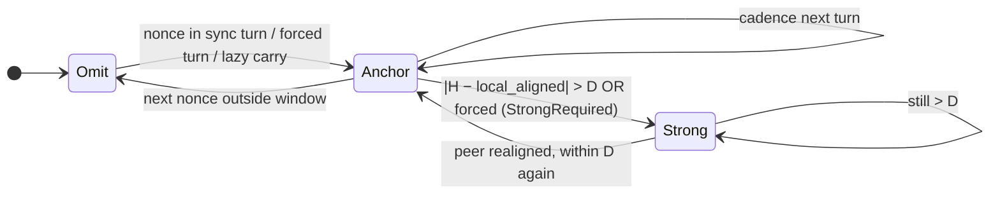
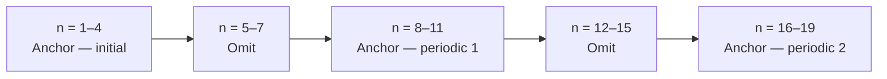
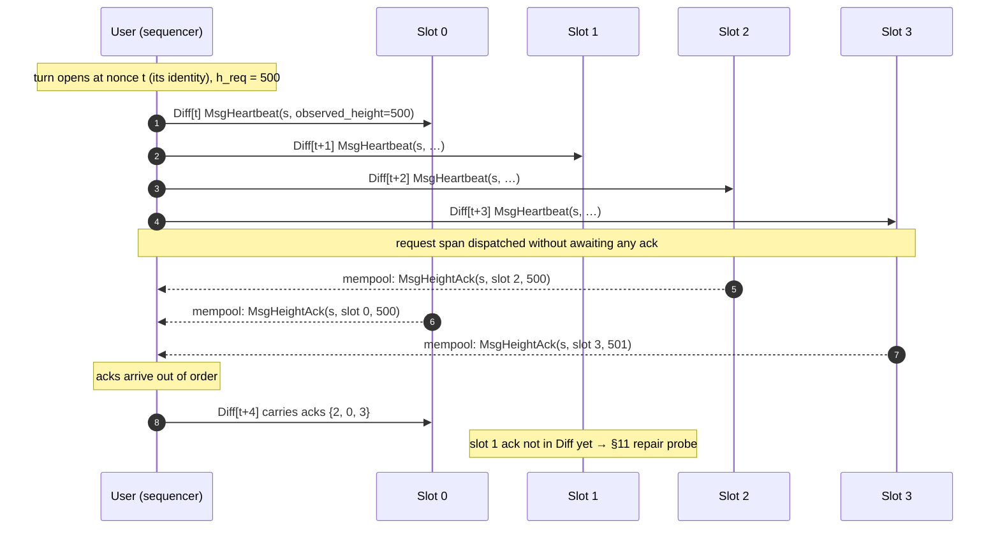
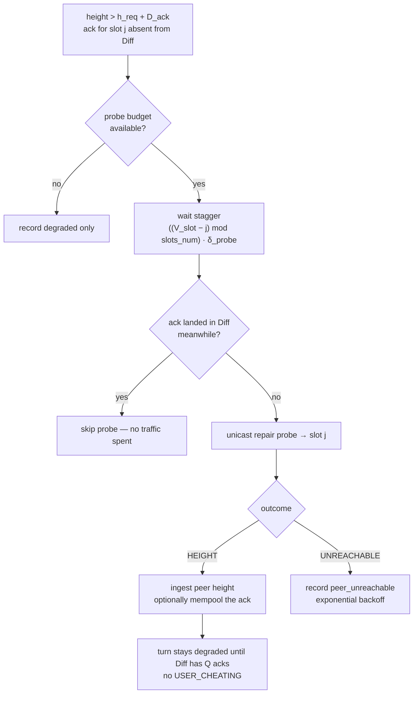
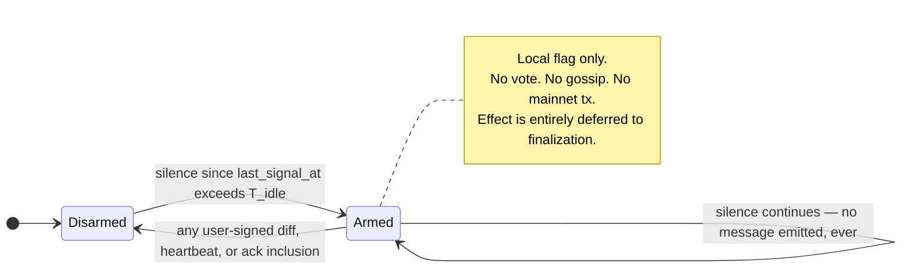

# Height-sync protocol

User ↔ host envelopes carry an **optional `HeightSyncSection`** that
attests to a mainnet `(height, block_hash)` pair. This section is the
sole input to cross-host time alignment and timeout decisions.
Downstream protocols (cPoC, finalization) gate adversarial votes on each
verifier's **local block oracle** (ready / stale), not on an
envelope-originator quorum. `block_hash` is a source of determenistic
randomness that is unknown in advance, used by
[`VALIDATION_PROTOCOL_PROPOSAL.md`](./VALIDATION_PROTOCOL_PROPOSAL.md)

This document is the **canonical, single-version** spec. The
in-tree implementation matches this document; the test catalog
([`height-sync-tests.md`](../height-sync-tests.md)) lists what is
already proven and what is planned.

Every normative rule below is bound to at least one row of the catalog:
§2–§5 for what is proven today, §6 for block-oracle sourcing, §7 for the
log plane of §10–§12 and the §14 checks, §8 for Strong.

Related docs:
[`height-sync-tests.md`](../height-sync-tests.md) (test catalog — implemented and planned),
[`height-sync-implementation-plan.md`](../height-sync-implementation-plan.md) (phasing, and the `D*` / `H*` identifiers the catalog carries),
[`CPOC_PROTOCOL.md`](./CPOC_PROTOCOL.md),
[`FINALIZATION_COLLECTOR_PROTOCOL_PROPOSAL.md`](./FINALIZATION_COLLECTOR_PROTOCOL_PROPOSAL.md),
[`VALIDATION_PROTOCOL_PROPOSAL.md`](./VALIDATION_PROTOCOL_PROPOSAL.md).

---

## Table of contents

1. [Summary](#1-summary)
2. [Problem](#2-problem)
3. [High-level overview of protocol](#3-high-level-overview-of-protocol)
4. [Goals](#4-goals)
5. [Glossary](#5-glossary)
6. [Architecture overview](#6-architecture-overview) (optional gateway follower is in this section)
7. [Wire format](#7-wire-format)
8. [Sync modes (Omit / Anchor / Strong)](#8-sync-modes-omit--anchor--strong)
9. [Cadence (sync turns, `K`, `slots_num`, forced turns)](#9-cadence)
10. [Heartbeat turns (mandatory height sync)](#10-heartbeat-turns)
11. [Peer sync status and the repair path](#11-peer-sync-status-and-the-repair-path)
12. [Close-ready arming (user silence)](#12-close-ready-arming)
13. [Producer rules](#13-producer-rules)
14. [Receiver pipeline](#14-receiver-pipeline)
15. [Trust model and signatures](#15-trust-model-and-signatures)
16. [Carry-forward, provenance, attribution](#16-carry-forward-provenance-attribution)
17. [Height readiness for consumers (local oracle)](#17-height-readiness)
18. [cPoC integration — full API](#18-cpoc-integration-api)
19. [Attack model and mitigations](#19-attack-model)
20. [Defaults and configuration](#20-defaults-and-configuration)
21. [Status and milestones](#21-status-and-milestones)

---

## 1. Summary

User–host inference traffic carries a **two-section HTTP body**:

1. **`HeightSyncSection`** — optional mainnet attestation: a signed
   `(mainnet_height, mainnet_block_hash)` pair, plus framing and
   provenance metadata.
2. **`message_body`** — the application payload (opaque to height
   sync).

Section 1 is **emitted only when needed**:

- **Sync turn** — the standard cadence: every `K` nonces, a window of
  `slots_num` consecutive nonces carries Anchor; in between, Omit.
- **Heartbeat turn** — the **mandatory** cadence in *wall-clock time*
  (`Interval`), **after** the first host-seeded floor (§10.3.1): when nonce
  traffic would leave the session quiet, the user MUST open a
  `slots_num`-wide turn whose entries land **in `Diff`** as signed
  `observed_height` stamps equal to `F` (§10). This is the liveness backbone
  of the protocol, not an optimization. A session that has never inferred
  does not heartbeat; hosts treat that as silence (`T_idle`).
- **Forced sync turn** — `MsgForceHeightSyncTurn` opens a
  `slots_num`-wide Anchor span at any nonce (cPoC dispute open,
  operator force). A heartbeat turn is wire-compatible with it.
- **`|Δ| > D`** — when the sender's claimed height differs from the
  receiver's aligned height by more than `D`, the sender MUST use
  **Strong** (`LightBlock` + `VerifyCommit`); otherwise the receiver
  rejects.

Height sync therefore has **two planes** that must not be confused:

| Plane | Carrier | Signed by | Durable? | Consumers |
| ----- | ------- | --------- | -------- | --------- |
| **Transport** | `HeightSyncSection` on the inference envelope (§7) | host on the response leg only; request leg carries no *section* signature (§15) | no — per-message | receiver pipeline, audit ring, Strong, divergence monitoring (§8.12) |
| **Log** | `observed_height` on diff-resident `MsgHeartbeat` / `MsgHeightAck`, and on stamped inference txs (§10.5) | **both** parties — user via the diff signature, host via `host_sig` / `proposer_sig` / `executor_sig` (§10.5.1) | yes — append-only `Diff` | cPoC height intervals, finalization `USER_TIMEOUT`, close-ready arming, in-session deadlines (§10.5.2) |

No signature spans both planes: `sender_signature` covers section fields
1–7 and never `message_body`, so a section and the diff in one exchange are
bound only **positionally**. That is why cross-plane checks (§14 L4) are
same-exchange checks that record a mark rather than replayable verdicts.

Everything before §10 specifies the transport plane. §10–§12 specify the
log plane, peer sync visibility, and what a host does when the sequencer
goes silent or drops a peer's answer.

Hosts sign **response-leg** Anchors with their secp256k1 signer key;
courier users carry these signed blobs forward, verifying on ingest
and using them as on-demand exculpation proof. Request-leg Anchors are
trusted by hosts (no inline signature) — the user proves provenance
later if disputed.

A single receiver pipeline classifies Omit / Anchor / Strong; signed
response tips and disputes attribute bad `(H, hash)` pairs. There is
**no** envelope-originator confirmation quorum — see §17.

---

## 2. Problem

At devshard we need source of mainnet height and randomness, that is unknowm in advance but is determenistic to make all hosts and user to aggree.

Each host has it's own latest `(height, block_hash)` oracle (inference chain grpc), and the prove by inference chain validators signatures. But hosts should aggree that any `height` provided to protocol is really latest. So there should be height sync protocol provided in this doc.

## 3. High-level overview of protocol

As devshard is designed for high throughput we aim to minimize extra data transferred in messages and minimize checks of minnet signatures. Also we are minimizing gossipping that should happen only on disputes and settlement to minimize traffic (as one host could be in a lot of devshard's)

So main design decitions are made:

- Height synchronization happens not on every nonce but only in specialized windows, where we add to request/response only `(height, block_hash)` and originator's (host that is responding to request) signature, to proove origin of this data for possible disputes. User is carrying forward `(height, block_hash)` at next requests to propogate this data to other hosts.
- Those windows are opened by nonce cadence **and** by a cadence in mainnet blocks (**heartbeat**, §10), because a session with no inference traffic advances no nonces and would otherwise stop synchronizing heights entirely. The `(height, block_hash)` a heartbeat carries is the **same** attestation as a normal sync-turn Anchor — not a second height format. What heartbeat uniquely does is (i) open a turn when there is no inference envelope to hang an Anchor on, (ii) put that attestation **into `Diff`** (so every later verifier sees the same signed stamp; the envelope itself is per-hop transport and never enters the log), and (iii) carry the roster's sync status so every host learns whether its peers answered and whether they were synchronized (§11). Inference txs SHOULD stamp the same `observed_height` into `Diff` when they exist (§10.5); heartbeat is required precisely when they do not.
- Because devshard is asynchronous, a heartbeat turn is dispatched to all slots without waiting for any answer; answers return out of order (§10.6). A missing answer in `Diff` is investigated by a **unicast probe to that host** (§11.3): the probe checks whether the peer is reachable and fetches its current height so alignment can continue. It does **not** prove whether the host never answered the sequencer or the sequencer omitted an answer it received — there is no receipt on the user↔host hop, so that omission **cannot** be attributed and **cannot** be used to punish the sequencer.
- Nothing in this layer votes. When the user goes silent, hosts only **mark themselves** ready to close the escrow (§12); the decision belongs to finalization.
- We trust heights in the future without additional mainnet proove if the height is close to the one we know is current. If there is a large disagreement between hosts on height (`height_in_the_future - known_height = |Δ| > D`) we use the full data from mainnet (block hash and validators signatures) to validate the height
- If we find that any earlier provided by any host `height` doesn't match the oracle `block_hash` we start the dispute

As the result we provide API at devshardd and devshardctl that gives latest
height and block hash from the local (or courier-cached) oracle, plus audit /
dispute surfaces for attribution.

---

## 4. Goals

1. **Cheap periodic alignment** — Anchor (no `LightBlock`) on a
   sync-turn schedule keeps every host's view of mainnet time within
   a bounded window without per-message proof overhead.
2. **Strong escalation on disagreement** — once `|Δ| > D` or
   finalization requires it, validator-quorum-bound proof
   (`LightBlock`) is mandatory.
3. **Provenance and attribution** — every cached `(H, hash)` is
   traceable to the originating host signature; carriers cannot be
   blamed for forwarding a malicious host's signed claim, and
   carriers that strip provenance become the cryptographic source.
4. **Replay resistance** — freshness budget `F` on originator
   timestamp + per-recipient last-propagated bookkeeping prevents a
   carrier from re-using stale or already-delivered tips.
5. **Height readiness for downstream consumers** — each verifier uses
   its **local block oracle** (and optional verified `LightBlock` when
   Strong is on the wire) to decide whether interval endpoints are
   ready enough to vote `Invalid`. Envelope carry-forward is for
   alignment and dispute evidence, not a multi-host confirmation tally.
6. **Courier-only deployment** — users with no mainnet follower of
   their own can still carry signed host tips between hosts in the
   round-robin so late hosts learn fresher tips. A gateway MAY
   optionally follow mainnet for verification (§6); that follower is
   not a protocol source and MUST NOT skip the host seed.
7. **Liveness independent of inference load** — alignment must not stop
   when the session goes quiet. The heartbeat cadence is measured in
   mainnet blocks and is **mandatory**, so a quiet escrow keeps a fresh,
   signed, log-resident height (§10).
8. **Mutual sync visibility** — a host must be able to tell, from the
   log alone, whether each peer's ack **appeared in `Diff`**, and must
   have a bounded way to ask a missing peer directly for its current
   height when the log is incomplete (§11). The probe does not decide
   *why* the ack is missing.
9. **Accountable sequencer silence without in-session voting** — user
   **silence** (no contact) is detectable locally and deferred to
   finalization (§12). A missing ack in `Diff` is **not** sequencer
   fraud evidence: the user↔host hop has no receipt.

---

## 5. Glossary

| Term | Meaning |
| ---- | ------- |
| **`HeightSyncSection`** | Wire-level header attached to every inference envelope; absent in Omit mode. |
| **Anchor** | `proof_type = "height-anchor-v1"`; carries `(H, hash)` without a `LightBlock`. Light path. |
| **Strong** | `proof_type = "cometbft-light-block-v1"`; carries `LightBlock` bytes; verified against pinned validator set with `> 2/3` voting power. |
| **Omit** | No `HeightSyncSection`. |
| **`H`** | Mainnet height; uint64. |
| **`hash`** | Canonical `BlockID.Hash` for block `H`. |
| **`K`** | Distance (in nonces) between sync-turn windows. Constraint: `K ≥ slots_num`. |
| **`slots_num`** | Width of a sync-turn window in nonces (equals escrow host slots). |
| **`D`** | Strong-escalation band; `\|H_peer − H_local_aligned\| > D` ⇒ Strong required. Default `2`. |
| **`F`** | Originator freshness budget. Default `60 s`. |
| **`W_conf`** | Confirmation-index window: the span of heights treated as contemporaneous for which attestations may be retained (`[tip − W_conf, tip]`, §17). Default `max(256, ⌈F / block_time⌉)`. It has **no role on the floor** — see *Why no `W_conf` on the floor* (§14). |
| **`F(m)`** | The reference height the log had established at nonces `< m`; the bar L0 holds every Diff-resident height to. Distinct from the freshness budget `F`. Raised only by **host-signed** first-party stamps; never exceeds the max reported host envelope `H` (§14). |
| **`FloorIndex`** | The structure that answers `F(m)`: the high-water mark of host-signed attributed claims. Sequencer-composed stamps (`MsgHeartbeat`, `MsgStartInference`) do not raise it. Carries (`stamp = F`) do not raise it. A raise is a host-signed first-party envelope height (`MsgHeightAck`, confirm, finish), at **any** distance — the height was bounded at admission (`\|Δ\| > D` ⇒ Strong), not here. Never lowers on the hot path. **Phase F** adds garbage cleanup after L6 if a garbage pair became `F` (*Garbage cleanup after L6* in §14). Retain window `DefaultFloorWindow` = 4096 *increases*. §14. |
| **`Q`** | Reachability threshold: `Q` distinct host-signed claims complete a heartbeat **turn**. Default `ceil(2/3 × N_hosts)`. Not a floor rule (the floor takes no vote, §14) and not envelope height confirmation (withdrawn §17). |
| **Originator** | The host whose **own oracle** first observed `(H, hash)`. Identified by `OriginatorSenderID` on the wire. Never the user or the gateway. |
| **Carrier** | Any sender that forwards a section it did not originate (typically the user). Identified by the session signature. |
| **`local_aligned`** | The receiver's view of mainnet height (its own follower on a host, or its peer-tip cache on a courier user). A gateway's optional chain follower (§6) is **not** protocol `local_aligned`. |
| **Local oracle readiness** | Whether this verifier's block oracle can evaluate height `h` (tip covers `h`, not stale). Consumed by cPoC instead of the withdrawn `IsStrictlyConfirmed` API. |
| **Heartbeat turn** | A `slots_num`-wide turn opened by the **time** cadence `Interval` instead of the nonce cadence `K`; carries `MsgHeartbeat` and obliges every slot to answer `MsgHeightAck`. §10. |
| **Turnover** | `Q` distinct **host-signed** height claims landing in the log — from `MsgHeightAck` or from executor stamps on ordinary inference traffic. A turnover is what discharges the heartbeat obligation; the user's own stamp does not, being self-signed. §10.3. |
| **`observed_height`** | Diff-resident, signer-bound scalar height claim. On `MsgHeartbeat` it is **always `F`**, seeded by a prior host envelope — the user has no protocol oracle, so a heartbeat MUST NOT open until at least one inference has produced that floor (§10.3.1). A host signs its own reading on `MsgHeightAck`. Distinct from `HeightSyncSection.mainnet_height`, which is transport-level and unsigned on the request leg. |
| **`turn_start`** | A turn's identity: the nonce its span opens at. Not a wire field — the diff chain is gapless, so a heartbeat inside the open span joins that turn and one past it opens a turn of its own. Nothing for a sequencer to choose, and monotone and bounded for free. |
| **Sync vector** | The user's signed per-slot report of ack status for the previous turn (`MsgHeartbeat.sync_vector`). Early visibility of who the user claims answered; only contradictions against `Diff` itself are attributable (§11.1). |
| **Repair probe** | Unicast host→host query when a peer's ack is missing from `Diff`. Fetches that peer's current height and liveness. Does **not** attribute the omission to host vs sequencer. §11.3. |
| **Close-ready** | Local, **unsignalled** host flag meaning "I would vote `AGREE` on a `USER_TIMEOUT` finalization". §12. |
| **`Interval`** | Heartbeat cadence in **milliseconds**: the longest gap allowed between turnovers. Default `12 s`; constraint `2 · Interval ≤ F`. |
| **`TurnTimeout`** | How long the user waits on one open turn before abandoning it. Default `2 · Interval` (`24 s`). |
| **Turnover budget** | `Interval + TurnTimeout`: the producer's own worst case for one turnover, and the quantity `D_ack` and `T_idle` are both stated against. |
| **`D_ack`** | The turn's ack window in mainnet blocks after the request height. Derived from the turnover budget through `block_time` (§20), default `37`. Stays in blocks: it judges *logged* heights, so it must replay identically. |
| **`T_idle`** | User-silence budget in **milliseconds** before a host arms close-ready. Default `4 · Interval` (`48 s`); constraint `T_idle > Interval + TurnTimeout`. |

---

## 6. Architecture overview

```mermaid
flowchart LR
    subgraph mainnet [Gonka mainnet]
        BC[CometBFT consensus]
    end

    BC -- "block headers + commits" --> HSD[heightsyncd / blockoracle]

    subgraph host [Host runtime]
        HSD --> SCH_H[AnchorScheduler<br/>local-oracle source]
        SCH_H --> TX_H[transport.Server<br/>signs response leg]
        TX_H -- "HeightSyncSection<br/>request inbound" --> RX_H[Receiver pipeline<br/>D-band, freshness, classify]
        RX_H --> AUD_H[AuditRing<br/>dispute evidence]
        AUD_H --> CPOC_H[cPoC consumer]
        HSD -- "local oracle tip" --> CPOC_H
    end

    subgraph user [Courier user / devshardctl]
        TIPS[HeightSyncPeerTips<br/>verbatim signed blobs] --> SCH_U[AnchorScheduler<br/>peer-tip source]
        SCH_U --> TX_U[transport.HTTPClient<br/>Carry, strip sig on request]
        TX_U -- "response inbound<br/>verify + cache" --> RX_U[Verify response Anchor<br/>RecordOriginWithBlob]
        RX_U --> TIPS
        TIPS -- "ObservedHeightNow / tips" --> CPOC_U[cPoC consumer]
    end

    TX_U -- "request leg<br/>HeightSyncSection" --> RX_H
    TX_H -- "response leg<br/>HeightSyncSection (signed)" --> RX_U

    subgraph log [Log plane §10-§12]
        HB[MsgHeartbeat<br/>user-signed observed_height]
        ACK[MsgHeightAck<br/>host-signed observed_height<br/>+ sync_state + peer_seen]
        TURN[SyncTurnRecord<br/>complete / degraded]
        ARM[close-ready flag<br/>no vote emitted]
    end

    TX_U -- "opens heartbeat turn<br/>every Interval ms" --> HB
    HB --> RX_H
    RX_H -- "mempool" --> ACK
    ACK -- "user appends" --> TURN
    HB --> TURN
    TURN -- "degraded: ack missing past D_ack" --> REP[Repair probe<br/>unicast host to host]
    REP -- "peer reachable: ingest height<br/>no blame" --> CPOC_H
    TURN -- "user silent > T_idle" --> ARM
    ARM -- "USER_TIMEOUT evidence" --> FIN[Finalization]
    TURN -- "reachability certificate<br/>advances h_last" --> CPOC_H
```



Key invariants:

- **Each host has its own mainnet follower** (`heightsyncd`/blockoracle);
  this is the canonical source of `local_aligned`.
- **The user is a courier.** Protocol `local_aligned` on the user side
  is the verified peer-tip cache, populated by signed host responses
  (seed + response legs). The user/gateway is never an originator:
  disputes exist to find **which host** provided a wrong `(H, hash)`,
  not whether the carrier invented one. A gateway process MAY follow
  mainnet independently; that follower is off-protocol (below).
- **`HeightSyncSection` is the only mainnet-related wire surface** on
  inference **envelopes**; the receiver pipeline is single-entry. Heights
  also appear inside `Diff` (log plane), but never as a second envelope
  field.
- **The log plane is additive, not a second pipeline.** `MsgHeartbeat` /
  `MsgHeightAck` are bound to the envelope sections of the same exchange
  (§10.4 binding rules), so there is one attestation per exchange with
  two carriers: transport for the hot path, log for anything replayable.
- **Only the user appends to `Diff`.** Hosts answer and, when a peer's
  ack is missing from the log, ask that peer directly for a height
  (§11.3). The probe does not attribute the omission. No host can open a
  turn, and no host votes here (§12.2).

### Optional gateway chain follower (verification only)

The protocol source of every user-emitted `(H, hash)` is a **host**.
The user carries, never originates. That is independent of whether the
gateway process can read the chain.

A gateway MAY subscribe to mainnet headers for its own use — trust
labels, delta logs, audit-ring `local_aligned`, historical
`LightBlock` lookup — behind one env var:

| Parameter | Value |
| --------- | ----- |
| Env | `DEVSHARD_GATEWAY_CHAIN_ORACLE` |
| Enable | `true` / `1` / `on` (case-insensitive) |
| Default | **off** |
| Mechanism | same stack as today's `loadHeightSyncProcessState`: Comet `NewBlock` tipcache + failover to `DEVSHARD_CHAINORACLE_URL` / direct RPC |
| Wired as | `ClientConfig.HeightSyncLogOracle` only |

Presence of `DEVSHARD_CHAIN_RPC` / `NODE_RPC_URL` /
`DEVSHARD_CHAINORACLE_URL` (needed to submit txs and, on hosts, to
follow) MUST NOT turn this on and MUST NOT change the scheduler
source.

When the flag is on, the follower MUST NOT:

1. Feed `AnchorScheduler.Decide` — the gateway scheduler is always
   `NewPeerTipOracleSource` over `HeightSyncPeerTips`.
   `NewAnchorSchedulerFromOracle` / `NewLocalOracleSource` are
   **host-side** constructors.
2. Populate `OriginatorSenderID` (that field is a host address) or
   emit a first-party Anchor.
3. Make `ObservedHeightNow` / `ObservedStampNow` return true. Those
   APIs read peer tips only.
4. Raise `F(m)`. Sequencer-composed stamps never raise the floor
   (§14); a gateway-read height is not even a sequencer stamp.
5. Skip, shorten, or satisfy the cold-start seed (§18.5). A local
   `Latest()` tip is not a host-signed Anchor and does not count
   toward seed quorum. Inference stays gated on the seed even while
   the follower is warm.

Why (5) is load-bearing: a seeded Anchor is exculpation. The origin
blob is what `HeightSyncEvidenceFor` returns so a later hash mismatch
becomes `DISPUTE_ORIGINATOR` against the named host rather than
`DISPUTE_CARRIER` against the user (attack model rows 1, 3, 27). A
gateway-minted pair has no host signature, so the protocol has no
honest party to blame but the carrier — which is the user, which is
the wrong target by design.

---

## 7. Wire format

`HeightSyncSection` is carried as protobuf field on the inference
envelope and JSON-mirrored for tooling. Field numbers are stable.

| # | Name | Type | Required when | Notes |
|---|------|------|---------------|-------|
| 1 | `proof_type` | `string` | Anchor / Strong | `"height-anchor-v1"` (Anchor) or `"cometbft-light-block-v1"` (Strong). |
| 2 | `mainnet_height` | `int64` | Anchor / Strong | Block height `H`. MUST NOT be set in Omit. |
| 3 | `mainnet_block_hash_hex` | `string` (hex) | Anchor / Strong | Canonical `BlockID.Hash` for `H`. |
| 4 | `timestamp_unix_ms` | `int64` | always | When the **carrier** built this section. |
| 5 | `direction` | `string` | always | `"request"` or `"response"`. |
| 6 | `originator_sender_id` | `string` | carry-forward | The host that first observed `(H, hash)` from its own oracle. Carrier MUST preserve. |
| 7 | `originator_timestamp_unix_ms` | `int64` | carry-forward | The originator's observation timestamp. Drives freshness gate `F`. |
| 8 | `sender_signature` | `bytes` | **response leg only** | secp256k1 signature over canonical bytes of fields 1–7 + domain `"heightsync.origin.v1"`. Empty on request leg. |
| 9 | `light_block` | `bytes` | Strong only | Serialized `LightBlock`-equivalent (`blockoracle.Header` with `Commit.Signatures`). |
| 10 | `tip_stale_after_ms` | `int64` | optional (Anchor) | **Advisory only** — not origin-signed. Milliseconds since the producer's block oracle last ingested a **new** header. Set when cadence wanted Anchor but the feed is quiet (long block time, `StaleAfter` exceeded) while a cached `(H, hash)` is still available. Absent when the tip is fresh or on courier carry-forward re-emits. Receivers MUST NOT treat this field as part of the cryptographic attestation; use freshness gate `F` on originator timestamps and local-oracle readiness (§17) for liveness. |

Notes:

- **Degraded Anchor (quiet feed).** When the local oracle has not
  received a new block within `StaleAfter` but `Latest()` still
  returns a cached header, hosts emit a normal Anchor (fields 1–8) plus
  field 10. This avoids sync-turn **response** Omit during long
  inter-block gaps; consensus across hosts still corrects a minority
  with an outdated tip. **Omit** remains mandatory when there is **no**
  cached tip (feed never started), `Latest()` fails (feed unavailable),
  or the courier peer-tip cache is empty.
- **Direction-bound signatures.** Field 8 is set by hosts on responses
  only. `Carry()` clears field 8 before sending on the request leg;
  inbound request validation does not require an inline signature.
- **Canonical signing input.** `CanonicalOriginBytes(sec)` =
  `"heightsync.origin.v1" || proto.Marshal(fields 1..7)`. Field 8
  is **not** part of the signing input.
- **Wire-level reservation.** `origin_attestation` (embedded
  originator blob) is reserved for future inline-embed deployments;
  current protocol uses the **asymmetric** model (response signed,
  request trusted, on-demand exculpation).

JSON mirror:

```json
{
  "height_sync": {
    "proof_type": "height-anchor-v1",
    "mainnet_height": 42,
    "mainnet_block_hash_hex": "abc...",
    "timestamp_unix_ms": 1700000000000,
    "direction": "response",
    "originator_sender_id": "gonka1host...",
    "originator_timestamp_unix_ms": 1700000000000,
    "sender_signature": "base64...",
    "light_block": "base64...",
    "tip_stale_after_ms": 12000
  }
}
```

(`tip_stale_after_ms` omitted when the cached tip is fresh.)

---

## 8. Sync modes (Omit / Anchor / Strong)



| Mode | Section 1 fields 2/3 | Field 9 (`light_block`) | When |
| ---- | -------------------- | ----------------------- | ---- |
| **Omit** | absent | absent | Between sync turns; courier peer-tip cache cold; host feed unavailable or **no cached tip**. |
| **Anchor** | present | empty | Inside a sync-turn window (cadence / initial / forced) or lazy carry-forward in courier mode. |
| **Anchor (degraded)** | present + field 10 | empty | Same as Anchor when cadence applies but the host oracle is **quiet** (`StaleAfter` since last block) and a cached tip exists — see field 10. |
| **Strong** | present | non-empty (verified) | `\|Δ\| > D`, finalization-grade, or forced turn with `StrongRequired = true`. |

Periodic alignment uses **Anchor only**. Strong is **not** a default
cadence step — it is the disagreement / dispute path.

**Quiet feed vs dead feed (hosts):**

| Oracle state | Cached tip | Sync-turn response |
| ------------ | ---------- | ------------------ |
| Fresh (block within `StaleAfter`) | yes | Anchor (no field 10) |
| Quiet (no new block within `StaleAfter`) | yes | **Degraded Anchor** (`tip_stale_after_ms` > 0) |
| Quiet or fresh | no | Omit (`oracle_miss` when cadence required) |
| Unavailable (`Latest()` error, e.g. height-sync stopped) | — | Omit |

---

## 9. Cadence

### Sync-turn windows

For a session direction, on outgoing nonce `n`:

- **Initial sync turn:** `1 ≤ n ≤ slots_num` → Anchor (or Strong, see §13).
- **Periodic sync turns:** for every `i ≥ 1`, `i·K ≤ n ≤ i·K + slots_num − 1` → Anchor.
- All other nonces → **Omit**, unless a force directive or lazy carry-forward applies.

Constraint: `K ≥ slots_num` so windows never overlap.



### Forced sync turn

`MsgForceHeightSyncTurn(trigger_nonce, slots_num, reason,
strong_required?)` opens an `ActiveForcedTurn{start, end}` span:

- **Both directions** MUST emit Anchor for every envelope in
  `[start, end]`. Omit inside a forced turn is INVALID.
- `strong_required = true` upgrades the window to Strong.
- A second directive while a turn is active is **silently ignored**.
- A forced window that overlaps the next cadence window **swallows**
  it (no double-Anchor on boundary).
- After `n > end`, cadence resumes from the standard rule.

### Lazy carry-forward (courier deployments)

Outside any sync-turn window, the courier user MAY emit Anchor on a
request leg iff:

1. The peer-tip cache holds a fresh originator section
   (`MaxFresh(now, F)` returns non-nil).
2. `cached_max_height > last_propagated[recipient]`.

The receiver classifies this as **`VALID_LAZY_ANCHOR`** (audit tag
`lazy`); it does **not** open a sync-turn obligation.

---

## 10. Heartbeat turns

### 10.1 Why the §9 cadence is not sufficient

Every trigger in §9 is indexed by **nonce**. On a session with steady
inference traffic that is ideal — real work pays for the alignment and
no extra message exists. On a **quiet** session it fails completely, and
it fails *silently*:

| Consequence when nonces stop advancing | Who breaks |
| -------------------------------------- | ---------- |
| No new `(H, hash)` enters circulation; every cached tip ages past `F` | Local oracles go stale / courier cache empty; cPoC holds `Inconclusive` (§17) |
| cPoC's height interval `I = [h_X, h_carry]` is never tightened from above | [`CPOC_PROTOCOL.md`](./CPOC_PROTOCOL.md) **C14** strategic-delay attack succeeds: a host signs a *fresh lie* during a later genuine cPoC window and the wide band admits it |
| No **user-signed** height claim exists anywhere in the log — §15 signs the response leg only | [`FINALIZATION_COLLECTOR_PROTOCOL_PROPOSAL.md`](./FINALIZATION_COLLECTOR_PROTOCOL_PROPOSAL.md) `USER_TIMEOUT` requires "latest user `HeightSyncSection` … with … sender signature", which is **unsatisfiable** under §15 as written |
| Hosts see only their own tip plus whatever the courier hands them | a host cannot distinguish "the roster is aligned" from "I am the only aligned host" |
| A host that never answered and a host whose answer the user dropped are indistinguishable | a stalled turn cannot be attributed to anyone |

The fix is one mechanism with three properties the §9 cadence lacks:
the cadence is measured in **mainnet blocks** (so it survives a quiet
session), the height claims land **in `Diff`** (so they are signed,
durable, and identical for every verifier), and the turn carries the
**roster's sync status** (so hosts see each other, §11).

### 10.2 Relationship to cPoC C14 — one heartbeat, not two

cPoC C14 already describes a heartbeat, but scoped as a *developer-side
courtesy* whose only purpose is tightening the cPoC band, riding
`MsgSkipProbe` — a message that only exists where cPoC is deployed, and
whose omission C14 explicitly tolerates ("a careless or lazy `D` exposes
itself to being lied to").

This section **promotes that mechanism to a required part of height
sync** and inverts the ownership: the heartbeat is a height-sync
primitive that exists with or without cPoC, and cPoC C14 becomes a
*consumer* of it. Normative mapping:

| Deployment | Heartbeat carrier | Ack carrier |
| ---------- | ----------------- | ----------- |
| No cPoC | `MsgHeartbeat` (§10.4) | `MsgHeightAck` (§10.4) |
| cPoC deployed | `MsgSkipProbe` **or** `MsgHeartbeat` — a probe carrying `observed_height` satisfies the turn's obligation for its target slot | `CarrySkip`-wrapped `CPoCProbeResponse` carrying `observed_height`, **or** `MsgHeightAck` |
| Any | any diff-resident message that carries a signed `observed_height` (§10.5) satisfies the obligation for its signer's slot | — |

There is therefore **one** height-exchange mechanism at any deployment
level; cPoC adds a payload to it rather than a parallel channel. This
also resolves cPoC open question **11(iv)** ("is C14's closure
structurally in the wire format or operationally via heartbeats"): it is
**structural** — `observed_height` is a required field on the heartbeat
pair (§10.5).

### 10.3 Cadence, initiator, and enforcement

**Initiator: the user, necessarily.** The user is the sequencer; it is
the only party that can append to `Diff`. A host cannot open a heartbeat
turn, only answer one. This is not a trust concession — it is the reason
§12 exists: the user's obligation is enforced by **hosts arming to close
the escrow**, not by a slashable in-session verdict.

**Obligation.** Let `t_last` be the instant of the last **turnover**: the
moment `Q` distinct host-signed height claims last landed, whether from
`MsgHeightAck` (§10.4) or from executor stamps on ordinary inference
traffic (§10.5). Then:

> If `now − t_last > Interval`, the user MUST open a heartbeat turn
> — **but only after `F` has been seeded** (§10.3.1). Until then the
> obligation is disarmed.

**Why time and not blocks.** The obvious formulation — "if
`h − h_last > K_hb`, open a turn" — is circular for exactly the session
it is meant to protect. A courier user has no follower of its own; its
only source of mainnet height *is* a completed height sync. So a quiet
user cannot observe `h` advancing until it heartbeats, and it will not
heartbeat until it observes `h` advance. Wall-clock time is the one clock
every party holds without asking anyone, so the *schedule* is in
milliseconds. The remaining circularity — no height to put *in* the
heartbeat — is §10.3.1: the first host inference seeds `F`, then the
clock may start. Everything that gets **judged** stays in blocks —
`D_ack` lateness, `|Δ| > D`, monotonicity — because those must replay
identically from the log, and a verifier replaying history has no access
to the producer's clock.

**Real traffic discharges the obligation for free.** Any turnover counts
— including an ordinary §9 cadence turn, and including inference
messages that carry a host's `observed_height` (§10.5). Heartbeats are
emitted *only* when the session would otherwise be quiet, exactly as in
cPoC C14's "conditional on absence of real traffic" rule. A busy escrow
pays nothing for this section.

#### 10.3.1 Heartbeat init: first inference seeds `F`

`MsgHeartbeat.observed_height` is the user's initiating stamp. The user
has no protocol oracle, so that field cannot exist until a **host** has
admitted an envelope and a host-signed stamp has set `F`. This is a
chicken-and-egg on purpose: the heartbeat is not a height source.

**Rule.** At least one inference MUST complete far enough for a host
response-leg envelope to be admitted and a host-signed Diff stamp
(`MsgConfirmStart` or `MsgFinishInference`) to raise `F`. Only after
that init MAY the user open a heartbeat turn. Every
`MsgHeartbeat.observed_height` is then **exactly `F`** (same hash), the
floor that host seeded. Courier tips stay on the envelope; they MUST
NOT appear as a user Diff stamp. `MsgHeightAck` cannot seed the first
`F`: it answers a heartbeat, so it cannot come first.

An unstamped heartbeat, a heartbeat while `F` is still unknown, or a
user stamp `≠ F` once `F` is known, is a protocol error. Hashless “quiet
from t=0” heartbeats are not a substitute: they would re-introduce a
user-chosen integer (P1) or a heightless turn that still looks like
contact.

**Enforcement on the receiving host.** The bound is checked where the
diff is verified, not only where it is composed, and the two directions
are not symmetric:

| user stamp | verdict | why |
| --- | --- | --- |
| `H < F(m)` | `INVALID(height_regression)` | existing L0; the log's own monotonicity |
| `H > F(m)` | **`MARK(height_unbacked)`**, logged at **error** level, diff applies | the claim is already inert — rule 3 keeps it out of `F` and the turn clock reads host stamps only — while `INVALID` on a floor read would let one lagging verifier refuse a diff the rest accept, splitting the escrow over a claim that changes nothing |
| `H = F(m)` | clean | the only stamp a user owes |

The mark is not a shrug: it cannot fire on honest lag, because the
producer had the log in front of it and `F` is *in* the log. Until
disputes land, the error-level line is the whole operator signal — which
is also the argument for the follow-up below.

**Planned: dispute signal, not only a log line (⏳ §18).** `height_unbacked`
names authored misbehaviour with the signature attached, so it belongs on
the same dispute path as L6 `DEFERRED_FAIL` rather than in an operator's
log grep. The signal is deliberately deferred until the Strong phase
(§15) provides the artifact a dispute is judged against.

A session that never infers therefore never heartbeats. Hosts arm
close-ready on `T_idle` of silence — the same path as today when
nothing arrives. The first inference **is** the init: without it there
is nothing to put in `MsgHeartbeat`. Session-open seed (§18.5 / E9) may
still warm the **envelope** cache for that first inference; it MUST NOT
count as `F` and MUST NOT authorize a heartbeat.

**A stalled turn must not silence the cadence.** A turnover needs `Q`
distinct hosts, so one unreachable slot can leave a turn open forever. The
user therefore abandons an open turn after `TurnTimeout` and opens the
next one, and also gives up as soon as the log settles the turn as
`degraded`. Abandonment is a producer-side scheduling decision only: the
`SyncTurnRecord` still degrades from the log, on logged heights, so the
record stays replayable.

`TurnTimeout` MUST exceed `Interval`, and the log's ack window MUST outlast
both. A turn is dispatched slot by slot and only then waits for acks, so
patience equal to the interval abandons every turn at the moment the next
becomes due — a session whose round trips run long then reopens forever and
records no turnover at all. Symmetrically, `D_ack · block_time` MUST be at
least `Interval + TurnTimeout`, the producer's whole turnover budget:
below it the log disowns a turn while its own producer is still legitimately
collecting the acks it asked for. This is why `D_ack` is **derived** from
the schedule (§20) rather than chosen: it is the same budget the producer
holds in milliseconds, expressed in the only unit a verifier can check.

**Wire compatibility with forced turns.** The first nonce of a heartbeat
turn SHOULD also carry `MsgForceHeightSyncTurn{reason = "heartbeat"}`.
That single reuse makes the **existing** forced-turn enforcement (§14
step 2: Omit inside the span is `INVALID`) cover the whole heartbeat
span with **no new receiver rules** — a heartbeat turn is a forced turn
plus diff-resident stamps plus an ack obligation.

### 10.4 Wire format

Two new members of the `DevshardTx` oneof
(`devshard/proto/devshard/v1/diff.proto`), claiming oneof field numbers
**`10`** (`MsgHeartbeat`) and **`11`** (`MsgHeightAck`) — `1..9` are
taken today. cPoC's `MsgSkipProbe` / `CarrySkip` must then claim `12`/`13`;
the two proposals are the only current claimants, so the allocation has to
be agreed before either lands. `SyncVectorEntry` and its `AckStatus` enum
are defined in §11.1; the `SyncState` enum in §11.2.

```proto
// MsgHeartbeat — user → Diff. Payload-free; exists to stamp a signed
// height into the log and to publish the roster's sync status.
message MsgHeartbeat {
  reserved 1;                       // was turn_seq; a turn is named by its span-start nonce
  uint64 observed_height       = 2; // always F, host-seeded; see §10.3.1 / §10.5
  bytes  observed_block_hash   = 3; // canonical BlockID.Hash for observed_height
  uint64 slots_num             = 4; // turn width; must equal escrow group size
  string reason                = 5; // height_cadence | quiet_session | forced | cpoc_band
  repeated SyncVectorEntry sync_vector = 6; // status of the preceding turn; §11.1
}

// MsgHeightAck — host → its mempool → Diff (the existing path that
// carries MsgConfirmStart / MsgRevealSeed). Host-signed: the user must
// not be able to fabricate an ack.
message MsgHeightAck {
  reserved 1;                       // was turn_seq; derivable from ref_nonce
  uint64    ref_nonce           = 2; // nonce of the MsgHeartbeat being answered
  uint32    slot_id             = 3;
  uint64    observed_height     = 4;
  bytes     observed_block_hash = 5;
  SyncState sync_state          = 6; // §11.2
  bytes     peer_seen           = 7; // bitmap, bit j = "slot j fresh within F"; §11.2
  bytes     host_sig            = 8; // over HeightAckContent, domain "heightsync.ack.v1"
}
```

Binding rules (all `MUST`):

| Rule | Violation is attributable to | Detected by |
| ---- | ---------------------------- | ----------- |
| `MsgHeightAck.observed_height` equals `max(anchor, F(ref_nonce + 1))`, the anchor being the **response-leg** `HeightSyncSection` on the same response | the **host** — it signed two heights for one response that the producer rule cannot reconcile | `DISPUTE_ORIGINATOR` **on sight**, no oracle lookup needed |
| `MsgHeartbeat.observed_height` equals `max(request-leg section height, F(m))` when a first-party section is present | the **user** — the diff signature and the envelope disagree | `DISPUTE_CARRIER` |
| `MsgHeightAck.ref_nonce` names a `MsgHeartbeat` already in `Diff` | the host (forged ack) or the user (forged carry) | causality check, as cPoC C3′ |
| `slots_num` equals the escrow group size, `8 · len(peer_seen) ≥ slots_num`, and `len(peer_seen) ≤ ⌈slots_num/8⌉` | proposer | framing |

`HeightAckContent` is the canonical signing input: domain
`"heightsync.ack.v1"` followed by `proto.Marshal` of fields `1..7`.
Field `8` is excluded, exactly as §7 excludes field 8 from
`CanonicalOriginBytes`.

**When an ack is emitted.** `MsgHeightAck` answers a **heartbeat turn**;
it is not a stamp attached to every host response. It exists because a
quiet turn has no other host-signed tx to carry a height: the user is the
only party that can append to `Diff`, the response-leg
`HeightSyncSection` is stripped at the transport edge and never enters the
log, and `MsgHeartbeat` alone proves only what the *user* claimed. The ack
is the minimal host-signed, turn-bound tx that closes that gap, and it is
also the only carrier of `sync_state` + `peer_seen` (§11).

| Situation | Height carrier in the log | `MsgHeightAck` |
| --------- | ------------------------- | -------------- |
| Host answers `MsgHeartbeat` | `MsgHeightAck` | REQUIRED |
| Host produces `MsgConfirmStart` / `MsgFinishInference` carrying a stamp (§10.5) | that tx | not emitted — the stamp discharges the obligation for its signer's slot |
| cPoC deployed | `CarrySkip`-wrapped `CPoCProbeResponse` carrying `observed_height` | MAY substitute (§10.2) |
| Repair probe answers `HEIGHT` (§11.3) | probe response | MAY be offered into the prober's mempool as courtesy repair; never evidence |

A busy escrow that stamps its inference txs therefore emits neither
heartbeats nor acks.

### 10.5 `observed_height`: why the log plane exists

`HeightSyncSection` cannot serve the log plane, for two independent
reasons:

1. **It is not signed on the request leg** (§7 field 8, §15). The user's
   height claim is therefore unattributable — which is precisely the gap
   that makes finalization's `USER_TIMEOUT` evidence unsatisfiable
   today.
2. **It is a transport envelope field, not a diff field.** It never
   enters the append-only log, so a verifier reconstructing the session
   from `Diff` alone cannot see it. cPoC's verdict predicate assumes
   heights are derivable from `Diff` (its `height_at[·]` map is built at
   diff-ingest time and is explicitly *local only*, which is why two
   verifiers can disagree).

`observed_height` fixes both: it is inside `DiffContent`, so the **user
signs it** by signing the diff, and the **host signs it** with
`host_sig` on the ack. Consequences worth stating explicitly:

- Two verifiers replaying the same `Diff` derive the **same** heights
  for heartbeat nonces. cPoC's per-verifier `height_at[·]` divergence
  shrinks to the nonces *between* stamps.
- A user-signed height claim now exists in the log, so
  `USER_TIMEOUT` evidence is satisfiable (§12.4).
- `MsgHeartbeat` / `MsgHeightAck` carry it as **REQUIRED** once a
  heartbeat is allowed to exist: the heartbeat value MUST equal `F`
  (§10.3.1). A heartbeat MUST NOT be composed before that init.
  `MsgStartInference` / `MsgConfirmStart` / `MsgFinishInference` SHOULD
  carry it too; where they do, real traffic discharges the heartbeat
  obligation (§10.3) and tightens cPoC bands with **zero** extra
  messages. Deployments that do not stamp existing messages are correct
  but pay more heartbeats after the first inference. This is the
  migration seam: the new messages are required from day one, the
  stamps on existing messages can land later.

#### 10.5.1 One stamp per message, inside that message's own signature

**A stamp MUST be covered by the signature of its own producer.** This is
not automatic, because devshard signs different txs over different
inputs. Two patterns exist, and only one is safe by default:

| Pattern | Messages | Signing input | Effect of appending `observed_height` |
| ------- | -------- | ------------- | ------------------------------------- |
| **Whole-message** | `MsgFinishInference`, `MsgValidation`, `MsgValidationVote` (`proposer_sig`) | `deterministicMarshal(msg)` with the signature field zeroed | covered **automatically**; no signing change |
| **Separate content** | `MsgConfirmStart` (`executor_sig` over `ExecutorReceiptContent`) | a *different* message, rebuilt field-by-field at ingest | **not covered** unless the content message is extended too |

`ExecutorReceiptContent` is a signing input only — it never enters
`Diff`. The verifier reconstructs it from committed state
(`prompt_hash`, `model`, `input_length`, `max_tokens`, `started_at`,
`escrow_id`) plus the fields the tx carries (`inference_id`,
`confirmed_at`). A field present on `MsgConfirmStart` but absent from
`ExecutorReceiptContent` is therefore **outside the executor's
signature**: the sequencer could rewrite the executor's height and
`executor_sig` would still verify. Normative:

> A deployment that stamps `MsgConfirmStart` MUST also add
> `observed_height` / `observed_block_hash` to `ExecutorReceiptContent`,
> MUST include them when signing the receipt, and MUST copy them from
> the tx into the reconstructed content before signature recovery.
> Otherwise the host-attributed height is user-forgeable and MUST NOT be
> treated as a host attestation.

The same rule generalises: **any** future stamp on a message whose
signature is over a separate content message must be mirrored into that
content message. `confirmed_at` already follows this pattern and is the
reference implementation.

**No `*_at_height` fields.** `observed_height` on a message already means
“the height its signer observed when producing this message”, which is
exactly what `started_at_height` or `confirmed_at_height` would mean on
the wire. Two fields for one value require a third rule to keep them
consistent, so exactly one stamp per message is carried. Event-specific
names belong in **derived state**, not on the wire: the inference record
SHOULD keep `started_at_height` and `confirmed_at_height` copied from the
stamps of `MsgStartInference` and `MsgConfirmStart`, because a single
inference has two distinct events and the consumers of a duration read
the record rather than the txs.

**Signer semantics.** A stamp is only as strong as the key on it:

| Stamp | Signer | Strength |
| ----- | ------ | -------- |
| `MsgHeartbeat`, `MsgStartInference` | user (diff signature) | a **claim** — attributable to the user, verified against the chain by L6 |
| `MsgHeightAck` (`host_sig`), `MsgFinishInference` (`proposer_sig`), `MsgConfirmStart` (`executor_sig`, if mirrored) | host | an **attestation** — rewriting it is forgery of that host |

Both are strictly stronger than the wall-clock timestamps they sit next
to: an `int64` timestamp is unfalsifiable, whereas `(H, hash)` must match
a real block, so even a user-originated stamp is checkable while
`started_at` never was.

#### 10.5.2 Consequence — timeouts and seals can leave wall time

`observed_height` in the log plus the derived record heights make it
possible to express in-session deadlines in blocks rather than in each
verifier's local clock:

| Decision | Wall-clock form | Height form |
| -------- | --------------- | ----------- |
| Execution timeout | `now − confirmed_at ≥ ExecutionTimeout`, evaluated against the verifier's own clock | `h_local − confirmed_at_height ≥ ExecutionTimeoutBlocks` |
| Refusal timeout | `now − started_at`, where `started_at` is user-controlled and unverifiable | `h − started_at_height`, now checkable via L6 |
| Deterministic seal clock | max `confirmed_at` over the recent confirmed window | max `confirmed_at_height` — a chain-verifiable logical clock |

This is the §1 motivation applied inward: a deadline that depends on each
host's clock cannot be agreed on, a height can. Migration is deliberately
two-step — a deployment first **carries** the heights, and only later
**switches** decisions onto them, because any decision that folds into a
state root must change under a version gate rather than a runtime flag,
or two participants compute different roots.

### 10.6 Asynchronous fan-out — the turn is pipelined, never serialized

devshard is asynchronous: the user does not wait for one host's response
before addressing the next host. That is a **normative constraint on
this protocol**, not an implementation note.



Rules that follow from this and that verifiers MUST honour:

- **The request span is deterministic; the ack tail is not.** The span is
  `slots_num` consecutive nonces `[t, t + slots_num − 1]`; because
  `executor(n) = hosts[n mod slots_num]`, any such span addresses every
  slot exactly once, so no nonce alignment is required. Acks land at
  arbitrary later nonces, in arbitrary order, possibly several in one
  diff.
- **Absence of an ack is not a fault before the deadline.** An ack is
  "missing" only once mainnet height exceeds `h_req + D_ack`, where
  `h_req` is `observed_height` on the heartbeat it answers. Treating an
  outstanding ack as a fault earlier is a protocol error — it would
  penalise the asynchrony the design depends on.
- **A sync vector inside a turn is nearly empty, by construction.**
  Because the span is dispatched before any ack returns,
  `MsgHeartbeat.sync_vector` at nonce `t + j` can only report what the
  user held when it *composed* that diff. The vector therefore reports
  turn `s − 1`, not `s` (§11.1).
- **Late acks are admitted.** An ack appended after the deadline still
  carries a reference height and is admitted for logical-time purposes,
  tagged `late` iff `observed_height > h_req + D_ack`. The comparison is
  against the ack's **own** stamp rather than its landing nonce or the
  ingest height of its diff, because that stamp is set by the host when it
  composes the answer: it is the one timestamp in the log the sequencer can
  neither forge nor backdate, which is what makes a withheld-then-drip-fed
  ack visible at all. A `late` tag does **not** erase the turn's degraded
  mark (§10.7) — otherwise a user could game the arming clock in §12 by
  drip-feeding stale acks. Since acks no longer confirm heights at all
  (§17), an admitted late ack cannot manufacture confirmation either.

### 10.7 Turn record and completion

Each verifier maintains, per escrow, from `Diff` alone:

```
SyncTurnRecord{
  turn_start = t, request_span [t, t + slots_num − 1], h_req,
  acks: slot → (nonce, observed_height, observed_block_hash, sync_state, late?),
  state ∈ {open, complete, degraded},
  completed_at_height,
}
```

| State | Condition |
| ----- | --------- |
| `open` | mainnet height ≤ `h_req + D_ack` and fewer than `Q` acks present |
| `complete` | acks from `≥ Q` distinct slots are in `Diff` — `Q = ceil(2/3 × slots)`, reachability only (§17) |
| `degraded` | height passed `h_req + D_ack` with `< Q` acks |

`h_req` is the height the request span was composed at, and it ignores any
heartbeat height carried without a hash: presence is keyed on the hash
throughout (§7), and `h_req` is a minimum, so admitting a hashless height
would pin the window low and make every honest ack late.

Both terminal states are final. A late ack never clears `degraded` (attack
22), and it never clears `complete` either — otherwise a slot that answered
in time could re-ack past the deadline and pull the turn's count back under
quorum after the fact.

Only a `complete` turn advances `h_last` (§10.3). A `degraded` turn means
the log is missing acks — `Diff` cannot say whether those hosts never
answered or the sequencer never appended what they sent. §11 is how a host
**contacts the missed peer and fetches a height**, not how it assigns blame.

Because every input is in the signed log, **all honest verifiers compute
the identical record**. What that record certifies is **reachability**: `Q`
slots answered within the deadline. It deliberately does not certify that
those slots saw any particular block — an ack carries a reference height,
which a lagging host may lift from the floor (§14), so the record cannot
distinguish `Q` independent observations from one observation echoed `Q`
times. Height readiness for consumers is each verifier's **local oracle**
(§17); optional Strong supplies a cryptographic `LightBlock` when required.

---

## 11. Peer sync status and the repair path

§10 makes heights durable in `Diff`. This section answers two questions
a host can actually answer about its **peers**: *did that host's ack
appear in the log?* and *if not, is that host reachable so I can still
learn its height?* It does **not** answer *why* the ack is missing.

### 11.1 Sync vector — the user's signed claim about the roster

```proto
message SyncVectorEntry {
  uint32    slot_id         = 1;
  AckStatus status          = 2; // §11.1 table below
  uint64    observed_height = 3; // as acked; 0 unless status = ACKED
  uint64    ack_nonce       = 4; // Diff nonce where the ack was appended; 0 if none
}
```

`AckStatus` is deliberately named apart from `MsgHeightAck.sync_state`
(§11.2): this enum is the **user's** claim about whether an ack is in
the log it is signing, not the host's claim about mainnet.

| `AckStatus` | User's claim |
| ----------- | ------------ |
| `ACKED` | a valid ack is in `Diff` at `ack_nonce` |
| `MISSING` | no ack for this slot is in `Diff` yet |
| `UNREACHABLE` | the request itself could not be delivered (transport failure) |
| `REJECTED` | an ack arrived on the p2p hop but failed a validity check (§14 L0–L3), so it was not appended |

The vector carries **one entry per slot** for the preceding turn
(§10.6). It is not a compression of the log — the log is authoritative,
and every host eventually sees every diff. Its value is **early
visibility**: hosts learn the user's view of the previous turn before
they have ingested later diffs.

The only user-attributable contradiction is against **`Diff` itself**
(the user signed both the vector and the log):

| User's vector says | Log says | Reading |
| ------------------ | -------- | ------- |
| `ACKED(j, h, n)` | ack present at `n` | consistent |
| `ACKED(j, h, n)` | **no ack at `n`** | user signed a claim its own log refutes ⇒ user-attributable |
| `MISSING` / `UNREACHABLE` / `REJECTED` | no ack | **inconclusive** — compatible with a silent host *and* with a sequencer that omitted a received ack. A later probe (§11.3) does not change this. |

A repair-probe payload MUST NOT be used to "contradict" `MISSING` or
`REJECTED`. The probed host can sign an ack **now** that it never sent
to the sequencer; treating that as censorship evidence would let a host
frame the user.

### 11.2 `sync_state` and `peer_seen` — a host's own view

`MsgHeightAck.sync_state` is the host's self-report, evaluated against
the turn's reference height `h_ref` (the `observed_height` of the
heartbeat it answers):

| `sync_state` | Condition at the answering host | Protocol consequence |
| ------------ | ------------------------------- | -------------------- |
| `SYNCED` | own oracle tip within `D` of `h_ref`, tip fresh, hash matches its oracle | none |
| `CATCHING_UP` | `h_ref − h_local > D` | the **next** heartbeat addressed to this slot MUST be **Strong** (§8): a host that cannot reach `h_ref` on its own oracle can only verify it from a `LightBlock`. This is the same `D`-band escalation as L5a, seen from the answering side — the lagging host is asking to be *convinced* of `h_ref`, which is what Strong is for. |
| `ORACLE_STALE` | no new block within `StaleAfter`, cached tip present | ack is a **degraded Anchor** peer (§7 field 10) |
| `ORACLE_UNAVAILABLE` | `Latest()` fails, or no cached tip | the slot contributes no envelope Anchor; it still counts toward turn reachability |

**`sync_state` is a label, not an input.** No protocol decision reads it:
turn completion counts reachable slots (§10.7), arming keys on user silence
and a wall clock (§12), repair triggers on a *missing* ack rather than a low
one (§11.3), and consumers judge height against their local oracle (§17). The one exception
is the `CATCHING_UP` row above, and that is a request for help rather than a
judgement of anyone.

This is deliberate and permanent: **divergence between hosts is monitoring**.
Because nothing decides on it, it does not need to be replay-verifiable, and
§14 explains why trying to make it so cost a second height semantics for no
enforceable gain. The first-party readings live in the envelope, where §8.12's
gateway collectors aggregate them into a divergence surface across the roster.
`sync_state` and `peer_seen` remain in the ack because they are cheap and
being log-visible makes them free for every verifier to observe — but they
are observations, not evidence.

`peer_seen` is a bitmap of the slots from which *this* host holds a
fresh (within `F`) height claim — including heights learned from `Diff`
**and** from repair probes. It tracks **connectivity**, not height: a set bit
says "I have heard from this slot recently", which is orthogonal to whether
that slot is caught up. A slot that **does not** ack in `Diff` is visible
only as missing; peers fill the height gap via probe, without pretending the
log explained the gap.

### 11.3 Repair probe — unicast, height fetch, no attribution

Host `V` reaches height `h_req + D_ack` for turn `s` and slot `j`'s ack
is not in `Diff`. Two hypotheses are consistent with that fact and
**remain consistent after any probe**:

- slot `j` never answered the sequencer, **or**
- slot `j` answered and the sequencer did not append the ack.

The user↔host hop has **no receipt**. Nothing slot `j` later signs for
`V` proves it previously delivered an ack to the user, and nothing the
user signed (other than a self-contradictory `ACKED` vector, §11.1)
proves it received one. Therefore a missing ack is **not slashable
against the sequencer**, and the probe MUST NOT be described as deciding
between those hypotheses.

The probe exists so `V` can still **check how slot `j` is doing** and
**learn its height** without waiting for the sequencer:

`POST /sessions/:id/heightsync/repair`

```
Request  { turn_start, ref_nonce, requester_slot, observed_height,
           observed_block_hash, requester_sig }        # domain "heightsync.repair.v1"
Response { outcome, observed_height, observed_block_hash,
           sync_state?, ack?, responder_sig }          # same domain
```

| `outcome` | Body | What `V` may conclude |
| --------- | ---- | --------------------- |
| `HEIGHT` | signed current `(observed_height, hash)` and `sync_state`; optional `MsgHeightAck` the peer is willing to have included | peer is reachable **now**; ingest the height as an Anchor-equivalent tip. Optional ack MAY be placed in `V`'s mempool so an honest sequencer can still complete the turn — **courtesy repair, not evidence**. |
| `UNREACHABLE` | timeout / no signed response | peer looks down **from `V`'s view**. Local record only. |



**Non-conclusion (normative).** `HEIGHT` with or without an attached
`MsgHeightAck` does **not** prove prior delivery to the sequencer. A
host that never answered the user can sign a fresh ack at probe time and
would otherwise frame the user. Implementations MUST NOT emit
`USER_CHEATING`, `ack_censored`, or equivalent from this path.

**A host needs no probe for its *own* ack.** Non-inclusion of an ack
this host put in its mempool is visible locally (`Mempool` /
`StalenessChecker`). That is still not proof the user *received* the
HTTP response — only that it was not appended. The host MAY treat
persistent non-inclusion as input to close-ready if the user also stops
contacting it (§12). It MUST NOT treat it as sequencer-fraud evidence
for other hosts.

**Bidirectional by construction.** Both legs carry a `HeightSyncSection`
and both are **signed** — the only place in this protocol where the
request leg is signed. The asymmetry of §15 exists because the request
sender is a courier user. Here both peers are hosts and there is no
user in the path, so provenance must be inline. The probe is a
**fallback height-sync channel** that works while a given ack is missing
from `Diff`; it is not a dispute channel.

### 11.4 Traffic bounds

devshard hosts serve many escrows, so extra host↔host traffic is
budgeted deliberately (cPoC § Gossip volume). Repair probes stay
bounded by construction:

| Bound | Value |
| ----- | ----- |
| Healthy path cost | **zero** — probes fire only for a slot missing past `D_ack` |
| Per prober, per `(turn_start, slot)` | at most **one** probe |
| Per responder, per `(turn_start, requester_slot)` | at most **one** HEIGHT build (oracle read + signature) |
| Per prober / responder, per `Interval` window | at most `R_max` probes / HEIGHT builds (default `slots_num`) |
| Unknown turn at the responder | reject **before** the oracle read; not a HEIGHT, not blame |
| Stagger before probing | `((V_slot − j) mod slots_num) · δ_probe` (default `δ_probe = 1 s`) so late probers usually find the ack already in `Diff` and skip |
| Repeated failure to the same peer | exponential backoff |
| A prober already armed close-ready (§12) | stops probing — the escrow is closing anyway |
| Worst case for one genuinely dead slot | `slots_num − 1` unicast requests **per turn**, degraded regime only |

Probes are **never** broadcast, never carry verdicts, and never produce
finalization evidence. Records they create (`peer_unreachable`, ingested
peer height) are **local operational state**.

---

## 12. Close-ready arming

### 12.1 The rule

A host has no way to force a silent user to sequence anything: only the
user appends to `Diff`. The protocol therefore makes user silence
**expensive** instead of trying to make it impossible.

> Let `last_signal_at(V)` be the instant at which `V` last observed the
> user act toward it — any user-signed diff applied, any heartbeat request
> received, or any of `V`'s own mempool txs included. When
> `now − last_signal_at(V) > T_idle`, `V` **arms close-ready**. `V` also
> records `last_signal_height(V)`, the mainnet height at that moment, for
> the evidence item.

**Silence is timed, not counted in blocks.** A host that has heard
nothing from the user has usually also stopped seeing mainnet height
advance — the same oracle outage or partition takes out both — so
counting *blocks* of silence can wait forever on exactly the failure it
is meant to detect. Elapsed time always advances, and it needs no
counterparty. The price is that `silent_for` is one host's account of the
gap rather than a value the roster can recompute, which is why arming
grants only *eligibility* to vote (§12.2) and closing still needs
finalization's `2f + 1` independently armed hosts.



### 12.2 Arming emits nothing — and that is the point

Arming is a **local state change**. It sends no message, opens no round,
and slashes nobody. It has exactly two effects, both deferred:

1. **Voting eligibility.** When a `FinalizeInit{trigger_reason =
   USER_TIMEOUT}` eventually arrives
   ([`FINALIZATION_COLLECTOR_PROTOCOL_PROPOSAL.md`](./FINALIZATION_COLLECTOR_PROTOCOL_PROPOSAL.md)),
   an **armed** host MAY vote `AGREE`; an **unarmed** host MUST vote
   `REJECT`. An unarmed host is by definition a host the user *is*
   serving, so from its view the timeout claim is false.
2. **Evidence supply.** Arming materialises exactly the per-host
   evidence `USER_TIMEOUT` requires: `(slot, last_signal_height,
   armed_at_height, last complete turn_start, degraded turns since)`, plus
   the local timing account `(last_signal_at, armed_at, silent_for)`.

Why not vote at arming time? Three reasons, and each is load-bearing:

| If hosts voted immediately | Failure |
| -------------------------- | ------- |
| Voting would run in the hot path | reintroduces exactly the all-to-all traffic that §11.4 and cPoC's gossip budget exist to avoid |
| A **partitioned minority** could close a healthy escrow | breaks safety: those hosts genuinely see silence, but the escrow is fine |
| Two vote-collection protocols would coexist | duplicates finalization's rounds, locks, and `unlock_timeout_certificate` machinery |

Deferring keeps safety in finalization's `2f + 1` quorum — which the
partitioned minority cannot reach — while making the eventual vote a
**table lookup** rather than a fresh investigation. That is the whole
purpose of pre-computing the flag.

### 12.3 Arming is level-triggered, not monotone

Unlike `confirmed` in §17, arming is **not** monotone: a single user
contact disarms `V` and resets `last_signal_at`. This is correct — a
user that heartbeats is a user that is alive, and there is no timeout to
claim. `V` retains the last armed interval `[armed_at_height,
disarmed_at_height)`, and its wall-clock counterpart, as evidence of the
gap.

**Named non-defence.** A user that heartbeats just inside `T_idle`
forever, while never submitting real inference, keeps every host
disarmed. That is *not* a height-sync failure — heights stay aligned and
the log stays attributable. It is an idle-escrow economics question
(lease cost, `EPOCH_CHANGE_IMMINENT` at epoch boundary), out of scope
here and deliberately not patched with a second timer in this layer.

### 12.4 What finalization consumes

```go
// Host side (devshard/heightsync):
type CloseReadyView interface {
    // Armed reports whether user silence has exceeded T_idle.
    Armed() (armed bool, armedAtHeight uint64)

    // TimeoutEvidence returns the USER_TIMEOUT evidence item for this host:
    // last user-signed observed_height, last_signal_height, last complete
    // turn, the degraded-turn list from §10.7 (context, not fraud), and
    // this host's timing account of the gap.
    TimeoutEvidence() UserTimeoutEvidence
}
```

`ArmReason` is **silence only**: no user-signed diff applied, no
heartbeat received, and none of this host's mempool txs included, for
longer than `T_idle`. Degraded turns are attached as **context** in
`TimeoutEvidence`, not as a separate reason and not as fraud.

**Named non-attribution.** A user that drops one host's acks while still
heartbeating that host cannot be punished for the drop. Other hosts that
are being served will not arm, so finalization cannot close on that
basis. If the user stops contacting the dropped host, that host arms on
`T_idle` like any other silence — `USER_TIMEOUT`, not `USER_CHEATING`.

---

## 13. Producer rules

### Hosts (have own oracle)

- On every outbound **response**: consult the local oracle; if a sync
  turn or forced turn applies, emit Anchor with
  `OriginatorSenderID = host_address`,
  `OriginatorTimestampMs = now`, and **sign** the section (field 8).
  If the oracle is quiet (no new block within `StaleAfter`) but a
  cached tip exists, still emit that Anchor and set
  `tip_stale_after_ms` to the age of the last ingested block (field 10
  is set **after** signing input fields 1–7). Omit only when there is
  no usable cached tip or `Latest()` fails.
- If `forced.StrongRequired` is set OR receiver's
  `peer_aligned_height` differs from local tip by `> D`: produce
  Strong by attaching the cached `LightBlock` for `H` (field 9).
- On inbound **requests**: do not sign anything; classify via the
  receiver pipeline (§14). Exception: on a **repair probe** (§11.3) the
  request leg is signed and verified, because both peers are hosts.
- On an inbound `MsgHeartbeat` addressed to this host: answer with a
  `MsgHeightAck` placed in the local mempool within `D_ack` (§10.4), and
  self-report `sync_state` honestly (§11.2). An ack is REQUIRED even when
  the local oracle is unusable — `ORACLE_UNAVAILABLE` is an answer, and a
  transparent failure is worth more to the roster than silence.

### Courier user (no protocol oracle)

The user has no *protocol* oracle. A gateway MAY run the optional
chain follower of §6; that does not change any rule in this section.

- Maintain `HeightSyncPeerTips` keyed by `OriginatorSenderID`.
- Verify host responses on ingest (`VerifyOrigin`); on failure, drop
  the tip and increment `origin_sig_invalid_total`.
- On outbound **requests**: consult the scheduler; the source is
  `PeerTipOracleSource`. Lazy carry only when the cache has a tip not
  yet propagated to the recipient. Clear field 8 (`sender_signature`)
  before sending. A warm `HeightSyncLogOracle` MUST NOT cause `Decide`
  to emit a first-party Anchor.
- Producer never sets `OriginatorSenderID = user_address` (nor any
  gateway identity); that field reflects the host that signed the
  cached blob.
- Cold-start seed (§18.5) is the only way the cache becomes non-empty
  before nonce 1. The optional follower does not fill it.
- **Heartbeat obligation (§10.3).** The loop is **disarmed until `F`
  is set** by a host-signed inference stamp (§10.3.1). After that,
  track `t_last` (last turnover). When `now − t_last > Interval`, open
  a heartbeat turn: dispatch `slots_num` consecutive nonces carrying
  `MsgHeartbeat` with `observed_height = F`, **without awaiting any
  ack** (§10.6), each envelope carrying an Anchor. Include every received
  `MsgHeightAck` in the next composed diff; report the previous turn's
  per-slot status in `sync_vector` (§11.1). Keep composing ack-carrying
  diffs until the turn turns over, bounded by `slots_num + 1` rounds,
  and abandon it after `TurnTimeout`. Skip the turn entirely when real
  traffic already discharged the obligation.

### Log-plane stamps (every producer)

Hosts and the courier user stamp `Diff` by the same rule, independent of
whether they have an oracle: read `F(m) = FloorIndex.AsOf(producing nonce)`
and write `max(own_tip, F(m))`. A **host** with no reading of its own
carries `F` at any distance; the **user** writes exactly `F` (§10.3.1) and
never its own tip. There is no plausibility escape and no omit-on-distance
branch — see *Carrying has no escape* in §14. That is the first box of the
floor cycle in §14; L0 and `Observe` close the loop.

---

## 14. Receiver pipeline

```mermaid
flowchart TD
    A[envelope arrives] --> B{HeightSyncSection<br/>present?}
    B -- no --> O{nonce in sync turn /<br/>active forced turn?}
    O -- yes --> O1[INVALID<br/>sync_turn_anchor_missing]
    O -- no --> O2[VALID_OMIT]
    B -- yes --> C{Anchor or Strong?}
    C -- Anchor --> D{\|H − local_aligned\| > D?}
    D -- yes --> D1[INVALID<br/>strong_required]
    D -- no --> E{carry-forward<br/>originator set?}
    E -- yes --> F{originator within F?}
    F -- no --> F1[INVALID<br/>stale_origin]
    F -- yes --> G[classify cadence / lazy<br/>by nonce vs sync turn]
    E -- no --> G
    C -- Strong --> H[StrongVerifier.VerifyLightBlock]
    H -- ok --> I[VALID_STRONG]
    H -- fail --> H1[INVALID<br/>strong_proof_invalid]
    G --> J{block H local AND<br/>hash matches?}
    J -- yes/match --> K[VALID_ANCHOR or<br/>VALID_LAZY_ANCHOR]
    J -- no/local-missing --> L[enqueue deferred check]
    J -- local AND mismatch --> M{originator present?}
    M -- yes --> M1[DISPUTE_ORIGINATOR]
    M -- no --> M2[DISPUTE_CARRIER]
```

Normative steps for a non-Omit envelope:

1. **Parse + framing** (proto / JSON).
2. **Forced-turn check first.** If `ActiveForcedTurn[start..end]` is
   set and `start ≤ nonce ≤ end`, the envelope MUST be Anchor (or
   Strong when `StrongRequired`). Omit ⇒ INVALID.
3. **`D` band.** If `proof_type == "height-anchor-v1"` and
   `|H − local_aligned| > D`: INVALID (`strong_required`).
4. **Strong path.** If `proof_type == "cometbft-light-block-v1"`: run
   `StrongVerifier.VerifyLightBlock` (chain id, header vs claims,
   `validators_hash`, optional epoch-bound Step 3b, `BlockID`,
   commit `> 2/3`); failure ⇒ INVALID (`strong_proof_invalid`).
5. **Originator presence and freshness.** If
   `OriginatorSenderID != ""` (carry-forward):
   - If `OriginatorTimestampMs` (falling back to `TimestampUnixMs`) is
     missing or `now_ms − ts > F` ⇒ INVALID (`stale_origin`); audit
     trust = `TrustDisputeCarrier`. A missing timestamp is arbitrarily
     old: the carrier can otherwise replay a cached `(height, hash)`
     forever.
   - Else continue.
6. **Cadence / lazy classification.**
   - Inside sync-turn (cadence / initial / forced): `VALID_ANCHOR`
     (tag `cadence`).
   - Outside sync-turn + originator present (courier): `VALID_LAZY_ANCHOR`
     (tag `lazy`).
   - Outside sync-turn + originator absent + Anchor: legacy host
     self-attestation; `VALID_ANCHOR`.
7. **Local oracle reconciliation.**
   - If block `H` is **local** and `hash` matches → accept; audit as aligned.
   - If `H` is **not yet local** → enqueue deferred check by
     `(originator, H, hash)`; do not advance `height_seen_max`.
   - If `H` is **local** and `hash` differs → `DISPUTE_ORIGINATOR`
     (originator metadata present) or `DISPUTE_CARRIER`
     (originator absent or signature failed); persist the offending
     signed blob.
8. **Audit + metrics.** Append `AnchorAttestation` (with `Tag`,
   `Trust`, `OriginatorSenderID`, `OriginSignedBlobAvailable`) to the
   per-peer ring; emit counters.
9. **Process `message_body`** if not INVALID.

### Result classes

| Class | Meaning |
| ----- | ------- |
| `VALID_OMIT` | No height attestation; framing OK. |
| `VALID_ANCHOR` | Anchor inside cadence / forced span; hash matched or deferred enqueued. |
| `VALID_LAZY_ANCHOR` | Anchor outside cadence (courier path); same audit semantics as VALID_ANCHOR, tag `lazy`. |
| `VALID_STRONG` | `LightBlock` verified against pinned set; may advance strong anchor state. |
| `VALID_STALE` | Cryptographically OK but recency rule fails (Strong-only). |
| `DEFERRED_FAIL` | Deferred check found hash mismatch ⇒ evidence vs originator. |
| `DISPUTE_ORIGINATOR` | Same-height / different-hash with verified originator. |
| `DISPUTE_CARRIER` | Same-height / different-hash without verified provenance. |
| `INVALID(reason)` | One of: `sync_turn_anchor_missing`, `stale_origin`, `strong_required`, `strong_proof_invalid`, `bad_framing`. |

### Log-plane checks (heartbeat pair)

The steps above classify the **transport** plane. When a diff contains
`MsgHeartbeat` or `MsgHeightAck`, the verifier additionally runs, at
diff-ingest time:

| # | Check | Failure |
| - | ----- | ------- |
| L0 | Reference-height monotonicity: a height produced while handling nonce `m` is `≥ F(m)`, where `F(m)` is the high-water mark of the **host-signed** claims the log had established at nonces `< m` (*How far the floor may move* below). Scope is **every** Diff-resident height — the inference legs, `MsgHeartbeat`, and `MsgHeightAck` alike. `m` is the **producing** nonce, not the landing nonce: `inference_id` names it on the executor legs, `ref_nonce + 1` on an ack, and it is the landing nonce for the sequencer-composed messages (see *One height in the log* below). A **sequencer-composed** stamp additionally has an upper bound: it must be exactly `F(m)`, because the user holds no oracle (§10.3.1). Host stamps have no upper bound here — theirs was enforced at envelope admission | `INVALID(height_regression)` below `F(m)`, attributed to the stamp's signer; a sequencer stamp **above** `F(m)` is `MARK(height_unbacked)` at error level and the diff still applies |
| L0b | Same-executor causal order: `confirm ≤ finish` on `observed_height` for one `inference_id`. `start` is user-signed, so `start`-vs-`confirm` and `start`-vs-`finish` are cross-signer pairs and are deliberately **not** compared (see *One height in the log* below) | `INVALID(height_regression)`, attributed to the executor |
| L1 | Framing: `slots_num` equals group size; `8 · len(peer_seen) ≥ slots_num` and `len(peer_seen) ≤ ⌈slots_num/8⌉`; `len(sync_vector) ≤ slots_num`; `len(observed_block_hash) ≤ 32` (empty remains legal); `ref_nonce ≠ 0`. No turn-id rule: a turn is named by its span-start nonce, so there is no sequencer-supplied counter to bound — the `1<<60` claim that once needed a stay-or-next rule is unexpressible. | `INVALID(bad_framing)` |
| L2 | `MsgHeightAck.host_sig` verifies over `HeightAckContent` for `slot_id`'s registered key; a stamp on `MsgConfirmStart` verifies under `executor_sig` only if mirrored into `ExecutorReceiptContent` (§10.5.1). Acks with a missing verifier are `INVALID` (fail closed); heartbeat-only diffs may still pass | `INVALID(ack_sig_invalid)` / `INVALID(executor_sig)` — the user may have fabricated the height |
| L3 | Causality: `ref_nonce` names a `MsgHeartbeat` already in `Diff`. The turn follows from it, so there is no second opinion to cross-check. | `INVALID(ack_causality)`, attributed to the appending user (cPoC C3′ shape) |
| L4 | Envelope binding: the ack's Diff height/hash equal `max(anchor, F(m))` — the reference height the producer rule requires, given the first-party `anchor` in the response-leg section of that same exchange and the floor the receiver can compute. Heartbeat height binds to the request-leg section the same way (§10.4), and only when that section is the sequencer's own read: a carry-forward relays a peer's tip, so there is no first-party claim to contradict. A receiver with no floor view checks the half it can, `height >= anchor`. **Same-exchange check only** — see the tier table below | `DISPUTE_ORIGINATOR` (ack) / `DISPUTE_CARRIER` (heartbeat) **on sight** — a self-contradiction needs no oracle — recorded as a retained mark, never as diff invalidity |
| L5a | Live `D` band at admission: `\|observed_height − local_aligned\| > D`. This is the **Strong hook**: the receiver cannot verify a reference height that far from its own follower, and Strong resolves it by having the claimant supply a `LightBlock` for the height it claimed | receiver MAY refuse the exchange and records a mark; with Strong, `INVALID(strong_required)` for that exchange; **never** a permanent diff verdict |
| L6 | Oracle reconciliation of `(observed_height, observed_block_hash)` — identical to step 7 above, including the deferred-check queue. **Attribution only:** a mismatch does **not** rewind `F`. Garbage cleanup of a pair that became the floor is Phase F (*Garbage cleanup after L6* below) | `DEFERRED_FAIL` / `DISPUTE_ORIGINATOR` |
| L7 | Turn bookkeeping: update `SyncTurnRecord` (§10.7); if `sync_vector` says `ACKED(j, h, n)` and `Diff[n]` has no matching ack, that is user-attributable (§11.1). `MISSING` / `UNREACHABLE` / `REJECTED` with no ack is **inconclusive**. | `ACKED` vs log: user-attributable, no `INVALID` — the diff is already signed. Other gaps: no blame. |

#### One height in the log, one at the edge

Heights in this protocol answer two unrelated questions, and the split is by
**plane**, not by message type:

| | **Log plane — reference height** | **Edge plane — first-party tip** |
| - | -------------------------------- | -------------------------------- |
| Lives in | `Diff`: every one of `MsgStartInference`, `MsgConfirmStart`, `MsgFinishInference`, `MsgHeartbeat`, `MsgHeightAck` | the `HeightSyncSection` of one HTTP exchange; never in `Diff` |
| Answers | “what is the honest logical time of this nonce?” | “what does *this* follower actually see right now?” |
| Party | whoever produced the nonce, carrying the best height it can justify | strictly first-party, signed by the observer |
| Value | `max(own_tip, F(m))`, or absent | the raw oracle read |
| Monotone across signers? | **yes** — it timestamps a shared log | no, and it need not be |
| Rule | L0 against `F(m)`, uniformly | L4 binding at the exchange; L5a's `D` band |
| May raise `F` | yes, and only a **host-signed** first-party envelope `H` (`MsgHeightAck`, confirm, finish). Sequencer stamps and carries do not raise. Distance is unbounded here: the raise cap and its `Q` corroboration are removed, because envelope admission already bounds the height (*Why no `W_conf` on the floor* below) | n/a |
| Consumed by | duration, fees, timeouts, `h_last`, record heights (§10.5.2) | Strong, dispute evidence, and **monitoring only** |

The single rule for the log plane is that a height must be justifiable from
the log itself: `F(m)` is already there, so lifting to it is always
available, and no honest party is ever forced to make a claim it cannot
support. That is what makes L0 an exact check with no tolerance band, and it
now applies to `MsgHeightAck` on exactly the same terms as to an executor
receipt. There is no longer a message in `Diff` whose height means something
different from every other message's.

##### Why divergence is deliberately not in the log

An earlier revision of this document put each host's raw follower height into
`MsgHeightAck` so that divergence would be replay-verifiable, and derived two
checks from it: per-signer own-tip monotonicity, and an in-log `D` band on
the `sync_state` label. Both are **withdrawn**.

The reason is that neither could ever produce a verdict. A tip that moves
backwards is a reorg or a lie; a `SYNCED` label outside `D` is a lie or a
stale read; and the log cannot separate either pair. Both therefore emitted
marks, and marks are per-verifier rather than consensus — a verifier that
refused a diff at the edge never records the mark its peer records. So the
cost was a second semantics for heights in `Diff`, plus a per-slot own-tip
index in the hashed state, in exchange for evidence that no rule was allowed
to act on.

Divergence between hosts is **monitoring, permanently**. No protocol decision
reads it: not turn completion, not arming (which keys on user silence and a
wall clock), not repair (which triggers on a *missing* ack, not a low one),
and not confirmation. Its natural home is therefore the edge, where the
observation is first-party and where §8.12's gateway collectors already
gather every height-sync metric. Putting it in the log first bought
replayability for a signal nothing replays.

What Strong settles is the other question. A receiver that cannot verify an
inbound *reference* height — `|observed_height − local_aligned| > D`, L5a —
demands a `LightBlock` from the party that claimed it. That is a claimant
proving one specific height it put in the log, at the exchange where it
claimed it. It is not adjudication of who is behind, and it needs no in-log
record of anyone's follower tip.

##### Why the basis is the producing nonce

A stamp must be judged against the floor its producer **could have
known**. Those differ, because production and landing are separated by the
pipeline: an executor receipt is produced while handling nonce `m` and lands
in whatever diff the sequencer next assembles, by which time other parties
may have pushed the floor higher. Judging it against the landing floor asks
it to have known a height that did not exist when it was signed — a demand
no honest party can meet, and one that concurrency guarantees will be made.

No wire field is needed to recover `m`, for any message type:

| Message | Producing nonce `m` | Why it is already in the log |
| ------- | ------------------- | ---------------------------- |
| `MsgConfirmStart`, `MsgFinishInference` | `inference_id` | it *is* the nonce assigned at `PrepareInference` |
| `MsgStartInference`, `MsgHeartbeat` | the landing nonce | sequencer-composed, so produced at the nonce it lands at |
| `MsgHeightAck` | `ref_nonce + 1` | names the heartbeat it answers, and L3 already requires that heartbeat to be in `Diff` |

The ack row is what makes it safe to bring acks under L0 at all. A host
composes its ack from the diff prefix it has applied, then the ack sits in
the sequencer's mempool and lands arbitrarily later — possibly after other
parties have raised the floor. Judged against the landing floor, an honest
ack would fail exactly as often as the pipeline is busy. `ref_nonce` pins the
basis to the heartbeat that solicited it, which is the newest thing its
producer is known to have seen, so the bar is one the host provably could
have cleared. This is also why `late` acks stay admissible (§10.6): landing
late moves nothing about which floor applies.

The `+ 1` is not cosmetic. Answering the heartbeat at `ref_nonce` means having
applied through `ref_nonce` **inclusive**, while `F` is exclusive of its own
argument — so `F(ref_nonce)` is the floor the host knew *before* reading the
message it is replying to, and it drops that heartbeat's own stamp. Both bars
are satisfiable, but only `F(ref_nonce + 1)` forces a lagging host to carry the
logical time it was just handed instead of quietly re-stamping an older one.
Producer and verifier must agree on the offset: a producer using `F(ref_nonce)`
against a verifier using `F(ref_nonce + 1)` authors invalid acks whenever it
lags, which is precisely when the lift matters.

`F(m)` is the floor at nonces strictly below `m`, so a stamp is never
compared against itself, and a `confirm` below its own `start` is fine — the
`start` carries the sequencer's roster maximum while the `confirm` carries
the executor's own view.

##### The floor cycle

`F(m)` is produced and consumed in one loop. A producer reads it, L0
checks every present stamp against it, `FloorIndex.Observe` is the only
place it moves, and the next producer reads the result. Admission, the
oracle, and the wall clock do not feed it — which is why every verifier
holds the same floor and returns the same L0 verdicts.

```text
producer (user or host)
  reads F(m) = FloorIndex.AsOf(producing nonce)
  host: stamps Diff with max(own_tip, F(m)), at any distance, or omits
  user: stamps exactly F(m), or omits — never its own tip (§10.3.1)
  if own_tip > F(m): this is a raise — Diff H MUST equal this hop's envelope H
  if own_tip ≤ F(m): this is a carry  — Diff H = F(m) (or omit); envelope stays t
       │
       ▼
ApplyDiff / ValidateDiff
  L0: every present stamp ≥ F(m)
      user stamp > F(m) → MARK(height_unbacked), logged at error level
      if AsOf(m) is unknown → skip L0
  apply txs
  Observe(attributed claims)     ← only place F moves
       │
       ▼
FloorIndex
  high-water of host-signed claims
  sequencer stamp (heartbeat / start):  at most a carry — never raises F
  carry (stamp = F):                    does not move F
  raise (host-signed stamp > F):        first-party envelope H, any distance
                                        (honest compose: stamp = response-leg envelope H)
  never lowers
  retain last 4096 *increases*; older AsOf → known=false
       │
       ▼
next producer reads the new F(m)
```

`AsOf` is exclusive of `m`, so a stamp is never compared against itself.
When a query falls off the retained window of 4096 *increases*
(`DefaultFloorWindow`), `known = false` and L0 is skipped rather than
invented — a fabricated floor there would reject honest stamps. The
sequencer is a distinct signer (`SequencerSigner`) so L0 can attribute its
stamps, but it cannot raise `F`. `Q` belongs to **turn completion** only
(§10.3); the floor does not take a vote. The subsections below unpack each
box.

##### How far the floor may move, and on whose word

`F` is the high-water mark of **host-signed first-party** claims in the
applied log. There is no cap on how far one such claim may move it and no
corroboration threshold, and that is a deliberate reversal — the two bounds
that used to be here are documented as removed in *Why no `W_conf` on the
floor* below.

| Motion | Requires | Rationale |
| ------ | -------- | --------- |
| raise, any distance | any one **host** signer | an advance from that hop's response-leg tip, which had to clear envelope admission (`\|Δ\| > D` ⇒ Strong, §8/§15) to be reported at all. A sequencer heartbeat does not raise `F`; the first host ack/confirm/finish at that height does |
| lower | never on the hot path | a floor that could fall would need L0 to accept stamps below it, i.e. the tolerance band this design exists to avoid. Reorgs resolve without it (below). **Phase F** is the planned exception: after L6 (or Strong) confirms a garbage pair that **became** `F`, clean the floor without `INVALID`-ing the diff (*Garbage cleanup after L6* below) |

Claims are **attributed**, and must be: blame for a height has to land on
the party that first put it in the log rather than on everyone who repeated
it. Every carrier is already named there — `slot_id` on an ack,
`executor_slot` on a finish, the executor of record for a confirm, the
sequencer for the legs it composes — so this adds no wire field. Only
**host-signed first-party** claims move `F`. Sequencer-composed stamps
(`MsgHeartbeat`, `MsgStartInference`) are user-signed; they are carries of
`F` only (`= F` on a heartbeat, §10.3.1) and MUST NOT increase `F`. A
heartbeat MUST NOT exist until a host-signed inference stamp has set `F`.

##### Why no `W_conf` on the floor

Earlier drafts bounded the floor twice: one signer could raise `F` by at
most `W_conf`, a longer jump needed `Q` distinct signers holding the height,
and a producer omitted rather than carried a floor more than `W_conf` above
its own tip. Both bounds are **removed**. Three reasons, in order of weight:

1. **The envelope already carries the rule they were imitating.** A height
   enters the system through a `HeightSyncSection`, where admission demands
   Strong for `|Δ| > D` with `D = 2` — a far tighter test than `W_conf = 256`,
   applied at the only place a height is first-party. Judging the same height
   a second time, loosely, at the point where it is merely being *repeated*,
   adds no protection: it re-litigates a claim that has already been admitted
   or refused, and it does so with the wrong evidence.
2. **They made an ordinary failure unrecoverable.** A first participant that
   stamps `H = 1` — a stale follower, or malice — sets `F = 1`. Every honest
   host is then at, say, 10 000, and `F` may not be raised past `1 + W_conf`
   without `Q` corroboration in the same nonce window; worse, the symmetric
   producer escape has each honest host *omit* its stamp because the distance
   is implausible. The escrow's logical time stays pinned near 1 with no path
   back, and the omissions remove exactly the host-signed stamps that would
   have repaired it. Distance is not evidence, and treating it as evidence
   converted a stale reading into a permanent wedge.
3. **The floor is not where a lie is punished.** `F` is a citation index:
   a stamp equal to `F` is visibly a carry, and L6 blames the floor's author,
   not its carriers. Nobody can set a future height and keep it — rule 1
   below, sharpened by Strong (§15) — so the deterrent lives on the envelope
   and in attribution, not in a clamp that also blocks honest repair.

What replaces them is narrower and aimed at the actual signer of a bad
number: user stamps are pinned to `F` exactly, with `> F` recorded as
`MARK(height_unbacked)` and logged at error level (§10.3.1), while host
stamps are bounded where they originate — at admission.

##### Rules that bound `F` (Strong may stay deferred)

These are design invariants, not Phase F. They are what stop floor poisoning
(attack 24b) without VerifyCommit on the hot path.

**Rule 1 — an envelope height cannot be in the future.** A first-party
`HeightSyncSection` carries `(H, hash)`. `hash` is `BlockID.Hash` of block
`H`, which does not exist until `H` is mined. An attacker who reports a
future `H` cannot produce the matching hash, and is caught: L6 when a
verifier's follower reaches `H` (or never does), and Strong when `|Δ| > D`
(deferred). Punishment is attributable (`DISPUTE_ORIGINATOR` / `DEFERRED_FAIL`).
Garbage may be *sent*; it cannot become a successful first-party tip.

**Rule 2 — `F` never exceeds the max reported first-party envelope `H`.**
`F` is a high-water of those envelope heights, not of Diff lifts. Concretely:

```text
stamp = F(m)     carry  — does not raise F (envelope may be t < F; that is lag)
stamp > F(m)     raise  — host-signed only (ack / confirm / finish)
                         honest compose: stamp H = that hop's response-leg envelope H
                         F' = max(F, stamp) still ≤ max reported host envelope H
stamp < F(m)     L0 INVALID (or omit — absence is legal)
```

Live envelopes on a later hop may sit below `F` (`F` never falls). Rule 2
is not `F = max(envelopes this round)`. It is `F ≤ max { first-party
**host** envelope H that has been reported }`.

**Rule 3 — sequencer-composed stamps never raise `F`.** `MsgHeartbeat` and
`MsgStartInference` are signed only by the user. `Observe` treats them as
carries at most: they may equal `F` (or omit), they MUST NOT increase `F`.
A raise requires a **host-signed** stamp (`MsgHeightAck`, `MsgConfirmStart`,
`MsgFinishInference`) produced on a hop that had a response-leg envelope.
`SequencerSigner` does not count toward `Q`. Gossip re-folds the same rule
from `Diff` alone (the signer is already in the log).

Together:

```text
future / fake H              --(1)-->  not a reported envelope tip
Diff fiction > envelopes     --(2)-->  does not raise F
user heartbeat / start > F   --(3)-->  does not raise F
F                            --(1)+(2)+(3)-->  not in the future
                             --(2)+(3)-------->  not above reported host envelope max
```

A Diff-only ratchet (`F+256` each nonce while envelopes stay ~1000) is
rule 2. A `1<<40` envelope is rule 1. A malicious sequencer committing
`MsgHeartbeat` at an unattested real `H` is rule 3. Strong sharpens rule 1;
it is not required for rules 2–3.

##### Replay: what is re-checked, what is not

Gossip, catch-up, and recovery present a diff **without** a
`HeightSyncSection`. `F` must still be identical for every verifier, so
`Observe` remains a pure function of applied `Diff` (and of `F` derived
from earlier diffs). The envelope is not an input to the fold.

| Check | Inputs | On replay |
| ----- | ------ | --------- |
| L0 / L0b / L1–L3 / L7 | `Diff` | **re-run**; same `INVALID` or not |
| `Observe` carry vs raise | `Diff` stamp and **signer** | **re-run**; sequencer stamps never raise; carry does not raise; host-signed `stamp > F` is a first-party raise |
| Rule 2 vs **this hop's** envelope (`stamp > F` ⇒ `stamp = envelope.H`) | `Diff` **and** `HeightSyncSection` | **not re-run** — no envelope. Honest compose already wrote `stamp = response-leg envelope.H`. L4, when the envelope is present, marks a mismatch; it never `INVALID`s the diff (tier table) |
| Rule 1 (`(H, hash)` is a real block) | `Diff` pair + local oracle | **deferred (L6)**; same as today. Future `H`: oracle never confirms; `DEFERRED_FAIL` once `H` is known to be absent or the hash disagrees |

So replay does **not** re-prove “this stamp equalled that HTTP envelope.”
It re-folds `F` from the stamps the log already contains, including the
signer. That is the same constraint as L4: the envelope never enters `Diff`,
so a later verifier cannot recompute the binding. Rule 3 **is** replayable:
`SequencerSigner` vs host slot is in the log, so every replica refuses a
user-only raise.

**Residual (host, not sequencer).** An honest composer never logs a
host-signed raise whose `H` is not that hop's response-leg envelope. A
malicious **host** can still put `ack.H > F` with envelope `t < ack.H`;
if the sequencer logs that ack, `Observe` raises (the signer is a host).
Honest compose MUST drop or omit that stamp (rule 2 at mempool assemble).
A matching high envelope + high Diff with a real `(H, hash)` is a real
host tip, not this residual.

`ApplyDiff` MUST NOT gate on the envelope. A host that refused L5a at
HTTP and a host that ingested the same bytes by gossip must compute the
same `F` (attack 24e).

There is no out-of-band mark on a host claim's **distance**. The earlier
`FLOOR_OUT_OF_BAND` mark fired on "far from every peer", which a whole roster
following a chain that jumped satisfies legitimately, and which the first
party to see any genuine jump satisfies briefly; it named lag as often as
misbehaviour. The mark that remains, `height_unbacked`, tests something a
signer cannot be honestly wrong about: a **user** stamp above the floor it
was reading (§10.3.1).

`F` advances from **applied diffs and from nothing else**. An L5a refusal at
the transport edge is a local admission decision about one exchange, and the
same diff arriving by catch-up or gossip carries no envelope to refuse; if
admission fed `F`, the verifier that refused and the verifier that ingested
would hold different floors and return different L0 verdicts on every later
diff — an escrow split produced by a check that is documented as
replay-identical for all verifiers.

##### Producer rule, and why zero tolerance is safe

A producer with own tip `t` handling nonce `m` MUST stamp

```text
observed_height = max(t, F(m))    or omit the stamp entirely
```

and never a value below `F(m)`. Both branches are always available, so
**every** honest party can satisfy L0 unconditionally, and therefore L0
needs no tolerance band: any violation is a stamp its signer could have
made correct, which is what makes `INVALID` the right verdict rather than a
mark. Absence stays legal at any floor (H38), so a party with no oracle is
never forced into a claim.

Lifting to `F(m)` is not a false claim. The floor is a height already in
the log, so a stamp equal to it is self-evidently a carry: a verifier can
point at the earlier tx that established that floor and at who signed it.
Blame for a bad height stays with its originator, and the carrier's own view
remains separately visible in the response-leg anchor of the exchange it
served. This is the same carrier/originator split as §15, applied to the log
plane. L6 makes it operational: a Diff pair identical to `F(m)` is by
construction a carry, so the mark names the signer that established the floor
alongside the signer that carried it.

**Carrying has no escape.** A producer carries `F(m)` however far above its
own tip that is. The rule used to say "omit if `F(m) − t > W_conf`", which
read as a refusal to repeat a poisoned height and worked out as the opposite:
it let whoever stamped first choose whether anyone else's stamp would ever be
written, and since nothing lowers `F`, a single stale or hostile height
silenced the roster for the rest of the session (*Why no `W_conf` on the
floor*). A carry is not an assertion — it is a citation of a height already in
the log, with its author attached (L6) — and the height was judged where it
entered, at envelope admission. So a lagging host carries and reports its real
position in `sync_state` instead, which is also what keeps a blind host
(`ORACLE_UNAVAILABLE`, `t = 0`) inside the cadence (§17).

##### Reorgs

`F` cannot fall, so a reorg leaves it briefly on an abandoned branch. That
resolves in three steps, none of them a new session:

1. while the live branch is below `F`, no party holds a first-party height
   that clears it, so producers carry `F` — a stale pair, but the log's own
   value, and L0 is satisfied. Diffs keep applying;
2. L6 reconciles that pair against each verifier's follower and marks it,
   attributed to the floor's author rather than to the carriers;
3. once the live branch passes `F`, own tips clear it again and stamping is
   first-party once more, on the live branch.

Depth does not change any of this. A deep reorg used to take the producer's
omission branch, which stalled stamping for as long as the live branch stayed
below `F`; carrying instead keeps the escrow applying diffs, and step 3 still
ends it.

##### Garbage cleanup after L6 (Phase F)

L6 is **attribution**, not floor repair. A later `DEFERRED_FAIL` /
`DISPUTE_ORIGINATOR` names the host that established a garbage `(H, hash)`;
carriers are not blamed (`Origin` / `carriedFrom`). **`F` is not unwound.**
The bad pair stays the standing floor and honest producers keep carrying it,
at any distance. Logical time stays dirty until Phase F repairs it — it no
longer *stalls*, because there is no omit-on-distance branch left to stop
every honest stamp at once.

That is the correct rule **today**. L6's oracle is verifier-local, so an
`INVALID` or a per-verifier rewind of `F` would split lagging oracles — the
same reason L5a must not feed the floor. Slash of the originator, if any,
does not restore the clock by itself.

**Phase F / the dispute layer** MUST add garbage cleanup once L6 (or Strong)
has detected a garbage pair that **became** `F`: rewind `F` to the last
L6-confirmed host pair, without `INVALID`-ing the diff. This is now the
*only* repair path for a poisoned floor, which is the price of dropping the
raise bound — and the right trade, since the bound blocked honest repair too
(*Why no `W_conf` on the floor*). Until it exists, "found and punished" is at
most a later mark (and, with F, a slash). **`F` stays polluted.**

##### Binding the log value to the first-party one

Making every Diff height a reference height does not make a host's oracle
read unverifiable — it moves the check to the edge, where the first-party
value lives, and makes it **stronger** than the equality it replaces.

In one exchange a host signs two things: the response-leg anchor, carrying
its raw oracle read, and the `MsgHeightAck`, carrying a reference height. The
producer rule ties them together by a function the receiver can evaluate,
because the receiver holds the anchor and can compute the floor:

```text
ack.observed_height == max(anchor.mainnet_height, F(m))
```

with `observed_block_hash` being the hash of whichever side won. A host that
understates its own tip in the anchor, or overstates its reference height in
the ack, breaks the identity under a single signing identity — so this stays
a `DISPUTE_ORIGINATOR` on sight, with no oracle lookup, exactly as the old
plain equality was. The earlier form could only catch a host contradicting
itself about one number; this one also catches it contradicting the rule.

Like every L4 check this is edge-only and its result MUST be persisted
verbatim, since a later verifier holding only `Diff` cannot recompute it.

Monotonicity is thus a property of the derived sequence `F(1), F(2), …`,
which is non-decreasing by construction — not a property of any individual
signer's stamps. `D` plays no part here: `D` bounds what a receiver is
willing to admit without a Strong proof (L5a) and labels divergence for
monitoring (§11.2), and nothing else. One constant cannot serve both a
log-ordering invariant and an admission policy merely because both are
counted in blocks.

#### Evaluation tiers — what may affect diff validity

A diff is presented more than once: at ingest, at catch-up, at recovery,
at audit. Each presentation reaches a verifier with a different wall
clock and a different follower tip. A check may therefore produce an
`INVALID` or dispute verdict **only** if its inputs are frozen in the
log.

| Tier | Checks | Inputs | May affect diff validity? |
| ---- | ------ | ------ | ------------------------- |
| **Pure `Diff`, verdict** | L0, L0b, L1, L2, L3, L7 | log bytes, registered slot keys, group size | **yes** — the same answer for every verifier, forever |
| **Same-exchange edge** | L4, L5a | the diff **and** the `HeightSyncSection` of one HTTP exchange | **no** — records a retained mark; L5a may refuse the exchange |
| **Local oracle, deferrable** | L6 | the verifier's own follower, once it reaches `H` | only via `DEFERRED_FAIL`, monotone once `H` is final. Does **not** rewind `F`; floor garbage cleanup is Phase F |

The mark-only tier is now empty, and that is the point of the previous
section. Every check that was in it was replay-stable yet asked a question
the log cannot answer — whether a tip that moved backwards followed a reorg
or lied, whether a `SYNCED` label was a lie or a stale read. A check that can
never reach a verdict does not belong in the log plane at all; the
observations it was built on are first-party, so they belong at the edge with
L4 and L5a, and the marks they produce are monitoring signals gathered by the
gateway (§8.12).

Two consequences that earlier revisions of this document stated
incorrectly:

1. **L4 is not a pure function of `Diff`.** The envelope never enters the
   log. The response-leg section is known only to the host that produced
   it and the user that received it; the request-leg section is known only
   to that one recipient, and under lazy carry-forward (§16) it is
   legitimately absent for recipients that already hold the tip. L4
   therefore has exactly one evaluation point — the party at the other end
   of that exchange, while both planes are in hand — and its result MUST
   be persisted verbatim (offending blob + signature), because no later
   verifier can recompute it. Verifiers that ingest a diff without an
   envelope (replay, catch-up, gossip) MUST skip L4 and L5a and MUST
   reach the same verdict on everything else.
2. **The `D` band MUST NOT be evaluated against the verifier's current
   tip as a validity rule.** A verifier replaying a session days later
   sits thousands of blocks above every historical stamp, so a
   `local_aligned` comparison would invalidate the whole session. L5a is
   therefore scoped to the live exchange — the one moment where both parties'
   clocks are contemporaneous — and its refusal is an admission decision
   about that exchange, never a retroactive verdict on the diff. Strong
   sharpens the refusal into a proof obligation without changing its scope.

#### Freshness is two-sided, and only one side is replayable

`observed_height` is carried with `observed_block_hash` precisely so that
freshness has a cryptographic floor rather than a clock:

| Bound | Mechanism | Replay-safe |
| ----- | --------- | ----------- |
| Cannot be **future-dated** | `observed_block_hash` cannot be known before block `H` exists, so the pair is an unforgeable lower bound on signing time; L6 confirms it | yes |
| Cannot **regress** | L0 against `F(m)`, on every Diff-resident height; L0b within one executor | yes |
| Cannot **stall** while nonces advance | heartbeat obligation `now − t_last > Interval` (§10.3) | no — the schedule is the producer's clock, so it is enforced live by hosts arming on `T_idle`; what replays is which turns completed at which heights |
| Cannot be **stale** relative to a live peer | L5a at admission | no — local, so it marks rather than invalidates |
| Silence after the last stamp | close-ready arming on `T_idle` (§12) | yes |

So the replayable answer to “was the height on this nonce fresh” is not a
per-diff freshness test — freshness is relative to a clock the log does
not contain. It is: the pair proves a lower bound on when it was signed,
monotonicity forbids regression, and the cadence bounds how far nonces can
advance without a new stamp, giving the log a logical clock of resolution
`Interval`. “Recent relative to *now*” stays a live, local judgement — and
so, now, does the cadence deadline itself.

---

## 15. Trust model and signatures

The protocol is **asymmetric**: responses are signed, requests are
trusted, exculpation is on-demand.

```mermaid
sequenceDiagram
    participant U as User (courier)
    participant H as Host A
    participant H2 as Host B
    U->>H: request (request leg, no sig)
    H->>U: response Anchor [signed by Host A]
    Note over U: VerifyOrigin OK<br/>RecordOriginWithBlob(host_A, H, blob, sig)
    U->>H2: request Anchor (carry-forward, no inline sig)
    Note over H2: trusts carrier;<br/>freshness gate F applies
    Note over H2: later, follower advances<br/>compares hash to canonical
    H2-->>U: DEFERRED_FAIL? open dispute vs user
    U->>U: HeightSyncEvidenceFor(host_A, H) → blob + sig
    U-->>H2: signed_blob proves originator = Host A<br/>⇒ DISPUTE_ORIGINATOR vs Host A
```

### Response leg (host → user)

1. Host fills `OriginatorSenderID`, `OriginatorTimestampMs`, builds
   `CanonicalOriginBytes` (fields 1–7 + domain `heightsync.origin.v1`).
2. Signs with the host's secp256k1 key, sets field 8.
3. User verifies field 8 on ingest. Fail ⇒ drop, no cache, no
   propagation; `origin_sig_invalid_total` increments.
4. On success: `RecordOriginWithBlob(originator, sec, blob, sig)`.

### Request leg (user → host)

1. Carry copies originator fields (6, 7) from the cached blob.
2. `Carry()` strips field 8 before sending.
3. Host accepts the section subject to receiver pipeline (§14). No
   inline signature is required or verified.

> **Not the whole story for user height claims.** This asymmetry leaves
> the *user's* height claim unsigned, which is why the log plane exists:
> `MsgHeartbeat.observed_height` is covered by the user's diff signature
> (§10.5). Consumers that need an attributable user height (finalization
> `USER_TIMEOUT`) MUST read the log plane, not the request-leg section.

#### “Unsigned” means unsigned *at the section level*

The request itself is authenticated. devshard's transport auth signs
`sha256(escrow_id ‖ whole body ‖ timestamp)` with the sender's key, inside
a bounded drift window, and the body is the whole envelope. So three
signatures with three different lifetimes coexist on one request:

| Layer | Covers | Lifetime | Replayable evidence |
| ----- | ------ | -------- | ------------------- |
| Diff signature | `DiffContent` — nonce, txs, `post_state_root` | durable; stored, gossiped, replayed | **yes** — the log plane |
| Transport auth signature | `escrow_id ‖ body ‖ ts`, i.e. section **and** `message_body` | ephemeral; checked at admission | only if deliberately retained (below) |
| `sender_signature` (field 8) | section fields 1–7 | durable in the origin blob | yes, for the **originating host** |

Field 8 is response-leg only for two independent reasons, and both are
structural rather than conventional:

1. **The response leg has no other authentication.** Transport auth runs
   on requests. A response section must be self-signed or it is anonymous.
   On the request leg transport auth already binds the sender, so an
   inline signature adds nothing for admission.
2. **A carrier cannot forward the originator's signature.** `Carry()`
   rewrites field 4 (`timestamp_unix_ms`) and field 5 (`direction`), both
   inside the signing input, so the originator's signature stops
   verifying. Re-signing with the carrier's key would attest “I relayed
   this”, not “`(H, hash)` is real” — the truth claim belongs to the host
   that read its own oracle. Hence exculpation on demand instead.

**No signature binds the section to `message_body`.** `CanonicalOriginBytes`
covers fields 1–7 only, so the envelope never binds a tx cryptographically;
a section and the diff inside the same body are related **positionally**,
by having travelled in one exchange. That is the whole reason L4 is an
edge check that records a mark.

**Retention makes a request-leg L4 mark portable.** A receiver that keeps
the raw request body byte-for-byte together with the transport signature,
its timestamp, and the escrow id can later recover the sender's address
and show that the *same signed bytes* contain a section height and a
`MsgHeartbeat` height that disagree. That is a genuine, third-party
checkable `DISPUTE_CARRIER` packet; the drift window is an admission rule
and does not limit later verification. Two limits apply: it attributes to
the **sender of the POST**, never to a host, because the request-leg
section carries no originator signature; and the retained body includes
the payload, so implementations SHOULD retain it only for exchanges where
L4 actually fired.

For host contradictions no retention is needed — the two host signatures
(section field 8, and `host_sig` / `executor_sig` / `proposer_sig` on the
tx) are each durable on their own, which is why `DISPUTE_ORIGINATOR` is
available on sight from `Diff` plus the stored origin blob.

### Exculpation

If a host later opens a dispute against the user-carrier, the user
calls `HTTPClient.HeightSyncEvidenceFor(originator, H)` to produce
the cached `(blob, sig)`. A dispute verifier re-runs `VerifyOrigin`;
success ⇒ blame shifts to the originating host
(`DISPUTE_ORIGINATOR`); failure ⇒ blame stays on the carrier
(`DISPUTE_CARRIER`).

### Strong proof

When Strong is on the wire (`light_block` non-empty), validation is
**cryptographic** against the pinned validator set:

1. Decode bytes as `LightBlock`-equivalent (`blockoracle.Header`).
2. Check `chain_id`, `height`, `block_hash` against claims.
3. Verify `validators_hash` matches Merkle root of the pinned set.
4. (Optional) Step 3b — verify against per-epoch participant set.
5. Verify `BlockID == hdr.BlockID`.
6. Run `VerifyCommit`: every commit signature ecrecovers to a pinned
   validator, no duplicates, accumulated power strictly `> 2/3` of
   total.
7. (Optional) Recency: `h ≥ local_tip − max_lag_blocks` else
   `VALID_STALE`.

---

## 16. Carry-forward, provenance, attribution

### Rules

- **Originator fields are immutable across hops.** Carrier MUST NOT
  overwrite `OriginatorSenderID` or `OriginatorTimestampMs`.
- **`D` bound on carry-forward.** A carry-forward Anchor with
  `|H − local_aligned| > D` is INVALID; carrier MUST escalate to
  Strong instead. (This is a stricter form of `strong_required`.)
- **Sender signature stripped on request.** The user's outbound
  request never carries field 8. The host trusts the request based
  on freshness + cadence rules; cryptographic proof lives in the
  user's cached blob.
- **Provenance-less carry = carrier is the source.** If a user
  forwards a section with empty originator fields, the carrier
  becomes the cryptographic signer of the claim and absorbs any
  dispute (`DISPUTE_CARRIER`).

### `last_propagated` discipline

`HeightSyncPeerTips.ShouldPropagateTo(recipient, h)` returns true iff
`h > last_propagated[recipient]`. On a successful send,
`MarkPropagated(recipient, h)` advances the high-water mark.
Reaching a quorum at a late host requires a strictly increasing
**height ladder** (production-faithful) — not three lazy carries at
the same `H`.

---

## 17. Height readiness for consumers (local oracle)

### Withdrawn: envelope `(C-quorum)` / `IsStrictlyConfirmed`

Earlier drafts tallied `≥ Q` distinct `OriginatorSenderID`s from the
audit ring into `IsStrictlyConfirmed(h)`. That API and
`ConfirmationIndex` are **removed**.

Reasons:

1. **Request-leg carry-forward is unsigned** (§15). Hosts admit
   originator labels under transport auth of the escrow owner. Counting
   those labels as independent host votes lets one courier mint a false
   quorum — the same laundering that withdrew `(C-turn)`.
2. **`MaxFresh` carry already prefers one tip.** Lazy hops do not
   naturally produce Q distinct originators; sync does not need that
   tally.
3. **Slashing already has a real quorum.** cPoC adversarial votes
   require a **verifier vote quorum**. Each V should judge the schedule
   against its **local block oracle** (and the shared `Diff`). A second
   envelope-originator tally adds no safety and was never consumed
   outside tests.

`(C-turn)` remains withdrawn: turn completion is reachability only
(`Q` slots answered). It is not a height certificate.

### What consumers use instead

| Need | Mechanism |
| ---- | --------- |
| Align / spread tips | Envelope Anchor + courier carry + heartbeats / floor |
| Attribute a bad `(H, hash)` | Dispute / exculpation (`HeightSyncEvidenceFor`, origin blob) |
| Gate an adversarial cPoC vote | **Local oracle readiness**: tip covers interval endpoints and the oracle is not stale; else `Inconclusive` (cPoC C6) |
| Optional shared cryptographic height | `(C-strong)` — verified `LightBlock` when Strong is enabled |

```go
// Conceptual — each verifier V:
func heightReady(h uint64) bool {
    hdr, err := oracle.Latest(ctx)
    if err != nil || hdr == nil || oracle.Stale() {
        return false // Inconclusive
    }
    return uint64(hdr.Height) >= h
}
```

Slash only when the cPoC **vote quorum** of verifiers agree on
`Invalid`. Minority lagged or wrong oracles do not slash alone.

### Turn completion vs height

`Q` is still used for exactly one thing: heartbeat **turn completion**
(reachability). It is no longer a floor rule — the floor follows any single
host-signed claim (§14) — and it does not reintroduce envelope `(C-quorum)`.

---

## 18. cPoC integration — full API

The following Go APIs are the **stable surface** that cPoC and
finalization consume. Implementation paths in parentheses.

### 18.1 Height readiness (local oracle)

```go
// Host / verifier: local tip for schedule evaluation.
func (h *host.Host) LatestHeight(ctx context.Context) (uint64, error)
// Or any blocks.BlockOracle wired into the session.
func (o blocks.BlockOracle) Latest(ctx context.Context) (*blocks.Header, error)
```

cPoC §C6 / verdict step 5: if either endpoint of interval `I` is not yet
covered by **this verifier's** oracle (or the oracle is stale), hold
adversarial candidates as `Inconclusive`. Do **not** call a removed
`ConfirmationView` / `IsStrictlyConfirmed` API.

**Usage example (cPoC verdict):**

```go
if !localOracleCovers(hX) || !localOracleCovers(hCarry) || oracle.Stale() {
    return InconclusivePendingHeight()
}
// evaluate schedule over I using Diff + local tip; vote Invalid only then
```

### 18.2 Observed height (heartbeat stamp source)

```go
func (c *transport.HTTPClient) ObservedHeightNow() (uint64, bool)
```

Returns `(h, true)` where `h` is the highest fresh tip in the
courier peer-tip cache; `(0, false)` when no fresh tip exists or
height sync is not configured. This is the value the user stamps into
`MsgHeartbeat.observed_height` (§10.5); a `false` return means the user
MUST NOT open a heartbeat turn claiming a height, and cPoC reads it as
"Inconclusive — no fresh height".

### 18.2.1 Heartbeat turns, sync status, repair

```go
// Both sides: the Diff-derived turn record of §10.7.
func (v *heightsync.TurnTracker) Record(turnSeq uint64) (SyncTurnRecord, bool)
func (v *heightsync.TurnTracker) Latest() (SyncTurnRecord, bool)

// Host side: peers whose ack is missing past h_req + D_ack (§11.3 input).
func (v *heightsync.TurnTracker) MissingAcks(turnSeq uint64) []uint32

// Host side: run the unicast repair probe for one missing slot.
func (s *transport.Server) RepairProbe(
    ctx context.Context, turnSeq uint64, slot uint32,
) (heightsync.RepairOutcome, error)

// Host side: close-ready flag + USER_TIMEOUT evidence (§12.4).
func (s *transport.Server) CloseReadyView() heightsync.CloseReadyView
```

`RepairOutcome` is `HEIGHT` (signed peer tip, optional ack for mempool
courtesy) or `UNREACHABLE`. It is **not** cheating evidence — see §11.3.
Consumers: cPoC / confirmation may use the ingested peer height locally;
finalization reads `CloseReadyView` only for `USER_TIMEOUT` (silence),
never for a missing ack.

### 18.3 Exculpation evidence (dispute layer)

```go
// User side: produce the originator's signed blob for (originator, h).
func (c *transport.HTTPClient) HeightSyncEvidenceFor(
    originator string, h int64,
) (blob, sig []byte, ok bool)
```

Returned by the courier cache (`HeightSyncPeerTips.OriginSignedBlobFor`).
Verifiable with `heightsync.VerifyOriginDetached(verifier, sec, blob, sig)`
without reaching the user.

### 18.4 Strong-grade evidence (Strong mode)

```go
// Host side: return cached LightBlock for h, if available.
func (s *transport.Server) LightBlockFor(h int64) (proof []byte, ok bool)
```

When the receiver's follower has advanced past a disputed `H`, the
dispute packet may carry both halves:

- Originator's signed blob from `HeightSyncEvidenceFor` (blame).
- Receiver's `LightBlock` from `LightBlockFor` (canonical pair).

A mock dispute verifier returns `DISPUTE_ORIGINATOR` when both pass.

Blame and slash do **not** restore `F`. A garbage pair that became the floor
stays `F` until Phase F garbage cleanup (§14).

### 18.5 Cold-start seed (optional at the host; required for attribution)

```go
// Server option:
transport.WithHeightSyncSeedRPC(true)
// Client call:
func (c *transport.HTTPClient) SeedHeightSync(ctx context.Context) (uint64, bool, error)
```

Opt-in `POST /sessions/:id/height-sync`: the host returns a forced
Anchor (originator-signed). The courier verifies + caches it before
issuing the first inference — useful for short-lived sessions where
the first inference is not in a sync turn, and **required** as the
attribution fill: the origin blob is what later disputes use to name
the host that claimed `(H, hash)`.

The seed RPC remains optional *for a host* (`WithHeightSyncSeedRPC(false)`
→ 404, still correct, just unseedable). It is not optional *as a
source* on a courier that intends to emit Anchors: a user-generated
or gateway-read height is not a protocol height.

A gateway that follows mainnet (`DEVSHARD_GATEWAY_CHAIN_ORACLE`, §6)
MUST still wait for the seed. The local tip does not count toward
quorum, does not stamp nonce 1, and does not satisfy a seed gate.
Gateway fail-closed behaviour on sub-quorum (503 until ≥ half the
roster returns an Anchor) is specified in
[`hung-seed-terminal-miss.md`](hung-seed-terminal-miss.md); that
product gate is consistent with this section, not an exception to it.

### 18.6 Force a sync turn

```go
// Operator / dispute / cPoC trigger:
state.SendMsgForceHeightSyncTurn(triggerNonce, slotsNum, reason, strongRequired)
```

Opens an `ActiveForcedTurn` in the next diff; every envelope in
`[trigger, trigger + slots_num − 1]` MUST be Anchor (or Strong when
`strongRequired = true`).

### 18.7 Audit and dispute consumers

```go
type AuditRing interface {
    List(peerID string) []AnchorAttestation
    ListPeers() []string
}

func (c *transport.HTTPClient) HeightSyncAuditRing() *heightsync.AuditRing
func (s *transport.Server)    HeightSyncAuditRing() *heightsync.AuditRing
```

Used by dispute / finalization consumers that need verbatim
attestations and per-peer history.

---

## 19. Attack model

Each row maps an adversary action to the protocol's defence and to
the test scenario that proves it (full catalog in
[`height-sync-tests.md`](../height-sync-tests.md)).

| # | Adversary action | Defence | Proven by |
| - | ---------------- | ------- | --------- |
| 1 | Host emits wrong `(H, hash)` and signs it | Deferred check eventually triggers DEFERRED_FAIL; `DISPUTE_ORIGINATOR` with stored signed blob; cPoC slash only via verifier vote quorum on local-oracle schedules | `TestHeightSyncAnchor_E2E_CheatingTrailStoresBogusUserHash`, `TestHeightSyncAnchor_E2E_CarrierExculpation`; planned: `TestHeightSyncStrong_E2E_DeferredFail_StrongEvidence` |
| 2 | Carrier replays a stale originator section | Freshness gate `F` rejects with `stale_origin`; carrier flagged `TrustDisputeCarrier` | `TestHeightSyncAnchor_E2E_StaleOriginRejected`, `TestHeightSyncAnchor_E2E_HeldOriginatorReplayRejected` |
| 3 | Carrier strips originator fields on carry-forward | Carrier becomes the cryptographic signer; `DISPUTE_CARRIER` on mismatch; sync-turn empty-originator audit dispute sentinel | Existing audit-ring tests; `TestHeightSyncAnchor_E2E_ForcedSyncTurn_HostResponsesAnchorEvenIfUserOmits` |
| 4 | Carrier substitutes hash | Audit verbatim; quorum cannot reach `confirmed`; eventually DEFERRED_FAIL | `TestHeightSyncAnchor_E2E_CheatingTrailStoresBogusUserHash` |
| 5 | Host returns invalid `sender_signature` | User drops tip; `origin_sig_invalid_total` increments; no cache; reputation/liveness handles persistent offenders | `TestHeightSyncAnchor_E2E_ResponseOriginSignatureInvalidDropped`, `TestClient_ResponseAnchor_DropsOnInvalidSig` |
| 6 | Sender claims `(H, hash)` `\|Δ\| > D` ahead with Anchor (no Strong) | `INVALID(strong_required)`; carrier cannot escape via originator metadata | Planned: `TestClassify_StrongRequiredOutsideD`, S1, S8 |
| 7 | Tampered `LightBlock` (signatures, validators_hash, BlockID) | Step 2/3/5/6 of CometBFT verification rejects | Planned: `TestVerifyLightBlock_*`, S4 |
| 8 | Validator-set substitution (wrong epoch) | Optional Step 3b verifies against epoch participants | Planned: S9 |
| 9 | Mainnet feed **unavailable** mid-session (`Latest()` fails) | Scheduler emits Omit on sync turn; local oracle stale ⇒ cPoC `Inconclusive`; no crashes | `TestHeightSyncAnchor_E2E_HeightSyncFeedStopped_*` |
| 13 | Long inter-block time (feed quiet, cached tip still valid) | Host emits **degraded Anchor** with `tip_stale_after_ms`; courier may still ingest verified response tips; hosts reconcile via own oracles | `TestAnchorScheduler_StaleFeedEmitsDegradedAnchorInSyncTurn`, `TestDecide_LogStaleSyncTurn`, container `TestContainerE2E_HeightSync_Cadence` (testenv `MOCKDAPI_STALE_AFTER` ≥ block cadence) |
| 10 | Host equivocates across sessions (`(H, hash_A)` then `(H, hash_B)`) | Per-`V` audit ring + dispute layer cross-session check | Audit-ring tests; full cross-session detection deferred to dispute plan |
| 11 | User omits Anchor inside a forced sync turn | Hosts MUST still emit Anchor on responses; missing user Anchor recorded as `force_request_anchor_missing` sentinel for dispute | `TestHeightSyncAnchor_E2E_ForcedSyncTurn_HostResponsesAnchorEvenIfUserOmits` |
| 12 | Replay an old verified `LightBlock` | Recency gate `local_tip − max_lag_blocks` → `VALID_STALE`; never advances aligned height | Planned (Strong recency) |
| 14 | **User never heartbeats** on a quiet session, so heights never align and cPoC bands stay wide | Heartbeat is mandatory on a wall-clock cadence **after** the first host-seeded `F` (§10.3.1). A session that never infers never heartbeats; after `T_idle` every served-nothing host arms close-ready (§12) and the escrow is closed via finalization `USER_TIMEOUT`. No in-session vote, so no hot-path traffic. | `TestHeartbeat_NoFloorSkipsUntilFirstInference`, `TestRecoverSession_EmptyLogWaitsForTheFirstHostStamp`; planned: `TestHeartbeat_QuietSession_ArmsCloseReady` |
| 15 | **User omits a host's `MsgHeightAck`** (or the host never sent one) | `Diff` cannot tell which. Repair probe fetches the peer's height if reachable (§11.3) so alignment continues. **No** `USER_CHEATING`: a host can sign an ack at probe time that it never sent to the sequencer. Close-ready still requires user **silence** (`T_idle`), not a missing ack. | Planned: `TestRepairProbe_HeightNoBlame` |
| 16 | User's `sync_vector` says `ACKED(j, h, n)` but `Diff[n]` has no ack | Vector is covered by the user's diff signature; contradiction is against the log the user also signed (§11.1). `MISSING` with no ack is inconclusive even if a probe later returns a signed height. | Planned: `TestSyncVector_AckedContradictsLog` |
| 17 | Host never acks a heartbeat (down, oracle broken, refusing) | Turn goes `degraded` identically for every verifier (§10.7); probe returns `HEIGHT` or `UNREACHABLE`. Either way the omission stays unattributed. | Planned: `TestRepairProbe_UnreachableOrHeight` |
| 18 | Host signs an ack whose `observed_height` differs from its own response-leg Anchor | L4 (§14) — self-contradiction under one identity ⇒ `DISPUTE_ORIGINATOR` **on sight**, no oracle lookup | Planned: `TestHeightAck_EnvelopeBindingMismatch` |
| 19 | Host reports `SYNCED` while its oracle is stale, to look healthy | Its `(H, hash)` fails L6 oracle reconciliation once the verifier's follower advances ⇒ existing `DEFERRED_FAIL` path; honest alternative (`ORACLE_STALE` / `CATCHING_UP`) carries no penalty, so lying is strictly worse | Planned: `TestHeightAck_FalseSyncedDeferredFail` |
| 20 | **Repair-probe amplification** — a host floods peers with probes, or all `N−1` hosts probe one dead slot at once | Budgets in §11.4: one probe per `(turn, slot)` per prober, one HEIGHT per `(turn, requester)` per responder, `R_max` per `Interval` both sides, unknown-turn reject before the oracle, deterministic stagger so late probers find the ack in `Diff` and skip, backoff, zero probes in the healthy path, and armed hosts stop probing | `TestRepairProbe_BudgetAndStagger`, `TestHandleHeightSyncRepair_FloodBoundsOracleReads`, `TestHandleHeightSyncRepair_UnknownTurnSkipsOracle` |
| 21 | **Partitioned minority** arms close-ready and tries to close a healthy escrow | Arming emits nothing (§12.2). Closing needs finalization's `2f + 1`, which the minority cannot reach, and unarmed hosts MUST vote `REJECT` on `USER_TIMEOUT`. | Planned: `TestCloseReady_MinorityCannotClose` |
| 22 | User drip-feeds late acks to make a degraded turn look complete and reset the arming clock | `late` is a positional test — landing nonce against the turn deadline, both in the log — so it does not depend on comparing two height readings. Late acks never clear a turn's `degraded` mark (§10.6), arming keys on contact toward **this** host rather than on turn state, and since acks no longer confirm heights (§17) an admitted late ack buys nothing | Planned: `TestLateAck_DoesNotClearDegraded` |
| 23 | **Sequencer rewrites a host's stamp on `MsgConfirmStart`**, attributing a height the executor never signed | `observed_height` / `observed_block_hash` are inside `ExecutorReceiptContent` and copied into the reconstructed content before recovery (§10.5.1), so any edit fails `executor_sig`. A deployment that stamps the tx without mirroring the content MUST NOT treat the height as a host attestation | Planned: `TestConfirmStart_TamperedObservedHeightFailsExecutorSig` |
| 24 | Stamp regression — a signer writes a height below one already in the log, to widen a band or backdate a duration | L0 against `F(m)`, uniformly across every Diff-resident height, plus L0b within one executor; both pure functions of `Diff`, so every verifier reaches the same verdict | `TestLogPlane_RefStampBelowFloorRejected`, `TestLogPlane_PerInferenceHeightOrder` |
| 24b | **Floor poisoning** — a party stamps an absurdly high reference height so no honest producer can ever clear the floor | Three invariants, Strong not required: **(1)** a first-party envelope `(H, hash)` cannot be a future height, and a height only enters the system through an envelope that had to clear `\|Δ\| > D` ⇒ Strong at admission. **(2)** `F` never exceeds the max reported **host** envelope `H` — carries do not raise; honest compose writes a host-signed raise as `stamp = response-leg envelope.H`. **(3)** sequencer-composed stamps (`MsgHeartbeat`, `MsgStartInference`) never raise `F`; a user stamp is exactly `F` and `> F` is `MARK(height_unbacked)` (§10.3.1). The diff still applies; L0 asks only `≥ F(m)`. **Distance is not part of the defence:** the raise bound and its `Q` corroboration are removed, because they punished honest repair harder than the attack (§14 *Why no `W_conf` on the floor*). A host-signed lie that does become `F` is **24f** | `TestFloorIndex_HostClaimRaisesAtAnyDistance`, `TestFloorIndex_PoisonedLowFloorRecovers`, `TestFloorIndex_SequencerStampsNeverRaise`, `TestLogPlane_SequencerStampAboveFloorIsMarkedNotRejected`, `TestHost_HeartbeatAck_CarriesAFloorFarAboveOwnTip`; planned: host raise with envelope `t < stamp` is not composed |
| 24c | **Divergence as a liveness weapon** — a lagging host is made to author invalid diffs, or to be excluded, purely for being behind | The producer rule is always satisfiable — `F(m)` is already in the log, and absence is legal — so a diverged host can serve honestly, and no log-plane verdict rests on how far behind it is (`sync_state` and the envelope anchors record the gap for monitoring). A verdict a lagging host cannot avoid would be a DoS against the escrow, not a defence | `TestHeightSyncDivergence_InferenceFlowNeverBlocked`, `TestHeightSyncDivergence_DeadOracleStillCarriesTime`, `TestHeightSync_E2E_WideDivergenceNeverBlocksInferences` |
| 24d | **Reorg wedge** — the chain reorgs below `F`, so no party can produce a first-party height that clears the floor | `F` never falls, and it does not need to: producers carry it while the live branch is below it (diffs keep applying), L6 attributes the stale pair to the floor's author rather than to the carriers, and once the live branch passes `F` stamping is first-party again with no new session. Depth is irrelevant: carrying has no distance escape, so a deep reorg does not stall stamping either | `TestHeightSyncFloor_ReorgReturnsToTheLiveBranch`, `TestLogPlane_L6BlamesTheFloorsAuthorForACarriedPair` |
| 24e | **Split the floor by refusing at the edge** — a party gets one verifier to refuse a diff at admission (L5a) so the two verifiers' floors, and therefore their L0 verdicts on every later diff, diverge | `F` folds applied diffs and nothing else: admission marks are local evidence and never enter the fold. Both verifiers hold the same floor and return the same verdicts, whichever path the diff arrived by | `TestHeightSyncFloor_AdmissionRefusalCannotSplitTheFloor` |
| 24f | **Dirty floor after L6** — a host-signed garbage `(H, hash)` becomes `F`; L6 later `DEFERRED_FAIL`s it | L6 names the originator and does **not** rewind `F` (lagging oracles must not split). Producers keep carrying it at any distance, so logical time stays dirty but the escrow keeps applying diffs and stamping. **Phase F** MUST clean the floor after L6/Strong detection without `INVALID`-ing the diff (§14 *Garbage cleanup after L6*) — now the only repair path, since there is no raise bound to stall behind | ⏳ H109. Slash, if any, does not restore the clock |
| 25 | Pre-signing a **future** height to look fresher than it is | `observed_block_hash` for an unmined height cannot be produced; L6 never confirms the pair and eventually returns `DEFERRED_FAIL` | Planned: `TestLogPlane_FutureDatedStampDeferredFail` |
| 26 | **Replay-time invalidation** — a party re-presents an old but honest session hoping a `D`-band or freshness rule rejects it, or an implementation that wrongly evaluates freshness at replay time | Only pure-`Diff` checks may invalidate (§14 tier table): L5a is admission-only, L4 is skipped without an envelope, so a historical session replays with identical verdicts regardless of when it is replayed | Planned: `TestLogPlane_HistoricalReplayNoInvalidation` |
| 27 | Gateway mints `(H, hash)` from its own chain read (empty originator) and emits it as a request-leg Anchor | Forbidden: the user is a courier (§6, §13). Defence: scheduler is `PeerTipOracleSource`; `DEVSHARD_GATEWAY_CHAIN_ORACLE` (default off) wires a follower as `HeightSyncLogOracle` only; seed still required so `HeightSyncEvidenceFor` has a host blob. A mismatch on a gateway-minted pair would be `DISPUTE_CARRIER` against the user — the wrong party | Planned: H105–H108 (`TestGatewayChainOracle_*` in `cmd/devshardctl/heightsync_env_test.go` / seed tests). Catalog: [`height-sync-tests.md`](../height-sync-tests.md) §7.8 |

**Out-of-scope adversaries:**

- An adversary who controls **`> 2/3`** of mainnet validators —
  outside this protocol's defence; same as any L1 consensus
  assumption.
- An adversary who poisons the host's local block oracle — block
  oracle has its own pinned validator-set verifier
  (`blockoracle/verifier`); height sync does not re-validate.
- A user that heartbeats just inside `T_idle` forever while never
  submitting real inference. Heights stay aligned and the log stays
  attributable, so this is not a height-sync failure; it is idle-escrow
  economics (lease cost, `EPOCH_CHANGE_IMMINENT`). Named in §12.3 and
  deliberately not patched with a second timer here.

---

## 20. Defaults and configuration

| Parameter | Default | Configurable via |
| --------- | ------- | ---------------- |
| `K` | `8` | `AnchorScheduler` constructor (`NewAnchorSchedulerFromOracle(K, slots, src)`) |
| `slots_num` | `4` (testenv) / `slots_num = escrow.HostSlots` (production) | same |
| `D` | `2` | `StrongPolicy.D` (planned). Governs **admission and the divergence label only** — L5a's refuse-or-demand-Strong decision and the `sync_state` label (§11.2). It is not an L0 tolerance: L0 compares against `F(m)`, which an honest producer always clears exactly (§14) |
| `F` | `60 s` | `HeightSyncPeerTips.Freshness`, inbound carry-forward freshness |
| `W_conf` | `256` heights | Confirmation-index window only: which attestations count as contemporaneous (§17). Not compiled into `HeartbeatConfig` and not a floor bound (§14 *Why no `W_conf` on the floor*) |
| `Q` | `ceil(2/3 × N_hosts)` | Heartbeat **turn completion** only. Not a floor rule; envelope `(C-quorum)` withdrawn (§17) |
| Audit-ring capacity | `1024` per peer | `NewAuditRing(capacity)` |
| Header-cache window (Strong) | `64` heights | `BlockOracleStrongSource.K` (planned) |
| Strong recency | off (`max_lag_blocks = 0`) | follow-on hardening |
| Confirmation rule | **withdrawn** (local oracle + optional Strong) | §17; no `ConfirmationConfig` |
| `StaleAfter` (block oracle client) | `10 s` client default; testenv: `block_time + block_interval_delta + 1s` (floor `10s`) | `MOCKDAPI_STALE_AFTER` env (compose / devshardd-testenv) |
| `Interval` (heartbeat cadence, **milliseconds**) | `12 s`; constraint `2 · Interval ≤ F` so two turnovers always fit inside the freshness budget | chain param; `HeartbeatConfig.Interval` |
| `TurnTimeout` (patience for one open turn, **milliseconds**) | `2 · Interval` (`24 s`); after this the producer abandons the turn so one dead slot cannot silence the cadence. Strictly greater than `Interval`: a span is dispatched slot by slot before it waits for acks, so equality abandons every turn as the next becomes due | chain param; `HeartbeatConfig.TurnTimeout` |
| `block_time` (assumed chain block interval, **milliseconds**) | `1 s` — the fastest chain we deploy against. The only deployment fact in this table, and the rate that converts the schedule into `D_ack`. Assuming fast blocks is the safe direction: too wide a window merely delays noticing a stalled turn, while too narrow a one calls honest acks late | chain param; `HeartbeatConfig.BlockTime` |
| `D_ack` (ack window, blocks) | **derived**: `⌈(Interval + TurnTimeout) / block_time⌉ + 1` = `37` at the shipped schedule. Constraint `D_ack · block_time ≥ Interval + TurnTimeout` — the log must outlast the producer's own patience. The trailing block is the boundary `h_req` was read inside. Not derived from `slots_num`: a tolerance must not be coupled to a topology number (§14) | chain param; `HeartbeatConfig.AckDeadlineBlocks` overrides the derivation |
| `T_idle` (close-ready arming, **milliseconds**) | `4 · Interval` (`48 s`); constraint `T_idle > Interval + TurnTimeout` so one lost turnover never arms a host | chain param; `HeartbeatConfig.IdleTimeout` |
| `δ_probe` (repair stagger) | `1 s`, multiplied by `(V_slot − j) mod slots_num` | `RepairConfig.Stagger` |
| `R_max` (repair probes per `Interval` per host) | `slots_num` | `RepairConfig.MaxProbesPerWindow` |
| Floor retain window | `4096` increases | `FloorConfig.Window` (`DefaultFloorWindow`). One entry per *increase* of `F`, not per nonce; a query past the window returns `known = false` and L0 is skipped (§14) |
| Heartbeat turn width | `slots_num` (same as every other turn) | derived from escrow group size |
| `Q` for turn completion | `ceil(2/3 × slots)` — reachability only, not a height certificate (§17) | `TurnTracker` / `QuorumForRoster` |
| Gateway chain follower | **off** | `DEVSHARD_GATEWAY_CHAIN_ORACLE` (`true` / `1` / `on`). Periodic Comet `NewBlock` + failover, wired as `HeightSyncLogOracle` only. Presence of `DEVSHARD_CHAIN_RPC` / `DEVSHARD_CHAINORACLE_URL` does **not** enable it (§6) |
| Gateway scheduler source | `PeerTipOracleSource` | not configurable. `NewAnchorSchedulerFromOracle` is host-side only |

---

## 21. Status and milestones

| Milestone | Status | Notes |
| --------- | ------ | ----- |
| Cadence + Anchor + audit + forced turn | ✅ | v1 PoC; container parity Phase A–C green. |
| Courier mode + lazy carry + freshness gate | ✅ | v2; in-process e2e green. Envelope `(C-quorum)` withdrawn (§17). |
| Asymmetric response signatures + exculpation API | ✅ | Step 8 (v2.1); in-process e2e green (E9, E10). |
| Strong mode (`LightBlock` + `VerifyCommit` + `D` band) | ⏳ | Tests catalogued in [`height-sync-tests.md`](../height-sync-tests.md) §8 (S1–S12). Optional cryptographic height for consumers; not an envelope-originator quorum. |
| Container parity for v2 (Phase D) | ⏳ | tracked in `CONTAINER_E2E_PLAN.md`. |
| Container parity for Strong (Phase E) | ⏳ | follow-on. |
| **Heartbeat turns** (§10): `MsgHeartbeat` / `MsgHeightAck` protos, time cadence `Interval`, `observed_height` stamps, turn record | 📋 | proposed here. No wire or Go surface exists yet; `ObservedHeightNow()` is the only piece in tree. Blocks cPoC C14 closure and finalization `USER_TIMEOUT` evidence. |
| **Peer sync status + repair probe** (§11): `sync_vector`, `sync_state`, `peer_seen`, `POST /sessions/:id/heightsync/repair` | 📋 | proposed here. Rides the existing `devshard/gossip` peer client and host mempool; no new transport. |
| **Close-ready arming** (§12): `CloseReadyView`, `UserTimeoutEvidence` | 📋 | proposed here. Consumer is `FINALIZATION_COLLECTOR_PROTOCOL_PROPOSAL.md`; nothing in this layer votes. Missing acks are not cheating evidence (§11.3). |
| `observed_height` stamps on `MsgStartInference` / `MsgConfirmStart` / `MsgFinishInference` | 📋 | RECOMMENDED (§10.5). Optional migration step: without it the protocol is correct but emits more heartbeats. `MsgConfirmStart` additionally requires the `ExecutorReceiptContent` mirror (§10.5.1) or its height is not a host attestation. |
| Derived record heights + moving timeouts / seal clock off wall time | 📋 | §10.5.2. Two-step by construction: carry the heights first, switch the decisions later under a version gate, since the seal clock folds into the state root. |
| On-chain `MsgHeightSyncEvidence` + slashing tx | ⏸ | dispute / cPoC owns. |
| Floor garbage cleanup after L6 | ⏸ | Phase F / dispute layer. L6 is attribution only; a garbage pair that became `F` stays `F` until cleanup (§14). Slash does not restore the clock. |
| Gateway chain follower opt-in (`DEVSHARD_GATEWAY_CHAIN_ORACLE`) | ✅ | Spec §6. Follower off by default (`true`/`1`/`on`). Wired as `HeightSyncLogOracle` only; scheduler always `PeerTipOracleSource`; seed still required. Tests H105–H108. |

**Implementation ordering note.** §10 is a prerequisite for §11 and §12
(both key on the turn's span-start nonce), and the `DevshardTx` oneof field numbers must be
allocated jointly with cPoC's `MsgSkipProbe` / `CarrySkip` before either
proposal lands — see §10.4.

Development notes and unresolved design choices:
[`height-sync-open-questions.md`](../../plans/height-sync-open-questions.md).

---

## Reading order for contributors

1. §6 — architecture diagram. Build a mental model of the host
   producer (own oracle, signs response leg) and the courier user
   (peer-tip cache, request-leg carrier) feeding a single receiver
   pipeline. The optional gateway chain follower in the same section
   is verification-only and is not a protocol source.
2. §8 — the three sync modes and the state diagram.
3. §10.1–§10.3.1 — why the nonce cadence alone is insufficient, why the
   first inference must seed `F` before any heartbeat, and why the
   schedule is wall-clock after that init. Read this before §14 if you
   are here for the quiet-session, cPoC-band, or `USER_TIMEOUT` problems.
4. §14 — the receiver pipeline flowchart, the **floor cycle** (producer
   → L0 → `FloorIndex.Observe` → next producer), the log-plane checks
   L0–L7, and the **evaluation tiers**; this is the load-bearing normative
   section. The tier table is the rule that decides whether a new check
   may invalidate a diff or may only record a mark.
5. §10.5.1 — where a stamp must sit to be signed by its own producer, and
   the `ExecutorReceiptContent` mirror that is easy to get wrong.
6. §15 — asymmetric signing model, what “unsigned request leg” does and
   does not mean, and the one exception in §11.3.
7. §11 + §12 — what a host does when a peer or the sequencer misbehaves;
   note that neither section emits a vote.
8. §17 + §18 — what cPoC and finalization actually consume (local oracle
   readiness; envelope `(C-quorum)` withdrawn).
9. [`height-sync-tests.md`](../height-sync-tests.md) — every behaviour
   above is bound to at least one named test.
