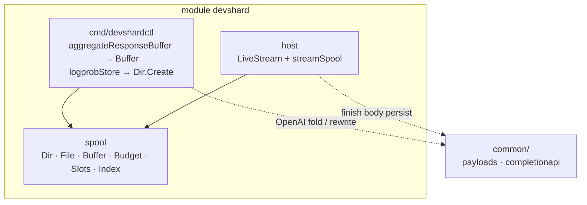
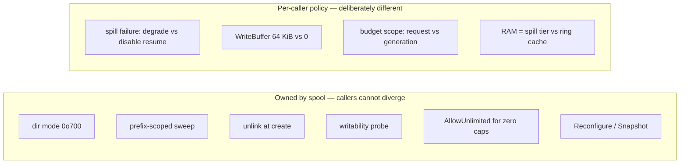
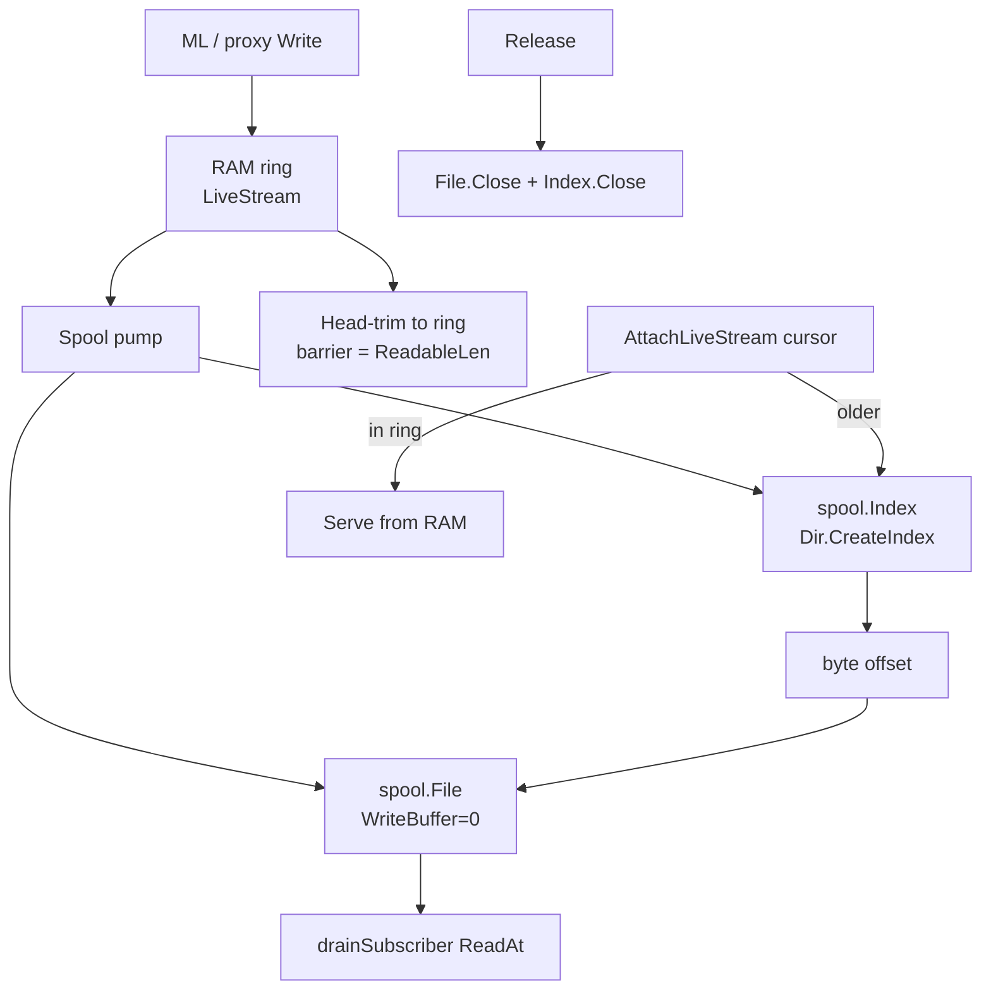
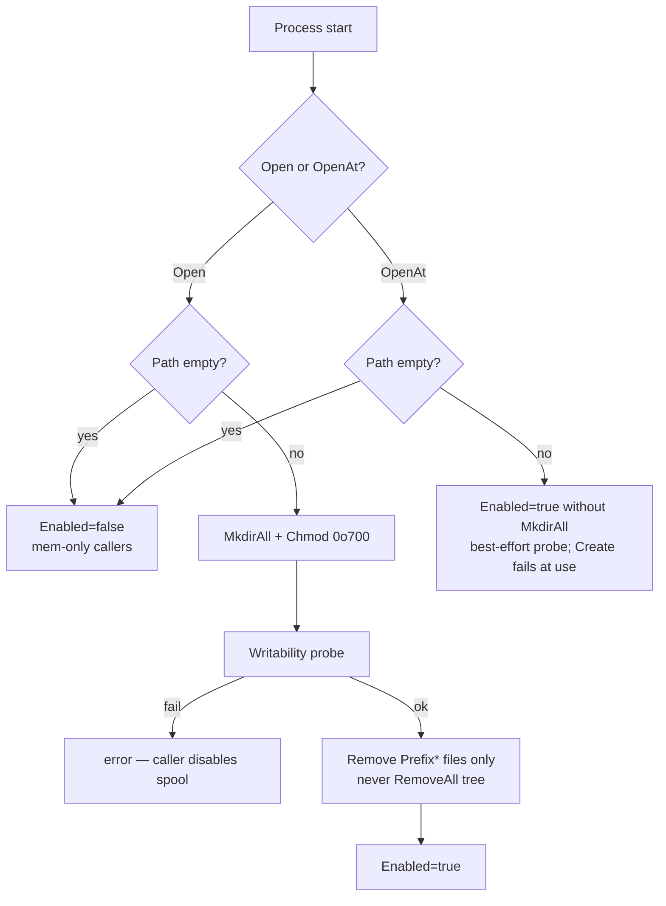

# Shared spill/spool library — design

**Status:** Implemented in `devshard/spool` (Phases −1…3 of the plan). Phase 4
(`common/spool` promotion) remains optional.  
**Audience:** Engineers adding or changing spill/resume buffering on gateway or host.  
**Implementation checklist / history:** [spool-shared-library-plan.md](./spool-shared-library-plan.md)  
**HA context:** [gateway-streaming-ha-overview.md](./gateway-streaming-ha-overview.md) §4 (host LiveStream) and always-stream aggregation on the gateway.

This document describes **where the shared module lives, what it owns, its APIs,
call-site flows, and how to use it correctly**. It tracks the current code. Phased
migration history stays in the plan.

---

## 1. Purpose

Gateway aggregation and host live-stream resume both need scratch disk: RAM up
to a threshold, then a temp file, then read-back, then delete. They do **not**
share one buffer abstraction — access patterns are opposites — but they share a
*substrate*: directory lifecycle, temp-file mechanics, byte budgets, and
capacity guards.

| Layer | Shared? | Lives in |
|---|---|---|
| Scratch dir open / probe / sweep / create file | Yes | `devshard/spool` |
| Counting slots, byte-budget helpers | Yes | `devshard/spool` |
| Mem-first spill buffer (single consumer) | Yes | `devshard/spool.Buffer` |
| Event-offset index (record → byte) | Yes (host first) | `devshard/spool.Index` via `Dir.CreateIndex` |
| SSE fold, NDJSON framing, logprobs merge, `foldBudget` | No | `cmd/devshardctl` |
| LiveStream ring, trim barrier, cursor, hop stamps | No | `host` |

**Not this package:** durable payload storage (`common/storage/payloads` —
complete bodies, `.tmp` + rename, survives restart). Spool data is scratch: no
`fsync`, wiped at boot, losing it costs at most one reconnect or one fold abort.

---

## 2. Module location

```text
module devshard                    ← one Go module
  ├─ spool/                        ← shared substrate (stdlib only)
  ├─ cmd/devshardctl/              ← gateway: Buffer + Dir for aggregate + logprobs
  ├─ cmd/devshardd/                ← host binary (env → PrepareLiveStreamSpoolDir)
  └─ host/                         ← LiveStream: File + Index for resume
```



**Why not `common/spool` yet.** Both consumers are already in `devshard`. Putting
the package in `common` forces every change through three modules
(`devshard`, `decentralized-api`, `edge-api`) with no third-party caller today.
`devshard/spool` is stdlib-only and type-agnostic so promotion later is a
`git mv` plus import rewrite when a second module actually needs it.

**Import path:** `"devshard/spool"`.

**CI guard:** `spool/guard_test.go` fails if production code under
`cmd/devshardctl` or `host` calls `os.CreateTemp` / `os.MkdirTemp` /
`os.OpenFile(...O_CREATE...)` outside the allow-list (currently empty).

---

## 3. Concepts

### 3.1 Types at a glance

| Type | Role |
|---|---|
| `Dir` | One scratch directory: enabled?, create files/indexes, caps, sweep, reconfigure |
| `File` | One scratch file: write / `ReadAt` / sequential `Reader` / close |
| `Buffer` | RAM until threshold, then spill into a `File` (single consumer after write) |
| `Budget` | Limit pair + optional Charge/Reclassify helpers for a unit of work |
| `Slots` | Reset-safe counting semaphore (concurrent files or degraded-RAM shares) |
| `Index` | Fixed-width sidecar: event/record number → absolute byte offset |

### 3.2 Ownership boundaries



---

## 4. Call-site flows

### 4.1 Gateway — aggregated non-streaming client

Winner SSE body accumulates in a `spool.Buffer` (wrapped as
`aggregateResponseBuffer` for the existing test surface). After inference
finishes, the fold reads through `OpenReader()` (line scan, no full `ReadAll`
of a spilled body).

Logprobs during fold do **not** use `Buffer`: `logprobStore` calls
`Dir.Create()` directly and charges a gateway-local `foldBudget` (RAM + disk
ceilings shared across choices). NDJSON framing and merge stay in
`cmd/devshardctl`.

Process-wide `MaxFiles` is one `Slots` instance: gateway owns
`aggregateSpoolSem` and passes it as `Config.Files` so Create and tests share
one counter.

```mermaid
sequenceDiagram
  participant P as Proxy.handleAggregated
  participant B as spool.Buffer<br/>(body)
  participant D as spool.Dir
  participant F as Fold / logprobStore

  P->>B: Write(SSE chunks)
  alt under RAM threshold
    B-->>B: keep in mem
  else RAM full, Dir enabled
    B->>D: Create()
    D-->>B: File (unlinked inode)
    B->>B: spill mem → File
  else spill impossible
    B-->>B: DegradeToRAM under Slots<br/>or keep maxMemory
  end
  P->>B: OpenReader()
  B-->>P: io.Reader
  P->>F: aggregateSSEStreamReader
  F->>D: Create() for logprobs spill
  F->>F: charge foldBudget; NDJSON on File
  P->>B: Close()
```

### 4.2 Host — live-stream resume

`LiveStream` keeps a RAM ring; a pump appends complete events to a `File` with
`WriteBuffer: 0` and an `Index` from `Dir.CreateIndex()`. Reconnect readers
resolve `(delivered_events, delivered_partial)` → byte offset and `ReadAt`
while the producer still appends. Index files do **not** consume a `MaxFiles`
slot (slots count generations / data files only).

Defaults today: unlimited concurrent files and per-file bytes
(`AllowUnlimited`), overridable via env (see §8). Boot uses `spool.Open`
(prefix sweep `ls-*`, never `RemoveAll`).



### 4.3 Boot — `Dir.Open` vs `OpenAt`



Gateway production path uses `Open`. Tests and degrade fixtures that point at a
missing path use `OpenAt` so spill fails at `Create` instead of silently staying
at the memory ceiling. `Reconfigure` never `MkdirAll`s for the same reason.

---

## 5. API reference

Package `spool`. Stdlib only: `bufio`, `bytes`, `encoding/binary`, `errors`,
`fmt`, `io`, `os`, `path/filepath`, `sync`, `sync/atomic`, `strings`.

### 5.1 `Dir`

```go
type Config struct {
    Path           string // "" → Enabled() == false
    Prefix         string // "agg-", "ls-"; also the sweep prefix
    KeepNamed      bool   // false (default) → unlink at create
    MaxFiles       int64
    MaxFileBytes   int64
    WriteBuffer    int    // default for Create(); 0 = unbuffered
    AllowUnlimited bool   // required if MaxFiles or MaxFileBytes is 0
    Files          *Slots // optional shared MaxFiles semaphore
}

type DirStats struct {
    Enabled, Path, Prefix string // Path/Prefix as configured
    FilesOpen, FilesMax   int64
    BytesWritten          uint64
    SweepCount            int
}

func Open(cfg Config) (*Dir, error)   // MkdirAll, chmod 0o700, probe, sweep
func OpenAt(cfg Config) (*Dir, error) // no MkdirAll; Enabled if Path set
func (d *Dir) Enabled() bool
func (d *Dir) Create() (*File, error)       // ErrNoCapacity if MaxFiles exhausted
func (d *Dir) CreateIndex() (*Index, error) // same unlink policy; no MaxFiles slot
func (d *Dir) FileSlots() *Slots
func (d *Dir) Stats() DirStats
func (d *Dir) Reconfigure(cfg Config) error
func (d *Dir) Snapshot() Config
```

Hard rules inside `Open` / `Create` (not config fields):

- Directory mode is always `0o700` (`MkdirAll` + `Chmod`).
- Sweep removes only entries matching `Prefix`; never deletes the directory tree.
- New files are mode `0o600`, unlinked at create unless `KeepNamed` (debug).
- Unbounded caps require `AllowUnlimited: true` (else `ErrUnlimitedRejected`).
- `CreateIndex` does not acquire a file slot.

### 5.2 `File`

```go
func (f *File) Write(p []byte) (int, error)
func (f *File) Flush() error
func (f *File) Len() int64
func (f *File) ReadableLen() int64
func (f *File) ReadAt(p []byte, off int64) (int, error)
func (f *File) Reader() (io.Reader, error)
func (f *File) Close() error
```

**`ReadableLen` barrier**

| `WriteBuffer` | When readers may see bytes |
|---|---|
| `> 0` | After flush; `ReadableLen` is flushed length; `ReadAt`/`Reader` flush first |
| `0` | Immediately; `ReadableLen() == Len()`; no flush under lock |

Gateway uses buffered writes (producer finished before read). Host uses
unbuffered writes (concurrent `ReadAt`). Short `ReadAt` against a growing file
returns `n` with a nil error when some bytes were read.

### 5.3 `Buffer`

```go
type SpillPolicy int
const (
    FailRequest SpillPolicy = iota // logprobs-style hard fail (unused by body)
    DegradeToRAM                   // aggregate body under degraded Slots
)

type BufferConfig struct {
    Dir            *Dir
    Budget         *Budget // Limits() → ram threshold + total ceiling
    OnSpillFailure SpillPolicy
    Degraded       *Slots // required when DegradeToRAM
}

func NewBuffer(cfg BufferConfig) *Buffer
func (b *Buffer) Write(p []byte) (int, error)
func (b *Buffer) OpenReader() (io.Reader, error)
func (b *Buffer) Bytes() ([]byte, error) // prefer OpenReader when spilled
func (b *Buffer) Len() int64
func (b *Buffer) Spilled() bool
func (b *Buffer) WriteErr() error
func (b *Buffer) DiskLimit() int64
func (b *Buffer) SpillDisabled() bool
func (b *Buffer) HoldsDegradedSlot() bool
func (b *Buffer) LastSpillErr() error
func (b *Buffer) Close() error
```

`Budget` on a Buffer supplies ceilings via `Limits()` only; `Write` does not
call `ChargeRAM` / `ChargeDisk`. First write failure is latched: later
`OpenReader` / `Bytes` refuse so a truncated prefix cannot be served as a
complete answer. On `DegradeToRAM`, a held degraded slot raises the ceiling to
the disk limit; without a slot the ceiling collapses to the RAM limit.

### 5.4 `Budget`

```go
func NewBudget(ramLimit, diskLimit int64) *Budget
func (b *Budget) Limits() (ramLimit, diskLimit int64)
func (b *Budget) RAMAvailable(n int64) bool
func (b *Budget) ChargeRAM(n int64) error
func (b *Budget) ChargeDisk(n int64) error
func (b *Budget) ReclassifyToDisk(n int64) error // after spill of already-charged RAM
func (b *Budget) Stats() (ram, disk int64)
```

Gateway fold accounting still uses a local `foldBudget` (text builders +
logprobs across choices). `spool.Budget` is the shared helper for Buffer
ceilings and for any future caller that wants Charge/Reclassify without a
domain wrapper. Callers wrap into domain errors
(`ErrAggregateFoldTooLarge`, etc.) with `errors.Is`.

### 5.5 `Slots`

```go
func NewSlots(max int64) *Slots
func (s *Slots) TryAcquire() bool
func (s *Slots) Release()
func (s *Slots) SetMax(n int64) // never zeroes in-flight cur
func (s *Slots) Stats() (max, cur int64)
func (s *Slots) Snapshot() (max, cur int64) // alias of Stats
func (s *Slots) Restore(max, cur int64)     // tests
```

`max == 0` means unlimited: `TryAcquire` always succeeds but still increments
`cur`, so `FilesOpen` stays accurate while caps are disabled and a later
`SetMax` to a finite n cannot admit extra holders. A nil `*Slots` still admits
without a counter (no object to track).

### 5.6 `Index`

```go
func (d *Dir) CreateIndex() (*Index, error)
func (i *Index) Append(offsets []int64) error
func (i *Index) At(n int64) (int64, error) // ErrIndexPast
func (i *Index) Len() int64
func (i *Index) Close() error
```

Write payload bytes before index entries so a torn append can only under-report
events, never point past readable data. Little-endian int64 entries, 8 bytes each.

### 5.7 Sentinel errors

| Error | Meaning |
|---|---|
| `ErrNoCapacity` | `MaxFiles` reached |
| `ErrBudgetExceeded` | RAM or disk charge refused |
| `ErrFileTooLarge` | `MaxFileBytes` / Buffer ceiling exceeded |
| `ErrClosed` | Use after `Close` |
| `ErrIndexPast` | Record number out of range |
| `ErrDisabled` | Operation needs a file but `Dir` is disabled |
| `ErrUnlimitedRejected` | Zero cap without `AllowUnlimited` |

---

## 6. Practices — how to use the module

### 6.1 Do

1. **Open one `Dir` per process role at startup** (gateway aggregate spool, host
   livestream spool). Pass `*Dir` into request/generation code; do not open a
   dir per request. Host caches dirs in `openLiveSpoolDir`.
2. **Branch on `Dir.Enabled()`**, not on an empty path string.
3. **Create scratch files only through `Dir.Create` / `Dir.CreateIndex` /
   `Buffer`.** Never call `os.CreateTemp` / `os.OpenFile(...O_CREATE...)` for
   response scratch in gateway or host production code — the CI guard fails the
   build if you do.
4. **Pick the right consumer shape:**
   - Write then read once after producer done → `Buffer` + `OpenReader`.
   - Concurrent random readers while appending → `File` with `WriteBuffer: 0`
     (+ `CreateIndex` if you need event→offset).
   - Domain-framed spill with its own byte accounting (logprobs) → `Dir.Create`
     + caller budget; do not force `Buffer` if framing/charge rules differ.
5. **Share one `Slots` for one resource.** Gateway passes `Config.Files:
   aggregateSpoolSem.Slots` so Create and the process semaphore stay one
   counter. Do not invent a second MaxFiles semaphore beside `Dir`.
6. **Close in a `defer`.** `Close` releases slots and unlinks; safe to call twice.
7. **Retune via `Dir.Reconfigure`.** In-flight files keep the snapshot from
   `Create`. Do not `MkdirAll` from test helpers that intentionally point at a
   missing path.
8. **Set `AllowUnlimited` only when you mean it**, and document why in the
   call site or env default note (host defaults unlimited today).

### 6.2 Don't

1. **Don't put SSE, fold, or resume-cursor logic in `spool`.** Those stay in
   `devshardctl` / `host`.
2. **Don't use spool for durable payloads.** Use `common/storage/payloads`.
3. **Don't `RemoveAll` a configurable spool path.** Sweep is prefix-scoped
   inside `Open` for a reason.
4. **Don't assume `ls` shows open files.** Default is unlink-at-create; use
   `Dir.Stats()` / `LiveStream.SpoolActive()` / metrics.
5. **Don't buffer (`WriteBuffer > 0`) if readers call `ReadAt` while writing**
   unless every read path flushes and honors `ReadableLen`.
6. **Don't serve a truncated body after a latched write error.** Check
   `OpenReader` / domain wrappers before folding or replaying.
7. **Don't treat `FilesMax == 0` as `FilesOpen == 0`.** Unlimited still counts
   holders, so a live retune to a finite `MaxFiles` blocks until in-flight
   files close.

### 6.3 Recommended call-site recipes

**Gateway body buffer (production sketch)**

```go
dir, err := spool.Open(spool.Config{
    Path:         aggregateSpoolPath,
    Prefix:       "agg-",
    MaxFiles:     int64(maxConc),
    MaxFileBytes: maxResp,
    WriteBuffer:  64 << 10,
    Files:        aggregateSpoolSem.Slots, // shared MaxFiles counter
})
// ...
buf := spool.NewBuffer(spool.BufferConfig{
    Dir:            dir,
    Budget:         spool.NewBudget(maxMem, maxResp),
    OnSpillFailure: spool.DegradeToRAM,
    Degraded:       aggregateDegradedSem.Slots,
})
defer buf.Close()
// Write from RunInference; then:
r, err := buf.OpenReader()
```

**Gateway logprobs spill (actual shape)**

```go
f, err := currentAggregateDir().Create()
// write NDJSON lines; charge foldBudget / moveToDisk on spill
defer f.Close()
```

**Host generation spool (actual shape)**

```go
dir, err := spool.Open(spool.Config{
    Path:           livestreamSpoolPath,
    Prefix:         "ls-",
    MaxFiles:       liveStreamMaxConcurrentSpools, // 0 + AllowUnlimited default
    MaxFileBytes:   liveStreamMaxSpoolBytes,
    WriteBuffer:    0, // concurrent ReadAt
    KeepNamed:      liveStreamSpoolKeepNamed,
    AllowUnlimited: true, // when either cap is 0
})
f, err := dir.Create()
idx, err := dir.CreateIndex()
// pump: f.Write(payload); idx.Append(starts)
// reader: off, _ := idx.At(deliveredEvents); f.ReadAt(dst, off+partial)
```

### 6.4 Failure semantics cheat sheet

| Situation | Gateway body | Gateway logprobs | Host LiveStream |
|---|---|---|---|
| Disk full / create fails | DegradeToRAM if slot; else keep mem cap | Fail fold (`ErrAggregateFoldTooLarge`) | `spoolErr` → resume disabled; inference continues |
| `MaxFiles` exhausted | Same as create fail | Fail fold | No spool for that generation / resume unavailable |
| `MaxFileBytes` / ceiling exceeded | Abort attempt (`ErrAggregateResponseTooLarge`) | Abort fold | Mark spool failed; resume disabled |
| Reader after `Close` | Error | Error | `ErrSpoolClosed` / attach unavailable |

---

## 7. Observability

`Dir.Stats()` is the supported live view: `FilesOpen`, `FilesMax`,
`BytesWritten`, `SweepCount`, path/prefix/enabled. `FilesOpen` is the live
holder count even when `FilesMax` is 0 (unlimited). Internal create-refuse /
create-fail atomics exist on `Dir` for future metric wiring; binaries may also
keep domain counters (gateway degrade refused, etc.).

| Signal | Source today |
|---|---|
| Files open / max | `Dir.Stats()` |
| Bytes written | `Dir.Stats().BytesWritten` |
| Sweep count | `Dir.Stats().SweepCount` |
| Host spool usable | `LiveStream.SpoolActive()` |
| Gateway degrade / fold limits | existing `devshardctl` counters |

Operators: anonymous files do not appear in `ls`; trust `Dir.Stats()`.
`KeepNamed` is for debugging only.

---

## 8. What stays outside the package

Documented so new code does not “share” the wrong layer:

| Concern | Owner |
|---|---|
| SSE line scan, fold merge, logprobs NDJSON framing, `foldBudget` | `cmd/devshardctl` |
| Resume cursor `(delivered_events, delivered_partial)` | `host` + transport |
| RAM ring size, reader stall, hop `: devshard-ts` | `host` |
| Durable finish body / hash | `common/storage/payloads` + processor |
| Env → `spool.Config` | each binary |

**Gateway env (unchanged names):** `GATEWAY_AGGREGATE_SPOOL_DIR`,
`GATEWAY_AGGREGATE_MAX_MEMORY_BYTES`, `GATEWAY_AGGREGATE_MAX_RESPONSE_BYTES`,
`GATEWAY_AGGREGATE_MAX_CONCURRENT_SPOOLS`,
`GATEWAY_AGGREGATE_MAX_DEGRADED_RAM_BYTES`.

**Host env:** `DEVSHARDD_LIVESTREAM_SPOOL_DIR` (default
`<dataDir>/livestream-spool`), `DEVSHARDD_LIVESTREAM_MAX_SPOOL_BYTES`,
`DEVSHARDD_LIVESTREAM_MAX_CONCURRENT_SPOOLS`,
`DEVSHARDD_LIVESTREAM_SPOOL_KEEP_NAMED`, `DEVSHARDD_LIVESTREAM_RING_BYTES`.

---

## 9. Related docs

| Doc | Role |
|---|---|
| [spool-shared-library-plan.md](./spool-shared-library-plan.md) | Analysis, divergence fixes, phased migration |
| [gateway-streaming-ha-overview.md](./gateway-streaming-ha-overview.md) | End-to-end HA; LiveStream tiers and reconnect |
| [gateway-always-stream-upstream-plan.md](./gateway-always-stream-upstream-plan.md) | Always-stream + aggregate path |
| [gateway-attempt-reconnect-plan.md](./gateway-attempt-reconnect-plan.md) | Same-nonce reconnect steps |
